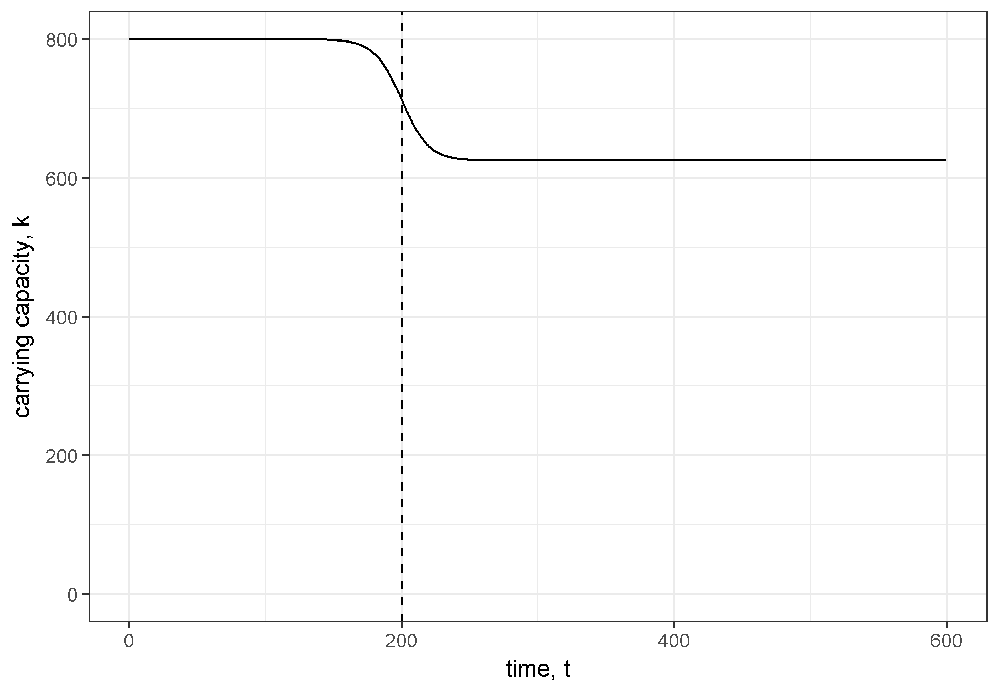
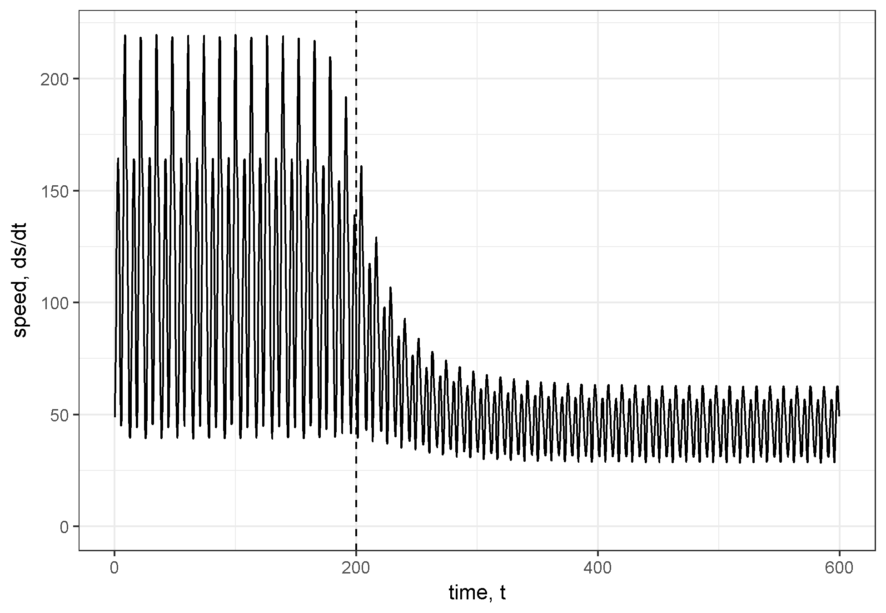

# A guide to Fisher Information for Ecologists  {#fiGuide}    

_This chapter is intended for submission to the publication *Methods in Ecology and Evolution* ^[Co-authors include: N.B. Price, A.J. Tyre, C.R. Allen, T. Eason, D.G. Angeler, and D. Twidwell]._

```{r cache = TRUE, echo=FALSE, warning=FALSE, eval=TRUE, message=FALSE, results="hide"}
# # Chunk defaults
# require(knitr)
# knitr::opts_chunk$set(cache = TRUE, cache.path = "_cache/", message = FALSE, warning=FALSE, eval=TRUE, echo=FALSE, error=FALSE, fig.align='center',
#                       out.width = "85%")
```

```{r startParms, echo=FALSE}
# Model parameters
parameters <- c(
  g1 = 1,
  m2 = 1,
  l12 = 0.01,
  g21 = 0.01,
  k = 625,
  B = 0.005
)

# Initial conditions
state <- c(
  x1 = 277.7815, 
  x2 = 174.551
)

# System differential equations (eq. 7.17 and 7.18)
deq <- function(t, state, parameters) {
  with(as.list(c(state, parameters)), {
    dx1dt <- g1 * x1 * (1 - (x1 / k)) - (l12 * x1 * x2) / (1 + B * x1)
    dx2dt <- (g21 * x1 * x2) / (1 + B * x1) - m2 * x2
    list(c(dx1dt, dx2dt))
  })
}
```

```{r odeSolve, echo=FALSE}
require(deSolve)
# Vector of times
TT <-  11.145
times <- seq(0, TT, by = TT/1e3)

# Solve system differential equations
out <- ode(
  y = state,
  times
  = times,
  func = deq,
  parms = parameters,
  rtol = 1e-10,
  method = "ode45"
)

# Convert to data frame
sysSol <- tibble(t = out[,1], x1 = out[,2], x2 = out[,3]) 

```

## Abstract    

Ecological regime shifts are increasingly prevalent in the Anthropocene. The number of methods proposed to detect these shifts are on the rise yet few are capable detecting regime shifts without a priori knowledge of the shift or are capable of handling high-dimensional and noisy data. A variation of Fisher Information (FI) in a dataset was proposed as a method for detecting changes in the orderliness of ecological systems. Although FI has been described in multiple research articles, previous presentations do not highlight a key component of FI that may make the metric easier to understand by practitioners. We use a two-species predator prey model to describe the concepts required to calculate FI. We hope this work will serve as a useful explanation of the FI metric for those seeking to understand it in the ecological systems and regime shifts. 

## Introduction  

Changes in the feedback(s) governing ecosystem processes can trigger unexpected and sometimes undesirable responses in environmental conditions [@scheffer_catastrophic_2001; @walther_ecological_2002]. Ecologists often refer to such changes as regime shifts, but this term  is used interchangeably in the literature with state change, state transition, or alternative state [@andersen_ecological_2009]. Climate change and globalization are triggering novel and unexpected changes in ecosystems, and the rapidity with which these changes occur make predictive modeling difficult. Although detecting regime shifts becomes more difficult as we increase the extent and complexity of the system in question , advances in the collection and analysis of ecological data may improve our ability to detect impending regime shifts in time for intervention [@jorgensen_towards_2004].

Although multiple quantitative approaches are proposed as regime shift detection methods ,few are consistently applied to terrestrial ecological data. We classify a regime shift detection methods (DMs) broadly as either model-based or model-free [@boettiger_quantifying_2012; @hastings_regime_2010; @dakos_methods_2012].  Model-based methods incorporate mathematical (mechanistic) representations of the system [@hefley2013statistical] and carry strict assumptions, which are often violated by real systems [@abadi2010assessment]. In addition to assumption violations nullifying parts of the model, model misspecification may yield spurious results [@perretti_model-free_2013.

Model-free (or metric-based detectin ethods (e.g., descriptive statistics, cross-correlation mapping) require fewer assumptions to implement than do model-based DMs [@dakos_methods_2012]. The most widely used model-free methods for detecting ecological regime shifts include descriptive statistics of one or a few components of a system, such as variance, skewness, and mean value [@mantua_methods_2004; @rodionov_application_2005; @andersen_ecological_2009] and composite measures which handle multivariable data, including principal components analysis [@petersen2008regime], clustering algorithms [@beaugrand2004north], exergy [@fath_exergy_2004], and Fisher Information [@cabezas_towards_2002; @karunanithi_detection_2008]. 

Fisher Information, hereafter FI is a model-free composite measure of any number of variables [@fisher_mathematical_1922], and is proposed as an early warning signal for ecological regime shift detection system sustainability [@mayer_applications_2007, @karunanithi_detection_2008, Eason and Cabezas 2012, Eason et al. 2014a]. Three definitions of FI exist: 
  I.   A measure of the ability of the data to estimate a parameter.    
  II.  The amount of information extracted from a set of measurements [@roy_frieden_physics_1998].      
  III. A measure representing the dynamic order/organization of a system [@cabezas_towards_2002].     

The application of FI to complex ecological systems was posed as part of the 'Sustainable Regimes Hypothesis,' stating a system is sustainable, or is in a stable dynamic state, if over some period of time the average value of FI does not drastically change [@cabezas_towards_2002]. This concept can be described using an ecological example. Consider the simple diffusion of a population released from a point source at $t = 0$. This process can be described by a bivariate normal distribution, $p(x,y\vert t)$. As the time since release (as $t$ increases) increases the spread of the distribution, $p(x,y\vert t)$, becomes larger (less concentrated about the mean) because the animals have moved further from the release location. FI will decrease in value as t increases, because $p(x,y\vert t)$  contains less information (higher uncertainty) about where the animals will be located. As $t \rightarrow \infty$, the animals will be relatively uniformly distributed across the environment and $p(x,y\vert t)$ will carry no information about the location of the animals. Consequently, as $t \rightarrow  \infty$, FI will approach zero. This system is not in a stable dynamic state because FI is decreasing with time.

In contrast, imagine a population varying around a carrying capacity following a simple logistic growth model. As long as the average system parameters (r and K and their variances) are stationary (not changing with time), then the logarithm of population size will have a normal distribution (check this!!!might need some different model). The FI measured over any selected window of time will be constant, indicating that the system is in a stable dynamic state. A perturbation to the population size due to disturbance will also not affect FI, as long as the disturbance does not change the distributions of r and K, and the perturbations themselves occur with some stationary probability distribution. 

Although the concept of FI is firmly grounded in physics [@frieden_physics_1998], the concepts behind its application to ecological systems remain elusive to the average ecologist. We aim to elucidate the statistical concept of FI and the steps required to calculate it as a measure of 'ecosystem order' and as a regime shift detection method [@cabezas_towards_2002; @fath_regime_2003]. We believe a concise and accessible synthesis of the topic, along with reproducible code, will aid the ecologists' understanding of this metric and will advance our understanding of its usefulness as an indicator of ecological regime shifts. We reproduce the analyses presented in [@fath_regime_2003] and @mayer_applications_2007 to fully explain these concept of and steps for calculating this form of Fisher Information. We hope this work will serve as a useful explanation of the FI metric for those seeking to understand it in the ecological regime shift context and will stimulate research using this and other multivariate, model-free, and composite measures to understand ecological regime shifts.

### On Fisher Information

Two methods exist for calculating Fisher Information (FI) as applied to ecological systems data, which we refer to as the *derivatives-based*  method, first appearing in @cabezas_towards_2002, and the *binning* method, first appearing in @karunanithi_detection_2008. The binning method was proposed as an alternative to the derivatives-based method for handling noisy and sparse data, and requires additional calculations and system-specific decisions, and for these reasons we focus solely on the derivatives-based method. The general form of FI can be found in [@fath_regime_2003] and [@mayer_applications_2007], and although others can be found, we refer the reader to @cabezas_towards_2002 for a complete derivation of FI, and to \@ref(#fiBiblio) for applications of Fisher Information in other fields. 

### Notation    

A capital letter (e.g., $A$) denotes a random variable; an asterisk superscript ($^*$) indicate a particular realization; *bold notation* indicates that the state of the system is defined in more than one dimension.

### Steps for calculating Fisher Information (FI) 

To calculate FI for a system with more than one state variable, we first estimate the probability of observing the system $p(x)$ in a given state, $x$, over time period $T$. The probability density function, $p(x)$, is then directly used to calculate the derivatives-based FI. We use bold notation to indicate that the state of the system is defined in more than one dimension (e.g., the state of a predator prey system is defined in two dimensions by the number of predators and number of prey). Here, we describe these steps and present the numerical calculation of FI using a two-species predator-prey model [@fath_regime_2003; mayer_applications_2007], hereafter referred to as the 'model system':

\begin{equation} 
  dx_1 = g_{1}x_{1}(1-\frac{x_1}{k})- \frac{l_{12} x_{1} x_{2}}{1+\beta x_{1}} \\
  dx_2 = \frac{g_{21}x_1 x_2}{1+\beta x_1} - m_2 x_2)
  (\#eq:predprey)
\end{equation}

The specified parameters for the model system are $g_1=m_2=1$, $l_12=g_12 = 0.01$ , $k=625$ ,and  $\beta=0.005$  [see @fath_regime_2003; @frieden_exploratory_2007; @mayer_applications_2007]. The initial conditions (predator and prey abundances) for the model system were not provided in the original references. Using package *deSolve* in Program R (v 3.3.2) to solve the model system \@ref(eq:predprey) we found $x_1  = 277.7815$ and $x_1= 174.551$ provided reasonable results. We found that a complete cycle of the system corresponds to approximately 11.145 time units. 

```{r pp1Period, echo=FALSE, fig.cap=paste("Phase space plot of two-species Lotka-Volterra predator-prey system over a single period (~11.145 time units."), cache = T}
# Plot system trajectory
ggplot(data = sysSol, aes(x = x1, y = x2)) +
  geom_path() +
  labs(x = "prey, x1", y = "predator, x2") +
  coord_fixed()
```


### Concepts behind the calculations  

Although the numerical steps for calculating the derivatives-based FI are relatively straightforward, the concepts required to interpret the measure in the context of multiple variables is more complex. Here, we thoroughly discuss the concepts and assumptions behind FI calculation. Below, steps do not represent steps within the calculation, they represent the major concepts required 

#### **Step 1. Probability of observing the system in a particular state, $p(x)$**   
```{r 2D-hist, echo=FALSE, fig.cap="A 2-dimensional histogram of the probability of observing a system in a particular state, $p(x)$, of the 2-species Lotka-Volterra predator prey system over a single period (~11.145 time units).", out.width="85%"}
# Plot probability of observing the system in a particular state
ggplot(data = sysSol, aes(x = x1, y = x2)) +
  geom_bin2d(aes(fill = ..density..), color = "black", drop = T, bins = 20) +
  scale_fill_distiller(palette = "YlOrRd") +
  labs(x = "prey, x1", y = "predator, x2", fill = "p(x)") +
  coord_fixed()
```

Fisher Information (FI) is defined with respect to a probability distribution. In the derivatives-based method, FI is calculated for a probability of observing a system (as defined by one or more state variables) in a particular state, $p(x)$, over some period of time, ($0 to t_{end}$). In other words $p(x)$ is the probability that, at a specific point in time ($t_{obs}^*$) we will observe the system in a particular state, $x^*$. The time at which we observe the system is a random variable, $t_{obs}  ~ Uniform(0,t_{end})$. To be clear, the study system is assumed to be deterministic and we assume no observation error, however, the observed state of the system, $x(T_{obs})$, is a random variable because it is a function of the random observation time,  $x^*= x(t_{obs}^*)$. The state of the model system, x, is defined in two dimensions by the number of predators and the number of prey \@ref(eq:predprey) and is easily visualized \@ref(fig:pp1Period).Therefore, the probability of observing a particular state is a two-dimensional joint distribution  \@ref(fig:2d-hist). 

A single state of the model system is defined by the number of predators and prey at a given point in time such that for any given point in time $x(t)=[x_1 (t),x_2 (t)]$. At some random time between 0 and $t_{end}$ [$T_{obs}  ~ Uniform(0,t_{end})$] we can count the number of predators and the number of prey to determine the state of the model system. We must assume the system is deterministic and there is no observation error. We can then calculate the probability of observing a particular predator and prey abundance combination, $p(x)$. Under these assumptions, the only possible states of the system are defined by the system's observed trajectory, the model parameters, and the initial conditions. Therefore, the support of the probability distribution \@ref(fig:2D-hist) is the trajectory of the system. 

```{r stringFig, echo=FALSE, out.width="95%", fig.cap = paste("A single cycle of a hypothetical two-species system over time period $t = 0$ to $t = T$. $s^*$ is the state of the system at some point in time. The dotted line represents the distance travelled by the system in phase space over its trajectory during time $(0, T)$.")}
knitr::include_graphics('./chapterFiles/fiGuide/figures/stringFig.png')
```

#### **Step 2.** Distance traveled by the system, $s$ 

Distance traveled by the system, s. We can now move from an n-dimensional representation of the probability distribution to a one-dimensional representation. To better understand this, imagine placing a string over the path of the entire trajectory from $0 to t_{end}$   \@ref(fig:stringFig). If we know the number of predators and prey at a particular point in time $(t_{obs}^*)$ then we can mark that location on the string (see asterisk in  \@ref(fig:stringFig). Next, imagine picking up the string and laying the string flat along a ruler. The length, s, of the entire string measures the total distance traveled by the system in phase space. The mark we made on the string (denoted $*$) lies at a distance $s^*$ between 0 and $s$. We call this length the distance traveled by the system, $s^*$. In this context, $s^*$ in phase space represents a measure of cumulative change in state. We note that the distance traveled in phase space increases monotonically with time. If the system never revisits the same state (i.e., the trajectory never overlaps or intersects itself), then every unique system state (i.e., point on the trajectory) is mapped to a unique value of distance traveled. Therefore, $p(x)$ (n-dimensional) is equivalent to the probability that the system is at distance s, i.e.,  $p(x)=p(s)$, (where $p(s)$ is one dimensional; @cabezas_simulated_2005). However, if the system revisits previous states, then a unique system state may be mapped to different values of distance traveled and the relationship between $p(x)$ and $p(s)$ is not one-to-one. We calculated the distance traveled s of the model system over a single cycle (11.145 time units;  \@ref(fig:distSpeedAccel). 

```{r solve-ODE, echo=FALSE}
# Initial conditions including distance
state_highO <- c(
  x1 = 277.7815, 
  x2 = 174.551,
  dx1dt = -48.6,
  dx2dt = 28.3,
  d2x1dt2 = -23.3,
  d2x2dt2 = -10.5,
  s = 0
)

# Model parameters
parameters_highO <- c(
  g1 = 1,
  m2 = 1,
  l12 = 0.01,
  g21 = 0.01,
  k = 625,
  B = 0.005
)

# System differential equations including higher order terms and distance
deq_highO <- function(t, state, parameters) {
  with(as.list(c(state, parameters)), {
    
  # 1st derivatives
  dx1dt <-
  g1 * x1 * (1 - (x1 / k)) - (l12 * x1 * x2) / (1 + B * x1)
  
  dx2dt <- (g21 * x1 * x2) / (1 + B * x1) - m2 * x2
  
  # 2nd derivatives
  d2x1dt2 <-
  (B * l12 * x1 * x2 * dx1dt) / (B * x1 + 1) ^ 2 - (g1 * x1 * dx1dt) / k - (l12 *
  x1 * dx2dt) / (B * x1 + 1) - (l12 * x2 * dx1dt) / (B * x1 + 1) - g1 * (x1 /
  k - 1) * dx1dt
  
  d2x2dt2 <-
  (g21 * x1 * dx2dt) / (B * x1 + 1) - m2 * dx2dt + (g21 * x2 * dx1dt) / (B *
  x1 + 1) - (B * g21 * x1 * x2 * dx1dt) / (B * x1 + 1) ^ 2
  
  # 3rd derivatives
  d3x1dt3 <-
  (2 * B * l12 * x2 * dx1dt ^ 2) / (B * x1 + 1) ^ 2 - (2 * g1 * dx1dt ^ 2) /
  k - (l12 * x1 * d2x2dt2) / (B * x1 + 1) - (l12 * x2 * d2x1dt2) / (B * x1 + 1) - (2 *
  l12 * dx1dt * dx2dt) / (B * x1 + 1) - (g1 * x1 * d2x1dt2) / k - g1 * (x1 /
  k - 1) * d2x1dt2 + (B * l12 * x1 * x2 * d2x1dt2) / (B * x1 + 1) ^ 2 - (2 *
  B ^ 2 * l12 * x1 * x2 * dx1dt ^ 2) / (B * x1 + 1) ^ 3 + (2 * B * l12 * x1 *
  dx1dt * dx2dt) / (B * x1 + 1) ^ 2
  
  d3x2dt3 <-
  (g21 * x1 * d2x2dt2) / (B * x1 + 1) - m2 * d2x2dt2 + (g21 * x2 * d2x1dt2) /
  (B * x1 + 1) + (2 * g21 * dx1dt * dx2dt) / (B * x1 + 1) - (2 * B * g21 *
  x2 * dx1dt ^ 2) / (B * x1 + 1) ^ 2 - (B * g21 * x1 * x2 * d2x1dt2) / (B *
  x1 + 1) ^ 2 + (2 * B ^ 2 * g21 * x1 * x2 * dx1dt ^ 2) / (B * x1 + 1) ^ 3 - (2 *
  B * g21 * x1 * dx1dt * dx2dt) / (B * x1 + 1) ^ 2
  
  # Derivative of distance (i.e., tangential velocity)
  dsdt <- sqrt(dx1dt ^ 2 + dx2dt ^ 2)
  
  list(c(dx1dt, dx2dt, d2x1dt2, d2x2dt2, d3x1dt3, d3x2dt3, dsdt))
  })
}

# Solve system differential equations (now with distance)
out_highO <- ode(
  y = state_highO,
  times = times,
  func = deq_highO,
  parms = parameters_highO,
  rtol = 1e-10,
  method = "ode45"
)

# Convert to data frame
sysSol_highO <-
  tibble(t = out_highO[, 1],
             x1 = out_highO[, 2],
             x2 = out_highO[, 3],
             dx1dt = out_highO[,4],
             dx2dt = out_highO[,5],
             d2x1dt2 = out_highO[,6],
             d2x2dt2 = out_highO[,7],
             s = out_highO[, 8]) %>%  
  # Calculate derivatives and pdf
  mutate(dsdt = sqrt(dx1dt^2 + dx2dt^2),
         d2sdt2 = (1/dsdt)*(dx1dt*d2x1dt2 + dx2dt*d2x2dt2),
         p = (1/TT)*(1/dsdt))

```

```{r distSpeedAccel, echo=FALSE,out.width="85%", fig.cap=paste("From top to bottom, distance traveled in phase space, speed tangential to system trajectory, acceleration tangential to system trajectory.")}

# Plot distance traveled
p1 <- ggplot(data = sysSol_highO, aes(x = t, y = s)) +
  geom_line() +
  labs(x = "time", y = "distance")

# Plot velocity
p2 <- ggplot(data = sysSol_highO, aes(x = t, y = dsdt)) +
  geom_line() +
  labs(x = "time", y = "speed")

# Plot acceleration
p3 <- ggplot(data = sysSol_highO, aes(x = t, y = d2sdt2)) +
  geom_line() +
  labs(x = "time", y = "acceleration")

# Grid plot
gridExtra::grid.arrange(p1, p2, p3, ncol=1)

```

#### **Step 3.** $p(s)$ as a function of the rate of change of $s$   

In previous presentations of FI, the relationship between the state of the system (n-dimensional) and the distance traveled (1-dimensional) was not always emphasized [@cabezas_towards_2002]. Here we use x to denote the state of the system and s to denote the distance traveled to emphasize this distinction. If a system travels at a constant speed over the entire time period, then the system is equally likely to be in any state along the trajectory ($s$ is linear and $p(s)$ is uniform). Referring to our model system, if the number of predators and prey are linearly related, then the speed of the system is constant. For non-linear systems, the distribution above the string will not be uniform  \@ref(fig:stringFig). Rather, it will change depending on the amount of time the system spends in each state. It follows that $p(s)$ is proportional to the inverse of the rate of change of distance traveled (i.e., the speed along the path in phase space).

We will now demonstrate this using our model system as an example. Suppose the abundances of the predator and their prey in our model system predictably operate at carrying capacity. Over a relatively short period of time the prey abundance quickly declines after a severe weather event (a pulse disturbance; (Bender et al. 1984), but quickly recovers. Intuitively, the absolute rate of change at time points near the disturbance will be larger than during time periods long before or long after the disturbance. It is therefore more likely that the system will be (observed) in a state where prey and predators are operating approximately at carrying capacity than in a state with relatively low prey abundance. Mathematically, the time, $t*$, at which we calculate the abundances of prey and predators is a uniform random variable, and the distance traveled by the system, $s^*$, is a function of time, is differentiable, and monotonically increases. Therefore, the probability density function of the distance traveled $p(s)=\frac{1}{T}\frac{1}{s'}$, where $s'= \frac{ds}{dt}$ is the speed of the system (the speed tangential to the trajectory; the first derivative of the distance traveled; instantaneous rate of change of $s$). We calculated the speed (the first derivative;  \@ref(fig:distSpeedAccel) and acceleration (the second derivative;  \@ref(fig:distSpeedAccel) of the distance traveled s by the model system over a single cycle using function ode in package deSolve (Soetaert et al. 2010) in Program R (R Core Team 2016).  

#### **Step 4.** Calculate the derivatives-based Fisher Information  

Now that we understand how to calculate both the distance traveled, $s$, and its probability density, $p(s)$, calculating the derivatives-based FI is straightforward and computationally inexpensive \@ref(eq:fiDerivs). There are several comparable equations for calculating the shift-invariant FI, and some may offer numerical advantages over others. Equation \@ref(eq:fiAdapted) is the general form and Equation \@ref(eq:fi73c) is the amplitude form for FI (in @mayer_applications_2007, respectively). Although these formulations are equivalent, \@ref(eq:fi73c) is most readily calculated when the differential equations for the system are known, obviating any advantage of a model-free metric. 

\begin{equation}   
    I = \frac{1}{T} \int_0^T dt\left[\frac{s''^2}{s'^4}\right]^2 \\  
  (\#eq:fiDerivs)  
\end{equation} 

\begin{equation} 
    I = \int \frac{ds}{p(s)}\left[\frac{dp(s)}{ds}\right]^2  \\
    (\#eq:fiAdapted)
\end{equation} 

\begin{equation} 
    I = 4 \int ds\left[\frac{dq(s)}{ds}\right]^2 \\
(\#eq:fi73c)
\end{equation} 

This article is interested in the Fisher Information calculated for a distribution of distance traveled, $s$, by the entire system. We calculated the Fisher Information value using Equation \@ref(eq:fiDerivs) over a single period of the model system (\@ref(eq:predprey)). We calculated Fisher Information to be $5.3$ x $10^{-5}$ which is consistent with the results of Mayer et al. (2007).	

## Case Study    
Mayer et al. (2007) calculated FI for a predator-prey system for several discrete values of carrying capacity of prey. The results of this study showed that FI was different for systems with different carrying capacities. However, this study did not address the central question of how FI changes during a regime shift.  As an extension of the original study, we simulate a regime shift by modeling a situation where carrying capacity is abruptly decreased. To simulate an abrupt change in carrying capacity, we assume carrying capacity is described by Eq. 6 where $k1$ is the initial carrying capacity, $k2$ is the final carrying capacity, $t*$ is the time of the regime shift, and alpha is a parameter that controls how quickly the regime shift occurs. The hyperbolic tangent function simulates a smooth, continuous change in carrying capacity while still allowing for the change to occur suddenly. To incorporate the change in carrying capacity into the system differential equations we define the rate of change of carrying capacity as given by \@ref(eq:mayerCase).  
\begin{equation}  
  k(t) = k_1  - 0.5(k_1-k_2)(\tanh(\alpha (t-t^*))+1)	  \\
  k'(t) = 0.5\alpha (k_1-k_2)(\tanh(\alpha(t-t^*))^2 +1)	  \\ 
(\#eq:mayerCase)
\end{equation} 

```{r FIcalc, echo=FALSE}
# Equation 7.3b
p <- sysSol_highO$p
s <- sysSol_highO$s
dp <- lead(p)-p
ds <- lead(s)-s
dpds <- dp/ds
ind <- 1:(length(s)-1)
FI_7.3b <- caTools::trapz(s[ind], (1/p[ind])*dpds[ind]^2)

# Equation 7.3c
q <- sqrt(sysSol_highO$p)
s <- sysSol_highO$s
dq <- lead(q)-q
ds <- lead(s)-s
dqds <- dq/ds
ind <- 1:(length(s)-1)
FI_7.3c <- 4*caTools::trapz(s[ind], dqds[ind]^2)

# Equation 7.12
t <- sysSol_highO$t
dsdt <- sysSol_highO$dsdt
d2sdt2 <- sysSol_highO$d2sdt2
ind <- 1:(length(s)-1)
FI_7.12 <- (1/TT)*caTools::trapz(t[ind], d2sdt2^2 / dsdt^4)

# Results
# FI_7.3b
# FI_7.3c
# FI_7.12
```

```{r kSim, echo=FALSE}

# Carrying capacity
k <- seq(625, 800, by = 25)

# Initial conditions
x1_ini <- c(277.7815,
          314.6527,
          303.6386,
          175.4664,
          50.72788,
          135.6263,
          571.6995,
          166.9751)
x2_ini <- c(174.551,
          191.5272,
          226.0233,
          270.6772,
          133.5784,
          32.24493,
          65.22751,
          345.6978)

# Loop over k's
results_kstudy <- NULL
FI_7.3b <- NULL
for(i in 1:length(k)){
  
  # Update parameters
  parameters["k"] <- k[i]
  state["x1"] <- x1_ini[i]
  state["x2"] <- x2_ini[i]
  state["s"] = 0
  
  # System differential equations including higher order terms and distance
  deq_kstudy <- function(t, state, parameters) {
    with(as.list(c(state, parameters)), {
      dx1dt <- g1 * x1 * (1 - (x1 / k)) - (l12 * x1 * x2) / (1 + B * x1)
      
      dx2dt <- (g21 * x1 * x2) / (1 + B * x1) - m2 * x2
      
      dsdt <- sqrt(dx1dt^2 + dx2dt^2)
      
      list(c(dx1dt, dx2dt, dsdt))
    })
  }
  
  # Vector of times
  TT <-  13.1
  times <- seq(0, TT, by = TT/1e3)
  
  # Solve system differential equations (now with distance)
  out_kstudy <- ode(
    y = state,
    times = times,
    func = deq_kstudy,
    parms = parameters,
    rtol = 1e-10,
    method = "ode45"
  )
  
  # Convert to data frame
  sysSol_kstudy <-
    tibble(k = as.factor(k[i]),
               t = out_kstudy[, 1],
               x1 = out_kstudy[, 2],
               x2 = out_kstudy[, 3],
               s = out_kstudy[, 4])
  
  # Remove any overlap in trajectories
  maxT <- (sysSol_kstudy %>% 
             mutate(startDist = sqrt((x1-x1_ini[i])^2 + (x2-x2_ini[i])^2)) %>% 
             filter(t > 10, t < 15) %>% 
             filter(startDist == min(startDist)))$t

  sysSol_kstudy <- sysSol_kstudy %>% 
    filter(t <= maxT)
  
  sysSol_kstudy <- 
    sysSol_kstudy %>% 
    mutate(dsdt = (lead(s)-s)/(lead(t)-t),
           p = (1/maxT)*(1/dsdt)) %>% 
    filter(!is.na(dsdt))
  
  
  # Fisher information
  p <- sysSol_kstudy$p
  s <- sysSol_kstudy$s
  dp <- lead(p)-p
  ds <- lead(s)-s
  dpds <- dp/ds
  ind <- 1:(length(s)-1)
  FI_7.3b[i] <- caTools::trapz(s[ind], (1/p[ind])*dpds[ind]^2)
  
  # Bind results
  results_kstudy <- rbind(results_kstudy, sysSol_kstudy)
}
```


```{r kByTime, echo=FALSE, out.width="85%",fig.cap = paste("Carrying capacity over time with a regime shift occuring around time 200.")}

```
```{r kTrajectories, out.width="85%", echo=FALSE, fig.cap=paste("Phase space plot of system trajectories for different values of k")}
# Plot trajectories
ggplot(data = results_kstudy, aes(x = x1, y = x2, color = k)) +
  geom_path() +
  labs(x = "prey, x1", y = "predator, x2") +
  coord_fixed()
```

We assumed an initial carrying capacity of 800 and a final carrying capacity of 625 which corresponds to the range of carrying capacities explored by Mayer et al. (2007). We simulated a time series of 600 time units with a regime change after 200 time units. We used an alpha value of 0.05. The time series for carrying capacity is shown in \@ref(fig:kByTime) and the system trajectory in phase space is shown in \@ref(fig:kTrajectories). The distance travelled in phase space (i.e., cumulative change in state) is shown in \@ref(fig:distOverTime) and the speed of the system (i.e., rate of change) is shown in \@ref(fig:dsdtOverTime). 

```{r dsdtOverTime, echo=FALSE,out.width="85%", fig.cap=paste("Speed of the system (rate of change) in phase space. Dashed vertical line at time 200 indicates location of regime shift.")}

```

We calculated FI for the distribution of distance travelled over a series of non-overlapping time windows. Multiple sources suggest the length of the time window should be equal to one system period such that FI is constant for a periodic system [@mayer_applications_2007; @cabezas_towards_2002]. However, the system period is different before, during, and after the regime shift. Therefore, we performed two separate calculations of FI using window sizes corresponding to the initial and final period of the system ($13.061$ and $11.135$, respectively).  The change in FI over time is shown in \@ref(fig:fiOverTime). 

```{r fiOverTime, echo=FALSE, out.width="85%", fig.cap=paste("Fisher Information calculated for non-overlapping time windows. Two different window sizes were used as indicated by color. Dashed vertical line at time 200 indicates approximate location of regime shift.")}
knitr::include_graphics('./chapterFiles/fiGuide/figures/fiOverTime.png')
```

## Conclusions     

We simulated a regime shift caused by a change in carrying capacity ($K$) within a simulated, two-species Lotka-Volterra system. We applied the Fisher Information (FI) method for regime shift detection to the simulated time series data. The predator-prey system was modeled as deterministic and the time series data was free from measurement and observation error. Despite this, the estimated FI had high variation over time, and results were dependent on the size of the time window used (winsize) in the calculation \@ref(fig:fiOverTime). The FI method for regime shift detection is based on the cumulative change in the state of the system (i.e., distance traveled in phase space) and the rate of change of the system (i.e., speed tangential to trajectory in phase space). The distance travelled metric, $s$, and its speed, $dsdt$, appear better visual indicators of the regime shift than FI [\@ref(fig:distOverTime); \@ref(fig:dsdtOverTime)].

In our explanation of the FI concept and calculation, we emphasize the distinction between the *state of the system* and the *distance traveled in phase space*. There are several reasons worth emphasizing this. First, there may not always be a one-to-one relationship between the probability of observing a system in a particular state and the probability of observing a system at a particular distance along the trajectory. In these situations the interpretation of FI may be less clear than if a one-to-one relationship existed. Second, this distinction facilitates the separation of the dimensionality reduction step (calculating distance traveled in phase space, $s$) from the subsequent steps related specifically to FI. Third, the distinction suggests that the **value of FI as a regime shift detection method is related to the rate of change of the system** (i.e., velocity and acceleration tangential to system trajectory in phase space). In particular, the distribution for which FI is calculated is simply the distribution of the distance traveled in phase space, when time is assumed to be uniformly distributed over a given interval. 

Our results suggest that insights can be gained directly from the calculation of distance traveled and associated rates of change. Consequently, these insights preclude the need to calculate beyond Step 3 (described above). This result also supports the use of the distance travelled metric, or the derivatives-based Fisher Information (\#eq:fiDerivs).

One remaining issue that is prevalent across ecological field studies is the assumption that the system is observed without error. Although ecological data rarely fulfill this assumption, this does not suggest that FI is useless as a metric of system stability. The primary difficulty with noisy data, especially with observations in integer form (e.g. count data), is that the denominator in can easily be zero for some pair of observations, making FI an infinite value within windows which contain two or more adjacent zero observations. One possible solution is to smooth the multidimensional vector of observations prior to calculating the derivatives, or to treat any sequential identical value as missing, and simply use a larger time step for that portion of the window calculation. 

The utility of Fisher Information in ecological studies is also stunted by its interpretability. This metric is unitless, making its values relative only within-sample (e.g., within a single time series). Further, interpreting the results within-sample is currently a qualitative effort [@mantua_methods_2004; @fath_regime_2003]. When the FI of a system is increasing, the system is said to be moving toward a more orderly state, and most presentations of FI posit sharp changes in FI, regardless of the directionality of the change, may indicate a regime shift [@cabezas_towards_2002; @karunanithi_detection_2008; @spanbauer_prolonged_2014]. Due to the qualitative nature of these interpretations of Fisher Information, intimate knowledge of the system in question and the potential driver(s) of the observed regime shift are required to confirm presence of a shift. 

## Acknowledgements   
I thank T. Eason, H. Cabezas and B. Roy Frieden for early discussions regarding Fisher Information. 