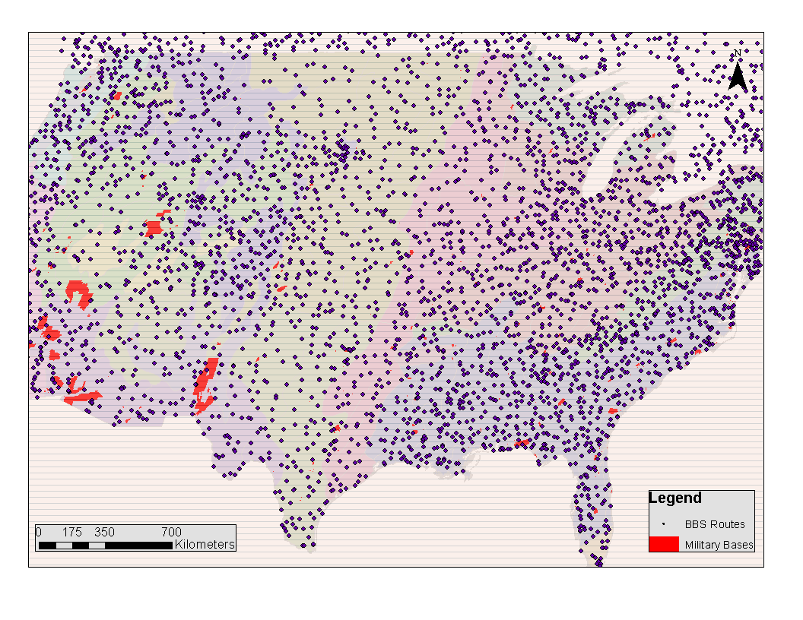
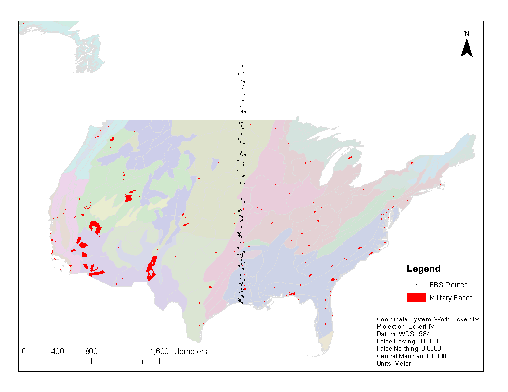
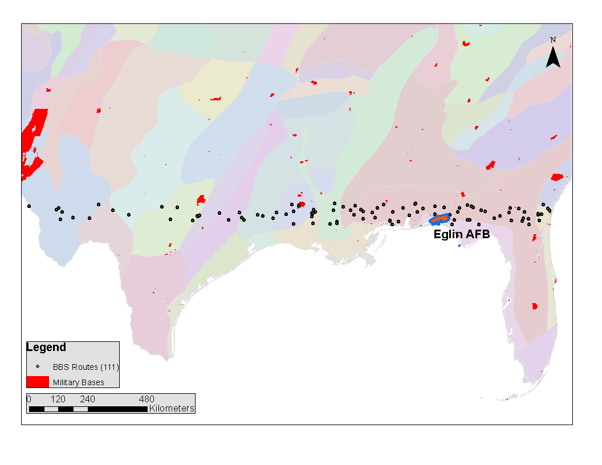

<!--
Above is the YAML (YAML Ain't Markup Language) header that includes a lot of metadata used to produce the document.  Be careful with spacing in this header!

If you'd prefer to not include a Dedication, for example, simply delete lines 17 and 18 above or add a # before them to comment them out.  If you have other LaTeX packages you would like to include, delete the # before header-includes and list the packages after hyphens on new lines.

If you'd like to include a comment that won't be produced in your resulting file enclose it in a block like this.
-->

<!--
If you receive a duplicate label error after knitting, make sure to delete the index.Rmd file and then knit again.
-->


```{r include_packages, include = FALSE}
if(!require(devtools))
  install.packages("devtools", repos = "http://cran.rstudio.com")
if(!require(here))
  install.packages("here", repos = "http://cran.rstudio.com")
if(!require(dplyr))
    install.packages("dplyr", repos = "http://cran.rstudio.com")
if(!require(ggplot2))
    install.packages("ggplot2", repos = "http://cran.rstudio.com")
if(!require(bookdown))
    install.packages("bookdown", repos = "http://cran.rstudio.com")
if(!require(kableExtra))
    install.packages("kableExtra", repos = "http://cran.rstudio.com")
if(!require(thesisdown)){
  devtools::install_github("ismayc/thesisdown")
  }
if(!require(tidyverse)){
  devtools::install.packages("tidyverse")
  }

  library(devtools)
  library(tidyverse)
```


<!-- Do not remove the line with the  '.unnumbered' -->
<!-- There is something buggy about it, when I remove it shit goes bananas.  -->
<!-- Need to figure out how to fix because it inserts like two blank pages! -->

#  {.unnumbered}

<!--chapter:end:index.Rmd-->

# Preliminary Content {-}

Paste from index.rmd if knitting to git or html

## Acknowledgements {-}

Paste from index.rmd if knitting to git or html

## Preface {-}

Paste from index.rmd if knitting to git or html

## Dedication {-}

Paste from index.rmd if knitting to git or html

`r if(!knitr:::is_latex_output()) '## Abstract {-}'`

<!--chapter:end:00--prelim.Rmd-->

<!-- The abstract shouild be written here, regardless of output filetype (e.g., pdf) -->
THis is my amazing abstract.

<!--chapter:end:00-abstract.Rmd-->

# Introduction {#intro-chapter}

Anthropogenic activity in the last few decades has drastically influenced the interations within and among Earth systems worldwide. The complexity of and drivers of changes in coupled human-natural systems is consequently altered, further limiting our ability to detect and predict change and impacts of change [@liu_complexity_2007; @scheffer_critical_2009]. 

Early warning systems are developed to detect and predict abrupt changes in disparate systems, e.g. cyber security [@], infrastructure [@], banking crises [@davis_comparing_2008], and agricultural systems [@]. The need to develop and improve early warning systems for natural and coupled human-natural systems is exacerbated by the consequences of climate change and globalization, especially when the human-related stakes are high. 

### Practicality of early warning systems

Forecasting change is arguably the holy grail of ecology. The ability to forecast change, paired with an understanding of system interactions, provides opportunity to prevent or mitigate systemic change. Despite the plethora of regime shift theory and proposed early warning systems in the ecological literatures, early warning systems are currently of limited practical utility. I explain this paradox as a function of early warning systems having the following qualit(ies):
  1. system or context specific; not generalizable   
  1. require a large number of observations  
  1. difficult implementation  
  1. difficult interpretation  
  1. require an understanding of the drivers of change  
  1. perform poorly under uncertainty  
  1. give no uncertaintiy around estimates  
  1. ignore observation error  
Research in these areas will improve existing and inform future early warning systems, such that they are useful to practitioners and other end-users. In this dissertation I tackle __THE ABOCE NUMBERS LIST HERE__.

### Dissertation aims  

The overarching aim of this work is to advance our understanding of the utility and limitation of using early warning systems (or regime detection metrics). Specifically, I examine those systems/models designed to detect abrupt change in ecological communities. This work is of value to both practitioners and theoreticians: 
  - Chapters are written as separate, publishable manuscripts (*sans* literature cited) geared towards the theoretical and applied ecologist   
  - Case studies, statistical software, and data are provided as reproducible examples of select methodologies. 


<!--chapter:end:01-chap-intro.Rmd-->

# A review of quantitative methods for identifying ecological regime shifts in ecological communities {#chapter-rdmMethodsReview}   

## Introduction
There is a disparity among the number of methods proposed for detecting ecological regime shifts and those used by practitioners. Despite the availability of qunatitative methods and other models for detecting abrupt shifts in numerical observations in other fields, new methods are continuously introduced into the ecological literature, often independent of methods already well-developed in other fields [@ref(andersen_xxx_YYYY)]. Insert and example of a method that could be used in ecology but is alrewady well-developed in another field. Perhaps exacerbating the lack of application of existing methods is the paucity of studies applying these methods to empirical systems data. 

In this chapter I briefly review the regime shift literature as it relates to quantitative methods proposed as "regime detection methods" (RDMs). This chapter is meant to serve as a preface to the data Chapters (#fiGuide)


  1. Existing RDMs    
    - in ecological journals  
    - whether they were introduced using empirical data  
  1. RDMs existing in other literatures that aren't in ecological literature  
  1. Provide a list of reviews related to RDMs in ecology  
  
It is my hope that this chapter will stimulate discussion of the utility of existing methods, and whether efforts may be most usefully funneled into developing new methods, refining existing methods, or borrowing existing methods from other fields. 
    
## Existing RDMs in ecological literature

I reviewed the ecological literature for RDMs using Web of Science (Web of Knowledge).


### Methods
Web of Science Search:
#### Boolean search
- Topic (TS)=("regime shift" or "regime change" or "abrupt shift" or "abrupt change" or "threshold" or "break point" or "change point" or "change-point" or "tipping point" or "structural change" or "observational inhomogeneity") AND method AND (ecology or ecological or environment or environmental)))  
- Document types = Article   
- Refined by: WEB OF SCIENCE CATEGORIES: ( ENVIRONMENTAL SCIENCES OR ECOLOGY ) AND WEB OF SCIENCE CATEGORIES: ( ENVIRONMENTAL SCIENCES OR ECOLOGY )  
- Timespan: All years. Indexes: SCI-EXPANDED, SSCI, A&HCI, CPCI-S, CPCI-SSH, BKCI-S, BKCI-SSH, ESCI, CCR-EXPANDED, IC.  
##### Notes on the boolean search in WOS
- Including the term threshold in TS search greatly widened the breadth of our results, yielding thousands of results. Many articles of which were in engineering, biomedical sciences, etc. (irrelevant).
- Adding the work "shift or change" into the title helped a lot.

#### Removing/retaining papers from search
```{r filterMethodsResults, echo=F, eval=T, cache = T, message=F, warning=F}
# Load and munge lit review data
## Read in the bib results from WOS search
bib <-
  readr::read_csv(paste0(
    here::here(),
    "/chapterFiles/rdmReview/wosresults_20190205_newMethods.csv"
  ))

## Filter results: Keep papers with to 'regime shifts' (and synonyms) in abstract or title
topicFilter <-
remove.list <-
paste(
c(
"regime shift",
"regime change",
"abrupt shift",
"abrupt change",
"threshold",
"observational inhomogeneity",
"structural",
"tipping point",
"boundary"
),
collapse = '|'
)

bib <- bib %>% dplyr::filter(grepl(topicFilter, TI) |
grepl(topicFilter, AB))

## Filter results 2: Keep only those with reference to a method or framework in abstract or title
topicFilter2 <- paste(c("method", "framework"), collapse = '|')
bib <- bib %>% dplyr::filter(grepl(topicFilter2, TI) |
                               grepl(topicFilter2, AB))

## Filter results 3: Keep only relevant publications (SO)
topicFilter3 <- paste(c("ecology", "ecography", "environ"), collapse = '|') %>% toupper()
bib <- bib %>% dplyr::filter(grepl(topicFilter3, SO))

## Download top 50 ecology journals (SJR)
tempFolder <- tempdir()
download.file("https://www.scimagojr.com/journalrank.php?category=2303&type=j&out=xls", 
              destfile = paste0(tempFolder,"/", "mySJRdata.csv"))#, method = "curl")
list.files(tempFolder)

topJrnls <-  read.csv(paste0(tempFolder, "/mySJRdata.csv"), header = T, sep=";") %>% dplyr::filter(SJR.Quartile == "Q1"|
                                   SJR.Quartile == "Q2"                                                                  ) %>%
  dplyr::select(Rank, Title) %>% 
  rename(SO = Title) %>% 
  mutate(SO = toupper(SO)) %>% 
  mutate(SO = str_replace(SO, " AND ", " & "))

## Filter bib by the 1st Quartile of SJR-ranked ecology journals (currently based on year 2017)
bib.keep <- bib %>% dplyr::filter(SO %in% topJrnls$SO)
```

```{r plotLitReview, echo=F, eval=T, cache = T, message=F, warning=F}
# Visualize results

## Plot the # of papers over time
bib.keep <- bib.keep %>% dplyr::select(AU, TI, PY, SO) %>% as_tibble() %>% 
  mutate(SO = as.factor(SO)) 

## Number of articles annually
ggplot(bib.keep %>% 
  group_by(SO) %>% 
  mutate(N = n())) + 
  geom_point(aes(x = PY, y = N, color = SO)) +
  ylab('number of articles')+xlab('publication title')+
  theme_bw()  

## Distribution across journals over all years
ggplot(bib.keep %>%
         group_by(SO, PY) %>%
         mutate(N = n()) %>% ungroup() %>%
         distinct(SO, N) %>%
         # filter(N > 1) %>%
         arrange(N)) +
  geom_bar(aes(x = SO, y = N), stat = 'identity') +
  ylab('number of articles \n (1900 to 2018)') + xlab('publication title') +
  theme_bw() + theme(axis.text.x = element_text(angle = 35, hjust = 1, size = 6))


```

### WOS Search results
The initial search prior to filtering by abstract yielded (see wosResults_20190205.xls) __1209__ articles.

We removed articles containing 

## Existing RDM and related review articles


## RDMs not yet explored for ecological data


Identifying historic ecolgoical regime changes has been achieved using post-hoc analyitcal approaches Methods for reliably forecasting and predicting these changes are less common. Although numerous quantitative methods exist for detecting ecological regime shifts, new methods are proposed for achieving this aim ata  XXX rate (*insert figure of number of papers per year with new methods*). These methods have proven useful in detecting shifts in atmospheric and fisheries catch data, and in systems that are well-described by a few state variables, or can be modelled reliably with matheamtical equations. Because ecological comunities are more complex than, say, a simple Lotka-Volterra predator prey system, the set of reliable regime shift detection methods narrows. 

Ecological and social-ecolgical systems have many unpredictable and variably interacting components. Quantitative models and methods are available for analyzing complex systems, but often require more data than is typically available in ecological reserach and management. Hence, tracking the changes in ecological systems is rarely done so using multiple variables. 

A survey of the methods available for detecting ecological regime shifts in high dimensional data is timely. Although multiple reviews of regime shift indicators exist, Recent reviews of regime shift indicators (Andersen et al, the others) are outdated, are not comprehensive (include only a subset of the available RSDMs), and do not provide recommendations for which events, systems, or data characterstics are appropriate for these methods. 

Some RSDMs are proposed for and are subsequently applied to data having specific characteristics, while others are proposed to be useful in multiple systems and on data of varying characterstics (e.g., Karunithi et al; Mayer 2007; Eason). This review provides a summary of the available methods and evaluates the appropriateness of these methods to data of varying character, quality, and quantity.

This paper compiles a plethorra of quantitative methods proposed as regime detection methods for ecological data. We discuss the relevant characteristics of the data/information that are required for each method, and how these characterstics may help or hinder the ecologists' interpretation of the analytical results. We pay special attention to the RSDMs that are most appropriate for  analysis of high dimensional and noisy ecological data. 


## Methods
### Identifying papers/RSDMs in the literature
I used the following databases to identify scholarly works that introduce and/or explain methods for identfying regime shifts:
1. Web of Science
    i. __Database searches*  
          a. Boolean (+ = asterisk in the database search)  
                i. WOS:   
                ii. SCOPUS:  ( TITLE-ABS-KEY ( ( approach  OR  analysis  OR  metric  OR  method^ )  AND  ( detect^  OR  predict^ ) )  AND  TITLE-ABS-KEY ( {regime shift}  OR  {regime change}  OR  {abrupt change} ) ) __1,473__ (where ^== __ in Scopus) 
    ii. __Opportunistic papers__  
          a. We used expert opinion (authors JLB, etc.) to identify any missing RSDMs that were not detected in our formal database searches. (i am making this next part up--need to double check once i have results)-->These papers are are typically found in the grey literature, or are published in journals not obvious to the general ecologist (e.g., name an obscure journal here).  
          b. Justification for our database searches containing some of these methods which are known/obvious to the author(s).  

2. Procedures for filtering the papers.     
    i. We removed duplicate titles (from the merging of Scopus and WOS), which resulted in _______ unique scholarly works.    
    i. We read the abstracts of each paper to determine the following:    
          a. Was this a new method being proposed or used? (if yes, proceed to ii.))    
          b. Was this just a case study or another application of a previously published method? (if yes, note the method(s) used and identify original method(s) source)      
          c. If this paper was an application of a method, we noted the method, and identified the orignal source for the method (if possible)  
    ii. Identify characteristics of the method  
        c. It is model-based?  
        a. Does it require a mathematical model?
        b. Does it require *a priori* knowledge of the regime shift
        d. Does it forecast or provide predicitons?
        e. Assumptions required (e.g., discontinuity, step functions, normality of response vars)
    iii. Identify requirements for the data input
        a. Require equal spacing b/w observations?
        b. Minimum # data points required to use?
        c. Minimum # of state variables required?
    iv. Identify the characteristics of the data USED to demonstrate the method
        a. Spatial resolution and extent
        b. Temporal resolution and extent
        c. Number of state variables 
        d. System type 
          i. Whole-system vs. selected variables?
          ii. Experimental system or observational/passive
3. Note the number of times the paper has been cited
  

## Results

We identified _______ number of quantiattive anlaytical approaches to identifying regime shifts and abrupt changes in data. 

### Potential figures

1. X = year Y = number of publications for *new* RSDMs in the ecol/env literature
1. X = year Y = # pubs for new RSDM appropriate for multidimensional systems


### Potential tables

<!-- \newpage -->
<!-- \blandscape -->
<!-- ```{r  echo=FALSE, message=FALSE, warnings=FALSE, label = "characteristicsResults"} -->
<!-- colNames <- t(c('Authors', "Year of Publication", "Dimensionality of data", "Longitudinality of data", "Method applied")) -->

<!-- knitr::kable( -->
<!--   colNames, longtable = TRUE, booktabs = TRUE, -->
<!--   caption = 'Data structure and analytical procedures characteristics fo the selected studies.' -->
<!-- ) -->

<!-- ``` -->
<!-- \elandscape -->

## Discussion 

1. Major findings of the review. 
1. What major assumptions are we currently making about the data and the system that we need to know more about moving forward? i.e., where are the gaps in knowledge?
1. How has or how can we take advantage of unstructured or semi-structured data to ID regime shifts?
1. How can or should we adapt our monitoring schemes to better suit these (or at least the seemingly helpful) analyses?
1. What about identifying the drivers behind the shifts? 
1. Which methods posit they can identify the, or potential, drivers of the state changes? Which have shown it?

Potential text: 
1. Climate change is expected to induce an increase in both the intensity and frequency of rapid ecological change or disturbance, impacting social systems, potentially to the detriment of human communities most vulnerable. Identifying and forecasting these changes is critical for community and ecological planning, management, and disaster mitigation. 

1. Because ecological and social systems are tightly coupled, we have used indicators in the environment and in wildlife communities to identify change and potential changes that may impact our social communities. 

1. Many regime shift analytical papers suggest that, using multiple quantitative methods to provide for evidence for a regiem shift in a specific data set is necessary or is acceptable. Although this proposition is valid, comparing results within a single system using multiple methods has often yielded varying results. Managing systems using quantitative methods that yield different results may yield improper management techniques and objectives. 


<!--chapter:end:02-chap-rdmMethodsReview.Rmd-->

# A guide to Fisher Information for Ecologists  {#fiGuide}    


```{r  include=FALSE, echo = F, warning=F, message = F, cache = T}
# knitr::opts_chunk$set(echo = TRUE)
library(tidyverse)
library(caTools)
library(deSolve)
library(gridExtra)
library(kedd)
library(ggthemes)
library(segmented)
theme_set(theme_bw())
```
<!-- ## Specify the model and parameters   -->
```{r startParms,  echo=F, message=F, warning = F, cache = T}
# Model parameters
parameters <- c(
  g1 = 1,
  m2 = 1,
  l12 = 0.01,
  g21 = 0.01,
  k = 625,
  B = 0.005
)

# Initial conditions
state <- c(
  x1 = 277.7815, 
  x2 = 174.551
)

# System differential equations (eq. 7.17 and 7.18)
deq <- function(t, state, parameters) {
  with(as.list(c(state, parameters)), {
    dx1dt <- g1 * x1 * (1 - (x1 / k)) - (l12 * x1 * x2) / (1 + B * x1)
    dx2dt <- (g21 * x1 * x2) / (1 + B * x1) - m2 * x2
    list(c(dx1dt, dx2dt))
  })
}
```
```{r odeSolve,  echo=F, message = F, warning = F, cache = T}
# Vector of times
TT <-  11.145
times <- seq(0, TT, by = TT/1e3)

# Solve system differential equations
out <- ode(
  y = state,
  times
  = times,
  func = deq,
  parms = parameters,
  rtol = 1e-10,
  method = "ode45"
)

# Convert to data frame
sysSol <- tibble(t = out[,1], x1 = out[,2], x2 = out[,3]) 

```

## Abstract    
Ecological regime shifts are increasingly prevalent in the Anthropocene. The number of methods proposed to detect these shifts are on the rise yet few are capable detecting regime shifts without a priori knowledge of the shift or are capable of handling high-dimensional and noisy data. A variation of Fisher Information (FI) in a dataset was proposed as a method for detecting changes in the orderliness of ecological systems. Although FI has been described in multiple research articles, previous presentations do not highlight a key component of FI that may make the metric easier to understand by practitioners. We use a two-species predator prey model to describe the concepts required to calculate FI. We hope this work will serve as a useful explanation of the FI metric for those seeking to understand it in the ecological systems and regime shifts. 

## Introduction  
Changes in the feedback(s) governing ecosystem processes can trigger unexpected and sometimes undesirable responses in environmental conditions [@scheffer_catastrophic_2001; @walther_ecological_2002]. Ecologists often refer to such changes as regime shifts—but this term  is used interchangeably in the literature with state change, state transition, or alternative state [@andersen_ecological_2009]. Climate change and globalization are triggering novel and unexpected changes in ecosystems, and the rapidity with which these changes occur make predictive modeling difficult. Although detecting regime shifts becomes more difficult as we increase the extent and complexity of the system in question , advances in the collection and analysis of ecological data may improve our ability to detect impending regime shifts in time for intervention [@jorgensen_towards_2004].

Although multiple quantitative approaches are proposed as regime shift detection methods ,few are consistently applied to terrestrial ecological data. We classify a regime shift detection methods (DMs) broadly as either model-based or model-free [@boettiger_quantifying_2012; @hastings_regime_2010; @dakos_methods_2012].  Model-based methods incorporate mathematical (mechanistic) representations of the system [@hefley2013statistical] and carry strict assumptions, which are often violated by real systems [@abadi2010assessment]. In addition to assumption violations nullifying parts of the model, model misspecification may yield spurious results [@perretti_model-free_2013.

Model-free (or metric-based detectin ethods (e.g., descriptive statistics, cross-correlation mapping) require fewer assumptions to implement than do model-based DMs [@dakos_methods_2012]. The most widely used model-free methods for detecting ecological regime shifts include descriptive statistics of one or a few components of a system, such as variance, skewness, and mean value [@mantua_methods_2004; @rodionov_application_2005; @andersen_ecological_2009] and composite measures which handle multivariable data, including principal components analysis [@petersen2008regime], clustering algorithms [@beaugrand2004north], exergy [@fath_exergy_2004], and Fisher Information [@cabezas_towards_2002; @karunanithi_detection_2008]. 

Fisher Information, hereafter FI is a model-free composite measure of any number of variables [@fisher_mathematical_1922], and is proposed as an early warning signal for ecological regime shift detection system sustainability [@mayer_applications_2007, @karunanithi_detection_2008, Eason and Cabezas 2012, Eason et al. 2014a]. Three definitions of FI exist: 
  I.   A measure of the ability of the data to estimate a parameter.    
  II.  The amount of information extracted from a set of measurements [@roy_frieden_physics_1998; frieden_fisher_1990[].      
  III. A measure representing the dynamic order/organization of a system [@cabezas_towards_2002].     

The application of FI to complex ecological systems was posed as part of the ‘Sustainable Regimes Hypothesis,’ stating a system is sustainable, or is in a stable dynamic state, if over some period of time the average value of FI does not drastically change [@cabezas_towards_2002]. This concept can be described using an ecological example. Consider the simple diffusion of a population released from a point source at $t = 0$. This process can be described by a bivariate normal distribution, $p(x,y\vert t)$. As the time since release (as $t$ increases) increases the spread of the distribution, $p(x,y\vert t)$, becomes larger (less concentrated about the mean) because the animals have moved further from the release location. FI will decrease in value as t increases, because $p(x,y\vert t)$  contains less information (higher uncertainty) about where the animals will be located. As $t→\infty$, the animals will be relatively uniformly distributed across the environment and $p(x,y\vert t)$ will carry no information about the location of the animals. Consequently, as $t→\infty$, FI will approach zero. This system is not in a stable dynamic state because FI is decreasing with time.

In contrast, imagine a population varying around a carrying capacity following a simple logistic growth model. As long as the average system parameters (r and K and their variances) are stationary (not changing with time), then the logarithm of population size will have a normal distribution (check this – might need some different model). The FI measured over any selected window of time will be constant, indicating that the system is in a stable dynamic state. A perturbation to the population size due to disturbance will also not affect FI, as long as the disturbance does not change the distributions of r and K, and the perturbations themselves occur with some stationary probability distribution. 

Although the concept of FI is firmly grounded in physics [@frieden_physics_1998], the concepts behind its application to ecological systems remain elusive to the average ecologist. We aim to elucidate the statistical concept of FI and the steps required to calculate it as a measure of ‘ecosystem order’ and as a regime shift detection method [@cabezas_towards_2002; @fath_regime_2003]. We believe a concise and accessible synthesis of the topic, along with reproducible code, will aid the ecologists’ understanding of this metric and will advance our understanding of its usefulness as an indicator of ecological regime shifts. We reproduce the analyses presented in [@fath_regime_2003] and @mayer_applications_2007 to fully explain these concept of and steps for calculating this form of Fisher Information. We hope this work will serve as a useful explanation of the FI metric for those seeking to understand it in the ecological regime shift context and will stimulate research using this and other multivariate, model-free, and composite measures to understand ecological regime shifts.

###On Fisher Information
Two methods exist for calculating Fisher Information (FI) as applied to ecological systems data, which we refer to as the ‘derivatives-based’ method, first appearing in @cabezas_towards_2002, and the ‘binning’ method, first appearing in @karunanithi_detection_2008. The binning method was proposed as an alternative to the derivatives-based method for handling noisy and sparse data, and requires additional calculations and system-specific decisions, and for these reasons we focus solely on the derivatives-based method. The general form of FI can be found in [@fath_regime_2003] and [@mayer_applications_2007], and although others can be found, we refer the reader to @cabezas_towards_2002 for a complete derivation of FI, and to \@ref(#fiBiblio) for applications of Fisher Information in other fields. 

###Notation    
A capital letter (e.g., $A$) denotes a random variable; an asterisk superscript ($^*$) indicate a particular realization; *bold notation* indicates that the state of the system is defined in more than one dimension.

###Steps for calculating Fisher Information (FI) 
To calculate FI for a system with more than one state variable, we first estimate the probability of observing the system $p(x)$ in a given state, $x$, over time period $T$. The probability density function, $p(x)$, is then directly used to calculate the derivatives-based FI. We use bold notation to indicate that the state of the system is defined in more than one dimension (e.g., the state of a predator prey system is defined in two dimensions by the number of predators and number of prey). Here, we describe these steps and present the numerical calculation of FI using a two-species predator-prey model [@fath_regime_2003; mayer_applications_2007], hereafter referred to as the ‘model system’:

\begin{equation} 
  dx_1 = g_{1}x_{1}(1-\frac{x_1}{k})- \frac{l_{12} x_{1} x_{2}}{1+\beta x_{1}} \\
  dx_2 = \frac{g_{21}x_1 x_2}{1+\beta x_1} - m_2 x_2) \\
  (\#eq:predprey)
\end{equation}

The specified parameters for the model system are $g_1=m_2=1$, $l_12=g_12 = 0.01$ , $k=625$ ,and  $\beta=0.005$  [see @fath_regime_2003; @frieden_exploratory_2007; @mayer_applications_2007]. The initial conditions (predator and prey abundances) for the model system were not provided in the original references. Using package *deSolve* in Program R (v 3.3.2) to solve the model system \@ref(eq:predprey) we found $x_1  = 277.7815$ and $x_1= 174.551$ provided reasonable results. We found that a complete cycle of the system corresponds to approximately 11.145 time units. 

```{r pp1Period, echo=FALSE, warning = F, message=F, fig.cap=paste("Phase space plot of two-species Lotka-Volterra predator-prey system over a single period (~11.145 time units."), cache = T}
# Plot system trajectory
ggplot(data = sysSol, aes(x = x1, y = x2)) +
  geom_path() +
  labs(x = "prey, x1", y = "predator, x2") +
  coord_fixed()
```

###Concepts behind the calculations  
Although the numerical steps for calculating the derivatives-based FI are relatively straightforward, the concepts required to interpret the measure in the context of multiple variables is more complex. Here, we thoroughly discuss the concepts and assumptions behind FI calculation. Below, steps do not represent steps within the calculation, they represent the major concepts required 

####**Step 1. Probability of observing the system in a particular state, $p(x)$**   
Fisher Information (FI) is defined with respect to a probability distribution. In the derivatives-based method, FI is calculated for a probability of observing a system (as defined by one or more state variables) in a particular state, $p(x)$, over some period of time, ($0 to t_{end}$). In other words $p(x)$ is the probability that, at a specific point in time ($t_{obs}^*$) we will observe the system in a particular state, $x^*$. The time at which we observe the system is a random variable, $t_{obs}  ~ Uniform(0,t_{end})$. To be clear, the study system is assumed to be deterministic and we assume no observation error, however, the observed state of the system, $x(T_{obs})$, is a random variable because it is a function of the random observation time,  $x^*= x(t_{obs}^*)$. The state of the model system, x, is defined in two dimensions by the number of predators and the number of prey \@ref(eq:predprey) and is easily visualized \@ref(fig:pp1Period).Therefore, the probability of observing a particular state is a two-dimensional joint distribution  \@ref(fig:2d-hist). 
 

```{r 2D-hist, echo=FALSE, fig.cap="A 2-dimensional histogram of the probability of observing a system in a particular state, $p(x)$, of the 2-species Lotka-Volterra predator prey system over a single period (~11.145 time units).", warning=TRUE, warning=F, cache = T}
# Plot probability of observing the system in a particular state
ggplot(data = sysSol, aes(x = x1, y = x2)) +
  geom_bin2d(aes(fill = ..density..), color = "black", drop = T, bins = 20) +
  scale_fill_distiller(palette = "YlOrRd") +
  labs(x = "prey, x1", y = "predator, x2", fill = "p(x)") +
  coord_fixed()
```

A single state of the model system is defined by the number of predators and prey at a given point in time such that for any given point in time $x(t)=[x_1 (t),x_2 (t)]$. At some random time between 0 and $t_{end}$ [$T_{obs}  ~ Uniform(0,t_{end})$] we can count the number of predators and the number of prey to determine the state of the model system. We must assume the system is deterministic and there is no observation error. We can then calculate the probability of observing a particular predator and prey abundance combination, $p(x)$. Under these assumptions, the only possible states of the system are defined by the system’s observed trajectory, the model parameters, and the initial conditions. Therefore, the support of the probability distribution \@ref(fig:2D-hist) is the trajectory of the system. 

```{r stringFig, echo=F, warning = F, out.width='100%', fig.cap = paste("A single cycle of a hypothetical two-species system over time period $t = 0$ to $t = T$. $s^*$ is the state of the system at some point in time. The dotted line represents the distance travelled by the system in phase space over its trajectory during time $(0, T)$.")}
knitr::include_graphics('./chapterFiles/fiGuide/figures/stringFig.png')
```

####**Step 2.** Distance traveled by the system, $s$ 
Distance traveled by the system, s. We can now move from an n-dimensional representation of the probability distribution to a one-dimensional representation. To better understand this, imagine placing a string over the path of the entire trajectory from $0 to t_{end}$   \@ref(fig:stringFig). If we know the number of predators and prey at a particular point in time $(t_{obs}^*)$ then we can mark that location on the string (see asterisk in  \@ref(fig:stringFig). Next, imagine picking up the string and laying the string flat along a ruler. The length, s, of the entire string measures the total distance traveled by the system in phase space. The mark we made on the string (denoted $*$) lies at a distance $s^*$ between 0 and $s$. We call this length the distance traveled by the system, $s^*$. In this context, $s^*$ in phase space represents a measure of cumulative change in state. We note that the distance traveled in phase space increases monotonically with time. If the system never revisits the same state (i.e., the trajectory never overlaps or intersects itself), then every unique system state (i.e., point on the trajectory) is mapped to a unique value of distance traveled. Therefore, $p(x)$ (n-dimensional) is equivalent to the probability that the system is at distance s, i.e.,  $p(x)=p(s)$, (where $p(s)$ is one dimensional; @cabezas_simulated_2005). However, if the system revisits previous states, then a unique system state may be mapped to different values of distance traveled and the relationship between $p(x)$ and $p(s)$ is not one-to-one. We calculated the distance traveled s of the model system over a single cycle (11.145 time units;  \@ref(fig:distSpeedAccel). 

```{r solve-ODE, echo = F, warning = F, message = F, cache = T}
# Initial conditions including distance
state_highO <- c(
  x1 = 277.7815, 
  x2 = 174.551,
  dx1dt = -48.6,
  dx2dt = 28.3,
  d2x1dt2 = -23.3,
  d2x2dt2 = -10.5,
  s = 0
)

# Model parameters
parameters_highO <- c(
  g1 = 1,
  m2 = 1,
  l12 = 0.01,
  g21 = 0.01,
  k = 625,
  B = 0.005
)

# System differential equations including higher order terms and distance
deq_highO <- function(t, state, parameters) {
  with(as.list(c(state, parameters)), {
    
  # 1st derivatives
  dx1dt <-
  g1 * x1 * (1 - (x1 / k)) - (l12 * x1 * x2) / (1 + B * x1)
  
  dx2dt <- (g21 * x1 * x2) / (1 + B * x1) - m2 * x2
  
  # 2nd derivatives
  d2x1dt2 <-
  (B * l12 * x1 * x2 * dx1dt) / (B * x1 + 1) ^ 2 - (g1 * x1 * dx1dt) / k - (l12 *
  x1 * dx2dt) / (B * x1 + 1) - (l12 * x2 * dx1dt) / (B * x1 + 1) - g1 * (x1 /
  k - 1) * dx1dt
  
  d2x2dt2 <-
  (g21 * x1 * dx2dt) / (B * x1 + 1) - m2 * dx2dt + (g21 * x2 * dx1dt) / (B *
  x1 + 1) - (B * g21 * x1 * x2 * dx1dt) / (B * x1 + 1) ^ 2
  
  # 3rd derivatives
  d3x1dt3 <-
  (2 * B * l12 * x2 * dx1dt ^ 2) / (B * x1 + 1) ^ 2 - (2 * g1 * dx1dt ^ 2) /
  k - (l12 * x1 * d2x2dt2) / (B * x1 + 1) - (l12 * x2 * d2x1dt2) / (B * x1 + 1) - (2 *
  l12 * dx1dt * dx2dt) / (B * x1 + 1) - (g1 * x1 * d2x1dt2) / k - g1 * (x1 /
  k - 1) * d2x1dt2 + (B * l12 * x1 * x2 * d2x1dt2) / (B * x1 + 1) ^ 2 - (2 *
  B ^ 2 * l12 * x1 * x2 * dx1dt ^ 2) / (B * x1 + 1) ^ 3 + (2 * B * l12 * x1 *
  dx1dt * dx2dt) / (B * x1 + 1) ^ 2
  
  d3x2dt3 <-
  (g21 * x1 * d2x2dt2) / (B * x1 + 1) - m2 * d2x2dt2 + (g21 * x2 * d2x1dt2) /
  (B * x1 + 1) + (2 * g21 * dx1dt * dx2dt) / (B * x1 + 1) - (2 * B * g21 *
  x2 * dx1dt ^ 2) / (B * x1 + 1) ^ 2 - (B * g21 * x1 * x2 * d2x1dt2) / (B *
  x1 + 1) ^ 2 + (2 * B ^ 2 * g21 * x1 * x2 * dx1dt ^ 2) / (B * x1 + 1) ^ 3 - (2 *
  B * g21 * x1 * dx1dt * dx2dt) / (B * x1 + 1) ^ 2
  
  # Derivative of distance (i.e., tangential velocity)
  dsdt <- sqrt(dx1dt ^ 2 + dx2dt ^ 2)
  
  list(c(dx1dt, dx2dt, d2x1dt2, d2x2dt2, d3x1dt3, d3x2dt3, dsdt))
  })
}

# Solve system differential equations (now with distance)
out_highO <- ode(
  y = state_highO,
  times = times,
  func = deq_highO,
  parms = parameters_highO,
  rtol = 1e-10,
  method = "ode45"
)

# Convert to data frame
sysSol_highO <-
  tibble(t = out_highO[, 1],
             x1 = out_highO[, 2],
             x2 = out_highO[, 3],
             dx1dt = out_highO[,4],
             dx2dt = out_highO[,5],
             d2x1dt2 = out_highO[,6],
             d2x2dt2 = out_highO[,7],
             s = out_highO[, 8]) %>%  
  # Calculate derivatives and pdf
  mutate(dsdt = sqrt(dx1dt^2 + dx2dt^2),
         d2sdt2 = (1/dsdt)*(dx1dt*d2x1dt2 + dx2dt*d2x2dt2),
         p = (1/TT)*(1/dsdt))

```

```{r distSpeedAccel, echo=FALSE, fig.cap=paste("From top to bottom, distance traveled in phase space, speed tangential to system trajectory, acceleration tangential to system trajectory."), cache = T}

# Plot distance traveled
p1 <- ggplot(data = sysSol_highO, aes(x = t, y = s)) +
  geom_line() +
  labs(x = "time", y = "distance")

# Plot velocity
p2 <- ggplot(data = sysSol_highO, aes(x = t, y = dsdt)) +
  geom_line() +
  labs(x = "time", y = "speed")

# Plot acceleration
p3 <- ggplot(data = sysSol_highO, aes(x = t, y = d2sdt2)) +
  geom_line() +
  labs(x = "time", y = "acceleration")

# Grid plot
grid.arrange(p1, p2, p3, ncol=1)

```

#### **Step 3.** $p(s)$ as a function of the rate of change of $s$  
In previous presentations of FI, the relationship between the state of the system (n-dimensional) and the distance traveled (1-dimensional) was not always emphasized [@cabezas_towards_2002]. Here we use x to denote the state of the system and s to denote the distance traveled to emphasize this distinction. If a system travels at a constant speed over the entire time period, then the system is equally likely to be in any state along the trajectory ($s$ is linear and $p(s)$ is uniform). Referring to our model system, if the number of predators and prey are linearly related, then the speed of the system is constant. For non-linear systems, the distribution above the string will not be uniform  \@ref(fig:stringFig). Rather, it will change depending on the amount of time the system spends in each state. It follows that $p(s)$ is proportional to the inverse of the rate of change of distance traveled (i.e., the speed along the path in phase space).

We will now demonstrate this using our model system as an example. Suppose the abundances of the predator and their prey in our model system predictably operate at carrying capacity. Over a relatively short period of time the prey abundance quickly declines after a severe weather event (a pulse disturbance; (Bender et al. 1984), but quickly recovers. Intuitively, the absolute rate of change at time points near the disturbance will be larger than during time periods long before or long after the disturbance. It is therefore more likely that the system will be (observed) in a state where prey and predators are operating approximately at carrying capacity than in a state with relatively low prey abundance. Mathematically, the time, $t*$, at which we calculate the abundances of prey and predators is a uniform random variable, and the distance traveled by the system, $s^*$, is a function of time, is differentiable, and monotonically increases. Therefore, the probability density function of the distance traveled $p(s)=\frac{1}{T}\frac{1}{s'}$, where $s'= \frac{ds}{dt}$ is the speed of the system (the speed tangential to the trajectory; the first derivative of the distance traveled; instantaneous rate of change of $s$). We calculated the speed (the first derivative;  \@ref(fig:distSpeedAccel) and acceleration (the second derivative;  \@ref(fig:distSpeedAccel) of the distance traveled s by the model system over a single cycle using function ode in package deSolve (Soetaert et al. 2010) in Program R (R Core Team 2016).  

#### **Step 4.** Calculate the derivatives-based Fisher Information 
Now that we understand how to calculate both the distance traveled, $s$, and its probability density, $p(s)$, calculating the derivatives-based FI is straightforward and computationally inexpensive \@ref(eq:fiDerivs). There are several comparable equations for calculating the shift-invariant FI, and some may offer numerical advantages over others. Equation \@ref(eq:fiAdapted) is the general form and Equation \@ref(eq:fi73c) is the amplitude form for FI (in @mayer_applications_2007, respectively). Although these formulations are equivalent, \@ref(eq:fi73c) is most readily calculated when the differential equations for the system are known, obviating any advantage of a model-free metric. 

\begin{equation}   
    I = \frac{1}{T} \int_0^T dt\left[\frac{s''^2}{s'^4}\right]^2 \\  
  (\#eq:fiDerivs)  
\end{equation} 

\begin{equation} 
    I = \int \frac{ds}{p(s)}\left[\frac{dp(s)}{ds}\right]^2  \\
    (\#eq:fiAdapted)
\end{equation} 

\begin{equation} 
    I = 4 \int ds\left[\frac{dq(s)}{ds}\right]^2 \\
(\#eq:fi73c)
\end{equation} 

This article is interested in the Fisher Information calculated for a distribution of distance traveled, $s$, by the entire system. We calculated the Fisher Information value using Equation \@ref(eq:fiDerivs) over a single period of the model system (\@ref(predprey)). We calculated Fisher Information to be $5.3$ x $10^{-5}$ which is consistent with the results of Mayer et al. (2007).	

##Case Study    
Mayer et al. (2007) calculated FI for a predator-prey system for several discrete values of carrying capacity of prey. The results of this study showed that FI was different for systems with different carrying capacities. However, this study did not address the central question of how FI changes during a regime shift.  As an extension of the original study, we simulate a regime shift by modeling a situation where carrying capacity is abruptly decreased. To simulate an abrupt change in carrying capacity, we assume carrying capacity is described by Eq. 6 where $k1$ is the initial carrying capacity, $k2$ is the final carrying capacity, $t*$ is the time of the regime shift, and alpha is a parameter that controls how quickly the regime shift occurs. The hyperbolic tangent function simulates a smooth, continuous change in carrying capacity while still allowing for the change to occur suddenly. To incorporate the change in carrying capacity into the system differential equations we define the rate of change of carrying capacity as given by \@ref(eq:mayerCase).  
\begin{equation}  
  k(t) = k_1  - 0.5(k_1-k_2)(\tanh(\alpha (t-t^*))+1)	  \\
  k'(t) = 0.5\alpha (k_1-k_2)(\tanh(\alpha(t-t^*))^2 +1)	  \\ 
(\#eq:mayerCase)
\end{equation} 

```{r FIcalc, echo = F, warning=F, message = F, cache = T}
# Equation 7.3b
p <- sysSol_highO$p
s <- sysSol_highO$s
dp <- lead(p)-p
ds <- lead(s)-s
dpds <- dp/ds
ind <- 1:(length(s)-1)
FI_7.3b <- trapz(s[ind], (1/p[ind])*dpds[ind]^2)

# Equation 7.3c
q <- sqrt(sysSol_highO$p)
s <- sysSol_highO$s
dq <- lead(q)-q
ds <- lead(s)-s
dqds <- dq/ds
ind <- 1:(length(s)-1)
FI_7.3c <- 4*trapz(s[ind], dqds[ind]^2)

# Equation 7.12
t <- sysSol_highO$t
dsdt <- sysSol_highO$dsdt
d2sdt2 <- sysSol_highO$d2sdt2
ind <- 1:(length(s)-1)
FI_7.12 <- (1/TT)*trapz(t[ind], d2sdt2^2 / dsdt^4)

# Results
FI_7.3b
FI_7.3c
FI_7.12
```
```{r kSim,  echo = F, warning=F, message = F, cache = T}

# Carrying capacity
k <- seq(625, 800, by = 25)

# Initial conditions
x1_ini <- c(277.7815,
          314.6527,
          303.6386,
          175.4664,
          50.72788,
          135.6263,
          571.6995,
          166.9751)
x2_ini <- c(174.551,
          191.5272,
          226.0233,
          270.6772,
          133.5784,
          32.24493,
          65.22751,
          345.6978)

# Loop over k's
results_kstudy <- NULL
FI_7.3b <- NULL
for(i in 1:length(k)){
  
  # Update parameters
  parameters["k"] <- k[i]
  state["x1"] <- x1_ini[i]
  state["x2"] <- x2_ini[i]
  state["s"] = 0
  
  # System differential equations including higher order terms and distance
  deq_kstudy <- function(t, state, parameters) {
    with(as.list(c(state, parameters)), {
      dx1dt <- g1 * x1 * (1 - (x1 / k)) - (l12 * x1 * x2) / (1 + B * x1)
      
      dx2dt <- (g21 * x1 * x2) / (1 + B * x1) - m2 * x2
      
      dsdt <- sqrt(dx1dt^2 + dx2dt^2)
      
      list(c(dx1dt, dx2dt, dsdt))
    })
  }
  
  # Vector of times
  TT <-  13.1
  times <- seq(0, TT, by = TT/1e3)
  
  # Solve system differential equations (now with distance)
  out_kstudy <- ode(
    y = state,
    times = times,
    func = deq_kstudy,
    parms = parameters,
    rtol = 1e-10,
    method = "ode45"
  )
  
  # Convert to data frame
  sysSol_kstudy <-
    tibble(k = as.factor(k[i]),
               t = out_kstudy[, 1],
               x1 = out_kstudy[, 2],
               x2 = out_kstudy[, 3],
               s = out_kstudy[, 4])
  
  # Remove any overlap in trajectories
  maxT <- (sysSol_kstudy %>% 
             mutate(startDist = sqrt((x1-x1_ini[i])^2 + (x2-x2_ini[i])^2)) %>% 
             filter(t > 10, t < 15) %>% 
             filter(startDist == min(startDist)))$t

  sysSol_kstudy <- sysSol_kstudy %>% 
    filter(t <= maxT)
  
  sysSol_kstudy <- 
    sysSol_kstudy %>% 
    mutate(dsdt = (lead(s)-s)/(lead(t)-t),
           p = (1/maxT)*(1/dsdt)) %>% 
    filter(!is.na(dsdt))
  
  
  # Fisher information
  p <- sysSol_kstudy$p
  s <- sysSol_kstudy$s
  dp <- lead(p)-p
  ds <- lead(s)-s
  dpds <- dp/ds
  ind <- 1:(length(s)-1)
  FI_7.3b[i] <- trapz(s[ind], (1/p[ind])*dpds[ind]^2)
  
  # Bind results
  results_kstudy <- rbind(results_kstudy, sysSol_kstudy)
}
```
```{r kByTime, echo=F, warning = F, out.width='100%', fig.cap = paste("Carrying capacity over time with a regime shift occuring around time 200."), cache = T}
knitr::include_graphics('./chapterFiles/fiGuide/figures/kByTime.png')
```

```{r kTrajectories, echo = F, warning=F, message = F, fig.cap=paste("Phase space plot of system trajectories for different values of k"), cache = T}
# Plot trajectories
ggplot(data = results_kstudy, aes(x = x1, y = x2, color = k)) +
  geom_path() +
  labs(x = "prey, x1", y = "predator, x2") +
  coord_fixed()
```


We assumed an initial carrying capacity of 800 and a final carrying capacity of 625 which corresponds to the range of carrying capacities explored by Mayer et al. (2007). We simulated a time series of 600 time units with a regime change after 200 time units. We used an alpha value of 0.05. The time series for carrying capacity is shown in \@ref(fig:kByTime) and the system trajectory in phase space is shown in \@ref(fig:kTrajectories). The distance travelled in phase space (i.e., cumulative change in state) is shown in \@ref(fig:distOverTime) and the speed of the system (i.e., rate of change) is shown in \@ref(fig:dsdtOverTime). 
```{r dsdtOverTime, echo=FALSE,echo = F, warning=F, message = F, fig.cap=paste("Speed of the system (rate of change) in phase space. Dashed vertical line at time 200 indicates location of regime shift."), out.width = "85%"}
knitr::include_graphics('./chapterFiles/fiGuide/figures/dsdtOverTime.png')
```
We calculated FI for the distribution of distance travelled over a series of non-overlapping time windows. Multiple sources suggest the length of the time window should be equal to one system period such that FI is constant for a periodic system [@mayer_applications_2007; @cabezas_towards_2002]. However, the system period is different before, during, and after the regime shift. Therefore, we performed two separate calculations of FI using window sizes corresponding to the initial and final period of the system ($13.061$ and $11.135$, respectively).  The change in FI over time is shown in \@ref(fig:fiOVerTime). 
```{r fiOverTime, echo = F, warning=F, message = F, fig.cap=paste("Fisher Information calculated for non-overlapping time windows. Two different window sizes were used as indicated by color. Dashed vertical line at time 200 indicates approximate location of regime shift."), out.width = "85%"}
knitr::include_graphics('./chapterFiles/fiGuide/figures/fiOverTime.png')
```

##Conclusions  
We simulated a regime shift caused by a change in carrying capacity ($K$) within a simulated, two-species Lotka-Volterra system. We applied the Fisher Information (FI) method for regime shift detection to the simulated time series data. The predator-prey system was modeled as deterministic and the time series data was free from measurement and observation error. Despite this, the estimated FI had high variation over time, and results were dependent on the size of the time window used (winsize) in the calculation \@ref(fig:fiOVerTime). The FI method for regime shift detection is based on the cumulative change in the state of the system (i.e., distance traveled in phase space) and the rate of change of the system (i.e., speed tangential to trajectory in phase space). The distance travelled metric, $s$, and its speed, $dsdt$, appear better visual indicators of the regime shift than FI [\@ref(distOverTime); \@ref(dsdtOverTime)].

In our explanation of the FI concept and calculation, we emphasize the distinction between the *state of the system* and the *distance traveled in phase space*. There are several reasons worth emphasizing this. First, there may not always be a one-to-one relationship between the probability of observing a system in a particular state and the probability of observing a system at a particular distance along the trajectory. In these situations the interpretation of FI may be less clear than if a one-to-one relationship existed. Second, this distinction facilitates the separation of the dimensionality reduction step (calculating distance traveled in phase space, $s$) from the subsequent steps related specifically to FI. Third, the distinction suggests that the **value of FI as a regime shift detection method is related to the rate of change of the system** (i.e., velocity and acceleration tangential to system trajectory in phase space). In particular, the distribution for which FI is calculated is simply the distribution of the distance traveled in phase space, when time is assumed to be uniformly distributed over a given interval. 

Our results suggest that insights can be gained directly from the calculation of distance traveled and associated rates of change. Consequently, these insights preclude the need to calculate beyond Step 3 (described above). This result also supports the use of the distance travelled metric, or the derivatives-based Fisher Information (\#eq:fiDerivs).

One remaining issue that is prevalent across ecological field studies is the assumption that the system is observed without error. Although ecological data rarely fulfill this assumption, this does not suggest that FI is useless as a metric of system stability. The primary difficulty with noisy data, especially with observations in integer form (e.g. count data), is that the denominator in can easily be zero for some pair of observations, making FI an infinite value within windows which contain two or more adjacent zero observations. One possible solution is to smooth the multidimensional vector of observations prior to calculating the derivatives, or to treat any sequential identical value as missing, and simply use a larger time step for that portion of the window calculation. 

The utility of Fisher Information in ecological studies is also stunted by its interpretability. This metric is unitless, making its values relative only within-sample (e.g., within a single time series). Further, interpreting the results within-sample is currently a qualitative effort [@mantua_methods_2004; @fath_regime_2003]. When the FI of a system is increasing, the system is said to be moving toward a more orderly state, and most presentations of FI posit sharp changes in FI, regardless of the directionality of the change, may indicate a regime shift [@cabezas_towards_2002; @karunanithi_detection_2008; @spanbauer_prolonged_2014]. Due to the qualitative nature of these interpretations of Fisher Information, intimate knowledge of the system in question and the potential driver(s) of the observed regime shift are required to confirm presence of a shift. 


## Acknowledgements  
We thank T. Eason, H. Cabezas and B. Roy Frieden for early discussions regarding Fisher Information. This work was funded by the U.S. Department of Defense’s Strategic Environmental Research and Development Program (project ID: RC-2510). 


<!--chapter:end:03-chap-fiGuide.Rmd-->

---
output:
  pdf_document: default
  html_document: default
---
```{r include=FALSE}
source('/chapterFiles/binningChap/04-chap-binning_analysis.R')
```

# An application of the Fisher Information binning method to spatiotemporal avian community data   
## Introduction    
Numerous quantitative methods are proposed for identifying abrupt changes in ecological systems. Despite advances in the detecting regime changes in atmospheric, oceanic, and aquatic systems,  it still poses difficult to identify abrupt changes in complex terrestrial ecological systems (Scheffer et al. 2009). Few studies have rigorously tested the quantitative regime shift detection methods using observational data from real, ecological systems (@bestelmeyer_analysis_2011). Many of the advances in ecological regime shift detection theory have been made in the aquatic sciences (freshwater and marine, but especially freshwater lakes; see Carpenter et al. 2011, Batt et al. 2013). However, many of the methods (e.g., critical slowing down, variance, autoregression) which appear to be useful in aquatic systems do not readily translate to larger, more complex, terrestrial systems. Additional quantitative methods have been proposed in the ecological literature for handling observations from more complex systems (see \@ref(review)). Applications of these quantitative methods to real systems data, coupled with expert knowledge, are required to advance regime change theory. 

Leading indicators of regime shifts using univariate data are well-tested on both theoretical and empirical data (e.g. Burthe et al., 2015). Commonly used indicators applied to time-series data include an index of variance, moments around the grand mean (skewness and kurtosis), and critical slowing down (Brock and Carpenter 2006). Although univariate indicators may provide insight into relatively simple systems, like small lakes and isolated wetlands (carpenter references), their reliability as indicators for complex systems is less certain. Leading indicators can be a reliable warning of impending shift (\@carpenterBrock2006), however, may prove most useful in systems of which we have mapped the suspected drivers and response mechanisms (Scheffer et al. 2009). Some methods have beeen adapted for spatially explicit data (Butitta et al 2017; Kefi et al. 2014). Some methods have been applied to early-warning indicators in whole systems (Carpenter et al. 2011), however, it is uncommon to have enough information to build reliable networks or food webs. Consequently, reliably measuring the ecological system at hand is often realistically (and financially) not possible.  

Contrary to univariate indicators of regime change, the Fisher Information measure is proposed as a method for identifying changes in a multivariate data set (Fisher 1922, Cabezas and Fath 2002, Karunanithi et al. 2008, Eason and Cabezas 2012, Eason et al. 2014, Ahmad et al. 2016). See Chapter \@ref(#derivatives) for a detailed explanation of the concept of Fisher Information. It is suggested that Fisher Information captures the ecological complexity of a system if given a set of observations which encompass the ecological drivers which dictate the state of the system. A relatively rapid change in the amount of Fisher Information is interpreted as a change in system configuration or orderliness (e.g., see Karunanithi et al. 2008). Fisher Information is rooted in statistics and in the physical sciences-it has only recently been applied to complex ecological and social-ecological systems (Frieden 1998; Fath et al.; Palowski et al). Despite its established use in identifying the degree of predictability of closed systems in physics, Fisher Information's utility in rigorously and universally assessing the state of complex ecological systems is not known. 

In this chapter I present an application of the Fisher Information measure using what I call the 'binning' Fisher Information method (first proposed in {@karunanithi_detection_2008}; hereafter, binning method) to a broad-scale and long-running abundance time series in North America. I present both spatial and temporal applications of the Fisher Information measure to community data to provide an applied and baseline understanding of how the Fisher Information binning measure appears on these data. This chapter also serves as an exploratory study of the Fisher Information binning measure for identifying regime boundaries and change in both space and time.  		


## Methods  

### Data: North American Breeding Bird Survey  
I use community abundance data from long-term monitoring programs to identify spatial and temporal regimes using the Fisher Information binning method. Although Fisher Information can be calculated using any number of variables, the binning method (see \@ref(derivatives)) requires many data points and a large number of observations at each sampling site or period of time. I therefore chose to using breeding bird abundances from a long-standing avian community survey, the North American Breeding Bird Survey (NABBS) (@pardieck_bbs_2017). 

The NABBS trains citizen scientist volunteers to annually collect data using a standardized roadside, single observer point count protocol and has been collecting data regularly across North America since 1966. The roadside surveys consist of 50 point counts (by sight and sound) along an approximately  24.5 mile stretch of road. Due to strict reliane on volunteers, some routes are not covered every year. Additionally, some routes are moved or discontinued, and some routes are not sampled in a given year. Route-year combinations which are missing years but are not discontinued are treated as missing data. 

Although NABBS volunteers identify all species as possible, persistent biases exist in this protocol. To reduce the influence of potential sampling bias, I removed waterfowl, waders, and shore species (AOU species codes 0000 through 2880). 


### Study areas  
Although the NABBS conducts surveys throughout much of North America, I limited analyses to the continental United States and parts of southern Canada. NABBS coverage of the boreal forests of Canada are sparse in space, and many routes in Mexico have fewer than 25 years of observations. I identified two strip-transects across large swaths of the continental United States-one running in a South-North direction, the other running East-West-and two individual NABBS sites (routes) to conduct spatial and temporal regime shift analyses, respectively. The South-North and East-West transects are hereafter referred to as spatial transects, and the NABBS sampling sites are referred to as routes (see section 'Building spatial transects', below).  

#### Military bases as study sites
The Mission of the US Department of Defense is to provide military forces to deter war and protect the security of the country, and a primary objective of individual military bases is to maintain military readiness. To maintain readiness, military bases strictly monitor and manage their natural resources. Military bases vary in size and nature, and are heterogeneously distributed across the continental United States (See \@ref(fig:ewRouteMap)). The spread of these bases, coupled with the top-down management of base-level natural resources presumably influences the inherent difficulties associated with collaborative management within and across military bases and other natural resource management groups (e.g., state management agencies, non-profit environmental groups.

Much like other actively managed landscapes, miltiary bases are typically surrounded by non- or improperly-managed lands. Natural resource managers of military bases face environmental pressures within and surrounding their properties, yet their primary objectives are very different. Natural resource managers of military bases, whose primary objective is to maintain military readiness, are especially concerned with if and how broad-scale external forcings might influence their lands. Prominent concerns include invasive species, wildlife disease, and federally protected species (personal communication with Department of Defense natural resource managers at Eglin Air Force and Fort Riley military bases). For these reasons, natural resource managers attempt to create buffers along their perimeters (e.g., live fire/ammunitions suppression, wide fire breaks). Identifying the proximity of military bases to historic and modern ecological shifts may provide insight into the effectiveness of their natural resource management efforts.


#### Focal military bases
The NABBS routes chosen for analyses in this Chapter lie within or near two two US Department of Defense properties: Fort Riley military base (located at approximately 39.110474 ??, -96.809677 ??; Kansas, USA) and Eglin Air Force base (located at approximately 30.459588 ??, -86.548459 ??; Florida USA). These military bases were used for research conducted under the a grant funded by the Department of Defense's Strategic Environmental Research and Development Program (SERDP; RSCON-15-01:RC 3150).

Eglin Air Force and Fort Riley military bases serve as ideal reference sites for this study. The natural resource management teams are active on each base and have been for at least two decades and each uses wildfire as a management technique. Fort Riley military base is especially relevant to regime shift detection method exploratory analysis. Woody encroachment of the Central Great Plains over the last century has triggered shifts in dominant vegetative cover and diversity (Ratajczak et al. 2012) in the area surrounding Fort Riley military base (e.g., Van Auken 2009). This phenomena should present itself as a regime boundary should Fisher Information be a robust regime shift detection method. Eglin Air Force base is embedded within a heavily developed matrix, and consequently has experienced less pronounced effects at broad spatial extent and over longer periods. Therefore, the ecological communities (and the data) surrounding Eglin Air Force base may exhibit a greater amount of noise, making the effect size of a regime shift and consequently the effect size smaller and more difficult to detect. For these reasons, Eglin Air Force and Fort Riley military bases are ideal locations for an exploratory analysis of the Fisher Information binning method as a regime shift detection method.

```{r bbsPoints, echo = FALSE, fig.align='center', fig.cap = 'Transect sampling design of East-West-running transects used to identify spatial regime boundaries.'}
 
```

#### Spatial sampling grid 
To our knowledge, @sundstrom_detecting_2017 is the only study to use the Fisher Information binning method on spatially-referenced data. The authors of this study hand-picked NABBS routes to be included in their samples such that their metrics should detect 'regime changes' when adjacent sampling points represented different ecoregions. The authors also suggest each ecoregion is similarly represented, having a similar number of NABBS routes within each ecoregion in the analysis. Their method of handpicking routes resulted in a transect which was neither North-South nor East-West running (see @sundstrom_detecting_2017), but rather zigzagged across a midwestern region.  

I constructed a gridded system across much of the continental United States and Canada to ameliorate potential effects of site selection bias. This method allows one to overlay regime detection metric results over various vegetation characteristic maps (e.g., ecoregions), rather than fit the sampling scheme to an ecoregion. The former also allows for comparison of results across time, and is especially useful when vegetation zones, or ecoregions, shift over time. 

The gridded system comprises North-South and East-West running transects transects running in either North-South or East-West directions. Here, I examine in detail only a single North-South and a single East-West transect, such that they contain the Eglin Air force and Fort Riley military bases, respectively.

```{r nsRouteMap, echo = FALSE, fig.align='center', fig.cap = 'A single, North-South transect of Breeding Bird Survey Routes used to calculate the Fisher Information binning measure and univariate early-warning indicators. '}

#  

```

```{r ewRouteMap, echo = FALSE, fig.align='center', fig.cap = 'A single East-West transect of Breeding Bird Survey routes used to calculate the Fisher Information binning measure. Military base locations can be used to visually estimate the proximity [of Department of Defense properties] to potential regime boundaries.'}

#  
```

#### Selecting routes for temporal analysis  

Temporal analysis consisted of time series of annually collected data at the level of an individual NABBS route. I analyzed two NABBS routes near the Eglin Air Force base-one to the East and one to the West. 

### Calculating the Fisher Information binning measure  
Fisher Information, $I(\theta)$, was developed in 1922 by Ronald Fisher as a measure of the amount of information that an observable variable, X, reveals about an unknown parameter, $\theta$. Fisher Information is a measure of indeterminacy (Fisher 1922) and is defined as,
\begin{equation} 
I(\theta) = \int \frac{dy}{p(y|\theta)}\left[\frac{dp(y|\theta)}{d\theta}\right]^2
(\#eq:fiGeneral1922)
\end{equation}
where $p(y|\theta)$ is the probability density of obtaining the data in presence of ??. The Fisher Information measure (FIM) is used to calculate the covariance matrix associated with the likelihood, $p(y|\theta)$. Fisher Information is described as Extreme Physical Information (EPI; Frieden and Soffer 1995, Kibble 1999, Frieden et al. 2002), a measure that has been used to track the complexity of systems in many scientific disciplines including, physics, cancer research, electrical engineering, and, recently, complex systems theory and ecology

Fisher Information as gathered from observational data provides insight as to the dynamic order of a system, where an orderly system is one with constant (i.e., unchanging) observation points, and one whose nature is highly predictable. A disorderly system is just the opposite, where each next data point is statistically unpredictable. In ecological systems, patterns are assumed to be a realization of ecosystem order; therefore, we should expect orderliness in a system with relatively stable processes and feedbacks. Orderliness, however, does not necessarily infer long-term predictability. \@ref(eq:fiGeneral1922) is next adapted to estimate the dynamic order of an entire system, $s$, as
\begin{equation} 
I = \int \frac{ds}{p(s)}\left[\frac{dp(s)}{ds}\right]^2
(\#eq:fiAdapted)
\end{equation}

where $p(s)$ is the probability density for $s$. Here, a relatively high Fisher Information value ($I$) infers higher dynamic order, whereas a lower value (approaching zero) infers less orderliness. To limit the potential values of I in real data, we can calculate the amount of Fisher Information by re-expressing it in terms of a probability amplitude function $q(s)$ (Fath et al. 2003, Mayer et al. 2007, eq. 7.3): 

\begin{equation}
I = 4 \int ds\left[\frac{dq(s)}{ds}\right]^2
(\#eq:fiAmplitude)
\end{equation}

A form specific to the pdf of distance travelled is derived as [@mayer_applications_2007, eq. 7.12](see \@derivatives for more information on \@ref(eq:derivativesFI)):

\begin{equation} 
(\#eq:derivativesFI)
I = \frac{1}{T} \int_0^T dt\left[\frac{s''^2}{s'^4}\right]^2
\end{equation}, 
where T is the number of equally spaced time points over which we integrate. 

These two variants of Fisher Information, \@ref(eq:fiAmplitude) and  \@ref(eq:derivativesFI), have been used to estimate the dynamic order of complex systems (Cabezas and Fath 2002, Karunanithi et al. 2008). Numerical calculation of I using the binning method (\@ref(eq:fiAmplitude) and \@ref(eq:derivativesFI)) incorporates a binning procedure for the probability of the system, $p(s)$, as being in one of an unidentified number of states ($s$).

I carefully considered prior to analyzing data using the Fisher Infomration binning method \@ref(eq:fiAmplitude)). The binning procedure allows for a single point in time or space to be categorized into more than one state, which violating the properties of alternative stable states theory. The size of states (see Eason and Cabezas 2012) measure is required to construct p(s). In the case of high dimensional data, a univariate binning procedure of p(s) is not intuitive (i.e., reducing a multivariable system to a single probability distribution rather than constructing a multivariate probability distribution). Importantly, when using community or abundance data, rare or highly abundant species can influence the size of states criterion, thus influencing the assignment of each point into states. Finally,  \@ref(eq:fiAmplitude) assumes equal spacing (in space or time) between sampling points. Each of these violations can be avoided by using \@ref(eq:derivativesFI); Cabezas and Fath 2002, Fath et al. 2003) to calculate the Fisher Information measure (see \@derivatives for discussion on this topic). The derivatives method (\@ref(eq:derivativesFI)) estimates the trajectory of the system's state by calculating the integral of the ratio of the system's acceleration and speed in state space (Fath et al. 2003).

## Results  

### Temporal data  

### Spatial data  


### Interpreting the Fisher Information binning measure  
Here I define a potential regime change as a point in time or space that exhibits a relatively large change in the Fisher Information value and which has a non-zero first derivative. Regime shifts are identified as data changing from one state to another, thus, rapid shifts in the value of I should indicate the points, in time or space, at which the system undergoes reorganization. Spatial and temporal Fisher Information calculation does not vary, but interpretation of either differ in that a spatial analysis will identify a spatial regime boundary (Sundstrom et al. 2017) in space within a single year (or a single aggregation of years). Analysis of temporal data will identify a point(s) in time at which a system in a specific location undergoes a regime shift. I follow the methods outlined in the relevant literature for interpreting the Fisher Information binning measure (e.g., Karunanithi et al. 2008, Eason and Cabezas 2012, Sundstrom et al. 2017). 

Interpreting the Fisher Information binning measure is currently a qualitative effort. I interpret an increase in I as increasing system order (Mantua 2004), and periods of relatively high values of I as the system occurring in a single state, or fluctuating around a single attractor. A rapid change in I indicates the system is no longer orderly and may be undergoing a reorganization phase (Holling 1992). Whether Fisher Information can identify a switch among basins of attraction within a single, stable state (or around a single attractor) remains unknown, as does the number of states which a system can occupy.

When a system occurs within any number of states equally, i.e., p(s) is equal for each state, both the derivative, ($\frac{dq(s)}{ds}$, and $I$ are zero. As ($\frac{dq(s)}{ds}$  approaches ???, we infer the system is approaching a stable state, and as (dq(s))???ds approaches zero the system is showing no preference for a single stable state and is on an unpredictable trajectory. \@ref(eq:fiAmplitude)  bounds the potential values of Fisher Information at $[0, 8]$, whereas \@ref(eq:fiGeneral1922), \@ref(eq:fiAdapted), and \@ref(eq:derivativesFI) have are positively unbounded $[0, ##INFINITY)$. If the Fisher Information is assumed to represent the probability of the system being observed in some state, s, then the absolute value of the Fisher Information binning measure is relative within a single datum (system). Thus, trends in Fisher Information should be interpreted relatively, but not absolutely.


## Discussion  
Current methods for identifying ecological regime changes in noisy, complex data are imperfect and require strict assumptions and detailed knowledge of the system. The Fisher Information binning measure was introduced to avoid some analytical issues related to complex and noisy data in the analaysis of ecological data (Karunanithi et al. 2008). This study found that the Fisher Information binning measure and other analytical techniques have a long way to go prior to being ready for ubiquitous application. 
It is vital for the user to understand the assumptions of estimating dynamic order and identifying regime changes in ecological systems using Fisher Information as the feasibility of calculating I using noisy data is still being explored (Sundstrom et al. 2017). There are three primary assumptions required when using Fisher Information to estimate relative orderliness within ecological data (Mayer et al. 2007):  
1. the order or state(s) ($s$) of the system is observable, 
1. any observable change in the information observed in the data represents reality and the variables used in the analyses will not produce false negatives, and 
1. changes in $I$ presumed to be regime shifts do not represent the peaks of cyclic (periodic) patterns.

The first assumption is one of philosophical debate and is thus not controllable. To attempt to control for false negatives, the user should take caution in her choice of input variables. In the the case of a very large, multivariate dataset, relativization and/or variable reduction measures may be useful (Rodionov 2005). To account for cyclic behavior in the data, we can take measures to ensure our integration periods capture at one full cycle of the system (Mayer et al. 2007). Increasing the integration period may also alleviate some issues of noisiness. 

Although the current calculation of Fisher Information for complex systems is a relatively straightforward process and is mathematically grounded, care should be taken when applying to ecological data due to its often sparse and noisy nature. Further, the boundaries of interpretation of $I$ for identifying ecological regime shifts are still under exploration.

<!--chapter:end:04-chap-binning.Rmd-->

`r if(knitr:::is_latex_output()) '\\appendix'`

`r if(!knitr:::is_latex_output()) '# (APPENDIX) Appendix {-}'` 

# Appendix A  {-#rRDM} 

This appendix contains the vignette associated with the R Package, `rRDM`. Development source code for this package is available on GitHub as a compressed file, https://github.com/TrashBirdEcology/rRDM/archive/master.zip  or https://github.com/TrashBirdEcology/rRDM.


<!-- # Appendix B   {-#appPaleo}  -->

<!-- This appendix provides documentation and R code association with the paleodiatom community example.  -->

<!-- ## Setup -->
<!-- ### Load required packages  -->
<!-- You will need to install the following packages if they are not already. -->

<!-- ```{r, echo = F, warning=F, message=F, cache = T} -->
<!-- library(tidyverse) -->
<!-- library(ggplot2) -->
<!-- library(ggthemes) -->
<!-- library(RColorBrewer) -->
<!-- library(ggjoy) -->
<!-- library(kedd) -->
<!-- library(caTools) -->
<!-- library(gridExtra) -->

<!-- # Set default ggplot theme -->
<!-- theme_set(theme_minimal()) -->
<!-- ``` -->

<!-- ### Load the data -->

<!-- Pull in the data from the supplementary materials for Spanbauer *et al.* (2014) [@spanbauer_prolonged_2014]. This data contains the percent abundances of diatom species from Foy Lake. Spanbauer *et al.* (2014) calculated the number of relative diatom valves in each sample. They removed time steps with no diatom data, claiming poor preservation rather than zero abundance. The authors also averages time steps 301 - 312. -->

<!-- ```{r, echo = T, warning=F, message=F, cache = T} -->
<!-- data <- read_csv("https://doi.org/10.1371/journal.pone.0108936.s001") -->
<!-- ``` -->

<!-- ## Calculate the distance metric -->

<!-- ### Calculate the distance  -->
<!-- Calculate the difference, $\Delta x$, in each species' relative abundance from time *n* to time *n + 1*. Calculate the change in distance, $\Delta s$, as the sum of the squares of the change in each species. Calculate the distance as the cummulative sums of the change in distance. -->
<!-- ```{r , echo=F, warning=F, message=F, cache = T} -->
<!-- distance <-  -->
<!--   data %>%  -->
<!--   select(-Sample) %>%  -->
<!--   arrange(YB1950) %>%  -->
<!--   mutate_at(funs(lead(.)-.), .vars = vars(-YB1950)) %>%  -->
<!--   gather(species, dx, -YB1950) %>%  -->
<!--   group_by(YB1950) %>%  -->
<!--   summarize(ds = sqrt(sum(dx^2))) %>%  -->
<!--   mutate(s = cumsum(ds)) %>%  -->
<!--   filter(!is.na(s)) -->
<!-- ``` -->

<!-- Load the numerical differentiation results data. These finite differences were approximated in MatLab, using code that implements the methods found in Chartrand, R. Numerical differentiation of noisy, nonsmooth data. (2011) ISRN Applied Mathematics, Vol. 2011. Article ID 164564 [@chartrand_numerical_2011]. -->

<!-- ```{r, echo=F, warning=F, message=F, cache = T} -->
<!-- # Load csv file -->
<!-- numDiff <- read.csv("chapterFiles/appendix_paleoExample/numerical_diff_results.csv", header = F)  -->
<!-- names(numDiff) <- c("t","dsdt","d2sdt2") -->

<!-- # Create vectors of for plotting purposes -->
<!-- tt <- numDiff$t -->
<!-- vv <- numDiff$dsdt -->
<!-- aa <- numDiff$d2sdt -->
<!-- ``` -->

<!-- ### Dataframe processing -->
<!-- Create a dataset in 'long' form for future plotting -->
<!-- ```{r, echo = F, warning=F, message=F, cache = T} -->
<!-- longData <-  -->
<!--   data %>%  -->
<!--   select(-Sample) %>%  -->
<!--   gather(species, relAbund, -YB1950)  -->

<!-- # Find some species that have "high" abundances  -->
<!-- topSpecies <-  -->
<!--   longData %>%  -->
<!--   group_by(species) %>%  -->
<!--   summarize(q95 = quantile(relAbund, 0.95)) %>%  -->
<!--   arrange(desc(q95)) %>%  -->
<!--   filter(row_number() <= 10) -->
<!-- ``` -->

<!-- ## Visualize data and results -->
<!-- ### Plot the relative abundance data over time -->
<!-- ```{r, echo = FALSE, warning=F, message=F, cache = T} -->

<!-- # For plotting, divide species into 10 species with "high" abundance and others -->
<!-- plotData <-  -->
<!--   longData %>% -->
<!--   mutate(species = if_else(species %in% topSpecies$species, species, "Other (n = 99)")) %>% -->
<!--   mutate(species = factor(species, levels = c(sort(topSpecies$species), "Other (n = 99)"))) %>% -->
<!--   group_by(YB1950, species) %>% -->
<!--   summarize(relAbund = sum(relAbund)) -->

<!-- # Generate plot -->
<!-- (gAbund <-  -->
<!--    ggplot(data = plotData, -->
<!--           aes(x = YB1950, y = relAbund, fill = species)) + -->
<!--    geom_area() + -->
<!--    geom_rug(sides = "b") + -->
<!--    scale_fill_brewer(palette = "Paired") + -->
<!--    theme(legend.position = "bottom") + -->
<!--    labs(x = "year", y = "relative abundance", fill = "species")) -->
<!-- ``` -->

<!-- ### Plot the distance travelled -->
<!-- ```{r, echo = FALSE, warning=F, message=F, cache = T} -->
<!-- (gS <- ggplot(data = distance, aes(x = YB1950, y = s)) +  -->
<!--   geom_line() + -->
<!--   labs(x = "year", y = "distance") + -->
<!--   xlim(min(numDiff$t), max(numDiff$t)) -->
<!-- ) -->
<!-- ``` -->

<!-- ### Plot the velocity -->
<!-- ```{r, echo = FALSE, warning=F, message=F, cache = T} -->
<!-- (gV <- ggplot(data = numDiff, aes(x = t, y = dsdt)) +  -->
<!--   geom_line() + -->
<!--   labs(x = "year", y = "velocity")) + -->
<!--   xlim(min(numDiff$t), max(numDiff$t)) -->
<!-- ``` -->


<!-- ### Plot the acceleration  -->
<!-- ```{r, echo = FALSE, warning=F, message=F, cache = T} -->
<!-- (gAcc <- ggplot(data = numDiff, aes(x = t, y = d2sdt2)) +  -->
<!--   geom_line() + -->
<!--   labs(x = "year", y = "acceleration") + -->
<!--   xlim(min(numDiff$t), max(numDiff$t)) -->
<!-- ) -->
<!-- ``` -->


<!-- ### Plot a histogram of distance traveled -->
<!-- Compare histogram of distance travelled to pdf calculated from velocity. -->

<!-- ```{r, echo = FALSE, warning=F, message=F, cache = T} -->
<!-- # Linear interpolate distance onto equal grid used for differentiation -->
<!-- s <- approx(distance$YB1950, distance$s, numDiff$t, "linear")$y -->

<!-- # Data frame for plotting -->
<!-- plotData <-  -->
<!--   numDiff %>%  -->
<!--   cbind(s) %>%  -->
<!--   mutate(TT = max(t) - min(t), -->
<!--          p = (1/TT)*(1/dsdt)) -->

<!-- ( -->
<!--   ggplot(data = plotData) +  -->
<!--     geom_histogram(aes(x = s, y = ..density..), fill = "blue", alpha = 0.5, bins = 100) + -->
<!--     geom_line(aes(x = s, y = p), size = 1.1) + -->
<!--     labs(x = "distance, s", y = "probability density, p(s)") -->
<!-- ) -->
<!-- ``` -->

<!-- ## Moving window analysis -->
<!-- ### Specifcy parameters for the moving window -->
<!-- Distance over which to move the window (in units time) -->
<!-- ```{r, echo = TRUE, warning=F, message=F, cache = T} -->
<!-- # Distance over which to move the window (in units time) -->
<!-- winspace <- 50 -->

<!-- # Size of the window (in units time) -->
<!-- winsize <- 500 -->

<!-- # Start and stop points for windows -->
<!-- t <- distance$YB1950 -->
<!-- winStart <- seq(min(t), max(t), by = winspace) -->
<!-- winStop <- winStart + winsize -->

<!-- # Number of windows -->
<!-- nWin <- length(winStart) -->
<!-- ``` -->

<!-- ### Loop over data calculating a FI value for each window -->
<!-- ```{r, echo=F, warning=F, message=F, cache = T} -->
<!-- FI_7.12 <- numeric(length(nWin)) -->
<!-- for(i in 1:nWin){ -->
<!--   df <-  -->
<!--     numDiff %>% -->
<!--     filter(t > winStart[i], -->
<!--            t <= winStop[i]) %>% -->
<!--     mutate(TT = max(t) - min(t), -->
<!--          p = (1/TT)*(1/dsdt)) -->

<!--   FI_7.12[i] <- (1/df$TT[1])*trapz(df$t, df$d2sdt2^2 / df$dsdt^4) -->
<!-- } -->

<!-- ``` -->

<!-- ## Plots -->
<!-- ###Plot Fisher Information for each window -->

<!-- ```{r FIplot, echo=F, warning=F, message=F, cache = T} -->

<!-- # Plot of FI -->
<!-- (gFI <- ggplot(data = data_frame(winStop, FI_7.12), -->
<!--        aes(x = winStop, y = FI_7.12)) + -->
<!--   geom_line() + -->
<!--   labs(x = "time (end of window)",  -->
<!--        y = "Fisher Information") + -->
<!--   xlim(min(numDiff$t), max(numDiff$t))) -->

<!-- # Stacked plot  -->
<!-- gB <- ggplotGrob(gS) -->
<!-- gC <- ggplotGrob(gV) -->
<!-- gD <- ggplotGrob(gFI) -->
<!-- maxWidth = grid::unit.pmax(gB$widths[2:5], gC$widths[2:5], gAcc$widths[2:5], gD$widths[2:5]) -->
<!-- gB$widths[2:5] <- as.list(maxWidth) -->
<!-- gC$widths[2:5] <- as.list(maxWidth) -->
<!-- gD$widths[2:5] <- as.list(maxWidth) -->

<!-- grid.arrange(gB, gC, gD, ncol=1) -->
<!-- ``` -->

<!-- ### Export figures -->
<!-- ```{r, eval = F, echo = F, warning=F, message=F, cache = T} -->
<!-- ggsave( -->
<!--     "figures/stackplot.png", -->
<!--     # plot = grid.arrange(gA, gB, gC, gD, ncol=1) # with relative abundance plot -->
<!--     plot = grid.arrange(gB, gC, gD, ncol = 1), -->
<!--     units = "cm", -->
<!--     dpi = 300 -->
<!-- ) -->
<!-- ggsave( -->
<!--     "figures/joyPlotFisher.png", -->
<!--     plot = joy, -->
<!--     units = "cm", -->
<!--     dpi = 300 -->
<!-- ) -->
<!-- ``` -->


<!--chapter:end:90-appendices.Rmd-->

<!--
The bib chunk below must go last in this document according to how R Markdown renders.  More info is at http://rmarkdown.rstudio.com/authoring_bibliographies_and_citations.html
-->

\backmatter

<!-- 
If you'd like to change the name of the bibliography to something else,
delete "References" and replace it.
-->

# References {-}
<!--
This manually sets the header for this unnumbered chapter.
-->
\markboth{References}{References}
<!--
To remove the indentation of the first entry.
-->
\noindent

<!--
To create a hanging indent and spacing between entries.  These three lines may need to be removed for styles that don't require the hanging indent.
-->

\setlength{\parindent}{-0.20in}
\setlength{\leftskip}{0.20in}
\setlength{\parskip}{8pt}


<!--
This is just for testing with more citations for the bibliography at the end.  Add other entries into the list here if you'd like them to appear in the bibliography even if they weren't explicitly cited in the document.
-->

---
nocite: | 
  @angel2000, @angel2001, @angel2002a
...

<!--chapter:end:99-references.Rmd-->

# Catch-all, unused, to be removed from pdf {.unnumbered}

### Table of definitions found throughout the dissertation
```{r tab:defs_tbl, echo = F, eval = F, message=F, warning=F}
# Create a table of definitions 
  # A box would be nice - if I have the time

library(kableExtra)

Alternative stable states (equilibrium)
	Thresholds exist
	>1 'state'
Periodic/cycles (i.e. unstable points or attractors)
	e.g., Pred-prey cycles
-Multiple stable states
-	Stability
- Perturbation-driven shift
- State-and-transition  model (STM)
	  distinct states are defined (a priori?)
	  more deterministic than range cond. mod.
- Range condition model
- Nonlinear dynamics
-	Stability
  	Removing or damaging negative feedbacksmakes the ssytem move away from the stable equilibrium attractor


defs_tbl <- rbind(
        c("Regime shift", "Vaguely defined as the change in the structure or functioning of a system." , 'ref'), 
        c("Holling's resilience","def", '@holling_XXX_1973'), 
        c("Pimm's resilience","Also known as engineering resilience", 'ref'), 
        c("term","def", 'ref'), 
        c("term","def", 'ref'), 
        c("term","def", 'ref'), 

        ) %>%
  data.frame() %>% 
  `colnames<-`( c("Regime shift", "Definitions", "Source"))


knitr::kable(defs_tbl,# "latex",
caption = "Definitions of terms related to regime shifts appearing throughout this work. Terms are higlighted in bold in the following section only.") %>%
  kableExtra::kable_styling(full_width = F) %>%
  kableExtra::column_spec(1, bold = T, width = '20em', color = "black") %>% # adjsts column width to provide flexibility for text columns
  kableExtra::column_spec(2, width = "67em") %>% 
  kableExtra::column_spec(3, width = "10em", color = "grey") 
  
kable(head(iris), format = "latex", caption = "Title of the table")

kableExtra::kable(defs_tbl) %>%
  kable_styling(full_width = F) %>%
  column_spec(1, bold = T, border_right = T) %>%
  column_spec(2, width = "30em", background = "yellow")
?kableExtra::kable
```
<!-- Here is my reference to a table (\#tab:defs_tbl)  -->

### On critical slowing down    
 
**Critical slowing down** is the most solid theoretical concept in the study of **ecological regime shifts** and is a more precise variant of **Pimm's resilience** (c.f. **Hollings resilience**). The theory is such that the **recovery rate**, or the time it takes to return to a **stable** point, decreases as it nears its **tipping point**.


"the recovery rate should decrease. It occurs because a system’s internal stabilizing forces become weaker near the point where they break and the system moves into a new regime. Thus critical slowing down is posited to exist at phase transitions, such as ecosystem collapse. A system is stable when it is in a deep basin of attraction corresponding to many strong negative feedback loops acting on it. In such a case small perturbations do not have long-term consequences. As a system degrades these negative feedback loops become broken and thus the steepness of the basin of attraction becomes lower.
Its resilience becomes decreased bring the system close to a critical transition. This means that the same perturbation that may not flip the system will though likely take longer to dissipate. Thus it will take longer for the system to return to its point of equilibrium when close to a tipping point. The simplest way to measure the approach to a potential tipping point then would be to directly measure the recovery rate at which the system returns back to its initial equilibrium state following a perturbation. In cases where the system is close to a tipping point, the recovery rate should decrease – slow down. As such critical slowing down offers some potential to probe the dynamics of a system in order to assess its resilience and the risk of an upcoming regime shift. “We have all these complex systems like the brain, the climate, ecosystems, the financial market, that are really difficult to understand, and we will probably never fully understand them. So it’s really kind of a small miracle that across these very different systems, we could find these universal indicators of how close they are to a threshold” – Marten Scheffer""

For multispecies data you will typically need to reduce dimensionality before you can proceed, for example by some sort of ordination. The vegan package for R is typically the starting point for this. I can help you a bit further on the way if you are not familiar with this if you want to, but then I would need to know a bit more about your data.


### Types fo regime shifts
There are different types fo regime shifts, and **why those differences matter**  

  * only “regime shifts” that are also “critical transitions” should show “critical slowing down”  
    - so that’s an important *technical distinction* if you’re trying to use *“early warning signals”*.   
  * There are mutiple types og **critical transitions**  
    - these results in very different changes in time series  
    - in some contexts, this doesn't really matter  
    
### Brandolini's principle    
    
- Current state of regime shift theory
- Why it is important to diagnose/detect abrupt changes at the system level
- Current methods are not being employed by ecological management. 
    - Why are applications largely restricted to theoretical research?
    - Why are the applications to empirical data largely restricted to the research community?
    - Is this an artefact of how long it takes for applied ecologists and ecological management to adopt new data anlysis techniques?

## Importance of this thesis  
- Identifying methods for multiple species data
- Highlighting the methods that may or may not be useful to the causal quantitative ecologist


## On the sheer number of RSDMs

A systematic review of the literature in 2018 yielded  670 results
  - scopus
  - search key:( TITLE-ABS-KEY ( "regimeshift" )  AND  TITLE-ABS-KEY ( ecolog* ) )  AND  ( LIMIT-TO ( SUBJAREA ,  "AGRI" )  OR  LIMIT-TO ( SUBJAREA ,  "ENVI" ) ) 

I widdled this down to  
  - same set as above

<!--chapter:end:99999-catchall.Rmd-->

