```{r install-packages, cache = TRUE, echo=FALSE, warning=FALSE, eval=TRUE, message=FALSE}
## IS THIS A QUICKRUN???? FALSE if knitting a final doc, true will not knit all simulations becaues time expensive # i think i disabled this, though?
quickRun<-FALSE
  if(!exists("quickRun")) quickRun <- FALSE
instlLoadPkgs <- function(packages, install = TRUE) {
  if(install){
  k <- packages[!(packages %in% installed.packages()[])];
  if(length(k))
  {install.packages(k, repos='https://cran.rstudio.com/');}
  }
  
  for(package_name in packages)
  {library(package_name,character.only=TRUE, quietly = TRUE);}
}

myPackages <- c( "tidyverse",
                 "pander",
                 "rmarkdown",
                 "ggplot2", 
                 "ggthemes", 
                 "gapminder",
                 "devtools", 
                 "here", 
                 "dplyr",
                 "thesisdown",
                 "bookdown",
                 "kableExtra", 
                 "gganimate", 
                 "sp", 
                 "raster",
                 "feather", 
                 "maps",
                 "gridExtra",
                 "kedd", 
                 "caTools", 
                 "kableExtra",
                 "tvdiff",
                 "deSolve", 
                 # "segmented", # for chapter 3
                 "DiagrammeR", # for chapter 2 (flow chart figure (grViz))
                 "webshot", # a bug with diagrammer requires me to use this when printing to .pdf
                 "revtools" # import tidy bibtex
                 )
                 
                 ipak <- function(pkg){
                 new.pkg <- pkg[!(pkg %in% installed.packages()[, "Package"])]
                 if (length(new.pkg))
                 install.packages(new.pkg, dependencies = TRUE)
                 suppressMessages(sapply(pkg, library, character.only = TRUE))
                 }

# Re-install often as these packages are in  development.
# devtools::install_github("trashbirdecology/bbsRDM", force = FALSE)
# devtools::install_github("trashbirdecology/regimedetectionmeasures", force = FALSE)
# devtools::install_github("natbprice/tvdiff", force = FALSE)
# remotes::install_github("noamross/redoc")

```

```{r detach-packages, include=FALSE }
# Detach all other packages just in case...
if(!is.null(sessionInfo()$otherPkgs)) suppressWarnings(suppressMessages(lapply(paste('package:', names(sessionInfo()$otherPkgs),sep=""), detach,character.only=TRUE,unload=TRUE)))

suppressWarnings(suppressMessages(ipak(myPackages)))
```

```{r load-packages, include=FALSE }
# Load additional packages (non-cran)
library(regimeDetectionMeasures, quietly = TRUE) 
library(bbsRDM, quietly = TRUE)
library(tvdiff, quietly = TRUE)
# library(redoc, quietly=TRUE)
```

```{r chunk-options, cache = TRUE, echo=FALSE, warning=FALSE, eval=TRUE, message=FALSE}
# Chunk defaults
require(knitr)
knitr::opts_chunk$set(cache = TRUE, cache.path = "_cache/",
                      message = FALSE, warning=FALSE,
                      eval=TRUE, echo=FALSE, error=FALSE,
                      fig.pos = 'bth',
                      fig.align='center', out.width = "85%")
```

```{r pander-options, cache=TRUE, echo=FALSE, warning=FALSE, eval=TRUE, message=FALSE}
panderOptions('knitr.auto.asis', TRUE)
```

# Table of Definitions {-#definitions}
Research surrounding regime shifts, threshold identification, change-point detection, bifurcation theory, etc. is muddled with jargon. Here, I provide a table of definitions (Table \@ref(tab:glossary)) for terms and concepts that may either be unfamiliar to the practical ecologist, or may have multiple meanings among and within ecological researchers and practitioners. With this table, I aim to both improve the clarity of this dissertation *and* highlight one potential issue associated with regime detection methods in ecology: semantics.

\newpage
\begin{landscape}
```{r glossary, echo = FALSE, eval = TRUE, message=F, warning=F}
# Create a table of definitions 
require(kableExtra)
require(tidyverse)
glossary <- read.csv("./chapterFiles/glossary.csv") %>%
  arrange(Term) %>% 
  filter(readyToUse==T) %>% 
  as_tibble() %>% 
  mutate(Term = tools::toTitleCase(as.character(Term)))

eor <- seq(2,nrow(glossary), 2)# every other row

kable(glossary %>% dplyr::select(Term, Definition, Synonyms), format = "latex", booktabs =TRUE,longtable=TRUE, 
      caption = "A table of definitions for terms, theories, and phrases often appearing in ecological regime shift literature.") %>%
kable_styling("striped", full_width = F, font_size = 10, 
              latex_options = c("repeat_header")
              ) %>% 
  row_spec(0, bold=T) %>% 
  column_spec(1, width = "12em") %>% 
  column_spec(2, width = "35em") %>% 
  column_spec(3, width = "8em") %>% 
  row_spec(row = eor, bold =TRUE)
```
\end{landscape}


  
# Introduction {#intro}
Anthropogenic activity in the last few decades will continue to influence the interations within and among ecological systems worldwide. The complexity and drivers of changes in coupled human-natural systems is consequently altered, further limiting our ability to detect and predict change and impacts of change [@liu_complexity_2007; @scheffer_critical_2009]. Early warning systems are developed to detect,  and in some cases predict, abrupt changes in disparate systems [e.g. cyber security @kaufmann2015structural; banking and stock markets @davis_comparing_2008]. The need to develop and improve early warning systems for natural and coupled human-natural systems is exacerbated by the consequences of climate change and globalization, especially when the human-related stakes are high. The ecological literature is inundated with quantitative methods and models with the promise of predicting abrupt change in high-dimensional ecological systems in time for intervention. The paucity of application of many of these methods by practitioners and decision makers suggests much work is to be done in advancing both our understanding of abrupt ecological change and of the methods used for detecting it. 

Forecasting undesirable change is, arguably, the holy grail of ecology. Paired with an understanding of system interactions, a forecast is ideal if it provides reliable predictions in sufficient time to prevent or mitigate unwanted systemic change. Early warning systems (or early warning signals, early warning indicators) have been developed and tested for some ecological systems data, but have been mostly applied to marine fisheries time series and nutrient loadings in shallow lakes. Despite the numerous quantitative methods [see Chapter \@ref(rdmReview)] proposed as early warning signals for ecological data, many are currently of limited practical utility. This paradox may be a consequence of existing  early warning systems  having one or more of the following characteristics:

  1. Not generalizable across systems or system types (especially when it requires a model or a determinsitic function to describe the system) 
  1. Requires a large number of observations
  1. Difficult to implement
  1. Difficult or to interpret 
  1. Requires an understanding of the drivers of change
  1. Performs poorly under uncertainty and in presence of noise
  1. Gives no uncertaintiy around estimates (tying into interpretation issues)
  <!-- 1. Cannot handle noisy data -->
  1. Ignores or does not sufficiently account for observation error
  1. Currently no baseline with which to compare results
  1. Currently no application/testing on empirical systems data
  1. Systems are subjectively bounded (i.e., components are chosen)
  1. Being overshadowed by semantics
  1. Are based on before-and-after information
  1. Cannot link the shift to potential drivers (i.e. the method reduces the dimensionality such that it is unitless and/or loses all relevant information)
  1. Cannot handle irregular sampling 
  1. Cannot handle non-smooth or non-linear data

Research focusing on the above areas as they relate to regime detection measures may improve the quality of these early warning systems, further shedding light on the potential of these methods for application to place-based  observations.

## Dissertation Aims
This dissertation  contributes to our understanding of the utility and limitations of early warning systems for ecological regime shift detection, referred to here as 'regime detection measures'. Regime detection measures exist for handling both univariate and multi-variable data, however, it is the latter of these methods within which this dissertation focuses. Although the univariate regime detection measures are currently more widely applied and conceptually tractable than many multivariate regime detection measures, the utility of the univariate measures may be limited when change(s) in the system dynamics manifest in entire community dynamics, rather than in select indicator species, for example. Multivariable regime detection measures may also be more advantageous than analysing individual variables when the drivers of the observed systemic change are unknown. Further, ecological systems are noisy, and ecological systems data are messy, conditions which complicate the use of univariate regime detection measures. 


## Dissertation Structure and Contents
This dissertation comprises a glossary (preface to Chapter 1), eight distinct Chapters (Chapters \@ref(intro)-\@ref(conclusions)), and a compendium of open-source statistical software authored during the production of this dissertation in the form of two appendices (Appendices \@ref(regimeDetectionMeasures) and \@ref(bbsRDM)). Finally, the dissertation is synthesized in Chapter \@ref(conclusions). The terminology associated with this line of research is highly variable both within and outside the field of ecology. For example, although many core concepts informing ecological regime shift theory stem from dynamical systems theory, the terminologies do not align [@andersen_ecological_2009; @hastings2010regime]. Therefore to ensure clarity of discussion throughout this work, I provide a glossary of phrases and concepts related to this dissertation in a front-matter. 

**Chapter  \@ref(rdmReview)**. There exists a staggering number of quantitative methods for identifying abrupt changes and regime shifts in ecological systems data. Despite the high number of methods proposed in the literature, few have been scrutinized against empirical data, and even fewer applied to multiple types of systems (e.g., terrestrial mammals vs. marine fisheries). Although numerous reviews of these methods are published, few are comprehensive in their presentation of the proposed methods and metrics. In this Chapter \@ref(rdmReview) I provide a comprehensive list of the regime detection measures proposed in the relevant literature. I further conduct a bibliographic analysis of the ecological regime shift relevant literature. 

**Chapter \@ref(fiGuide)**. Fisher Information is proposed as a method for identifying regime shifts in multivariable ecological time series and spatially-explicit data and has been applied to a variety of systems across at least 20 publications. Two forms of this measure exist, one of which (the 'derivaitves-based' method) requires fewer steps and *a priori* defined parameters to calculate than the other (the 'binning method'). Chapter \@ref(fiGuide) contributes to the  understanding of the 'derivatives-based' Fisher Information as a regime detection measure in two ways. First, I present a step-by-step overview of both the logistics and concepts required for calculating this measure. Next, I suggest that the current calculation of Fisher Information can be split into two distinct parts: a dimensionality reduction and the actual calculation of the Fisher Information. The results of this study have implications for how the method can be used in the future, and whether it will suffice as an indicator of abrupt change under certain conditions.

**Chapter \@ref(fisherSpatial)**. The Fisher Information method has been applied both temporal [@cabezas_san_2010] and spatial empirical data [@eason2019information;@sundstrom2017detecting]. To demonstrate the utility of Fisher Information in identifying abrupt change in ecological communities at large spatial scales, I present an application of Fisher Information to spatially-explicit avian community data in North America.


**Chapter \@ref(velocity)**. Building off of the method described in Chapter \@ref(fiGuide) I suggest a method which I refer to as the  'velocity' method for identifying ecological regime shifts. Previous use of the velocity metric has been embedded within larger calculations of Fisher Information, specifically in the 'derivatives-based' method (see Chapter \@ref(fiGuide)). The velocity method is an overlooked, simple calculation that may be useful in identifying abrupt changes in high dimensional temporal or spatial series. Here, I thoroughly describe the calculations behind the velocity metric, and demonstrate its utility through application to both simulated and empirical systems data. 

**Chapter \@ref(resampling)**. Of the numerous regime detection measures published (see Chapter \@ref(rdmReview)), few have been applied to empirical multivariate ecological data, and even fewer scrutinized as indicators of abrupt  change. In this Chapter I compare the ability of select regime detection measures to identify published abrupt changes in a paleodiatom community. Further, I examine the results of these measures under various conditions of data quality and quantity (e.g., missing species, infrequent sampling) using resampling methods. This Chapter also provides a critical starting point for determining the utility of the velocity method (proposed in Chapter \@ref(velocity)) versus other techniques. 

**Chapter \@ref(discontinuity)**. This chapter presents an application of body mass discontinuity analysis to avian community time series before and after a landscape-scale regime shift [@roberts2019shifting]. In this chapter, I test the hypothesis that species which are sensitive to grassland habitat loss and degradation should be located near the edges of body mass aggregations. Although I find evidence suggesting declining and sensitive (grassland obligate) species operate near the edges of body mass disributions as opposed to other species, I was unable to identfiy clear patterns in the avian community body mass distributions using a before-and-after design with respect to the proposed spatial regme [@roberts2019shifting]. Appendix \@ref(discontinuity) contains an annotated version of the code for the functions used to identify discontinuities in avian body mass distributions [originally published in @barichievy2018method]. 

## Appendices and Software
Appendices include brief descriptions and vignettes for  three self-authored R pakckages, and are used throughout this dissertation. Each are available for download at www.github.com/trashbirdecology. A final Appendix contains the code used to conduct the discontinuity analysis used in Chapter \@ref(discontinuity)

__R package: `bbsAssistant`__. Appendix \@ref(bbsAssistant) is contains a vignette for the self-authored R package, written to facilitate retrieval and munging of information and data from the North American Breeding Bird Survey (U.S. Geological Survey) FTP server and website.

__R package: `regimeDetectionMeaures`__. Appendix \@ref(regimeDetectionMeasures) contains code for calculating a suite of regime detection measures, including the traditional early-warning indicators, Fisher Information, and the velocity metric. 

__R package: `bbsRDM`__. Appendix \@ref(bbsRDM) contains functions for conducting spatial and temporal anlaysis of the regime detection measures contained in package __regimeDetectionMeasures__ (Appendix \@ref(regimeDetectionMeasures)), and is closely aligned with the analyses in Chapters \@ref(fisherSpatial) and \@ref(resampling). Further, this package provides a wrapper for downloading and munging data from the U.S. Geological Survey's Breeding Bird Survey, munging said data, and creating spatial sampling grids across North America. Minor additional functionality includes an option to download and identify U.S. military bases across the globe. 
<!-- Jessica is a quantitative ecologist and Ph.D. candidate in the Nebraska Cooperative Fish and Wildlife Research Unit, in the School of Natural Resources at the University of Nebraska-Lincoln. Her dissertation research is advised by Drs. Craig Allen and Dirac Twidwell. She received her M.Sc. in Wildlife Ecology & Conservation at the University of Florida, studying  urban ecology and House Sparrow population trends with Drs. Michael Moulton & Katie Sieving. She is the receipient of the Fling, Othmer, and Nelson Fellowships from the University of Nebraska and upon completion of her Ph.D. will begin a position as Research Ecologist and Mendenhall Fellow in the Science Analytics and Synthesis group at the U.S. Geological Survey where she will use integrated population modelling to bridge science and decision makers.  -->

  

# Methods for Detecting Ecological Regime Shifts {#rdmReview}
```{r sourceBibAnalysis, echo=FALSE, warning=FALSE,  message=FALSE}
# This chunk is the initial analysis of the bibliography results, and turned the search results into csvs for simple reviewing. 
## This script also saves some objects to refer to later in figures in this chapter
suppressMessages(source("./chapterFiles/rdmReview/bibliographyAnalysis.R"))
# if(!exists("rdm.dir")) rdm.dir <- "./chapterfiles/rdmReview")
# wos.filteredByHand <- read_csv(paste0(rdm.dir, "/wosSearchResults_20190310/wos_20190310_withoutPrior_filteredByHand.csv"))
# 
# finalMetricsList <- read_csv(paste0(rdm.dir, "/methodsMetricsList.csv")) %>% as_tibble() %>%
#   filter(!is.na(method))
# finalMetricsList.bib <- revtools::read_bibliography(paste0(rdm.dir, "/", "methodsMetricsList.bib")) %>% as_tibble()
# fig.path <- paste0(rdm.dir, "/figures/figsCalledInDiss/")
```
## Introduction

Ecological regime shifts, or persistent changes in the underlying structure or functioning of natural systems due to exogenous forcings, are increasingly relevant in ecological research and management in an era of rapid and novel change due to to anthropogenic activity. Identifying and predicting these types of changes is especially important when they impact ecosystem services or society in any other way. Numerous quantitative methods are proposed for identifying ecological regime shifts yet there exists a disparity among the number of methods proposed and the number of studies evaluating these changes using empirical data [@hawkins2015ecosystems]. Despite the prevalence of review papers of ecological regime shift detection methods [@mac2014scrutiny; @scheffer2015generic; @rodionov_brief_2005; @roberts2018early; @dakos2015resilience; @mantua_methods_2004; @litzow_early_2016; @kefi2014early; @andersen_ecological_2009; @boettiger_early_2013; @dakos2015resilience; @kefi2014early; @yin2017methods; @ducre2003comparison; @clements2018indicators; @filatova2016regime; @deyoung_regime_2008; @roberts2018early], there does not currently exist a comprehensive and modern source for these quantitative methods. 

Existing reviews of the ecological regime shift methods vary in both the number and detail of the methods presented [@mac2014scrutiny; @scheffer2015generic; @rodionov_brief_2005; @roberts2018early; @dakos2015resilience; @mantua_methods_2004; @litzow_early_2016; @kefi2014early; @andersen_ecological_2009; @boettiger_early_2013; @dakos2015resilience; @kefi2014early; @yin2017methods; @ducre2003comparison; @clements2018indicators; @filatova2016regime; @deyoung_regime_2008; @roberts2018early]. For example, some reviews critique the current state of the regime shift literature  [e.g., @andersen_ecological_2009], while others present overviews of a large number of methods with reference to a particular system type, or methodology type [e.g., @roberts2018early]. These and other reviews provide useful syntheses of the methods, however, do not emphasize the sheer number and breadth of the methods proposed for and applied to empirical systems data. The rapid growth of this literature and the methods proposed for identifying ecological regime shifts is contributing to the lack of comprehensiveness among existing methods review papers. 

Building a comprehensive database of the proposed ecological regime shift detection methods based on a formal literature review is difficult for a few reasons. First, the terminology associated with regime shift theory and detection is highly variable within and among fields [@andersen_ecological_2009]. For example, the terms, *regime shifts, regime changes* and *tipping points* are variably used in studies of ecological systems, whereas *inhomogeneities* is common in meteorology and climatology, and *structural change* is largely confined to the study of economics. Although semantics vary both within and across disciplines some methods are shared or are concurrently applicable across fields. Second, papers introducing a new method or approach to identifying regime shifts are not often proposed in publication outlets with aims of disseminating new quantitative methods (e.g., *Ecological Modelling*, *Methods in Ecology and Evolution*). Rather, many new methods are published in journals with refined (e.g., *Entropy*, *Progress in Oceanography*), as opposed to publications with broader scopes (e.g., *Ecology* and *Nature*). 

The primary aim of this Chapter is to provide a single and comprehensive source of the quantitative methods proposed for identifying ecological regime shifts, akin to the most comprehensive method review by @rodionov_brief_2005. I also conduct a bibliographic analysis of the ecological regime shift literature to identify trends in the development and current state of ecological regime shift theory. Finally, I compile a comprehensive list of the proposed regime detection measures present in the ecological regime shift literature. 

## Methods   
This Chapter comprises two components. First, I compile a comprehensive list of the regime shift detection methods and metrics used in the ecological literature based on expert knowledge and prior reviews. Second, I conduct a bibliographic analysis of the results of a formal review of the ecological regime shift literature to identify potential themes and gaps in this area.

### Quantitative methods for identifying ecological regime shifts {#revMeth1}
I used expert knowledge and previously published review papers to compile a comprehensive list of the quantitative methods proposed as ecological regime shift detection methods. A pilot study which used a systematic literature review failed to identify many of the methods of which I was previously aware, hence the reliance on expert knowledge and previously published reviews. Here, I identify the first instances of each method in the ecological or relevant literature.

The comprehensive list of methods makes exclusions for the following reasons. First, I do not include methods which largely recycle, or make only slight adaptations to, existing methods [@byrski2016double; @salehpour2011line; @zhou2008one]. However @nicholls2011biological for an addition of variable optimization to the method in @nicholls_detection_2011 that was not included in my comprehensive list. Next, the  list excludes papers which propose a combination of existing methods [e.g., @kong2017hydrological; @seddon2014quantitative; @vasilakopoulos2017resilience]. 

### Bibliographic analysis of the ecological regime shift literature {#rsTerms2}
The still-vague definition of ecological regime shifts has led to a breadth of articles exploring this phenomenon. I conducted a formal literature review using the Web of Science database to identify patterns in the development and persistence of the ecological regime shift literature. I conduct a systematic literature review using ISI Web of Science, and use these results to conduct exploratory bibliographic analyses. The search was designed in an attempt to capture the development and breadth of the field of ecological regime shifts. I used the below-mentioned search boolean to identify articles related to regime shift and abrupt changes in ecological systems, restricting the search to the Web of Science 'categories' ('WC') *Ecology* and *Biodiversity Conservation*:  

> TS=("regime shift" OR "regime shifts" OR "regime change" OR "regime changes" OR "catastrophic change" OR "catastrophic shift" OR "catastrophic changes" OR "catastrophic shifts" OR "sudden change" OR "sudden changes" OR "abrupt shift" OR "abrupt shifts" OR "abrupt change" OR "abrupt changes") AND WC=("Ecology" OR "Biodiversity Conservation")      

```{r wosRegimePubsByJrnl, echo=FALSE, out.width="75%", eval=TRUE, message=FALSE, warning=FALSE,  fig.cap = "Number of articles containing phrases related to ecological 'regime shifts' published per publication outlet."}
ggplot(wos.regime.plotData %>%
              group_by(journal) %>% 
              summarise(nJrnl = n()) %>% 
               filter(nJrnl >= 10, 
                      journal != "NA") %>% 
               arrange(nJrnl)) +
  geom_bar(aes(x =  journal, y = nJrnl), stat= "identity")+
  ylab('number of articles') + xlab("") +
  coord_flip()+
  theme_bw() + 
  theme(axis.text.y = element_text( hjust = 1, size = 4))+
  theme(axis.title.x = element_text(size = 8))
```

I identified patterns and trends in the articles resulting from the above mentioned search using a bibliographic analysis [using R Package `bibliometrix`; @bibliometrix]. This package contains function wrappers for conducting and visualizing network analyses based on keyword, authorship, and citation data. In an attempt to understand the evolution of regime shift theory and relate this evolution to the quantitative methods in the ecological literature, I focus analyses on using keyword and concept themes rather than citation counts and author dominance.
```{r wosRegimePubsByYearwithNumEcolPubs,echo=FALSE,out.width="85%", fig.cap = "Number of publications by year in fields 'Ecology' and 'Biodiversity Conservation' which included terms related to 'regime shift' (total = 654)."}
p <- ggplot(wos.regime.plotData %>%
              distinct(year, .keep_all = TRUE)) +
  geom_bar(
    aes(x = year, y = nRegime.pubs, color = "Regime shift"),
    stat = "identity",
    show.legend = FALSE
  ) +
  geom_line(
    wos.all.ecol,
    mapping = aes(x = year, y = nEcol.pubs / 1e3, color = "All ecology"),
    size = 1.3
  ) +
  scale_y_continuous(sec.axis = sec_axis( ~ . * 1000, name = "# all ecology publications\n (line)")) +
  scale_colour_manual(values = c("red", "black")) +
  labs(y = "# regime shift \n relevant publications ",
       x = "year",
       colour = "Publication type") +
  theme(legend.position = c(0.05, 0.85),
        axis.title.y = element_text(size = 10))
p
```
\begin{landscape}
```{r methodstable, eval=TRUE, echo=FALSE, message=FALSE, warning=FALSE}
long_dt <- finalMetricsList %>%
  filter(!is.na(myLabel1)) %>% 
  mutate(Source = nocite) %>% 
  # mutate(Source = paste0('"' , "@", myLabel1, '"')) %>% 
  dplyr::select(method, type1, Source) %>% 
  rename(`Metric type`=type1,
         Method = method) %>% 
  arrange(`Metric type`, Method) 

# for(i in 1:(nrow(long_dt))){
#   tmp <- long_dt$Source[i]
#   long_dt$Source[i] = wrapr::qc(.(tmp))
#   }

kableExtra::kable(long_dt,
      format = "latex",
      longtable=TRUE, # this needs to come before booktabs i think... 
      booktabs =TRUE,
      caption = "List of the regime detection methods identified using expert knowledge and previously published reviews of methods.") %>%
kableExtra::kable_styling("striped", 
              full_width = TRUE, 
              latex_options = c("repeat_header")
              ) %>% 
  kableExtra::row_spec(0, bold=TRUE) %>% 
  kableExtra::column_spec(1, width = "20em") %>% 
  kableExtra::column_spec(2, width = "10em") %>% 
  kableExtra::column_spec(3, width = "15em") 
```
\end{landscape}
```{r jrnlYearFig, echo=FALSE,eval=FALSE, fig.cap= "Number of methods published over time."}
yearTemp <- finalMetricsList.bib %>% 
  group_by(year) %>% 
  summarise(n = n_distinct(label)) 

ggplot(yearTemp ) +
  geom_bar(aes(x = year, y =n), stat = 'identity') +
  ylab("articles published ") + xlab('publication year') +
  theme_bw() + 
  theme(axis.text.x = element_text(angle = 90, hjust = 1, size = 12))
```

## Results 
### Quantitative methods for identifying ecological regime shifts
I identified `r length(unique(finalMetricsList$method))` unique methods proposed for identifying ecological regime shifts (Table \@ref(tab:methodstable)) based on expert knowledge and previously published review articles. 
```{r thematicMaps-keyword, echo=FALSE, eval=TRUE, fig.cap="A thematic map of the clusters (themes) identified among the (a) author-supplied and (b) ISI-supplied keywords for each article using a clustering algorithm.", out.width="85%"}
knitr::include_graphics("./chapterFiles/rdmReview/figures/figsCalledInDiss/thematicMaps-keywords.png")
```

### Bibliographic analysis of ecological regime shift literature  
A search of Web of Science for articles in Ecology and Biodiversity Conservation containing phrases related to 'regime shifts' yielded $1,636$ original articles. These articles were not filtered in any fashion and as such all were considered in the bibliographic analysis. I used the clustering algorithms of the R package `bibliometrics` to produce thematic maps, which use clustering algorithms to identify clusters (or themes) based on bibliography features [e.g., keywords, authors ; @cobo2011approach]. 

#### Thematic mapping using keywords  
Two types of keywords exist in the ISI Web of Science bibliography metadata: those provided to the publication by the authors (author-supplied), and those defined by the ISI Web of Science (ISI-supplied). A keyword thematic map suggests these keywords are used very differently within this literature (Figure \@ref(fig:thematicMaps-keyword))^[Axes represent (x, Callon's centrality) the degree of interaction, or the contribution of the theme to the research field and (y, Callon's density) the strength of the network arcs, or the importance of a theme to the field. Clusters appearing in the quadrants (from top-right moving counter-clockwise) represent the following themes: I) motor-themes (important to the field and well-developed); II) basic-themes (well-developed but marginally important to the field); III) emerging and disappearing themes (under-developed and marginal); and IV) specialized themes (important but under-developed). These themes were identified using a clustering algorithm discussed further in @cobo2011approach]. The clustering algorithm identified fewer clusters (themes) in the ISI-keywords (Figure \@ref(fig:thematicMaps-keyword)a) than were identified among the author-supplied keywords (Figure \@ref(fig:thematicMaps-keyword)b^; see footnote $^2$). This pattern is not surprising given the ISI-supplied keywords are restricted to a pre-set number of keywords, whereas authors can and do provide synonyms, or words not used at all by ISI. The themes identified in the ISI-supplied keyword analysis were relatively consistent as the number of keywords analysed increased, but the themes varied drastically among the author-supplied keywords. For this reason I make inference on only the ISI-supplied keyword cluster analysis. 
```{r thematicMaps-keyword-author, eval=TRUE,echo=FALSE, fig.cap="The themes identified in the literatue based on author-supplied keywords vary as the number of words included in the analysis increased.", out.width="85%"}
knitr::include_graphics("./chapterFiles/rdmReview/figures/figsCalledInDiss/thematicMaps-keywords-nVaries-author.png")
```

```{r thematicMaps-keyword-isi, eval=TRUE,echo=FALSE, fig.cap="The themes identified in the literatue based on the ISI-supplied keywords vary as the number of words included in the analysis increased.", out.width="85%"}
## Currently these are not being run nor called from file.
knitr::include_graphics("./chapterFiles/rdmReview/figures/figsCalledInDiss/thematicMaps-keywords-nVaries-isi.png")
```

```{r historiograph, echo=FALSE, fig.cap="Chronological direct citation newtwork suggests the intellectual structure can be mapped to a few papers. This historiograph identifies important works explicitly in chronological, as opposed to absolute, order.", out.width="85%"}
knitr::include_graphics("./chapterFiles/rdmReview/figures/figsCalledInDiss/historiograph-75quantile.png")
```

```{r totArtCitesPerYear, echo=FALSE,out.width="85%",  fig.cap="Total number of articles published and corresponding number of citations (for papers published that year). The most highly cited papers to-date are those published in the late 2000s."}
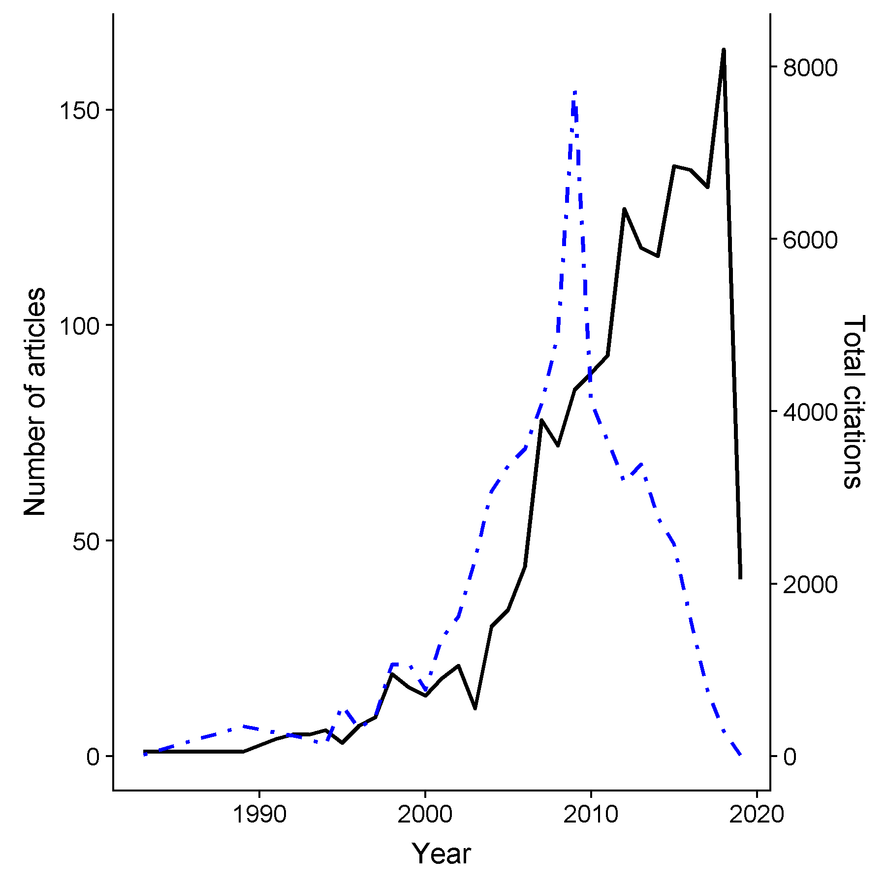
```

```{r revArtNums,echo=FALSE,out.width="85%", fig.cap="Total number of articles published per year by category as categorized by ISI. Book chapters, proceedings, editorials, and letters are excluded."}
knitr::include_graphics("./chapterFiles/rdmReview/figures/figsCalledInDiss/revArtNums.png")
```


Four major themes were identified in the ISI keyword analysis and, interestingly, fell mostly within the quadrants representing the most extreme values: the first and the third quadrants (Figure \@ref(fig:thematicMaps-keyword-isi)). The themes identified by the ISI-supplied keywords were much larger in scope (e.g, dynamics, ecosystems, climate; Figure \@ref(fig:thematicMaps-keyword)a) than those identified in the analysis of author-supplied keywords (e.g., eutrophication, trophic cascade; Figure \@ref(fig:thematicMaps-keyword)b). That is, the themes of 'regime shifts' and 'ecosystem dynamics' are highly central to and dense within the regime shift literature (Figure \@ref(fig:thematicMaps-keyword)b-d). This suggests these two themes are important to the development of the field and are still strongly influencing the evolution of this field. Although the theme 'dynamics' appears a central theme in the development and persistence in ecological regime shift theory based on the bibliographic analysis, it is not necessarily reflected in the many case studies of regime shifts in application [@litzow_early_2016]. In fact, @litzow_early_2016 found that $\sim50%$ of case studies actually tested or accounted for non-linear dynamics when applying  early warning indicators and other regime shift measures to ecological time series. 

#### Historiograph, citation, and reviews
A few patterns appear in analyses of the intellectual and chronological structure of the ecological regime shift literature (Figure \@ref(fig:historiograph)). First, although the concept of stability, thresholds, and multiple stable states in ecological systems first appeared (and was well-received) in the literature in the 1970s [e.g., @holling1973resilience; @may1977thresholds], the most highly cited papers in this field appeared primarily in the early and mid 2000s [@scheffer2003catastrophic; @carpenter2006rising; @folke2004regime; @walker2004resilience; @van2005implications]. The most recent major contributions to the field were conceptual works emphasizing planetary boundaries and tipping points and the impacts of not recognizing these shifts [@hughes2013multiscale]. Finally, the "rise" of resilience theory [@folke2004regime; @walker2004resilience], the first efforts of a search for early warning indicators of ecological regime shifts [@carpenter2006rising]  and the critiques soon following these efforts [@andersen_ecological_2009; @contamin_indicators_2009] are highlighted in the historiograph.

The most influential papers in the field, based solely on number of citations, are those published in the late 2000s (Figure\@ref(fig:totArtCitesPerYear)), and include the articles which are broad in-scope and are still used today to frame studies in the context of global change, planetary boundaries, and large-scale tipping points [@rockstrom_planetary_2009; @smith2009eutrophication; @bennett2009understanding]. Around this time ($\sim2007$) is when the number of regime detection measures doubled (Figure \@ref(fig:wosRegimePubsByYearwithNumEcolPubs)). Papers equally influential to the development of this field include those corresponding to the observed rapid increase in the number of total publications in ecological regime shift theory (in the early 2000s), @folke2004regime and @scheffer2003catastrophic (Figure\@ref(fig:totArtCitesPerYear)). 

Numerous reviews of the regime shift literature exist, ranging from conceptual reviews of the state of regime shift theory in ecology and application [e.g., @bestelmeyer_analysis_2011; @mac2014scrutiny; @andersen_ecological_2009], to studies of robustness of early warning indicators under various theoretical and practical conditions [e.g., @dutta2018robustness; @perretti2012regime; @lindegren_early_2012; @hastings2010regime; Figure \@ref(fig:revArtNums)]. Further, comprehensive reviews of the ecological regime shift detection literature are increasingly out-dated. A permanent and open-source database containing information critical to the testing, comparison, and implementation of RDMs may prove useful to the reader who is interested in applying RDMs but is lacking the statistical or mathematical background to do so.

## A synthesis of the methods available for the practical ecologist
Many of the methods identified in this review have yet to be tested on empirical data from more than a single system type (see Table \@ref(tab:methodstable)).  I categorize the regime detection methods as one of either model-free or model-dependent. Model-free and model-dependent methods are those which do and do not require a mechanistic model to describe the system, respectively. Because many of the model-dependent methods are based on auto-regressive modelling approaches, this is highlighted in the model-dependent section. 

The early warning indicators that are often referred to as, "traditional early warning indicators" (variance, skewness, autocorrelation at lag-1) are fairly well-reviewed, and have been applied to  a variety of conditions [@dakos2012methods; @ditlevsen2010tipping; @lindegren_early_2012; @boettiger_quantifying_2012; @sommer2017generic; @perretti2012regime; @dutta2018robustness; @litzow_early_2016]. However, many of these works apply the traditional (and other) early warning indicators to simulated data, with only some [@contamin_indicators_2009; @perretti2012regime; @dutta2018robustness; @guttal2013robustness] testing under varying conditions of noise and expected shift types. The utility and robustness of the traditional early warning indicators is not consistent across and within systems, making them of limited utility in situations where the system cannot be reliably mathematically modelled, or where we have limited data [@burthe2016early; @hastings2010regime; @perretti2012regime; see also Chapter \@ref(resampling)]. Critical reviews and comparative studies of early warning indicators suggest that no early warning indicator is reliable alone, suggesting the user apply a suite, rather than a single method, and  that there remain gaps in our understanding of the conditions under which  an early warning indicators might fail [@kefi2014early; @clements2018indicators;  @filatova2016regime; @deyoung_regime_2008].

Regime detection measures can be classified into one of two major groups which will largely dictate the applicability of an approach to an analyst or type of information. Some RDMs require the use of mechanistic models whereas others fall into the category of model-independent (or model-free). In most situations, the practical ecologist will have insufficient data or a limited understanding of the system with which to parameterize even the simplest mechanistic models. Further, developing an informative defining data-generating model (i.e. system of equations, differential equations) for more than a few variables (i.e. much greater than 2) is often intractable. Following the convention of @dakos2012methods, I classify the 66 regime detection measure identified as a result of this review for detecting as one of model-based or model(metric)-free and generally synthesize the utility of these types of measures to the practical ecologist. 

### Model-dependent
Model-dependent require a mechanistic (mathematical) representation of the system, models which often carry strict assumptions that are easily violated by empirical systems [@abadi2010assessment]. Model-dependent methods are usefully categorized under two contexts: differentiable systems of equations or auto-regressive. The methods relying on mechanistic models include model descriptions of systems with many, dynamic and interacting components. For example, models are used to reconstruct trophic food webs where prey or predator collapse induces trophic regime shifts in freshwater lake systems [@carpenter2011early]. 

### Model-free
Model-free [or metric-based per @dakos2012methods] methods are those which do not require a mathematical representation of the system. In fact, many require much less knowledge about the system component dynamics and their interactions to calculate a results. The utility of these methods vary with respect to the number of state variables encompassed in the method, and are therefore further categorized as either univariate (using a single dimension) or multivariate (using but not necessarily requiring multiple dimensions). The most widely used model-free univariate RDMs include descriptive statistics of individual system components (i.e. univariate), such as variance, skewness, and mean value [@mantua_methods_2004; @rodionov_application_2005; @andersen_ecological_2009]. These univariate methods, often referred to as 'traditional early-warning indicators' require only very simple calculations of individual variables, however, their efficacy in empirical systems analysis is controversial. For example, variance [@carpenter2006rising] and skewness (of a single variable), oft referred to generally as 'leading indicators' or 'early-warning indicators' in the literature, have been applied to both theoretical and empirical systems data with varying results. 

## Discussion 
In this chapter I present a comprehensive list of the regime detection measures proposed for analyzing ecological data. Although multiple reviews of regime detection measures exist, they are either not comprehensive in their survey of the possible methods or are increasingly out of date with respect to the number of methods proposed in the literature [@rodionov_brief_2005]. Most reviews since the comprehensive list presented in @rodionov_brief_2005 are not comprehensive, instead focusing on a single aspect of measures that may be useful to a particular audience. For example, @roberts2018early summarizes methods capable of handling multiple variables, and @dakos2015resilience review only methods designed to detect the phenomenon of critical slowing down. The list presented here does not discriminate, and provides an update to the seminal methods paper by @rodionov_brief_2005. It is important to note that contributions of previous reviews to the understand and scrutiny of regime detection measures in ecology: @mac2014scrutiny; @scheffer2015generic; @rodionov_brief_2005; @roberts2018early; @dakos2015resilience; @mantua_methods_2004; @litzow_early_2016; @kefi2014early; @andersen_ecological_2009; @boettiger_early_2013; @dakos2015resilience; @clements2018indicators; @filatova2016regime; @deyoung_regime_2008. 

Leading indicators/regime detection measures which analyze only single variables (e.g., variance, autocorrelation at lag-1) are well-tested on both theoretical and empirical data [e.g. @burthe2016early]. Among the most widely used RDMs indicators applied to time-series data include an index of variance, moments around the grand mean (skewness and kurtosis), and critical slowing down [@carpenterBrock2011early; @carpenter2006rising]. Although univariate indicators may provide insight into relatively simple systems, their reliability as indicators for complex systems is less certain [@burthe2016early; @dutta2018robustness; @perretti2012regime; @sommer2017generic; @bestelmeyer_analysis_2011]. Leading indicators can be a reliable warning of impending shift [@carpenterBrock2011early]. Some methods have been applied to early-warning indicators in whole systems [@carpenter2011early], however, it is uncommon to have enough information to build reliable networks or food webs. Consequently, reliably measuring the ecological system at hand is often realistically (and financially) not possible. To be useful to practitioners it may be necessary to move beyond heuristic methods, to methods which supply statistical significance or probabilities. And although critiques of some RDMs exist, the rate at which they are rigorously tested does not exceed the proliferation of new methods in the literature. For any method to gain credible traction as a pragmatic tool in ecology, studies should address the concerns of these critiques.

Only a handful of methods have been introduced to the mainstream methodological journals in ecology (e.g., *Ecological Modelling*, *Methods in Ecology and Evolution*). Although many mainstream publications (e.g., *Science*, *Ecology Letters*) include applications of some of the methods identified in this chapter (Table \@ref(tab:methodstable)), I argue that celebrity and 'new and shiny' [@steel2013applied] methods may influence which methodological articles are printed in these popular journals.  A critical survey of potential and realized applications of these methods would be useful for highlighting the needs of future research and methodological improvements. Many of the methods presented in Table \@ref(tab:methodstable) have either not been applied to empirical data at all, or were tested only once, often but not always in the article introducing or adapting the methodology [@hawkins2015ecosystems]. Some methods, especially those dubbed 'early warning indicators' (variance, auto-regressive model coefficients) have become relatively mainstream in their application to empirical data, despite having been shown to be less robust in noisy and nonlinear systems [@burthe2016early], in systems exhibiting lag-effects [@guttal2013robustness], and in systems not exhibiting catastrophic shifts [@dutta2018robustness]. Unlike these early warning indicators, fewer efforts have been made to test robustness under these and more simple conditions [@dutta2018robustness; c.f. @brock2010interacting; @benedetti2015experimental]. In addition to the paucity of studies attempting to understand the limitations of these methods, this review suggests that simply identifying the suite of methods used in ecological regime shift detection may be difficult using traditional review methods.  Many of the methods mentioned in this review were not easily identifiable in a pilot, systematic search process in Web of Science and Google Scholar--rather, many methods were those of which I was either previously aware and/or those previously  highlighted in the existing reviews [@scheffer2015generic; @rodionov_brief_2005; @roberts2018early; @dakos2015resilience; @mantua_methods_2004; @litzow_early_2016; @kefi2014early; @andersen_ecological_2009; @boettiger_early_2013; @dakos2015resilience; @clements2018indicators; @filatova2016regime; @deyoung_regime_2008]. To facilitate this process, an online, comprehensive database may prove useful to the practical ecologist. 

@hastings2010regime aptly point out an important feature of using any methods for identifying regime shifts in empirical system data: first,  only have a single history exists for ecological system trajectories and second,  most early warning indicators which signal critical slowing down require the system to have a small potential. Although both points are equally important, the latter infers that no ecological system that is complex, or which cannot be accurately modelled using a system of continuous equations, will be predictable via current, early warning signals.  This, paired with the failure of early warning signals in some systems gives little hope for relying upon most regime detection measures and early warning signals as indicators of ecological regime shifts. Disregarding stochasticity in ecological models will often make the model non-differentiable at the point of an abrupt shift [@hastings2010regime; @graham1984existence]. 

The warnings by @hastings2010regime have not yet been heeded---regime detection measures are still being introduced into the literature, often assuming that the system will exhibit critical slowing down prior to the shift, or having been tested on only a single trajectory of an ecological system. Given the increase in introduction and application of regime detection measures, I recommend the following practices be used in this field will aid the accessibility  and transparency of the methods: consistent use of fewer methods which require fewer assumptions; persistent collection and maintenance of baseline data (reference data); an open-sourced database of methods and applications; an updated and critical review of the current state of methods in ecology (see Chapter \@ref(resampling)) which includes a brief discussion of the methodological advancements and demonstrated failures; rigorous empirical applications of these methods (especially of those only tested on toy and experimental data); and the relationship of the RDMs used in ecology to other fields (computer science, data science, climatology and oceanography). I identify a suite of questions (Table \@ref(tab:nextStepsTab)) that would be useful in a much-needed modern and critical review of this field.


```{r nextStepsTab, echo=FALSE}
Questions.stat <- c(
  "Does the method assume smooth potential?",
  "Does the regime shift need to be identified *a priori*?",
  "What are the major assumptions about the distribution of the original data?",
  "Does the method explicitly assume the system/variable is stationary?", 
  "Does the performance of the method change with non-stationarity?",
  "Can the method handle unstructured data?",
  "Can the method handle multiple regime shifts?",
  "What types of regime shifts can the method detect (e.g., stochastic resonance, slow-fast cycles, noise-induced transition)?",
  "Is it a model- or metric-based method?", 
  "Does it have forecasting potential?",
  "Can the method handle uneven sampling?",
  "What are the minimum data requirements (resolution, extent, number of observations)?",
  "How does the method handle missing data (e.g., new invasions)?", 
  "Does the method assume Eulerian or Lagrangian processes?")

Questions.ecol <- c(
  "Does the system *have* smooth potential?",
  "Has the method been tested on empirical data? If so, to what rigor?",
  "What is the impact of losing state variables on long-term predictions (e.g., species extinction)?",
  "Can the method identify drivers?",
  "What assumptions does the method make about the system?", 
  "What types of regime shifts are possible in the system?", 
  "Are regime shift(s) suspected *a priori*?",
  "What lag(s) exist in the data (system)?",
  "Would a positive forecast change management action?",
  "Do predictions translate to other systems?",
  "Can we interpolate data if necessary? If so, what does this mean for inference?",
  "In which discipline(s) beyond ecology has the method been tested?"
  )

Questions = tibble::tibble(
  Type = c(
  "Methodological",
  rep("", length(Questions.stat) - 1),
  rep("", length(Questions.ecol))
  ),
  Questions = c(Questions.stat, Questions.ecol)
  )
  
kableExtra::kable(Questions,
  format="latex",
  longtable = TRUE,
  booktabs = TRUE,
  caption = "Potential questions for a comprehensive review of the ecological regime detection metrics literature."
  ) %>%
  kableExtra::kable_styling(full_width = FALSE) %>%
  kableExtra::column_spec(1, bold = TRUE, border_right = TRUE) %>%
  kableExtra::column_spec(2, bold = FALSE, width = "30em")
```  

# Deconstructing the steps for calculating Fisher Information as a measure of abrupt change in ecological systems {#fiGuide}    

This chapter is currently under review at _Ecological Modelling_ with coauthors N.B. Price, A.J. Tyre,  D.G. Angeler, T. Eason,  D. Twidwell, and C.R. Allen.

```{r cache = TRUE, echo=FALSE, warning=FALSE, eval=TRUE, message=FALSE, results="hide"}
# Chunk defaults
# knitr::opts_chunk$set(cache = TRUE, cache.path = "_cache/", message = FALSE, warning=FALSE, eval=TRUE, echo=FALSE, error=FALSE, fig.align='center',
#                       out.width = "95%")
```

```{r startParms, cache = TRUE, echo=FALSE, warning=FALSE, eval=FALSE, message=FALSE}
# Model parameters
parameters <- c(
  g1 = 1,
  m2 = 1,
  l12 = 0.01,
  g21 = 0.01,
  k = 625,
  B = 0.005
)

# Initial conditions
state <- c(
  x1 = 277.7815, 
  x2 = 174.551
)

# System differential equations (Equation 7.17 and 7.18)
deq <- function(t, state, parameters) {
  with(as.list(c(state, parameters)), {
    dx1dt <- g1 * x1 * (1 - (x1 / k)) - (l12 * x1 * x2) / (1 + B * x1)
    dx2dt <- (g21 * x1 * x2) / (1 + B * x1) - m2 * x2
    list(c(dx1dt, dx2dt))
  })
}
```

```{r odeSolve, cache = TRUE, echo=FALSE, warning=FALSE, eval=FALSE, message=FALSE}
# require(deSolve)
# Vector of times
TT <-  11.145
times <- seq(0, TT, by = TT/1e3)

# Solve system differential equations
out <- ode(
  y = state,
  times
  = times,
  func = deq,
  parms = parameters,
  rtol = 1e-10,
  method = "ode45"
)

# Convert to data frame
sysSol <- tibble(t = out[,1], x1 = out[,2], x2 = out[,3]) 

```

## Abstract    

Ecological regime shifts are increasingly prevalent in the Anthropocene. The number of methods proposed to detect these shifts are on the rise, yet few are capable detecting regime shifts without a priori knowledge of the shift, and fewer are capable of handling high-dimensional, multivariate and noisy data. A variation of Fisher Information has been proposed as a method for detecting changes in the "orderliness" of ecological systems data. Although this method is described and applied in numerous published studies, its calculation and the concepts behind its calculation are not clear. Here, I succinctly describe this calculation using a two-species predator-prey model. Importantly, I demonstrate that the actual equation for calculating Fisher Information metric comprises fewer steps than was previously described, by decoupling the dimensionality-reduction component from the actual Fisher Information calculation component. I hope this work will serve as a reference for those seeking to understand Fisher Information in the context of ecological systems and regime shifts, and will stimulate further research of the efficacy of these composite regime shift detection metrics.. 

## Introduction  
Changes in the feedback(s) governing ecosystem processes can trigger unexpected and sometimes undesirable responses in environmental conditions [@scheffer_catastrophic_2001; @walther_ecological_2002].  Ecologists often refer to such changes as regime shifts, but this term  is used interchangeably in the literature with state change, state transition, or alternative state [@andersen_ecological_2009]. Climate change and globalization are triggering novel and unexpected changes in ecosystems [@hughes_catastrophes_1994;@scheffer_catastrophic_2001;@walther_ecological_2002;@parmesan_ecological_2006], and the rapidity with which these changes occur make predictive modeling difficult. Although detecting regime shifts is increasingly difficult as we increase the extent and complexity of the system in question [@jorgensen_towards_2004], advances in the collection and analysis of ecological data (La Sorte et al. 2018) may improve our ability to detect impending regime shifts in time for intervention [@groffman_ecological_2006; @deyoung_regime_2008; @carpenter2011early; @sagarin_observation_2012; @wolkovich_temporal_2014; @jorgensen_towards_2004]. 

Numerous quantitative approaches have been proposed as regime shift detection methods [@clements_including_2016; @rodionov_application_2005; @andersen_ecological_2009; @mantua_methods_2004], but few are consistently applied to terrestrial ecological data [@deyoung_regime_2008]. I broadly classify these methods as either model-based or model-free [@boettiger_quantifying_2012; @hastings2010regime; @dakos2012methods].  Model-based methods use mathematical (mechanistic) representations of the system [@hefley2013statistical], which often carrying strict assumptions that are easily violated by dynamic systems such as ecosystems [@abadi2010assessment]. Further, model mis-specification may yield spurious results [@perretti_model-free_2013]. Model-free [or metric-based, per @dakos2012methods] regime detection methods require fewer assumptions to implement than do model-based methods, and typically require much less knowledge (if any) about system component interactions. The most widely used model-free methods include both descriptive statistics of individual system components, such as variance, skewness, and mean value [@mantua_methods_2004; @rodionov_application_2005; @andersen_ecological_2009] and composite measures of multiple variables, notably principal components analysis [@petersen2008regime;@mollmann2015marine], clustering algorithms [@beaugrand2004north], and the 'variance index' [@brock_variance_2006].

### Fisher Information as a Regime Detection Method
A method that has been more recently applied in the analysis of ecological and social-ecological systems is Fisher Information [@cabezas_towards_2002; @karunanithi_detection_2008]. As a multivariate, model-free method, Fisher Information integrates the information present in the entire data of a system and distills this complexity into a single metric. This allows Fisher Information to capture ecosystem dynamics with higher accuracy than uni-variate-based metrics, which frequently fail to detect regime changes [@burthe2016early]. However, despite the potential of this method its mathematical underpinnings -- specifically its calculation and the concepts behind its calculation-- may not be obvious to those without extensive training in mathematics.  In this paper, I address this knowledge gap. I first provide an overview of the method and highlight the need to account for scaling properties, an inherent feature in complex systems. I then succinctly describe the decoupling of the dimensionality-reduction component from the actual Fisher Information calculation component using a two-species predator-prey model. I finally discuss the results from a theoretical viewpoint and its practical utility for predicting regime shifts, an increasing concern motivated by current rates of fast ecological change.   

### The Sustainable Regimes ypothesis
Fisher Information [hereafter, FI; @fisher_mathematical_1922] is a model-free, composite measure of any number of variables, and is proposed as an early warning signal for ecological regime shift detection and as a measure of system sustainability [@mayer_applications_2007;@karunanithi_detection_2008; @eason2014managing;@eason_evaluating_2012]. Three definitions of FI in this context exist: (i) a measure of the ability of the data to estimate a parameter, (ii) the amount of information extracted from a set of measurements [@frieden_physics_1998;@frieden_fisher_1990], and (iii) a measure representing the dynamic order/organization of a system [@cabezas_towards_2002]. Although definitions (i) and (ii) are widely applied in the statistical and physical sciences, I focus on definition (iii) as it is gaining traction as a tool  used in the context of ecological system response to fast environmental change. The application of FI to complex ecological systems was posed as part of the "Sustainable Regimes Hypothesis," stating a system is sustainable, or is in a stable dynamic state, if over some period of time the average value of FI does not drastically change [@cabezas_towards_2002]. This concept can be described using an ecological example. Consider the simple diffusion of a population released from a point source at $t=0$. This process can be described by a bi-variate normal distribution, $p(x,y|t)$. As the time since release, $t$, increases, the spread of the distribution, $p(x,y|t)$, disperses because the animals have moved further from the release location. As the animal moves away from the release location, the potential area within which it currently occupies will increase with time. In this example, FI will decrease in value as t increases because $p(x,y|t)$  contains less information (higher uncertainty) about where the animals will be located. If we assume constant dispersal, as $t\rightarrow\infty$ the animals will be relatively uniformly distributed across the environment and $p(x,y|t)$ will carry no information about the location of the animals. Consequently, as $t\rightarrow\infty$ FI approaches zero (no information). Per the Sustainable Regimes Hypothesis [@cabezas_towards_2002], this example system is not in a stable dynamic state over the range of $t$, since  FI decreases with time. 

Conversely, if a population following a simple logistic growth model, $\frac{dN}{dt}=rN(1-\frac{N}{K})$, varies around some carrying capacity, K, and the average system parameters ($r$, $K$, and their variances $\sigma_r, \sigma_k$) are stationary, then the logarithm of the population size should follow a normal distribution, $N ~ normal(\mu,\sigma)$. In this situation, the FI measured over any selected window of time will be relatively constant and, per the Sustainable Regimes Hypothesis, indicates the system is in a stable dynamic state. Further, this Hypothesis posits that a perturbation to N will also not affect FI so long as the perturbation occurs with a stationary probability distribution and if the perturbation does not change the distributions of $r$ and $K$. 

### Fisher Information requires dimension reduction prior to calculation  
An important feature of the FI method is that it requires a complete reduction in dimensionality (i.e., from $>1$  to $1$ system component). For example, a recent application of Fisher Information to empirical data condensed a species pool from 109 species time series into a 1-dimensional time series [@spanbauer_prolonged_2014]. A reduction in dimensionality, i.e. condensing multivariate data into a single metric, of over two orders of magnitude likely involves a large loss of relevant information, raising the questions of what information is preserved during the dimensionality reduction step in calculating FI, what is lost, and whether this is important. Other dimension reduction techniques, e.g., principal component analysis (PCA) and redundancy analysis (RDA), attempt to preserve the variance of the data, and the number of components scales with the dimensionality of the data (i.e. they are scale explicit). In contrast, by reducing entirely the dimensionality of the data, the FI method does not identify which features of the data are preserved, and the dimensionality does not scale with the dimensionality of the original data.

### Aims
The key contribution of this study is that I decouple the dimensionality reduction step of the FI method (Step 1) from the statistical analysis step (Step 2). By isolating the dimensionality reduction step, we can evaluate it based on its own merits and relate it to more well-known and established methods of dimensionality reduction. By isolating the statistical analysis step, one can better understand how Fisher Information is calculated on the single-dimensional data. I believe that this decoupled approach will eliminate some confusion regarding the calculation of FI, allowing interested researchers to readily evaluate the merits of this method. To facilitate our explanation of the method, I reproduce the predator-prey analysis used in [@fath_regime_2003; @mayer_applications_2007], then induce a "regime shift" into the model. I hope this work will serve as a useful explanation of the FI metric for those seeking to understand it in the ecological regime shift context and will stimulate research using this and other multivariate, model-free, and composite measures to understand ecological regime shifts.

## Methods
### Predator-prey model system
Our model system is a two-species predator-prey model [Equation \@ref(eq:predprey); @fath_regime_2003; @mayer_applications_2007; @frieden_exploratory_2010], hereafter referred to as the "model system":
\begin{equation} 
\begin{array}{rcr}
  dx_1 = g_{1}x_{1}(1-\frac{x_1}{k})- \frac{l_{12} x_{1} x_{2}}{1+\beta x_{1}} \\
  dx_2 = \frac{g_{21}x_1 x_2}{1+\beta x_1} - m_2 x_2)
  \end{array}
  (\#eq:predprey)
\end{equation}

The specified parameters for the model system are $g_1=m_2=1$,$l_{12}=g_{12}= 0.01$ ,$k=625$ ,and $\beta=0.005$ [@fath_regime_2003; @mayer_applications_2007; @frieden_exploratory_2010]. The initial conditions (predator and prey abundances) for the model system were not provided in the original references [@fath_regime_2003; @mayer_applications_2007]. I used package `deSolve` in Program R (version 3.3.2) to solve the model system [Equation Equation \@ref(eq:predprey)] finding $x_1=277.781$ and $x_2=174.551$ to provide reasonable results. A complete cycle of this system corresponds to $~11.145$ time units.

### Inducing a Regime Shift
@mayer_applications_2007 calculated FI for a predator-prey system for several discrete values of carrying capacity of prey. The results of this study showed that FI was different for systems with different carrying capacities ($K$). However, this study did not address the central question of **FI behavior during a regime shift**.  As an extension of the original study, I simulated a regime shift by modeling an abrupt decline in carrying capacity, $k$. I assume $k$ is described by Equation \@ref(eq:mayerCase) where $k_1$ is the initial carrying capacity, $k_2$ is the final carrying capacity, $t_{shift}$ is the time the regime shift occurred, and $\alpha$ is the parameter controlling the rate (slope) of the regime shift. The hyperbolic tangent function (see Equation \@ref(eq:mayerCase)) simulates a smooth and continuous change in $k$ while still allowing for the regime shift to occur rapidly. I incorporate the change in $k$ into our system of differential equations by defining the rate of change in $k$, $k'(t)$, given by (Equation \@ref(eq:mayerCase)). I assume $k_1=800$ and $k_2=625$, values corresponding to the range of carrying capacities explored by @mayer_applications_2007. I simulated a time series of 600 time units, introducing a regime change after 200 time units, and $\alpha=0.05$, where $t^*$ indicates the 
\begin{equation}  
\begin{array}{rcr}
  k(t) = k_1  - 0.5(k_1-k_2)(\tanh(\alpha (t-t^*))+1) \\ 
  k'(t) = 0.5\alpha (k_1-k_2)(\tanh(\alpha(t-t^*))^2 +1) \\
(\#eq:mayerCase)
\end{array}
\end{equation}


### Decoupling the Steps for Calculating Fisher Information
Two methods exist for calculating Fisher Information (FI) as applied to ecological systems data to which I refer the "derivatives-based" method (first appearing in @cabezas_towards_2002 and the binning method (first appearing in @karunanithi_detection_2008). Although the binning method is proposed as an alternative to the derivatives-based method for handling noisy and sparse data, our decoupling method reveals it may be an unnecessary method. Therefore, I focus on only the derivatives-based method for explaining the theoretical basis for the FI method. The general form of FI can be found in [@fath_regime_2003;@mayer_applications_2007] and I refer the reader to [@cabezas_towards_2002]. 

\begin{equation}  
\frac{ds}{dt} = \sqrt(\frac{dx_1}{dt}^2 + \frac{dx_2}{dt}^2)
(\#eq:shere)
\end{equation} 

__Step 1__: Dimensionality Reduction. The key idea of the dimensionality reduction step is to calculate the Euclidean distance traveled in phase space. In phase space, each coordinate axis corresponds to a system state variable (e.g., number of predators and number of prey). The state of the model system over time describes a path or trajectory through phase space. The distance traveled represents the cumulative change in state relative to an arbitrary starting point in time. For the model system, the distance traveled in phase space can be obtained by solving the differential equation given by Equation \@ref(eq:shere)

The original motivation for the dimensionality reduction step is that, under restrictive conditions, there is a one-to-one mapping between the state of the system ($s$), defined in a multidimensional phase space, and the distance traveled, a one-dimensional summary [@cabezas_towards_2002]. To relate this abstract idea to a more familiar situation, we draw an analogy between the path traced by the system in phase space and the path of a car over the course of a trip. The distance traveled by the car over time is related to the position of the car. Given the route of the car, we could determine the location of the car at any point in time if we know how far it has traveled. However, the distance traveled provides no information about the proximity of locations (i.e., system states). For example, two points in phase space may be arbitrarily close, but the distance traveled would be different if these system states occur at different points in time. Moreover, if the system revisits the same state twice then the one-to-one mapping breaks down and a single state maps to potentially very different values of distance traveled.

What is preserved in the calculation of distance traveled is the rate of change of the system (e.g., the speed and acceleration of the car). The rate of change of the system is the first derivative of the distance traveled in phase space. This is an important point because the concept of a "regime shift" is often associated with the idea of a sudden change in system state. Therefore, it may not be unreasonable to employ a dimensionality reduction procedure that preserves these system dynamics. 

__Step 2: Statistical Analysis.__ The product of __Step 1__ is a one-dimensional time series of what I call "distance traveled", $s$, (in phase space). The variable $s$ is referred to as "Fisher variable s" and "represent[s] a particular state of phase space" in the FI literature [@mayer_applications_2007]. I believe distance traveled ($s$) is more descriptive than "Fisher Variable s" and avoids confusing the state of the system, defined in multiple dimensions by the multivariate data, with the one-dimensional summary. Using this measure, we next calculate the probability of observing the system in a particular state by assuming a one-to-one mapping between distance traveled and the system state. That is, we calculate the probability of observing the system at a particular distance, $p(s)$, along the trajectory for some period of time from 0 to $t_{end}$. The time at which we observe the system is assumed to be a random variable, $T_{obs} \sim Uniform(0,t_{end})$. This approach assumes the system is deterministic and is observed without error. However, the observed distance traveled by the system, $s$, is a random variable because it is a function of the random observation time.

\begin{equation} 
    I = \int \frac{ds}{p(s)}\left[\frac{dp(s)}{ds}\right]^2  \\
    (\#eq:fiAdapted)
\end{equation} 
\begin{equation}
    I=\frac{1}{T}\int_0^Tdt\left[\frac{s''^2}{s'^4}\right]^2 \\
  (\#eq:fiDerivs)
\end{equation}

Importantly, the probability of observing the system at a particular value of s increases if the system is changing slowly at that point in time. That is $p(s)$ is inversely proportional to the system rate of change, $s'$. Mathematically, the distance traveled in phase space, $s$, is a monotonically increasing function of time and we assume it is differentiable. Therefore, the probability density function of the distance traveled is $p(s)=\frac{1}{T}\frac{1}{s'}$, where $s'=\frac{ds}{dt}$ is the speed (or velocity) of $s$, and $T$ is the time interval over which the system was observed ($t_{start}$-$t_{end}$). We note that $p(s)$ is simply a constant multiplied by the inverse of the speed of the system.

The original motivation for the FI calculation as applied to ecological systems was the hypothesis that "since Fisher Information is a measure of the variation" it is also "an indicator of system order, and thus system sustainability" [@cabezas_towards_2002]. Equation \@ref(eq:fiAdapted) is a general form of FI and Equation \@ref(eq:fiDerivs) is the form used in the derivative-based method for FI [see Equation 7.3b and 7.12 in @mayer_applications_2007]. To better understand the FI calculation, note that Equation\@ref(eq:fiDerivs) is, in part, a measure of the gradient content of the probability density function. As the probability density function becomes flatter, the FI value will decrease. In this way, the FI calculation is closely related to the variance. In fact, the FI value for a normal distribution calculated according to Equation \@ref(eq:fiDerivs) is simply one over the variance. It is also important to note that FI is zero for a uniform distribution, as the probability density function is flat. Note also that FI goes approaches $\infty$ if the system is not changing over some period of time (Equation \@ref(eq:fiDerivs)).

```{r FIcalc, cache = TRUE, echo=FALSE, warning=FALSE, eval=FALSE, message=FALSE}
# Equation 7.3b
p <- sysSol_highO$p
s <- sysSol_highO$s
dp <- lead(p)-p
ds <- lead(s)-s
dpds <- dp/ds
ind <- 1:(length(s)-1)
FI_7.3b <- caTools::trapz(s[ind], (1/p[ind])*dpds[ind]^2)

# Equation 7.3c
q <- sqrt(sysSol_highO$p)
s <- sysSol_highO$s
dq <- lead(q)-q
ds <- lead(s)-s
dqds <- dq/ds
ind <- 1:(length(s)-1)
FI_7.3c <- 4*caTools::trapz(s[ind], dqds[ind]^2)

# Equation 7.12
t <- sysSol_highO$t
dsdt <- sysSol_highO$dsdt
d2sdt2 <- sysSol_highO$d2sdt2
ind <- 1:(length(s)-1)
FI_7.12 <- (1/TT)*caTools::trapz(t[ind], d2sdt2^2 / dsdt^4)

# Results
# FI_7.3b
# FI_7.3c
# FI_7.12
```

```{r kSim, cache = TRUE, echo=FALSE, warning=FALSE, eval=FALSE, message=FALSE}
# Carrying capacity
k <- seq(625, 800, by = 25)

# Initial conditions
x1_ini <- c(277.7815,
          314.6527,
          303.6386,
          175.4664,
          50.72788,
          135.6263,
          571.6995,
          166.9751)
x2_ini <- c(174.551,
          191.5272,
          226.0233,
          270.6772,
          133.5784,
          32.24493,
          65.22751,
          345.6978)

# Loop over k's
results_kstudy <- NULL
FI_7.3b <- NULL
for(i in 1:length(k)){
  
  # Update parameters
  parameters["k"] <- k[i]
  state["x1"] <- x1_ini[i]
  state["x2"] <- x2_ini[i]
  state["s"] = 0
  
  # System differential equations including higher order terms and distance
  deq_kstudy <- function(t, state, parameters) {
    with(as.list(c(state, parameters)), {
      dx1dt <- g1 * x1 * (1 - (x1 / k)) - (l12 * x1 * x2) / (1 + B * x1)
      
      dx2dt <- (g21 * x1 * x2) / (1 + B * x1) - m2 * x2
      
      dsdt <- sqrt(dx1dt^2 + dx2dt^2)
      
      list(c(dx1dt, dx2dt, dsdt))
    })
  }
  
  # Vector of times
  TT <-  13.1
  times <- seq(0, TT, by = TT/1e3)
  
  # Solve system differential equations (now with distance)
  out_kstudy <- deSolve::ode(
    y = state,
    times = times,
    func = deq_kstudy,
    parms = parameters,
    rtol = 1e-10,
    method = "ode45"
  )
  
  # Convert to data frame
  sysSol_kstudy <-
    tibble(k = as.factor(k[i]),
               t = out_kstudy[, 1],
               x1 = out_kstudy[, 2],
               x2 = out_kstudy[, 3],
               s = out_kstudy[, 4])
  
  # Remove any overlap in trajectories
  maxT <- (sysSol_kstudy %>% 
             mutate(startDist = sqrt((x1-x1_ini[i])^2 + (x2-x2_ini[i])^2)) %>% 
             filter(t > 10, t < 15) %>% 
             filter(startDist == min(startDist)))$t

  sysSol_kstudy <- sysSol_kstudy %>% 
    filter(t <= maxT)
  
  sysSol_kstudy <- 
    sysSol_kstudy %>% 
    mutate(dsdt = (lead(s)-s)/(lead(t)-t),
           p = (1/maxT)*(1/dsdt)) %>% 
    filter(!is.na(dsdt))
  
  
  # Fisher information
  p <- sysSol_kstudy$p
  s <- sysSol_kstudy$s
  dp <- lead(p)-p
  ds <- lead(s)-s
  dpds <- dp/ds
  ind <- 1:(length(s)-1)
  FI_7.3b[i] <- caTools::trapz(s[ind], (1/p[ind])*dpds[ind]^2)
  
  # Bind results
  results_kstudy <- rbind(results_kstudy, sysSol_kstudy)
}
```
```{r solve-ODE, cache = TRUE, echo=FALSE, warning=FALSE, eval=FALSE, message=FALSE}
# Initial conditions including distance
state_highO <- c(
  x1 = 277.7815, 
  x2 = 174.551,
  dx1dt = -48.6,
  dx2dt = 28.3,
  d2x1dt2 = -23.3,
  d2x2dt2 = -10.5,
  s = 0
)

# Model parameters
parameters_highO <- c(
  g1 = 1,
  m2 = 1,
  l12 = 0.01,
  g21 = 0.01,
  k = 625,
  B = 0.005
)

# System differential equations including higher order terms and distance
deq_highO <- function(t, state, parameters) {
  with(as.list(c(state, parameters)), {
    
  # 1st derivatives
  dx1dt <-
  g1 * x1 * (1 - (x1 / k)) - (l12 * x1 * x2) / (1 + B * x1)
  
  dx2dt <- (g21 * x1 * x2) / (1 + B * x1) - m2 * x2
  
  # 2nd derivatives
  d2x1dt2 <-
  (B * l12 * x1 * x2 * dx1dt) / (B * x1 + 1) ^ 2 - (g1 * x1 * dx1dt) / k - (l12 *
  x1 * dx2dt) / (B * x1 + 1) - (l12 * x2 * dx1dt) / (B * x1 + 1) - g1 * (x1 /
  k - 1) * dx1dt
  
  d2x2dt2 <-
  (g21 * x1 * dx2dt) / (B * x1 + 1) - m2 * dx2dt + (g21 * x2 * dx1dt) / (B *
  x1 + 1) - (B * g21 * x1 * x2 * dx1dt) / (B * x1 + 1) ^ 2
  
  # 3rd derivatives
  d3x1dt3 <-
  (2 * B * l12 * x2 * dx1dt ^ 2) / (B * x1 + 1) ^ 2 - (2 * g1 * dx1dt ^ 2) /
  k - (l12 * x1 * d2x2dt2) / (B * x1 + 1) - (l12 * x2 * d2x1dt2) / (B * x1 + 1) - (2 *
  l12 * dx1dt * dx2dt) / (B * x1 + 1) - (g1 * x1 * d2x1dt2) / k - g1 * (x1 /
  k - 1) * d2x1dt2 + (B * l12 * x1 * x2 * d2x1dt2) / (B * x1 + 1) ^ 2 - (2 *
  B ^ 2 * l12 * x1 * x2 * dx1dt ^ 2) / (B * x1 + 1) ^ 3 + (2 * B * l12 * x1 *
  dx1dt * dx2dt) / (B * x1 + 1) ^ 2
  
  d3x2dt3 <-
  (g21 * x1 * d2x2dt2) / (B * x1 + 1) - m2 * d2x2dt2 + (g21 * x2 * d2x1dt2) /
  (B * x1 + 1) + (2 * g21 * dx1dt * dx2dt) / (B * x1 + 1) - (2 * B * g21 *
  x2 * dx1dt ^ 2) / (B * x1 + 1) ^ 2 - (B * g21 * x1 * x2 * d2x1dt2) / (B *
  x1 + 1) ^ 2 + (2 * B ^ 2 * g21 * x1 * x2 * dx1dt ^ 2) / (B * x1 + 1) ^ 3 - (2 *
  B * g21 * x1 * dx1dt * dx2dt) / (B * x1 + 1) ^ 2
  
  # Derivative of distance (i.e., tangential velocity)
  dsdt <- sqrt(dx1dt ^ 2 + dx2dt ^ 2)
  
  list(c(dx1dt, dx2dt, d2x1dt2, d2x2dt2, d3x1dt3, d3x2dt3, dsdt))
  })
}

# Solve system differential equations (now with distance)
out_highO <- deSolve::ode(
  y = state_highO,
  times = times,
  func = deq_highO,
  parms = parameters_highO,
  rtol = 1e-10,
  method = "ode45"
)

# Convert to data frame
sysSol_highO <-
  tibble(t = out_highO[, 1],
             x1 = out_highO[, 2],
             x2 = out_highO[, 3],
             dx1dt = out_highO[,4],
             dx2dt = out_highO[,5],
             d2x1dt2 = out_highO[,6],
             d2x2dt2 = out_highO[,7],
             s = out_highO[, 8]) %>%  
  # Calculate derivatives and pdf
  mutate(dsdt = sqrt(dx1dt^2 + dx2dt^2),
         d2sdt2 = (1/dsdt)*(dx1dt*d2x1dt2 + dx2dt*d2x2dt2),
         p = (1/TT)*(1/dsdt))

```

```{r distSpeedAccel, cache = TRUE, echo=FALSE, warning=FALSE, eval=TRUE, message=FALSE, out.width="95%", fig.cap=paste("From top to bottom, distance traveled in phase space, speed tangential to system trajectory, acceleration tangential to system trajectory.")}
# 
# # Plot distance traveled
# p1 <- ggplot(data = sysSol_highO, aes(x = t, y = s)) +
#   geom_line() +
#   labs(x = "", y = "distance")+
#   theme(plot.margin = unit(c(1,0.5,0,0), "cm"))
# 
# 
# # Plot velocity
# p2 <- ggplot(data = sysSol_highO, aes(x = t, y = dsdt)) +
#   geom_line() +
#   labs(x = "", y = "speed")+
#   theme(plot.margin = unit(c(1,0.5,0,0), "cm"))
# 
# 
# # Plot acceleration
# p3 <- ggplot(data = sysSol_highO, aes(x = t, y = d2sdt2)) +
#   geom_line() +
#   labs(x = "time", y = "acceleration")+
#     theme(plot.margin = unit(c(1,0.5,0,0), "cm"))
# 
# # Grid plot
# plot<- cowplot::plot_grid(p1, p2, p3, ncol=1, labels="auto", vjust=1.5)
# ggsave(plot, filename = ".//chapterFiles/fiGuide/figures/distSppedAccel.png")

knitr::include_graphics("./chapterFiles/fiGuide/figures/distSppedAccel.png")
```
##Results
Distance traveled ($s$), speed ($\frac{ds}{dt}$), and acceleration ($\frac{d^2 s}{dt^2}$) capture the dynamics of the model system [Equation \@ref(eq:predprey); Figure \@ref(fig:distSpeedAccel)]. I simulated a regime shift in the carrying capacity of this model system, at approximately $t=200$ (Figure \@ref(fig:kByTime)). The location of this regime shift with respect to the system trajectory in phase space over the entire simulated time period is shown in (Figure \@ref(fig:kTrajectories)). Although a slight change is captured by $s$ (Figure 4) at the location of this regime shift, it is not pronounced. Although the distance traveled, $s$ (Figure \@ref(fig:sOverTime)) changes fairly smoothly around the location of the regime shift, the system exhibits a steep decline in speed ds/dt   soon after the induced regime shift (Figure \@ref(fig:dsdtOverTime)).

I calculated FI for the distribution of  $s$ over a series of non-overlapping time windows. According to @mayer_applications_2007 the length of the time window should be equal to one system period such that FI is constant for a periodic system, however, the system periods are not identical before, during, and after the regime shift. Therefore, I performed two separate calculations of FI using window sizes corresponding to the initial (when $t<200$) and the final ($t>200$) periods of the system ($winsize = 13.061$ and $11.135$ time units, respectively). Using these window sizes the drop in FI at the regime shift initiation is bigger than the magnitude of the fluctuations preceding it (Figure \@ref(fig:fiOverTime)).

```{r kByTime, cache = TRUE, echo=FALSE, warning=FALSE, eval=TRUE, message=FALSE, out.width="95%",fig.cap = paste("Carrying capacity over time with a regime shift occuring around time 200.")}
knitr::include_graphics('./chapterFiles/fiGuide/figures/kByTime.png')
```

```{r kTrajectories, cache = TRUE, echo=FALSE, warning=FALSE, eval=TRUE, message=FALSE, out.width="95%",  fig.cap=paste("Phase space plot of system trajectories for different values of k. Colored point indicates the coordinates coorresponding to the shift induced in carrying capacity. ")}
# Plot trajectories
# ggplot(data = results_kstudy, aes(x = x1, y = x2, color = k)) +
#   geom_path() +
#   labs(x = "prey, x1", y = "predator, x2") +
#   coord_fixed()

knitr::include_graphics(".//chapterFiles/fiGuide/figures/kTrajectories.png")
```

```{r sOverTime, cache = TRUE, echo=FALSE, warning=FALSE, eval=TRUE, message=FALSE, out.width="95%",fig.cap = paste("Distance travelled in phase space over time. Dashed vertical line at time 200 indicates location of regime shift.")}
knitr::include_graphics('./chapterFiles/fiGuide/figures/sOverTime.png')
```


## Discussion
Part of the appeal of the FI method of regime shift detection is that it provides a 1-dimensional visual summary of system "orderliness". However, I have demonstrated that, because only a single measure is required to calculate the Fisher Information, the dimensionality reduction step need not necessarily use the 'distance traveled'. Rather, for example, one can calculate the Fisher Information of anohter reduced dimension like the components of an ordination (e.g. using Principal Components Analysis). The rate of change of the system (velocity, $\frac{ds}{dt}$}), on which FI method is based, is also a 1-dimensional quantity. In the simple predator-prey example, calculating and plotting FI did not provide a clear benefit over simply plotting the system rate of change directly. I suggest that future research uncouple the dimensionality reduction step and the FI calculation step in order to better illustrate the benefits of the FI method relative to dimensionality reduction alone.
```{r dsdtOverTime, cache = TRUE, echo=FALSE, warning=FALSE, eval=TRUE, message=FALSE,out.width="95%", fig.cap=paste("Speed of the system (rate of change, velocity) in phase space. Dashed vertical line at time 200 indicates location of regime shift.")}
knitr::include_graphics('./chapterFiles/fiGuide/figures/dsdtOverTime.png')
```

In the predator-prey example, I assumed the data was free from observation error. Despite these ideal conditions, the estimated FI had high variation and the results depended on the size of the time window used in the calculation. This issue arises because the period of the cyclic system is changing during the regime shift such that it is difficult to find a single window size that works well for the entire time series. @mayer_applications_2007 describe this as a "confounding issue" related to "sorting out the FI signal of regime change from that originating from natural cycles" and suggest using a time window that is large enough to include several periods. However, in the absence of a quantitative decision rule defining what changes in FI indicate regime shifts, it is difficult to separate the signal in the FI metric from the noise due to fluctuations in the natural cycles. Further research is needed to define quantitative decision rules for what changes in FI constitute a regime shift.

The example used in this study is unrealistic in that I assume no measurement error and therefore focus on the "derivatives-based" method of calculating FI. However, our analysis also has implications for the "binning" method of calculating FI that was later developed for high-dimension noisy data (@karunanithi_detection_2008). Rather than attempting to estimate the rate of change of each system component (e.g., hundreds of species) and combining these estimates to get the total system rate of change, I suggest an approach where the dimensionality of the data is first reduced by calculating distance traveled in phase-space and then only a single rate of change is estimated.  The advantage of this approach is that for an n-dimensional system it only requires the estimation of one derivative rather than n-derivatives . The drawback to this approach is that noisy observations will likely introduce some bias into the estimate of the system rate of change. Nonetheless, I believe this approach is worth exploring due to its simplicity relative to the "binning" method.
```{r fiOverTime, cache = TRUE, echo=FALSE, warning=FALSE, eval=TRUE, message=FALSE, out.width="95%", fig.cap=paste("Fisher Information calculated for non-overlapping time windows. Two different window sizes were used as indicated by color. Dashed vertical line at time 200 indicates approximate location of regime shift.")}
knitr::include_graphics('./chapterFiles/fiGuide/figures/fiOverTime.png')
```
The Fisher Information of an $n$-dimensional system is a vector of unit-less values which can only be compared within a data set (e.g., within a single community time series) and interpreting FI is still largely a qualitative effort [@mantua_methods_2004; @fath_regime_2003], not unlike most regime detection methods [Ch. \@ref(rdmReview)]. When the FI of a system is increasing, the system is said to be moving toward a more orderly state, and most studies of FI propose that sharp changes in FI, regardless of the direction of the change, may indicate a regime shift [@cabezas_towards_2002; @karunanithi_detection_2008; @spanbauer_prolonged_2014]. Although the aforementioned and numerous other works interpret FI in this context [e.g., @eason2014managing;@eason_evaluating_2012], I suggest future work which clearly identifies the ecological significance of the Fisher Information metric and its significance within the ecological regime shift paradigm. 

## Acknowledgements
I thank H. Cabezas and B. Roy Frieden for early discussions regarding the development of Fisher Information, and T.J. Hefley for comments on an earlier draft.


<!-- #UNUSED FIGS -->
```{r pp1Period,eval=FALSE, cache = TRUE, echo=FALSE, warning=FALSE, eval=TRUE, message=FALSE, fig.cap=paste("Phase space plot of two-species Lotka-Volterra predator-prey system over a single period (~11.145 time units."), cache = T}
# Plot system trajectory
# ggplot2::ggplot(data = sysSol, aes(x = x1, y = x2)) +
#   geom_path() +
#   labs(x = "prey, x1", y = "predator, x2") +
#   coord_fixed()
```

```{r 2D-hist, cache = TRUE, echo=FALSE, warning=FALSE, eval=FALSE, message=FALSE, fig.cap="A 2-dimensional histogram of the probability of observing a system in a particular state, $p(x)$, of the 2-species Lotka-Volterra predator prey system over a single period (~11.145 time units).", out.width="95%"}
# Plot probability of observing the system in a particular state
# ggplot2::ggplot(data = sysSol, aes(x = x1, y = x2)) +
#   geom_bin2d(aes(fill = ..density..), color = "black", drop = T, bins = 20) +
#   scale_fill_distiller(palette = "YlOrRd") +
#   labs(x = "x_1", y = "x_2", fill = "p(x)") +
#   coord_fixed()+
#   theme_bw()
```

```{r stringFig, cache = TRUE, echo=FALSE, warning=FALSE, eval=FALSE, message=FALSE, out.width="95%", fig.cap = paste("A single cycle of a hypothetical two-species system over time period $t = 0$ to $t = T$. $s^*$ is the state of the system at some point in time. The dotted line represents the distance travelled by the system in phase space over its trajectory during time $(0, T)$.")}
# 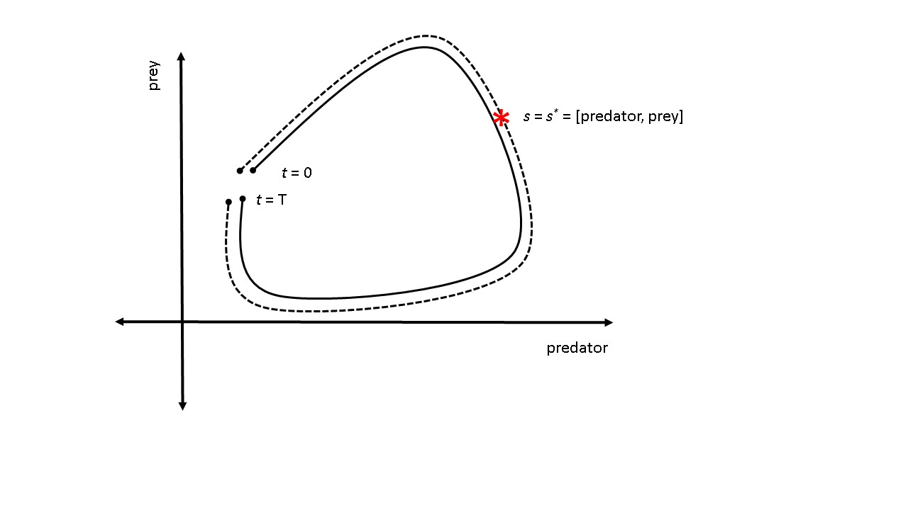
```


  

# An application of Fisher Information to bird community data does not reveal distinct regimes in the continental United States {#fisherSpatial}
```{r cache = TRUE, echo=FALSE, warning=FALSE, eval=TRUE, message=FALSE}
# knitr::opts_chunk$set(cache = TRUE, cache.path = "_cache/", message = FALSE, warning=FALSE, eval=TRUE, echo=FALSE, error=FALSE, fig.align="center",out.width = "85%")
## Only run line six this if you need to calculate more metrics, or fix them.
# you need to go into this (line 158) and specify parameters for calculating metrics.
# source('/chapterFiles/fisherSpatial/04-chap-fisherSpatial_analysis.R')
figDir <- "./chapterFiles/fisherSpatial/figures"
figDissDir <- "./chapterFiles/fisherSpatial/figures/figsCalledInDiss"
```
## Introduction    
Ecosystems are open, dynamical systems that are most often not easily described using fully parameterized models. Some patterns have emerged in certain statistical mechanics of ecological observations. despite the complexity of most ecological systems. An uptick in recent years of studies of **regime shifts** (Table \@ref(tab:glossary)) in ecology has spurred an increase in the number of new methods for detecting ecological regime shifts (Chapter \@ref(rdmReview)), some of which have been applied to spatial information [@butitta_spatial_2017; @kefi2014early; @sundstrom2017detecting; @guttal2009spatial; @brock_variance_2006]. As defined in Table  \@ref(tab:glossary), a regime shift is largely considered an abrupt and persistent change in a system's structure or functioning. Following this definition and without considering the pressures (Table \@ref(tab:glossary)) associated with the observed regime shift, it is not yet clear whether identifying a 'spatial regime' using a snapshot of a system (i.e. using a single or short period of time relative to the time scale of the system dynamics and/or pressures) is pragmatic. A concise and global definition of the spatial regime detection measure is important since observations of non-random spatial processes (e.g., land cover) can manifest as either a rapid shift (e.g. an ecotone) or as a gradual change (e.g., slow mixing along a gradient). Consequently, and because most regime detection measures signal abrupt change, only the former may be identified as "regime shifts" using spatial regime detection measures.

Although it is suggested that statistical and pragmatic methods are advanced more rapidly by bottom-up approaches, i.e. using case studies [see @deangelis2017spatially], there is much work to be done in the way of testing the statistical rigor of spatial regime detection measures. The objective of this chapter is to determine whether the Fisher Information as a regime detection method [Eq. \@ref(eq:fiDerivs)] identifies spatial regime boundaries in the bird communities of the continental United States. This chapter is also supported by original software developed for implementation in Program R, which is publicly available (see Appendix \@ref(regimeDetectionMeasures)).

```{r bbsPoints, eval=TRUE, echo = FALSE, fig.cap = 'Locations of Breeding Bird Survey routes sampled between 1966 and 2017.', out.width="85%"}
knitr::include_graphics(paste0(figDissDir, "/bbsRoutesUsed.png"))
```

## Data and Methods
### Data: North American breeding bird communities
I used community abundance data  [@sauer2017results] from long-term monitoring programs to identify spatial and temporal regimes using the Fisher Information (FI) derivatives method (see Eq. \@ref(eq:fiDerivs)). The North American Breeding Bird Survey (NABBS) trains citizen scientist volunteers to annually collect data using a standardized roadside, single observer 3-minute point count protocol and has organized data collection annually across North America (Figure \@ref(fig:bbsPoints)) since 1966. The roadside surveys consist of 50 point counts (by sight and sound) along $\sim24.5$ mile stretch of road. Due to strict reliance on volunteers, some routes are not covered every year. Additionally, some routes are moved or discontinued due to changing landscape conditions and change in observer safety. Route-year combinations that were missing years but were not discontinued were treated as missing data. Although NABBS volunteers attempt to identify all species as possible, persistent biases exist in this protocol. Despite a standardized survey protocol, some species are difficult to detect using these methods. For example, crepuscular species are less likely to be detected beyond the first few points of the BBS route, given they are most active at sunrise and the survey begins within 30 minutes of sunrise. Further, species which congregate in large groups and are highly mobile (e.g., waterfowl) tend to have less reliable inter-annual abundance estimates given their ability to move long-distances in a short period of time. To remove any potential influence of sampling bias on the Fisher Information result, I removed birds of these types from all analyses: waterfowl, waders, and shore species (BBS AOU numeric codes 0000 through 2880).  

### Study area
Although the NABBS conducts surveys throughout much of North America (most of the United States, Canada, and Mexico), coverage of the boreal forests of Canada are sparse in space, and many routes in Mexico have fewer than 25 years of observations. For these reasons I limited analyses largely to the continental United States and parts of Southern Canada (see Figure \@ref(fig:bbsPoints)).

```{r basesOfInterestMap, echo = FALSE, Figurealign='center',  out.width="85%", fig.cap = 'Locations of focal U.S. military bases, Eglin Air Force Base (AFB) and Fort Riley Military Base.'}
knitr::include_graphics(paste0(figDissDir, "/basesOfInterestMap.png"))
```

```{r ewRoutesUsedHere, out.width="85%", echo = FALSE, fig.cap="Three East-West running transects analyzed in this Chapter overlayed against the Omernick Ecoregion boundaries map."}
# Routes used in this chapter analysis. 
# for some reason, when i include a caption on this chunk it fucking fails, saying the caption is beyond float, despite the length of hte caption,...
knitr::include_graphics(paste0(figDissDir,  "/allRoutesUsed_ecoregions.png"))
```

#### Focal military base
The Mission of the U.S. Department of Defense is to provide military forces to deter war and protect the security of the country, and a primary objective of individual military bases is to maintain military readiness. To maintain readiness, military bases strictly monitor and manage their natural resources. Military bases vary in size and nature, and are heterogeneously distributed across the continental United States (See Figure \@ref(fig:ewRoutesUsedHere)). The spread of these bases (Figure \@ref(fig:basesOfInterestMap)), coupled with the top-down management of base-level natural resources presumably influences the inherent difficulties associated with collaborative management within and across military bases and other natural resource management groups (e.g., state management agencies, non-profit environmental groups).

Much like other actively managed landscapes, military bases are typically surrounded by non-managed lands, or lands not managed specifically for natural resource or ecological biodiversity or conservation.  Natural resource managers of military bases face environmental pressures within and surrounding their properties, yet their primary objectives are very different. Natural resource managers of military bases, whose primary objective is to maintain military readiness, are especially concerned with if and how broad-scale external forcings might influence their lands. Prominent concerns include invasive species, wildlife disease, and federally protected species (personal communication with Department of Defense natural resource managers at Eglin Air Force and Fort Riley military bases). For these reasons, natural resource managers attempt to create buffers along their perimeters (e.g., live fire/ammunition suppression, wide fire breaks). Identifying the proximity of military bases to historic and modern ecological shifts may provide insight into the effectiveness of their natural resource management efforts.

The NABBS routes chosen for analyses in this Chapter lie within or near Fort Riley military base (located at approximately $39.110474^{\circ}$, $-96.809677^{\circ}$; Kansas, USA). Fort Riley (Figure \@ref(fig:basesOfInterestMap)) is a useful reference site for this study.  Woody encroachment of the Central Great Plains over the last century has triggered shifts in dominant vegetative cover and diversity [@ratajczak2018abrupt] in the area surrounding Fort Riley military base [@van2009causes]. This phenomena should present itself as a regime boundary if Fisher Information is a reliable spatial regime detection measure. 
<!-- The natural resource management teams are active on each base and have been for at least two decades and each uses wildfire as a management technique. Fort Riley military base is especially relevant to regime shift detection method exploratory analysis. -->
<!-- Eglin Air Force base is embedded within a heavily developed matrix, and consequently has experienced less pronounced effects at broad spatial extent and over longer periods. Therefore, the ecological communities (and the data) surrounding Eglin Air Force base may exhibit a greater amount of noise, making the effect size of a regime shift and consequently the effect size smaller and more difficult to detect. For these reasons, Eglin Air Force and Fort Riley military bases are ideal locations for an exploratory analysis of the Fisher Information as an spatial regime detection measure.  -->

#### Spatial sampling grid  
Fisher Information has been applied to empirical data as a spatial regime detection measure in recent years [@sundstrom2017detecting; @eason2019information]. The authors of  @sundstrom2017detecting used the Fisher Information binning method to demonstrate the utility of this method as an indicator of spatial regime boundaries, suggesting that rapid changes in the resulting value of Fisher Information as calculated for spatially adjacent sites should indicate 'regime changes'. @sundstrom2017detecting identified sampling sites which transected multiple ecoregions, resulting in a transect which zigzagged across a region of the Midwestern United States [@sundstrom2017detecting]. I identified sites using a gridded system across the continental United States and parts of Canada to ameliorate  potential bias associated with handpicking NABBS routes. The gridded system comprises East-West running transects transects, ameliorating potential  sampling bias as the transect location and widths were designed to capture large-scale shifts in bird communities at regular intervals. This spatial sampling grid  approach also  allows for raster stacking, or layering data layers (e.g., vegetation, LIDAR, weather), providing an opportunity to  identify potential relationships with abiotic drivers, should regime shifts be observed in the avifauna data. This spatial sampling method also provides a simple vector for visualizing changes in the Fisher Information over space-time. For brevity, I present visual results of only three, spatially-adjacent, East-West running transects (Figure \@ref(fig:ewRoutesUsedHere)) at multiple time periods. 

### Calculating Fisher Information (FI) 
Fisher Information, $I(\theta)$, was developed in 1922 by Ronald Fisher as a measure of the amount of information that an observable variable, X, reveals about an unknown parameter, $\theta$. Fisher Information is a measure of indeterminacy (Fisher 1922) and is defined as,
\begin{equation} 
  I(\theta) = \int \frac{dy}{p(y|\theta)}\left[\frac{dp(y|\theta)}{d\theta}\right]^2
  (\#eq:fiGeneral1922)
\end{equation}
where $p(y|\theta)$ is the probability density of obtaining the data in presence of $\theta$. The Fisher Information measure (FIM) is used to calculate the covariance matrix associated with the likelihood, $p(y|\theta)$. Fisher Information is described as Extreme Physical Information [@frieden1995lagrangians; @frieden_non-equilibrium_2002], a measure that has been used to track the complexity of systems in many scientific disciplines including, physics, cancer research, electrical engineering, and, recently, complex systems theory and ecology

Fisher Information as gathered from observational data provides insight as to the dynamic order of a system, where an orderly system is one with constant (i.e., unchanging) observation points, and one whose nature is highly predictable. A disorderly system is just the opposite, where each next data point is statistically unpredictable. In ecological systems, patterns are assumed to be a realization of ecosystem order; therefore, one should expect orderliness in a system with relatively stable processes and feedbacks. Orderliness, however, does not necessarily infer long-term predictability. Equation \@ref(eq:fiGeneral1922) is next adapted to estimate the dynamic order of an entire system, $s$, as
\begin{equation} 
  I = \int \frac{ds}{p(s)}\left[\frac{dp(s)}{ds}\right]^2
  (\#eq:fi73c)
\end{equation}

where $p(s)$ is the probability density for $s$. Here, a relatively high Fisher Information value ($I$) infers higher dynamic order, whereas a lower value (approaching zero) infers less orderliness. To limit the potential values of $I$ in real data, we can calculate the amount of Fisher Information by re-expressing it in terms of a probability amplitude function $q(s)$ [@mayer_applications_2007; @fath_regime_2003]: 

\begin{equation}
  I = 4 \int ds\left[\frac{dq(s)}{ds}\right]^2
  (\#eq:fiAmp)
\end{equation}

A form specific to the probability density function of distance traveled by the entire system, which I call the 'derivatives' method, is defined as [@mayer_applications_2007, eq. 7.12]:
\begin{equation}
  I = \frac{1}{T} \int_0^T dt\left[\frac{s''^2}{s'^4}\right]^2
  (\#eq:fiDerivs)
\end{equation}

where T is the number of equally spaced time points over which the data are integrated. Numerical calculation of $I$ using the binning method (Eq. \@ref(eq:fiAmp) and \@ref(eq:fiDerivs)) each incorporate a moving-window procedure for calculating the probability of the system, $p(s)$, as being in one of an unidentified number of states ($s$). Although previously applied to spatially-explicit terrestrial community data,the binning method requires multiple parameters to be defined *a priori*, which have been shown to influence inference based on the metric. I therefore calculated FI using the derivatives equation [see Chapter \@ref(fiGuide)].

The binning procedure allows for a single point in time or space to be categorized into more than one state, which violating the properties of alternative stable states theory. The size of states [see @eason_evaluating_2012] measure is required to construct $p(s)$. In the case of high dimensional data, a univariate binning procedure of $p(s)$ is not intuitive (i.e., reducing a multivariate system to a single probability distribution rather than constructing a multivariate probability distribution). Importantly, when using community or abundance data, rare or highly abundant species can influence the size of states criterion, thus influencing the assignment of each point into states. Finally, Eq. \@ref(eq:fiAmp) assumes equal spacing (in space or time) between sampling points. Each of these violations can be avoided by using Eq. \@ref(eq:fiDerivs) [@cabezas_towards_2002; @fath_regime_2003] to calculate the Fisher Information measure (see Chapters \@ref(fiGuide), \@ref(velocity) for detailed discussions on this topic). Briefly, derivatives method (Eq. \@ref(eq:fiDerivs)) estimates the trajectory of the system's state by calculating the integral of the ratio of the system's acceleration and speed in state space [@fath_regime_2003]. Here, I use the derivatives method (Eq. \@ref(eq:fiDerivs)) to calculate Fisher Information for all East-West transects (see Figure \@ref(fig:ewRoutesUsedHere)) at decadal intervals (years 1980, 1990, 2000, and 2010).  Justification for using this method is provided in detail in Chapter \@ref(fiGuide).

### Interpreting and comparing Fisher Information across spatial transects
#### Interpreting Fisher Information values
Interpretation of FI, like the interpretation of numerous other regime detection measures, is currently a qualitative effort. Fisher Information is proposed as an indicator of system orderliness, where periods of relatively high values of FI indicate the system is in an "orderly" state, possibly fluctuating around a single attractor. A rapid change in FI is proposed as an indicator of a change in a system's orderliness, suggesting a potential reorganization phase. Whether Fisher Information can identify a switch among basins of attraction within a single, stable state remains unknown, as does the number of states which a system can occupy. When a system occurs within any number of states equally, i.e., $p(s)$ is equal for each state, both the derivative, ($\frac{dq(s)}{ds}$, and $I$ are zero. As $(\frac{dq(s)}{ds} \rightarrow \infty)$, we infer the system is approaching a stable state, and as $\frac{dq(s)}{ds} \rightarrow 0$  the system is showing no preference for a single stable state and is on an unpredictable trajectory. Eq. \@ref(eq:fiAmp)  bounds the potential values of Fisher Information at $[0, 8]$, whereas Eq. \@ref(eq:fiGeneral1922), Eq. \@ref(eq:fi73c), and Eq. \@ref(eq:fiDerivs)  are positively unbounded $[0, \infty)$. If the Fisher Information is assumed to represent the probability of the system being observed in some state, $s$, then the absolute value of the Fisher Information index is relative within a single datum (here a single datum is a spatial transect). It follows that Fisher Information should be interpreted relatively, but not absolutely.

Here I define a potential regime change as a point(s) having a non-zero derivative, and at which relatively large changes (manifested as either a sharp increase or decrease) in FI occurs. Regime shifts are identified as data changing from one state to another, thus, rapid shifts in the value of FI should indicate the locations of these shifts in the time *and* space, at which the system undergoes reorganization. Spatial and temporal Fisher Information calculation does not vary, but interpretation of either differ in that a spatial analysis will identify a spatial regime boundary [@sundstrom2017detecting] within a single time period, whereas temporal analysis identifies the point in time at which the system undergoes a regime shift. I follow published recommendations for interpreting the Fisher Information results in the context of identifying regime shifts [e.g., @karunanithi_detection_2008; @eason_evaluating_2012; @fath_regime_2003].

#### Interpolating results across spatial transects

NABBS are not regularly spaced, and pairwise correlations of adjacent transects (see Figure \@ref(fig:ewRoutesUsedHere)) is not possible without either (1) binning the Fisher Information calculations using a moving-window analysis, or (2) interpolating the results to regularly-spaced positions in space. To avoid potential biases associated with the former option (i.e. choosing window size, location of data aggregation), I linearly interpolated the calculated Fisher Information within each spatial transect to 50, evenly-spaced points along the longitudinal dimension. The 50 longitudinal points to which I interpolated were the same across each spatial transect, while latitude varied across transects. I used the function `stats::approx()` (with argument `rule=1`) to linearly approximate the Fisher Information. I did not interpolate values beyond the longitudinal range of the original data (i.e., no extrapolation). 

#### Spatial correlation of  Fisher Information 
If Fisher Information captures and reduces information regarding abrupt changes in community structure across the landscape, then it follows that the values of Fisher Information should be spatially auto correlated. That is, the correlation of FI values should increase as the distance between points, both within and among transects, decreases. Further, direct comparison of FI across routes is not possible since FI (Eq. \@ref(eq:fiDerivs)) is a relative value with no upper limit (i.e. can take on any value between $0$ and $\infty$). In other words, FI values calculated  are **not** relatively comparable outside of a single spatial transect (Figure \@ref(fig:ewRoutesUsedHere)). Fisher Information **is**, however, directly comparable within each spatial transect (e.g., \@ref(fig:ewRoutesUsedHere)). For these reasons, we can identify spatial regime shifts both within and among spatial transects by using pairwise correlations among two transects (e.g., \@ref(fig:ewRoutesUsedHere)) to determine whether values of FI are consistent across space. Here, I calculate the pairwise correlation (Pearson's) among each pair of adjacent spatial transects (e.g., Figure \@ref(fig:ewRoutesUsedHere)). I removed a pair of points if at least one point was missing an estimate for Fisher Information. This occurs when the original longitudinal range of one transect exceeded the range of the adjacent pair. 

## Results  
### Fisher Information across spatial transects
```{r fi1Tsect, echo = FALSE, message=FALSE, warning=FALSE,  out.width="85%", fig.cap="The change in the Fisher Information  values along a single,  East-West-running spatial transect (Transect number 12) over time."}
knitr::include_graphics(paste0(figDissDir,  "/transect_12_East-West_metric_FI_Eqn7_12.png"))
```

As suggested earlier, rapid increases or decreases in FI are posited indicate a change in system orderliness, potentially suggesting the location of a regime shift. Using this method yields inconclusive results regarding the location of 'spatial regimes' (Figure \@ref(fig:fi1Tsect)). Of the three spatial transects analyzed in this chapter (see Figure \@ref(fig:ewRoutesUsedHere)), Figure \@ref(fig:fi1Tsect) is representative of the lack of pattern observed in the Fisher Information values across all analyzed transects. I did not identify patterns of spatially contagious abrupt changes in the Fisher Information values within or among spatial transects. 
<!-- Further, the log-transformed FI suppresses some of the extreme values which can visually dampen other sharp changes, but did not exhibit clear regime shifts in these data.  -->
```{r fiSinglePair, echo = FALSE,  out.width="85%", fig.cap="Fisher Information of two spatially adjacent transect pairs (transects 12, 13) over time. Interdecadual trends in FI are very different within each transect and are not highly correlated among transects over time."}
knitr::include_graphics(paste0(figDissDir,  "/interp_FI_singlePair_corPlot_East-West.png"))
```
\begin{landscape}
```{r usaFI, eval=TRUE, echo = FALSE,  out.width="65%", fig.cap="Fisher Information of select East-West spatial transects over time. These transects are representative of the results obtained from the remaining transects."}
# knitr::include_graphics(paste0(figDissDir,  "/usaAllTsects_East-West_metric_FI.png")
knitr::include_graphics(paste0(figDissDir, "/usaAllTsects_East-West_metric_logScaleFI.png"))
```
\end{landscape}
```{r fiEcoregion, echo = FALSE,  out.width="85%", fig.cap="Contrary to expectations there appear no clear patterns of abrupt change in the Fisher Information results along three selected East-West running transects  (Year 2010). The results are visualized here at regularly-spaced intervals such that the locations are not precise relative to the location of corresponding Breeding Bird Survey routes."} 
knitr::include_graphics(paste0(figDissDir,  "/scaledFiInterpolated_year2010_zoom_East-West.png"))
```

```{r corPlotTsectsInterp,echo = FALSE, out.width="85%", fig.cap="Pairwise relationships of Fisher Information (interpolated values) of spatially adjacent transects over time do not exhibit expected patterns of high postive correlation. Pairs were compared (column) at select sampling years (rows), and pair-wise correlations among paired transects are presented. Large, positive correlations indicate Fisher Information signals similarly at adjacent spatial transects."}
knitr::include_graphics(paste0(figDissDir,  "/interpolated_FI_corplotSelectTransects_East-West.png"))
```

```{r corPlotTsectsInterpLog, eval=TRUE,echo = FALSE,  out.width="85%", fig.cap="Pairwise relationships of Fisher Information (interpolated values on the log-scale) of spatially adjacent transects over time. Pairs were compared (column) at select sampling years (rows), and pair-wise correlations among paired transects are presented. Large, positive correlations indicate Fisher Information signals similarly at adjacent spatial transects."}
knitr::include_graphics(paste0(figDissDir,  "/interpolated_FI_corplotSelectTransects_East-West_log.png"))
```

### Spatial correlation of Fisher Information
This study did not identify spatial correlation of the Fisher Information results among most of the spatially adjacent transects (Figures \@ref(fig:corPlotTsectsInterp) and \@ref(fig:corPlotTsectsInterpLog))). For spatially-adjacent transects (e.g, transects 11 and 12, or 12 and 13 in Figures \@ref(fig:corPlotTsectsInterp) and \@ref(fig:corPlotTsectsInterpLog)), we should expect high and positive correlation values, and these values should stay consistent across time *unless* the spatial transects were separated by an East-West running physical or functional boundary. This is not, however, what I expect in our East-West running transects (Figure \@ref(fig:ewRoutesUsedHere)), as the spatial soft-boundaries limiting the distribution and functional potential of avian communities are largely North-South (Figure \@ref(fig:ewRoutesUsedHere)). Note spatial transects in Figure \@ref(fig:ewRoutesUsedHere) overlap multiple, large spatial ecoregion boundaries, such that we should expect our data to identify these points (boundaries).

Upon initial investigation, there are no consistent signs of broad-scale patterns in FI across space (Figure \@ref(fig:fiEcoregion))^[Here, shape size indicates the relative value of the scaled and centered Fisher Information results. Red box (top panel) indicates the extent of the results presented in the bottom panel.]. If Fisher Information is an indicator of spatial regime boundaries, we should expect to see large changes in its value (in either direction) near the edges of functional spatial boundaries (e.g., at the boundaries of ecoregions). No clear regime changes appeared in areas where we might expect rapid changes (e.g., along the 105th meridian West, where a sharp change in altitude occurs).
```{r fiEcoregion00, echo = FALSE,  out.width="85%", fig.cap="Fisher Information results (scaled and centered; larger circles (points) represent higher values of Fisher Information) plotted against ecoregion boundaries (EPA Level 2 boundaries) for the year 2000."}
knitr::include_graphics(paste0(figDissDir,  "/scaledFiInterpolated_year2000_East-West.png"))
```

Numerical investigation of the spatial correlation among adjacent transects also yielded no clear patterns. I did not identify any obvious correlation with changes in FI values and functional potential (using Omernick Ecoregion Level 2; see Figure \@ref(fig:fiEcoregion)). However, in years 2000 and 2010 the transects 11 and 12, and 12 and 13 were highly positively correlated (Figure \@ref(fig:corPlotTsectsInterpLog)). Rather than abrupt changes in Fisher Information I found gradual changes (e.g., see results for years 2000 and 2010 in Figs. \@ref(fig:fiEcoregion) and \@ref(fig:fiEcoregion00).

## Discussion  
The Fisher Information measure was introduced as a method to avoid analytical issues related to complex and noisy ecological data [@karunanithi_detection_2008; @fath_regime_2003] and was recently  suggested as an indicator of spatial regimes [@sundstrom2017detecting; @eason2019information]. Contrary to expectations, I did not consistent abrupt changes in the  Fisher Information metric  (Eq. \@ref(eq:fiDerivs)), which would indicate a regime shift of sorts, in the avian communities. Further, there was an absence of autocorrelation among the spatially adjacent transects in my study area, suggesting that the Fisher Information may not be a suitable metric for identifying abrupt changes in bird communities at this scale. 

Although the Fisher Information equation (Eq. \@ref(eq:fiDerivs)) used in this study is a relatively straightforward and fairly inexpensive computational  calculation, extreme care should be taken when applying this index to empirical data. Fisher Information is capable of handling an infinite number of inputs (variables) and, given sufficiently low window size parameters, can technically calculate an index value for only two observations. It is important that the user understands the assumptions of identifying regime shifts or abrupt changes when using this method, as rigorous testing of its efficacy is necessary (but see Chapter \@ref(resampling)). The sampling design of the North American Breeding Bird Survey data in this Chapter was designed to avoid subjective decisions present in a previous application [@sundstrom2017detecting].

There are three primary assumptions required when using Fisher Information to estimate relative orderliness within ecological data [@mayer_applications_2007]: (i) the order or state(s) ($s$) of the system is observable; (ii) any observable change in the information observed in the data represents reality and the variables used in the analyses will not produce false negatives; and, (iii) changes in $I$ presumed to be regime shifts do not represent the peaks of cyclic (periodic) patterns. Assumption (i) is one of philosophical debate and is thus not controllable. To attempt to control for false negatives or false positives that may result from violating assumption (ii), the user of this metric should take care in their selection of state variables. In the the case of a high dimensional data, relativization of state variables and/or a state variable reduction technique  may be useful. However, Fisher Information does not convey information on how specific variables relate to the calculated index. Finally, we can take measures to  account for cyclic behavior [assumption (iii)] in the data by ensuring integration periods capture at one full cycle of the system and, given sufficiently high number of observations, increasing the integration period may also alleviate some issues related to irreducible error, or white noise.

The lack of patterns identified using Fisher Information may be influenced by a mismatch among the ecologically relevant scales and the temporal resolution and extent of our data may influence the ability of this index to capture large-scale changes in whole bird communities. Aside from the typical biases associated with the BBS data (e.g., species detection probability, observer bias), there are additional considerations to be made when using these data to identify 'spatial regime shifts'. Breeding Bird Survey routes are spaced apart so as to reduce the probability of observing the same individuals, but birds which fly (especially in large flocks) overhead to foraging or roosting sites have a higher probability of being detected on multiple routes. We have, however, removed these species (waders, shorebirds, waterfowl, herons) from analysis. Regardless, this study assumes there is potential for each unique BBS route to represent its own state. If routes were closer together, it is more probable that the same type and number of species would be identified on adjacent routes. Therefore, if this method does not detect slight changes in nearby routes which occupy the same 'regime', then it follows that the method is sensitive to loss or inclusion of new species, which are spatially bounded by geological and vegetative characteristics. What new information does this give us about the system? Fisher Information reduces and removes the dimensionality of these systems, which may omit information or signals integral to understanding  the ecological processes at play. 

Effective regime detection measures should provide sufficient evidence of the drivers and/or pressures associated with the identified regime shifts [@mac2014scrutiny]. The Fisher Information index, while collapsing a wealth of data into a single metric, does not allow the user to relate the resulting value to the original data, unlike other dimension reduction techniques. For example, the loadings, or the relative influence of variables on the ordinate axes, can be derived from a Principal Components Analysis--this cannot be achieved using Fisher Information. If Fisher Information clearly suggested a spatial regime boundary or shift, a before-and-after post-hoc analysis of the regional community dynamics might confirm the regime shift occurrence.

A rapid change in either direction (increase or decrease) of the Fisher Information value is proposed as an indicator of ecological regime shifts, or a change in the orderliness of a system  [@mayer_fisher_2006; @eason_evaluating_2012]. After calculating the Fisher Information for each spatial transect (Figure \@ref(fig:ewRoutesUsedHere)) during each sampling year in this study, I used pairwise correlation to determine whether spatial autocorrelation existed among pairs of spatial transects. If some set of points are close in space and  are *not* separated by some physical or functional boundary (e.g., an ecotone, high altitude rock formations), then the Fisher Information calculate should exhibit a relatively high degree of spatial autocorrelation that is consistent over time. It follows that the correlation coefficient of spatially adjacent transects should be similar, diverging only as the distance between the transects differs and/or a functional or physical boundary separates them. Contrary to these expectations, I did not find evidence of such abrupt changes within nor across the East-West running spatial transects. Several questions remain regarding the application of regime shift detection methods to spatially-explicit data. If signals of regime shifts  do exist, the results of this study suggest the Fisher Information metric may not be ideal for identifying them. This study provided an objective evaluation of the Fisher Information metric as a spatial regime detection measure. Future work on the following areas may improve our understanding of if and how Fisher Information may provide insights of ecological regime shifts in spatial and/or temporal data:

1. Sensitivity of Fisher Information to data quality and quantity (this is explored in Chapter \@ref(resampling)).
1. What, if any, advantages does FI have over other density estimation techniques?
1. Does FI provide signals in addition to or different than geophysical and vegetative (e.g. LIDAR) observations (data)? 
1. Relationship of Fisher Information to likelihood ratio-based unsupervised change-point detection algorithms [e.g., ChangeFinder; @liu2013change].
1. How does Fisher Information perform relative to other regime detection measures (see Chapter \@ref(resampling))?
  

# Using Resampling Methods to Evaluate the Relative Performance of Regime Detection Measures {#resampling}
```{r setupresampling, cache = TRUE, echo=FALSE, warning=FALSE, eval=TRUE, message=FALSE, results="hide"}
knitr::opts_chunk$set(echo=FALSE, warning=FALSE, message=FALSE, out.width="85%")
get_os <- function(){
  sysinf <- Sys.info()
  if (!is.null(sysinf)){
    os <- sysinf['sysname']
    if (os == 'Darwin')
      os <- "osx"
  } else { ## mystery machine
    os <- .Platform$OS.type
    if (grepl("^darwin", R.version$os))
      os <- "osx"
    if (grepl("linux-gnu", R.version$os))
      os <- "linux"
  }
  tolower(os)
}
# IF ON MAC:
if(get_os()!="windows") figDir <- "./chapterFiles/resampling/figsCalledInDiss/"
if(get_os()=="windows") figDir <- "./chapterFiles/resampling/figsCalledInDiss//"
```
## Introduction 
Ecological systems have many unpredictable and variably interacting components. Methods for analyzing these complex systems, e.g. Dynamic Bayesian Networks, network models, and food webs are designed to handle these complexities, yet require data- and knowledge-intensive models. Although ecological data collection and data management techniques are improving [@lasorte2018opportunities], the aforementioned approaches to modeling and understanding complex system are often unfeasible in ecosystem research and management [@clements_including_2016]. 

A growing concern with anthropogenic impacts on the environment has increased the demand for mathematical and statistical techniques that capture these dynamics. These often undesirable changes in the structure or functioning of ecological systems are often referred to as _regime shifts_, _regime changes_, _state change_, _abrupt change_, etc. [@andersen_ecological_2009] . A yet-unattained goal of ecological research and management is to reach a point where these methods can predict impending regime shifts in real-time and with high confidence. Ideally, ecological regime shift detection methods (hereafter, regime detection measures) would require little knowledge of the intrinsic drivers of the system, and the users of the method would not be required to know if and where a regime shift occurred in the data. 

Despite the suite of regime detection measures in the environmental and ecological research literature, they are not used in ecological management. We can describe the current state of regime detection measures as being either system specific (i.e., the method is not system agnostic) or not. Methods of the latter type are convenient in that they can be applied across various system and data types, but the results of these analyses require some degree of subjective interpretation [@clements2018indicators; _c.f._ @batt2013changes]. Efforts to develop and/or improve regime detection measures that do not require such subjectivity will aid the advance of regime detection measures research and application. 

Current efforts to improve regime detection measures may be stunted by the lack of application beyond simple and/or theoretical systems data. Like most statistical and mathematical approaches, the evolution of many regime detection measures begins with application to theoretical data, followed by application to empirical data. Current applications of regime detection measures to empirical, ecological data are largely limited to data describing populations [@anderson_community_1999;@alheit_synchronous_2005; @deyoung_regime_2008], climatic, marine, and Paleolithic regime shifts [@spanbauer_prolonged_2014; @kong2017hydrological; @yang_10_2006], with few applications to terrestrial data [_c.f._ @bahlai2015shifts; @sundstrom2017detecting]. Although testing the performance and inference boundaries of theoretical and simple systems is important, they are of little use to ecosystem managers if they are not proven to be easily and reliably applicable to their system. Additionally, regime detection measures should be capable of handling empirical ecological data, which are often sparse, noisy, and haracterized by irregular time intervals. 

Ecological systems data are expensive to capture, often exhibiting large process variation and observation errors. This variability reduces data quality and quantity, limiting the numerical tools for identifying trends and changes in the system [@thrush2009forecasting]. Some methods, new and old, proposed as regime detection measures are purported to handle the data limitation and quality issues inherent in ecological data, and minimize subjective decisions for choosing state variables and interpreting results. For example, variable reduction techniques, e.g. principal components analysis [@rodionov_application_2005; @andersen_ecological_2009; @reid_global_2016], clustering algorithms [@weijerman2005regime;@weissmann2016predicting], an index of variance [@brock_variance_2006],  and Fisher Information [@cabezas_towards_2002; @fath_exergy_2004; @karunanithi_detection_2008] were introduced as methods which collapse the system into a single indicator of ecological regime shifts. Although these methods have been used on empirical ecological systems data, their robustness to empirical data quality and quantity have yet to be examined. 

In this Chapter I examine the influence of observation and process errors on the inference obtained from select multivariate regime detection measures. There are three major objectives:  

1. Identify the effects of data quality on regime detection measure inference.
1. Identify the effects of data quantity on regime detection measure inference.
1. Explore the relative performance of velocity (described in Chapter \@ref(velocity)) to the above mentioned methods under multiple scenarios.

This Chapter provides baseline relative performance estimates of select, multivariate regime detection measures under various scenarios of data quality and quantity. The results from this Chapter inform the practical ecologist of the potential limitations to consider when applying these regime detection measures to their data, and has potential to inform the data collection process. Additionally, the software accompanying this Chapter allows the end user to implement these methods on this or their own system data, or on theoretical data.

```{r origDat, echo=FALSE, out.width="85%", fig.cap="Relative abundances of the diatom species in Foy Lake over the time period."}
knitr::include_graphics(paste0(figDir,"origDataRelAbundance.png"))
```

```{r timeElapsed, echo=FALSE, out.width="85%", fig.cap="The amount of time elapsed between observations for the Foy Lake paleodiatom data.", out.width="75%"}
knitr::include_graphics(paste0(figDir,"timeElapsed.png"))
```

## Data and Methodology
### Study system and data  
I used paleodiatom time series from a freshwater system in North America (Foy Lake, present day Montana) that apparently underwent rapid shifts in algal community dynamics at multiple points in time. This data comes from a single soil core sample, from which the relative abundances of 109 diatom species were identified at  768 observations (time points) over $\approx7,000$ years (Figure \@ref(fig:origDat)). Although the soil core was sampled at regular distances, the soil accumulation process is not necessarily linear over time, resulting in irregularly-sampled observations (i.e., time elapsed between sampling points differs varies; see Figure \@ref(fig:timeElapsed)). The data were published in @spanbauer_prolonged_2014 and can be downloaded at the publisher's website.

### Regime detection measures
Fewer model-free regime detection metrics exist than do model-based metrics (Chapter \@ref(rdmReview)) and of these, only a few are suggested for multivariate data. Here, I compare the results for three regime detection metrics that are model-free and can handle multivariate data: velocity (Chapter \@ref(velocity)), the Variance Index [@brock_variance_2006] and Fisher Information [@fath_regime_2003]. I chose the Variance Index, as this is one of the more widely applied multivariate, model-free regime detection measures, and has been shown to, in some empirical data, identify regime shifts _post hoc_. I introduced the velocity in Chapter \@ref(velocity) as a new, potential regime detection metric. As this is the first time it has been used for such a purpose, including it in this approach allows us to further identify potential flaws with the method, but also to gain some baseline estimates of its relative performance. In Chapter \@ref(fiGuide), I presented the Fisher Information metric as it is used in detecting ecological regime shifts, and discuss the situations under which it may or may not be a good metric. 

#### Velocity ($v$) calculation
In Chapter \@ref(velocity), I describe a new method, __velocity__, $v$, as a potential dimension reduction and regime detection method. First introduced by @fath_regime_2003 as one of multiple steps in calculating their variant of Fisher Information, velocity calculates the cumulative sum of the mean root square change in all state variables over a period of time (Eq. \@ref(eq:velocityEq)). Steps for calculating this metric are described in detail in Chapters \@ref(fiGuide) and \@ref(velocity).  

\begin{equation}
\begin{array}{rcr}
\Delta s_i = \sqrt{\sum_{j=1}^{n} (x_{i,j} -x_{i-1, j})^2}
s_k =  \sum_{i=2}^{k}\Delta{s_i}
2\leq k \leq n
v =\frac{\Delta s}{\Delta t}  
\end{array}
(\#eq:velocityEq)
\end{equation}

#### Variance Index (VI) calculation
The Variance Index was first introduced by @brock_variance_2006, and can be simple defined as the maximum eigenvalue of the covariance matrix of the system within some period, or window, of time. The Variance Index (also called Variance Indicator) was originally applied to a modelled system [@brock_variance_2006] and has since been applied to empirical systems data [@spanbauer_prolonged_2014; @sundstrom2017detecting]. Although rising variance has been shown to manifest prior to abrupt shifts in some empirical systems data  [@van2005implications;@brock_variance_2006], the Variance Index, which is intended for multivariate data, appears most useful when the system exhibits a discontinuous (non-linear) shift [@brock_variance_2006]. 

#### Fisher Information (FI) calculation
Fisher Information ($I$) is essentially the area under the curve of the acceleration to the fourth degree ($s''^4$) divided by the squared velocity ($s'^2$; also referred to as $v$ in Chapter \@ref(velocity)) of the distance traveled by the system, $s$ over some period of time ($T$), and is given in Eq. \@ref(eq:fiDerivs2):  

\begin{equation}   
    I = \frac{1}{T} \int_0^T dt\left[\frac{s''^2}{s'^4}\right]^2 \\  
  (\#eq:fiDerivs2)  
\end{equation} 

I refer the reader to Chapter \@ref(fiGuide) for a complete description and to @cabezas_towards_2002 for a complete derivation of Fisher Information.
(ref:re1) Density plot of the coefficient of variation (CV) as a percentage (%) of the Variance Index resampled values over 10,000 iterations. Densities are drawn based on all values of CV but values greater than 100% are not printed.
```{r viCV, echo=FALSE, out.width="85%", fig.cap="(ref:re1)"}
knitr::include_graphics(paste0(figDir,"VI_cvDensity.png"))
```

(ref:re2) Mean Variance Index (VI) and associated 95% confidence intervals over 10,000 iterations using the __observations__ resampling method. Red line indicates the value of VI when __M__ and __P__ are 100%.
```{r viResamp,  echo=FALSE, out.width="85%", fig.cap="(ref:re2)"}
knitr::include_graphics(paste0(figDir,"VI_observations_ribboned_facetByProb.png"))
```

#### Using moving window analysis to calculate Fisher Information and Variance Index
Unlike $velocity$, the Variance Index and Fisher Information are calculated using moving window analysis. That is, over the entire time series, $T^*$, these metrics are calculated within multiple windows of time, $T$. In this approach, all state variables, $x_i$, are used to inform the calculations (of Variance Index and Fisher Information) over a time interval, $T$, where $T$ is the length in [time] units of the time interval and satisfies the following condition: $2\leq T < (T^*-1)$. If $T = T^*-1$, then only a single value of the metric will be calculated for entire time series, which does not allow for any estimate of change. 

When using these metrics in the context of identifying abrupt changes in ecological systems data across $T*$, it is ideal the value of $T$ meets the following conditions: $3 < T \ll T^*-1$. The length of a time window dictates the number of calculations one can obtain over $T^*$, such that the number of potential metric calculations increases as $\frac{T}{\ T^*}$ decreases. Previous applications of moving window analyses to calculate Fisher Information found that at least eight observations (time points) should be used.

An additional parameter is required when conducting moving window analyses: the number of time points by which the window advances. In order to maximize the number of poitns at which results were obtained, I advanced the moving window at a rate of one time unit (rather than skipping observations). However, it is important to note that because these data are not sampled annually and the because the window always advances by a single time unit, the number of observations included in each calculation will not be the same. If fewer than 5 observations are in a window, I did not calculate metrics, advancing the window forward. I assigned the calculated values of Fisher Information and Variance Index within each moving window to the __end__ (the last time unit) of the moving window. In temporal analyses, assigning the value[which value] to any other point in time (e.g., the beginning or the middle) muddles the interpretation of the metric over $T^*$. Also note that this method has the potential to result in calculating a metric for all integers between $0.20 T^*$ and $T^*$.
(ref:re3) Mean Variance Index (VI) and associated 95% confidence intervals over 10,000 iterations using the  __species__ resampling method. Red line indicates the value of VI when __M__ and __P__ = 100%. 
```{r viResamp2, echo=FALSE, out.width="85%", fig.cap="(ref:re3)"}
knitr::include_graphics(paste0(figDir,"VI_species_ribboned_facetByProb.png"))
```

### Simulating data quality and quantity issues using resampling techniques 
Using a resampling approach I calculated the regime detection measures over different scenarios simulating data quality and data quantity issues common to ecological data analysis. The scenarios are categorized as _observations_ and _species_. The observations scenario simulates a loss of temporal observations (decreasing the number of times the system was observed), and the species scenario simulates a loss of information about the system by removing some proportion of the species. The loss of temporal observations and the loss of species were examined at three proportions: $\textbf{P} = [0.25, 0.50, 0.75, 1.00]$, where $\textbf{P}$ is the proportion of species and time points __retained__ for analysis. For example, when $\textbf{P} = 0.25$, a random selection of $25\%$ of the species are retained for analysis in the species scenario. I re-sampled the data over $10,000$ iterations ($N_{samp}$) for each scenario and $\textbf{P}$ combination. Note that because when $\textbf{P} = 1.00$, all data are retained. Therefore, no resampling was conducted at this level because only a single metric (e.g. Velocity) value is possible.
(ref:re4) Mean velocity and associated 95% confidence intervals over 10,000 iterations using the observations resampling method. Red line indicates the value of velocity when __M__ and __P__ are 100%.
```{r dsdtResamp, echo=FALSE, out.width="85%", fig.cap="(ref:re4)"}
knitr::include_graphics(paste0(figDir,"dsdt_observations_ribboned_facetByProb.png"))
```

### Comparing regime detection measures 
Interpretation of the regime detection measures used in this analysis are currently limited to visual inspection. Therefore, I limit inference in this study largely to the impact of data loss on the variability with a regime detection measure (i.e. how robust is the measure to data loss). It is important to not only identify the influence of data quality and quantity on the performance of individual regime detection metrics, but also to somehow relate these qualities. I visually inspect the relative performance of these metrics by comparing the coefficient of variation of the re-sampled samples for the results of resampling method ($\textbf{M}$; species, observations) and sampling percentage ($\textbf{P}$; 25%, 50%, 75%) combination for each metric (FI, VI, $v$). The coefficient of variation measures provides a relative measure of the variability in the estimated metric across re-sampled samples as $100\frac{\sigma}{\mu}$, where $\sigma$ is the standard deviation and $\mu$ is the mean value.
I observed the distributions of the CV to identify potential flaws in the metrics should data quality or quantity ($\textbf{M}$, $\textbf{P}$) decrease. First, within a value of $\textbf{P}$ a low error to mean ratio (CV) indicates that the metric value is similar across the re-sampled samples ($N_{samp}=10,000$). The efficacy of the metric should be questioned as CV$\rightarrow 1$, and perhaps even abandoned as CV$\gg1$. Next, we can examine how the distribution of CV changes within $\textbf{M}$ and across $\textbf{P}$. As we increase $\textbf{P}$, we are increasing the volume of data we are feeding the metric. Intuitively, we can assume that as we add more data (volume), we are supplying the metric with more _information_, theoretically increasing the signal-to-noise ratio. Following this logic, we should expect the distribution of CV to generally decrease in mean CV value and also become less variable (less dispersion around the mean CV). A visual examination of the distribution of CV across $\textbf{P}$ and within $\textbf{M}$ was sufficient to achieve inference regarding the quality of these metrics upon loss of observations and species.   
(ref:re5) Mean velocity and associated 95% confidence intervals over 10,000 iterations using the observations resampling method for a subset of the time series (the second 'regime' identified). Red line indicates the value of velocity when __M__ and __P__ = 100%.
```{r dsdtResampRegime2, echo=FALSE, out.width="75%", fig.cap="(ref:re5)"}
knitr::include_graphics(paste0(figDir,"dsdt_observations_ribboned_facetByProb_regime2.png"))
```
(ref:re6) Density plot of the coefficient of variation (CV) as a percentage (%) of the Distance Metric (s) resampled samples (10,000 iterations). Densities are drawn based on all values of CV, but values >100% are not printed.
```{r sCV,echo=FALSE, out.width="85%", fig.cap="(ref:re6)"}
knitr::include_graphics(paste0(figDir,"s_cvDensity.png"))
```

## Results
### Velocity of the distance travelled ($v$)
The velocity of the distance traveled, $\frac{ds}{dt}$ or $v$, exhibited dispersion across the values of $\textbf{P}$, however, yielded consistent results (i.e., high overlap in the densities of the CV across values of $\textbf{P}$ and across methodologies; e.g. Figures \@ref(fig:fiCV) and \@ref(fig:viCV)). Further, it should be noted that because $v$ is calculated using first differences, it will be sensitive to large changes in the state variables. By examining the density plot of the CV of the distance traveled, $s$, we notice that this measure is highly insensitive to data loss (Figure \@ref(fig:sCV)), suggesting that a finite differencing approach (e.g., using total variation regularized differentiation; see Chapter ) which can yield a much smoother derivative than the approach used here, may decrease the sensitivity of $v$ to data loss. This hypothesis is further supported when examining the effect of species (Figure \@ref(fig:dsdtResamp)) and temporal observation loss (Figure \@ref(fig:dsdtResampRegime2)) on the velocity metric. These conditions are representative of the other $\textbf{P}$-$\textbf{M}$ combinations. 

### Variance Index 
The Variance Index (VI) performed best under the the observations resampling method, exhibiting low values for and low dispersion in the CV density (Figure \@ref(fig:viCV)) across iterations. However, the VI appears sensitive to high losses of species information, where the density of the CV still exhibits low dispersion but with higher overall mean values (Figure \@ref(fig:viCV)). Surprisingly, the Variance Index was insensitive to temporal observation loss (Figure \@ref(fig:viResamp)), exhibiting a similar amount of noise across various degrees of data loss ($\textbf{P}$). Although the signal was dampened under the species method, the signals for the shifts in community composition were not lost across levels of $\textbf{P}$ (Figure \@ref(fig:viResamp2)). This is likely due to the high probability that the dominant species were rarely always excluded from the re-sampled observations.
(ref:re7) Density plot of the coefficient of variation (CV) as a percentage (%) of the Fisher Information resampled samples (10,000 iterations). Densities are drawn based on all values of CV, but values >100% are not printed.
```{r fiCV, echo=FALSE, out.width="85%", fig.cap="(ref:re7)"}
knitr::include_graphics(paste0(figDir,"FI_cvDensity.png"))
```
(ref:re8) Mean Fisher Information (FI; note the scale) and associated 95% confidence intervals over 10,000 iterations using the species resampling method. Red line indicates the value of FI when __M__ and __P__ are 100%. A very small value was added to the mean FI prior to log transformation.
```{r fiResamp,  echo=FALSE, out.width="85%", fig.cap="(ref:re8)"}
knitr::include_graphics(paste0(figDir,"logFI_species_ribboned_facetByProb.png"))
```

### Fisher Information is highly sensitive to information loss   
The Fisher Information method did not yield conclusive results regarding the abrupt shifts in the paleodiatom community composition. Further, this method appears highly sensitive to varying quality and quantities of data (Figures \@ref(fig:fiResamp), \@ref(fig:fiCV)). Although the Fisher Information identifies the shift in community composition at $\sim1,300$ years before present, it fails to identify shifts outside this period. Further, it is difficult to visually analyze any value of the Fisher Information on the original scale as the values range from $\approx 0$ to $10^{15}$ (Figure \@ref(fig:fiResamp)). In addition to failing to identify the shifts in community composition, the standard deviation of Fisher Information far exceeded the mean value of Fisher Information under all $\textbf{M}$-$\textbf{P}$ scenarios (Figure \@ref(fig:fiCV)). When I re-sampled the data using 25% and 50% of the species the ratio of mean Fisher Information to standard deviation (CV) of Fisher Information is always $\gg 1$ (i.e, not pictured in Figure \@ref(fig:fiCV)). The high variation in FI values across re-sampled iterations coupled with the  high dispersion within each $\textbf{M}$-$\textbf{P}$ combination (Figure \@ref(fig:fiCV)) suggests Fisher Information will not produce similar trends when we lose or distort the data collected. This is also suggested by the high confidence intervals surrounding each  $\textbf{M}$-$\textbf{P}$ combination (Figure \@ref(fig:fiResamp)).  

(ref:re11) Local regression (loess) smoothing of a dominant species in the paleodiatom community, _Anomoeoneis costata_ varies with the span parameter, making it difficult to justify smoothing the data prior to calculating various regime detection metrics.
```{r loessEx,  echo=FALSE, out.width="85%", fig.cap="(ref:re11)"}
knitr::include_graphics(paste0(figDir,"loess.png"))
```

## Detrending the Data Prior to Calculations 
If and how to manipulate the original data prior to calculating various regime detection methods is an important consideration, and a line of research that has not yet been fully explored. Although most of the multivariate methods identified in the literature review do not require data that conforms to a specific distribution, how the results of these methods can vary as we change the quality and characteristics of the original data [@michener2012ecoinformatics]. In fact, since many of the methods for regime shift detection are specifically looking for changes in variance structure and autocorrelation, standardizing variances is not counter-intuitive. 

Some studies detrend the original time series prior to data aggregation and calculation of regime detection metrics. I did not detrend the original data for two reasons. First, the authors of the original paper analyzing this data set [@spanbauer_prolonged_2014] did not detrend species time series. Like @spanbauer_prolonged_2014 I only scaled the original data, rather than detrending. Second, detrending a time series requires yet another subjective decision by the data analyst. For example, a "spanning" parameter must be chosen when detrending (smoothing) non-linear time series using local regression (Loess) regression (see Figure \@ref(fig:loessEx)). Other smoothing methods are being explored for both detrending [e.g., PcR; @beck_variance_2018] and regime shift identification [e.g., generalized additive modelling; @beck_variance_2018]. Finally, this data exhibits rapid and drastic shifts in community composition _and_ contains a disproportionate amount of dominant versus non-dominant species. Consequently, most species contain more zero than non-zero observations, which makes loess smoothing difficult. Future work studying the impact of detrending, data scaling, outlier removal, and other related decisions would be of value in understanding the efficacy of these and other regime detection measures in real-world situations. 

## Conclusion
In this chapter I provide additional evidence for the sensitivity of select regime detection measures to  information (data) quality and quantity loss. The loss of data quantity was simulated by randomly sampling subsets of both the species and the temporal observations, and the reduction in data quality manifests as a function of removing whole species from the community profile. Previous studies of the robustness of uni-variate regime detection metrics have found similar results, suggesting the measures fail in numerous real-world ecological conditions [@andersen_ecological_2009;@contamin_indicators_2009]. This chapter also highlights the relative insensitivity of the new  velocity metric (see Chapters \@ref(fiGuide), \@ref(velocity)) to data and information quality and quantity (e.g., Figure \@ref(fig:dsdtResamp)) loss. 

## Ackowledgements 
This study was conceptualized at the International Institute for Applied Systems Analysis (IIASA) as part of the Young Scholars Summer Program in 2018. I thank my IIASA program supervisors, Drs. Brian Fath and Elena Rovenskaya, for their advisement of this project and IIASA scientists Drs. Matthias Jonas, Chai Molina, Piotr Zebrowski for feedback on study design. 
  

# Velocity (*v*): Rate of Change of System Trajectory Identifies Abrupt Changes in Ecological Systems {#velocity}
```{r setupChVelocity, cache = TRUE, echo=FALSE, warning=FALSE, eval=TRUE, message=FALSE}
# # Chunk defaults
set.seed(123)
## make the plots if they dont exist
# if(purrr::is_empty(list.files("./chapterFiles/velocity/figsCalledInDiss/")))){source("./chapterFiles/velocity/06-chap-velocity_makeplots.R")}
```
## Introduction
<!--  "There is a statistical approach to infer whether or not alternative attractors are involved in a shift [42], based on the principle that all attractor shifts imply a phase in that the system is speeding up as it is diverging from a repeller (see Box 2). from @Schefferand carpetner 2003"  -->
When, how and why ecological systems exhibit abrupt changes is a hallmark of modern ecological research, and changes that are unexpected and undesirable can have undesirable downstream consequences on, e.g., ecosystem services, biodiversity, and human well-being. Quantitatively detecting and forecasting these changes, however, has yet to be accomplished for most ecological systems [Chapter \@ref(rdmReview); @ratajczak2018abrupt]. Moving from abrupt change methods requiring highly descriptive models and *a priori* assumptions of the state variable responses to drivers to methods requiring few, if any, *a priori* assumptions or knowledge is increasingly necessary for forecasting and managing complex ecosystems under an era of intensifying anthropogenic pressures.

```{r lorenz3D, eval=TRUE, echo=FALSE,  fig.cap="An example solution of the Lorenz ('butterfly') represented in 3-dimensional phase-space. Phase plots are typically used to visualize stable areas within a system's trajectory but reconstruction requires the difference models to be known and parameterized.", out.width="85%"}
knitr::include_graphics("./chapterFiles/velocity/figsCalledInDiss/lorenz3D.png")
```

A few broad classes of quantitative approaches exist for quantitatively identifying abrupt changes in complex ecosystems. First, one can use simple mathematical models to describe the system and statistically test for discontinuities in the observed variables [e.g., in coral reefs, @mumby2013evidence]. Although mathematical representations are ideal, very rarely are  ecological systems easily and well-described by them and often fail to meet the assumptions of the model. Second, we can track changes in the mean or variance of state variables to identify departures from the norm [e.g., early-warning indicators such as variance and variance index, @brock_variance_2006]. Much like the mathematical modelling approach, these early-warning indicators have shown to be useful in some simple driver-response systems [e.g., lake eutrophication @carpenter_leading_2008], but are unreliable in other empirical systems [e.g., @perretti2012regime;@dutta2018robustness;@dakos2012robustness]. The last type of approach is the model-free approach [@dakos2012methods; Chapter \@ref(rdmReview)]. This group of abrupt change indicators can incorporate multiple state variables, and ideally requires no *a priori* assumptions about the expected driver-response relationships, or even about the drivers at all. It is this class of abrupt change indicators to that this chapter contributes. 

```{r lorenz3Dts, eval=TRUE, echo=FALSE, out.width="85%", fig.cap="An example solution of the Lorenz ('butterfly') represented in individual system components."}
knitr::include_graphics("./chapterFiles/velocity/figsCalledInDiss/lorenz3D_timeseries.png")
```

### Tracking ecosystem trajectory through time to explore system dynamics
A classic example of state-switching by a system is demonstrated in the Lorenz ('butterfly') attractor [Figure \@ref(fig:lorenz3D); @takens1981detecting]. This phase plot (Figure \@ref(fig:lorenz3D)) provides an informative visual of the behavior of a chaotic system manifesting two attractors. Although the periodic, attractor behaviors are made clear when examining the time series of each dimension (Fig \@ref(fig:lorenz3Dts)), identifying such behaviors in additional dimensions becomes increasingly difficult. 

System trajectory in phase space are used often in dynamical systems theory and systems ecology to make inference regarding system behavior and dynamics, but phase space (trajectory) dynamics are not commonly applied outside theoretical studies as a tool for ecological data analysis [c.f. @sugihara2012detecting for an example of phase-space reconstruction using Taken's theorem applied to ecological time series]. Some methods of attractor reconstruction have been applied to environmental data [e.g., individual time series of fisheries stocks, climate, stock market; @sugihara2012detecting; @ye2015equation], yet they **do not incorporate the dynamics of whole-systems**. Model-free methods for exploring and describing the dynamics of whole ecological systems are largely restricted to the commonly-applied dimension reduction techniques and clustering algorithms (e.g., Principal Components Analysis, K-means clustering). In fact, this is true of many abrupt change and regime shift indicators. 

### Rate of change as an indicator of abrupt change in the system trajectory
How quickly a system switches states [e.g., moving from attractor to another; \@ref(fig:lorenz3D)] may yield insights into the responses of ecological systems to perturbations (e.g., anthropogenically induced pressures such as climate change, urbanization) and community shifts (e.g., species introductions or extinctions, shifts in dominance). For example, @beck_variance_2018 tracked rate of change using chord distances---a data transformation for positive values and that is suitable prior to ordination analysis---to capture abrupt changes in community composition of a temperate, paleodiatom community. Chord distance, however, is greatest when the observations among data rows (e.g., time, location) have no species in common. In other words, this measurement may be most useful in high community turnover conditions. Alternative numerical methods for estimating system rates of change may be useful when the system does not exhibit, for example, high degrees of turnover or changes other in simple, biodiversity metrics. 

Rate of change (ROC, often represented as $\Delta$) is a term used for various measures that describe the relationship among to variables, measuring the change in one variable relative to another. As a refresher ROC is represented as **speed** ($\textbf{S}$) or **velocity** ($\textbf{V}$), where ($\textbf{S}$) is the adirectional magnitude (i.e. it is a scalar) of the displacement of an object over unit time and $\textbf{V}$ describes both the direction and magnitude (i.e. it is a vector) of the object's movement in space-time. $\textbf{S}$ is a scalar taking values of $\geq0$ and $\textbf{V}$ can take any value between $-\infty$ and $\infty$. For example, consider a car travelling at a constant speed of $50\frac{km}{h}$ around along a hilly landscape, where it is ascending and descending hills. Although $\textbf{S}$ is constant, $\textbf{V}$ changes in a sinusoidal fashion, where $\textbf{V}$ is $\textbf{V}>0$ when ascending, $\textbf{V}<0$ when descending, and $\textbf{V}\approx0$ at in the valleys and at the peaks of the hills. Although $\textbf{S}$ is useful when estimating other scalar quantities (e.g., $\frac{miles}{gallon}$), given a starting and/or final position in space, $\textbf{S}$ is not informative of its the path traveled. 

### Aims
Here, I propose a method that simply describes the rate of change behavior of system dynamics in phase space: **velocity**, $V$. An alternative to other  model-free approaches [e.g., Fisher Information; @cabezas_towards_2002], the velocity metric allows one to examine the behavior of an entire system along its trajectory 
(through space or time) without having to reconstruct the phase space. The ability to handle noisy and high-dimensional data and the lack of subjective parameters in calculating the metric makes this method an alternative to existing early warning indicators and phase-space reconstruction methods. 

I first describe the steps for calculating this new metric ($V$), as both a dimension reduction technique and abrupt change indicator. Although this is the first instance of this calculation to, alone, be suggested as a regime detection metric, it has been used as part of a larger series of calculations of the Fisher Information metric [see Chapter \@ref(fiGuide)], first introduced in @fath_regime_2003. I use a simple, two-variable system theoretical system to present baseline estimates of the expected  behavior of $V$ under various scenarios. I induce abrupt shifts under varying conditions of changing means and variance of each of these two variables and discuss the contexts under which this metric ($V$) may signal or may fail to signal abrupt changes. Finally, I explore the utility of this metric in identifying known regime shifts in an empirical, high-dimensional paleoecological community time series.

### Analytical approach 
I first describe the steps for calculating velocity by constructing a simple, two-variable system that exhibits only a rapid, discontinuous change in the means of the state variables. I next vary the mean and variance of the state variables of this system to demonstrate baseline expectations for the behavior of velocity under a simple rapid shift scenario. Next, I construct a second model system similar to the first, but one that exhibits a continuous rapid change in the state variables. The purpose of this section is three-fold. First, I demonstrate how velocity behaves when the system undergoes varying degrees of change (e.g., slow change versus nearly discontinuous, rapid). Second, I concurrently identify baseline expectations of velocity under varying conditions of mean and variability of the state variables before and after a shift. Third, by introducing a smoothing function to the rapid shift, we gain an understanding of how process variability (noise) impacts the shift detectability by the velocity metric. Finally, I calculate the velocity of an empirical, paleolithic freshwater diatom community time series to demonstrate the utility of the velocity metric in highly noisy, high dimensional, and irregularly-sampled data. 

## Steps for Calculating Velocity, $V$
 S
In this section, I first demonstrate the calculations of velocity using a very simple, two-variable toy system. The first system exhibits a rapid shift at a single point in time, where mean and variance are constant before and after the shift point. I demonstrate the signals achieved with and the variability within the $V$ calculation by exploring a number of scenarios of this simple system. For the examples in this section, observations of $x_i$ are randomly drawn from distribution $x_i\sim Normal(\mu, \sigma)$, where $\mu$ is the mean and $\sigma$ is the standard deviation. 

```{r sysEx, cache = TRUE, echo=FALSE, warning=FALSE, eval=TRUE, message=FALSE,   out.width="85%", fig.cap="The 2-variable discrete time toy system used to demonstrate steps for calculating system velocity. Each variable, $x$, is drawn from a normal distribution with means that change at $t = 50$. State variables have constant standard deviation, $\\sigma = 5$."}
knitr::include_graphics("./chapterFiles/velocity/figsCalledInDiss/sysEx.png")
```

Consider a system (Figure \@ref(fig:sysEx)) with $N$ state variables ($x_i$), with observations taken at time points, $t$. System velocity is calculated as the cumulative sum over time period $t_0$ to $t_j$,  as the total change in all state variables, {$x_1 ...x_N$}, between two adjacent time points, e.g., $t_j$ and $t_{j+1}$, denoted $t_{j,j+1}$. I use this simple, two-variable system to demonstrate how *velocity* is calculated. The system comprises variables $x_1$ and $x_2$, with observations occurring at each time point $t = {1,2,3,...100}$. First, we calculate the change in each state variable, $x_i$, between two adjacent points in time, $t_j$ and $t_{j+1}$, such that the difference, $x_{t_{j+1}} - x_{t_j}$ is assigned to the latter time point, $t_{j+1}$. For example, in our toy data, we use observations at time points $t = 1$ & $t=2$ (Figure \@ref(fig:sysEx2)). For all examples in this chapter, the state variables $x_1$ and $x_2$ were drawn from a normal distribution (using function *rnorm*), with parameters $\bar{x}_i$ (mean) and $\sigma_i$ (sd) for 100 time steps, $t$. Under each scenario I induce a regime shift at time  $t=50$, where  either or both a change in  $\bar{x}_i$ or $\sigma_i$ occurs. 
```{r sysEx2,   cache = TRUE, echo=FALSE, warning=FALSE, eval=TRUE, message=FALSE,  out.width="85%", fig.cap="Data used to calculate velocity at the first two time points, $t_1$ and $t_2$."}
 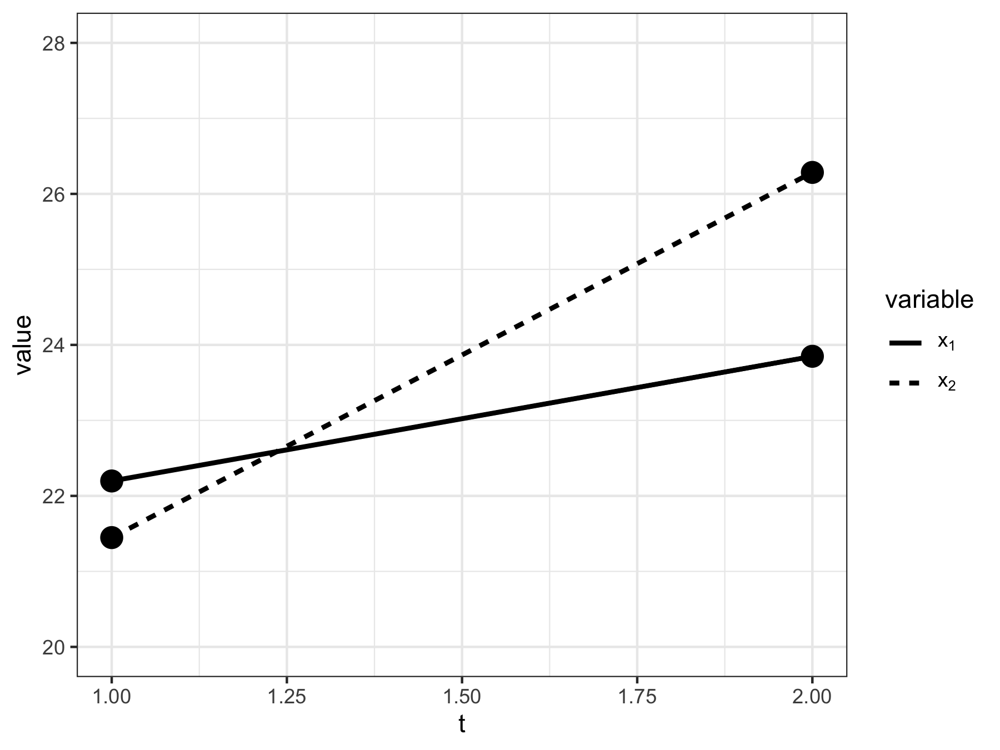
```

### Step 1: Calculate $\Delta x_i$

The first step is to calculate the change in values for each state variables, $x_i$, between two consecutive time points [e.g., from time $t$ to $t+1$ for the discrete-time system; Figure \@ref(fig:sysEx2); Equation \@ref(eq:diffX)]:
\begin{equation}
\Delta x_i = x_{i(t+1)} - x_{it} 
(\#eq:diffX)
\end{equation}
Note that $\Delta x_i$ can take any value between $-\infty$ and $\infty$. 

### Step 2: Calculate distance traveled, $s$

Next, we calculate the total change in the multivariate system as a function of the change in all  state variables $x_i$. First, we calculate $\Delta s$ as the square root of the sum of squares of the changes in all state variables per Pythagoras's theorem [Equation \@ref(eq:ds)]: 
\begin{equation}
\Delta s = \sqrt{\sum{\Delta x_i^2}}
(\#eq:ds)
\end{equation}
Although $\Delta s$ represents the absolute change in the system between consecutive points in time, this measure is not yet relative along the system's trajectory. To create a relative value we next calculate the total distance traveled along the system trajectory, $s$, as the cumulative sum of $\Delta s$ [Equation \@ref(eq:ds)] since the first observation, such that a cumulative sum is calculated for every $t$ over the interval $[0,T]$ [Equation \@ref(eq:s)]:
\begin{equation}
s_T = \Sigma_{t=0}^{T}{\Delta s}
  (\#eq:s)
\end{equation}

```{r sysExs, cache = TRUE, echo=FALSE, warning=FALSE, eval=TRUE, message=FALSE,  out.width="85%", fig.cap = "Distance traveled, $s$, for the 2-species toy system."}
 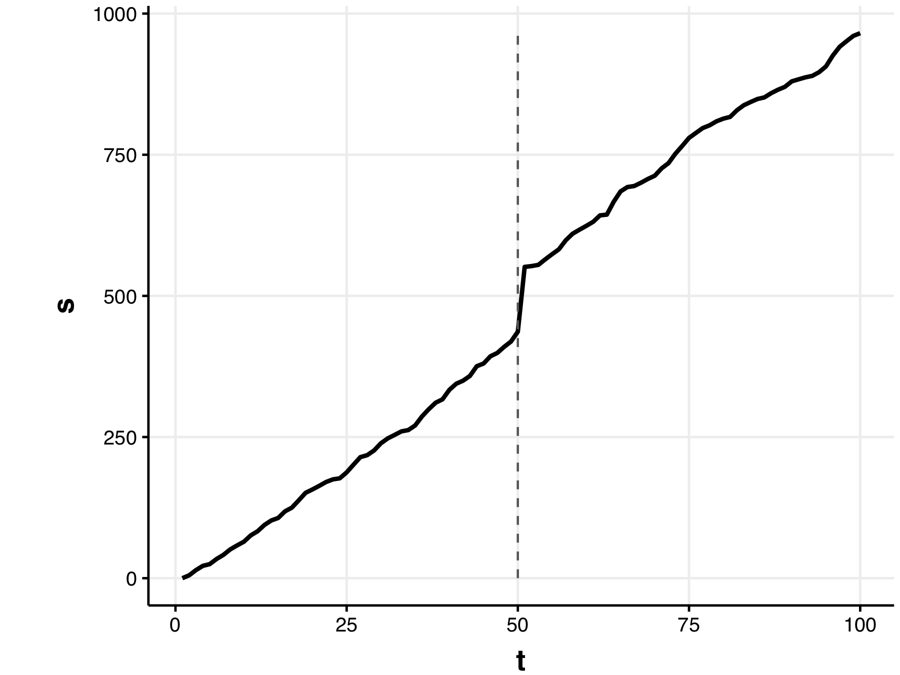
```

We now have a single measure, $s_T$ [hereafter referred to as $s$; Equation \@ref(eq:s)] at each discrete point in time in our $N$-dimensional system (Figure \@ref(fig:sysExs)). It should be noted that $s$(Figure \@ref(fig:sysExs)) is monotonically increasing since the value of $\Delta s$ [Equation \@ref(eq:ds)] is a sum of squares. Although discussed in a later section, it is important to note that $s$ is not unitless---that is, $s$ has units of the state variables, $x_i$. For example, if our 2-variable toy system represents biomass, then the units of $s$ represents the cumulative absolute change in biomass of the entire system. 

### Step 3: Calculate velocity, $V$ (or $\frac{\Delta s}{\Delta t}$) 

Finally, we calculate the **system velocity**, $V$ (or $\frac{\Delta s}{\Delta t}$), by first calculating the change in $s$ [Equation \@ref(eq:s)], and then divide  by the total time elapsed between consecutive sampling points:
\begin{equation}
 v = \frac {\Delta s}{\Delta t} 
(\#eq:velocity)
\end{equation}

```{r velocSysEx1,  cache = TRUE, echo=FALSE, warning=FALSE, eval=TRUE, message=FALSE,  out.width="85%", fig.cap = "System change ($s$) and velocity ($V$) of the model system over the time period. Constant means ($\\bar{x}_{pre}=25$, $\\bar{x}_{post}=10$) and sharp change in variance for both state variables, $\\sigma =5$."}
knitr::include_graphics("./chapterFiles/velocity/figsCalledInDiss/velocitySysEx1.png")
```

```{r distTab, eval=TRUE, cache = TRUE, echo=FALSE, warning=FALSE,  message=FALSE}
df.wide <- readRDS(file = ".//chapterFiles/velocity/dfwide_table.RDS")

options(knitr.kable.NA = "")
library(kableExtra)
kable(df.wide[1:5,],digits=3, "latex", align="c", booktabs=TRUE, escape = FALSE, 
            caption = 'Steps outlined for calculating system velocity, $V$, using the 2-variable toy data as an example.')
```

The numerical results for each step in the calculation of velocity [Equation \@ref(eq:velocity)] is demonstrated using the first five time points of our toy system (Figure \@ref(fig:sysEx)) in Table \@ref(tab:distTab). 

## Velocity *v* Performance Under a Discontinuous Transition 
I used simulation techniques to determine the baseline expectations of the performance of velocity $V$ under varying degrees of rapid shifts in the mean and variance of the toy system. The toy system in this section undergoes a discontinuous shift at $t = 50$ (see \@ref(fig:sysEx)). If the system undergoes a rapid and discontinuous change in one or more state variables, the velocity, because it is a rate of change, has the potential to approach $\infty$ as $\Delta t \rightarrow 0$. Therefore, it is important to understand the degree to that velocity can detect very sudden changes in mean values, despite effect sizes. Here, I varied  each of the following system parameters at the regime shift location ($t=50$): $\bar{x}_1$, increase in the mean value of $x_1$ and $\sigma_1$, the change in variance of $x_1$.

Simulations consisted of 10,000 random samples drawn from the normal distribution for each parameter, I randomly drew the toy system samples 10,000 times under increasing values of $\bar{x}_1$ and $\sigma_1$. To identify patterns in the influence of parameter values on velocity, I present the mean values of $V$ across all simulations, with confidence intervals of $\pm 2$ standard deviations. As mentioned above, the state variables $x_1$ and $x_2$ were drawn from a normal distribution (using function *rnorm*), with parameters $\bar{x}_i$ (mean) and $\sigma_i$ (sd) for 50 time steps, $t$. 

#### Varying post-shift mean  
I examined the influence of the magnitude of change in $x_1$ in the period before (pre; $t <50$) and after (post; $t \geq 50$) by varying the mean parameter, $\bar{x}_1$ in the set $W=\{25,30,35,...100 \}$ (Figures \@ref(fig:simVplot1) and \@ref(fig:simVplot2)). As expected, the magnitude of $V$ increases linearly as the total difference between $\bar{x}_{1_{pre}}$ and $\bar{x}_{1_{post}}$ increases (Figure \@ref(fig:simVplot2)). This is not surprising because  $s$ increases as the total change in abundance across the entire system increases [Equation \@ref(eq:s)]. Consequently the potential  of $V$ also increases with total state variable values (e.g. abundance, biomass). The linear relationship among $V$ and total state variable values indicates that while $V$ is capable of identifying large shifts in data structure, it may fail to identify subtle changes (i.e. lower effect sizes).
```{r simVplot1, cache = TRUE, echo=FALSE, warning=FALSE, eval=TRUE, message=FALSE, fig.cap = "Velocity ($V$) generally increases as the total change in the mean value of $\\bar{x}_{1_{t=50}}$ increases in a single iteration of our toy system ($N_{iter}=1$, seed = 123). This 2-variable system exhibits a regime shift at $t=50$, where variance is constant $\\sigma = 5$, $\\bar{x}_1 = 25$ when $t<50$,  $\\bar{x}_2=50$ when $t\\geq50$, $\\bar{x}_1 = 25$ when $t <50$.", out.width="85%"}
knitr::include_graphics("./chapterFiles/velocity/figsCalledInDiss/simVplot1.png")
```

```{r simVplot2, cache = TRUE, echo=FALSE, warning=FALSE, out.width="85%", eval=TRUE, message=FALSE, fig.cap = "Change in velocity ($V$) as the total change in the mean value of $\\bar{x}_{2_{t=50}}$ over 10,000 simulations. A regime shift was induced at $t=50$ with constant varoance $\\sigma = 5$, $\\bar{x}_2 = 25$ when $t<50$,  and changes in variable mean values, $\\bar{x}_2 = 50$ when $t \\geq 50$, $\\bar{x}_1 = 25$ when $t<50$."}
knitr::include_graphics("./chapterFiles/velocity/figsCalledInDiss/simVplot2.png")
```

#### Varying Post-shift Variance
In the previous example, variance was constant before and after the abrupt shift at $t=50$. To determine whether the signal emitted by $V$ at the regime shift is lost or dampened when increasing variance I varied the variance parameter, $\sigma_1$ along the set $W = \{1,2,3,...25 \}$. The variance for both state variables ($x_1, x_2$) prior to the regime shift, $\sigma_{x_1}$ and $\sigma_{x_2}$, was $5$, with the change occurring in $\sigma_{x1post}$.
```{r simVarPlot, echo=FALSE,  eval=TRUE,   out.width="85%", fig.cap = "High variance of velocity ($V$) in a single iteration ($N_{iter}=1$, seed = 123) of simulations as we increase $\\sigma_1$ at $t=50$."}
knitr::include_graphics("./chapterFiles/velocity/figsCalledInDiss/simVarPlot.png")
```

```{r simVarPlot2,  cache = TRUE, echo=FALSE, warning=FALSE, eval=TRUE, message=FALSE,   out.width="85%", fig.cap = "The variance around the average ($\\pm2$ SD) velocity ($V$) increases as the variance of $\\bar{x}_{2_{t=50 (post)}}$ (post shift) increases. $\\bar{x}_{1_{pre}} = 25$, $\\bar{x}_{1_{post}} = 100$, $\\bar{x}_{2_{pre}} = 25$, $\\bar{x}_{2_{post}} = 50$, $\\sigma_{1_{pre}} = 5$, $\\sigma_{2_{pre,post}} = 5$"}
# p<- ggplot(data = dist.sim.reduced2)+
#  geom_ribbon(aes(x = var.sim, ymin = lower , ymax = upper), fill = "grey70") +
#     geom_line(aes(x = var.sim,  y = dsdt.sim.mean))+
#     theme_bw()+
#   xlim(c(1,25))+
#   ylab(expression(paste("velocity, ",italic("v"), " at ", italic("t = 51"))))+
#   xlab(expression(paste(sigma, " ", bar("x")[1], " at ", italic("t = 50"))))+
#   ggtitle(expression(paste("Mean ",  italic("v")," (±2SD) over ", 10,000, " iterations")))
# 
# ggsave(p, filename=paste0(figDir,"simVarPlot2.png")
knitr::include_graphics("./chapterFiles/velocity/figsCalledInDiss/simVarPlot2.png")
```

#### Smoothing the data prior to calculating *v*
To determine whether process or observational noise influences the signal in $V$, I used linear approximation techniques to smooth the data prior to calculating the derivatives. I used the function `stats::approx` that linearly interpolates the original data, $x_1$ and $x_2$, to regularly-spaced time points along  the set $t=\{1:100\}$. I then calculated $V$ as described in (Eqs. \@ref(eq:diffX) through \@ref(eq:velocity)). Increasing the number of points ($t$) at that the original state variables were smoothed (i.e., $t$) did not influence the amount of noise surrounding the signal of the regime shift (at $t=50$) in system velocity, $V$ (Figure \@ref(fig:simVarPlot2)).
```{r smoothV, eval=FALSE, cache = TRUE, echo=FALSE, warning=FALSE, eval=TRUE, message=FALSE,  out.width="85%", fig.cap = "The noise in system velocity ($V$) is not obviously reduced in this system as the original data ($x_1$, $x_2$) is increasingly smoothed."}
# smoothed <- approx_dist.sim(t.mult = 1)
# p1<- dsdtPlot(df = smoothed[[1]],dist = smoothed[[2]], div = 1/1.4)+
#   ggtitle("no smoothing")+theme(legend.position="none")
# smoothed <- approx_dist.sim(t.mult = 2)
# p2<- dsdtPlot(df = smoothed[[1]],dist = smoothed[[2]], div = 1/1.4)+
#   ggtitle("increase t by 2X")+theme(legend.position="none")
# smoothed <- approx_dist.sim(t.mult = 5)
# p3<-dsdtPlot(df = smoothed[[1]],dist = smoothed[[2]], div = 1/1.4)+
#   ggtitle("increase t by 5X")+theme(legend.position="none")
# smoothed <- approx_dist.sim(t.mult = 10)
# p4<-dsdtPlot(df = smoothed[[1]],dist = smoothed[[2]], div = 1/1.4)+
#   ggtitle("increase t by 10X")+theme(legend.position="none")
# smoothed <- approx_dist.sim(t.mult = 100)
# p5<-dsdtPlot(df = smoothed[[1]],dist = smoothed[[2]], div = 1/1.4)+
#   ggtitle("increase t by 100X")
# p<- cowplot::plot_grid(p1,p2,p3,p4,p5)
# ggsave(p, filename=paste0(figDir,"smoothV.png")
knitr::include_graphics("./chapterFiles/velocity/figsCalledInDiss/smoothV.png")
```

## Velocity Performance Under a Smooth Transition
In the previous section I presented expectations for velocity signals under a discontinuous transition in a discrete-time system. Given velocity is a measure of the rate of a change in a system and the range of transition speeds ecological systems exhibit (e.g., slow driver-response or threshold dynamics), it is important to understand if and when the velocity signal is dampened under varying degrees of transition speeds. In this section I use a similar toy system, to demonstrate the expectations of velocity under a smooth shift and under varying degrees of rapidity.

Although the data constructed in this section are similar to that used in the previous section in that we are manipulating the mean and variance of two state variables before and/or after an abrupt shift, this section introduces a component of process noise into the shift itself. This is important because the derivative of a nearly discontinuous function is infinite. Although we are interested in identifying rapid shifts in systems, velocity will approach infinity as the rate of change in the shift increases and the sampling intervals decrease. In other words, if the system exhibits turnover in e.g. $25\%$ of the state variables, we expect the value of velocity to be similar to that of a turnover in e.g. $75\%$ of the variables. Removing the possibility of infinite values provides more relative measures within the community time series. 

### Generating the data
Here we consider a two-variable system over the time interval $[1,100]$ with state variables $x_1$ and $x_2$ that exhibits abrupt shifts in mean and/or variance of one or both variables at time $t=50$. I generated species observations for the true process and  the true process with process variability. The true process data were created using the parameters for $\mu$ and $\sigma$ for each of the conditions in described in Table \@ref(tab:sysParams) (random seed in Program R was 12345).
```{r sysParams, echo=FALSE, eval=TRUE, cache=TRUE}
params <- data.frame(
  sd.perc_1a = c(0.05, 0.05, 0.05, 0.05, 0.05,  0.05), # percent of the mean will determine the sd_1a ... sd_2b
  sd.perc_1b = c(0.10, 0.10, 0.05, 0.05, 0.10,  0.10),
  sd.perc_2a = c(0.05, 0.05, 0.05, 0.05, 0.05,  0.05),# percent of the mean will determine the sd_1a ... sd_2b
  sd.perc_2b = c(0.10, 0.05, 0.05, 0.05, 0.10,  0.05),
       mu_1a = c(10,     10,   10,   10,   10,  10),
       mu_1b = c(55,     55,   55,   55,   10,  10),
       mu_2a = c(15,     15,   15,   15,   15,  15),
       mu_2b = c(44,     15,   44,   15,   15,  15)
)

colnames(params) <- c(
  "$\\sigma_{x_{1_{pre}}}$",
  "$\\sigma_{x_{1_{post}}}$",
  "$\\sigma_{x_{2_{pre}}}$",
  "$\\sigma_{x_{2_{post}}}$",
  "$\\mu_{x_{1_{pre}}}$",
  "$\\mu_{x_{1_{post}}}$",
  "$\\mu_{x_{2_{pre}}}$",
  "$\\mu_{x_{2_{post}}}$"
)

conditions <-c( 
  "$\\mu_{x_1}$, $\\mu_{x_2}$, $\\sigma_{x_1}$, $\\sigma_{x_2}$", 
  "$\\mu_{x_1}$, $\\sigma_{x_1}$", 
  "$\\mu_{x_1}$, $\\mu_{x_2}$", 
  "$\\mu_{x_1}$", 
  "$\\sigma_{x_1}$, $\\sigma_{x_2}$", 
  "$\\sigma_{x_1}$" 
)   
myTab <- cbind(conditions, params)
require(kableExtra)
options(knitr.kable.NA = "")
kable(myTab,digits=2, "latex", align="l", booktabs=TRUE, escape = FALSE,
            caption = 'Conditions for generating various scenarios of the hyperbolic tangent-induced abrupt change. $\\sigma_i$ represents the standard deviation of $\\mu_{x_i}$ as the percent of $\\mu_{x_i}$, $\\mu_{x_i}$ is the mean of the state variable, $x_i$, and pre and post represent the periods before and after the regime shift at $t=50$, respectively.')
```

#### True process model
Data were generated from a normal distribution and an abrupt shift in the mean was incorporated using a hyperbolic tangent function. The true process for each state variable, $x_i$, was generated from [Equation \@ref(eq:true); see Figure \@ref(fig:trueObsEx)]:
\begin{equation}
\begin{array}{rcl}
\mu_{xipre}\sim Normal(\mu_{xipre},\sigma_{xipre}) \\ 
\mu_{xipost} \sim Normal(\mu_{xipre}, \sigma{xipost}) \\ 
\mu_{x_i}(t) = \mu_x{_ipre}  - 0.5(\mu_x{_ipre}-\mu_{xipost})(\tanh(\alpha (t-t_{shift}))+1) \\ 
\end{array}
(\#eq:true)
\end{equation}

where $\mu_{x_i}(t)$ is the mean value of $x_i$ at time $t$ and *pre* and *post* are the periods before and after the abrupt shift ($t_{shift}$), respectively. The parameter $\alpha$ in Equation \@ref(eq:true) controls for the rate of change at the point of the abrupt change, $t_{shift}$, where higher values of $\alpha$ correspond with a higher slope at $t_{shift}$. I simulated a single iteration (data set) for various conditions of changing $\mu_{xi}$ and  $\sigma_{xi}$ (see  Table \@ref(tab:sysParams)), for two state variables $x_1\ \&\ x_2$ at intervals of $t=1$ along the temporal interval $t=[1,100]$.
```{r trueObsEx, echo=FALSE, warning=FALSE, message=FALSE, cache = TRUE,   out.width="85%", fig.cap="An example of the data generated by the true process model. In this example the mean values ($\\mu_{xi}$), but not the percent standard deviation ($\\sigma_{xi}$), are varied before and after the transition point. The observed data are plotted against the true-process model for each state variable, $x_i$. Panels represent different degrees of the smoothing parameter, $\\alpha$ (top: $\\alpha=0.25$, bottom:$\\alpha=1.00$)."}
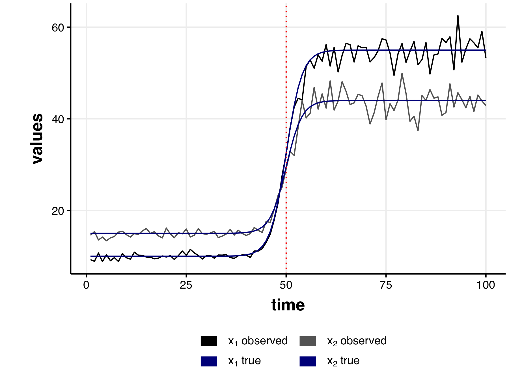
knitr::include_graphics("./chapterFiles/velocity/figsCalledInDiss/changeMuBoth_tanhAlpha1-100tvdiffAlpha-1000iter_origDat.png")
```

#### Observed process data
I generated observations by imputing noise into the true process model [Equation \@ref(eq:true)] through random sampling of $\sigma_x{_i}$ from a normal distribution [Equation \@ref(eq:observed); Figure \@ref(fig:trueObsEx)]:
\begin{equation}
\begin{array}{rcl}
\mu_{xipre}\sim Normal(\mu_{xipre},\sigma_{xipre}) \\ 
\sigma_{xipre} \sim Normal(0,\sigma_{Xipre}\mu_{Xipre}) \\
\mu_{xipost} \sim Normal(\mu_{ipost},\sigma_{ipost}) \\ 
\sigma_{xipost} \sim Normal(0,\sigma_{Xipost}\mu_{xipost}) \\
\mu_{xi}(t) = \mu_x{_ipre}  - 0.5(\mu_{xipre}-\mu_{xipost})(\tanh(\alpha (t-t_{shift}))+1) \\
\end{array}
(\#eq:observed)
\end{equation}

where $\sigma_{xi}$ is the observed error around $\mu_{xi}$, and $\sigma_{Xi}$ is $X\%$ of $\mu_{xi}$ under various sampling conditions (as described in Table \@ref(tab:sysParams)). I generated the error as a percent of the mean as this scaling relationship is commonly observed in ecological data [@taylor1961aggregation].

### Evaluating Velocity Performance Under Conditions of Changing Means and Variance
I simulated a single data set (using `r set.seed=12345` in Program R) by randomly drawing a single realisation (observed data) of the hyperbolic tangent process model with additive noise process [Equation \@ref(eq:observed)]. I then calculated the distance traveled, $s$, and the velocity of the distance traveled, $V$ (also referred to as $\frac{ds}{dt}$) using Equation \@ref(eq:velocity)---this approach (Equation \@ref(eq:velocity)) is a simple alternative to numerical integration techniques, requiring only simple algebraic techniques. This method is ideal for discrete time data, or where computational power would not suffice for numerical integration. When using the first differences method, however, $V$ will demonstrate high variability, depending on the amount of time between samples (i.e. as the intervals of $t-t+1$ increase). 

I also calculated $V$ using a numerical integration method for non-smooth, noisy data, called total variation regularized differentiation [@chartrand2011numerical]. I used the R package `tvdiff` [@price2019tvdiff] to perform  numerically integrate the distance traveled, $s$. The regularized differentiation method in this package [function `tbdiff::tvRegDiff`; described fully in @chartrand2011numerical] provides a numerical solution for calculating non-noisy derivatives of noisy, non-smooth data. Using this smooth-derivative estimation technique may be an ideal supplement to the velocity method in cases where process and observational error generate noisy observational data. Although not possible in most ecological systems data, here we can compare the fit of the smooth-derivative to the derivative of the true process, allowing us to determine the usefulness of calculating a smooth-derivative. There are two tuning parameters required to be chosen by the analyst when implementing the total-variation regularized differentiation, each of that influence the amount of noise smoothed out in the resulting derivative: $\alpha$ and the number of iterations. I implemented this numerical differentiation over 1,000 iterations, and selected $\alpha$ by comparing the anti-differentiated distance traveled, $s$, to the true process values of $s$ (e.g., see Figure \@ref(fig:antiDiffComp)). For most conditions and smoothness I found the tuning parameter for `tvdiff` $\alpha=0.50$ provided a good fit of $s$ (Figure \@ref(fig:antiDiffComp)), however, when the hyperbolic tangent smoothing parameter, $\alpha$ was low (i.e. $\alpha_{tanh}=0.25$) higher values of $\alpha_{tvdiff}$ yielded more abrupt changes in the derivative. 
```{r antiDiffComp, echo=FALSE, eval=TRUE, message=FALSE, warning=FALSE,   out.width="85%", fig.cap="Antidifferentiated values ('observed') of the distance traveled, $s$, to the true process values of $s$ ('true) provides a method for identifying the best values of the smooothing parameter, $\\alpha$. Under most conditions $\\alpha \\ll$ sufficed. Here, we compare the true and antidifferentiated values of $s$ under the condition of changing $\\mu_{x1}$ when the hyperbolic tangent function is most rapid ($\\alpha_{tanh}=1$) for the `tvdiff` $\\alpha=0.50$. Not pictured: the antidifferentiated values of $s$ (observed) is increasingly smoothed as $\\alpha$ increases."}
knitr::include_graphics(".//chapterFiles/velocity/figsCalledInDiss/compareTvdiff_s_changeMuX1_tanhAlpha1-05tvdiffAlpha-1000iter.png")
```
\newpage
```{r mu1varpt25, echo=FALSE, warning=F, message=F, cache = T,   out.width="85%", fig.cap="The velocity signal is muted when the  hyperbolic smoothing parameter, $\\alpha$, is low (0.25). True and observed values of $x_i$ (panel A), observed distance traveled ($s$, panel B), observed velocity (C), and the smoothed velocity (D). "}
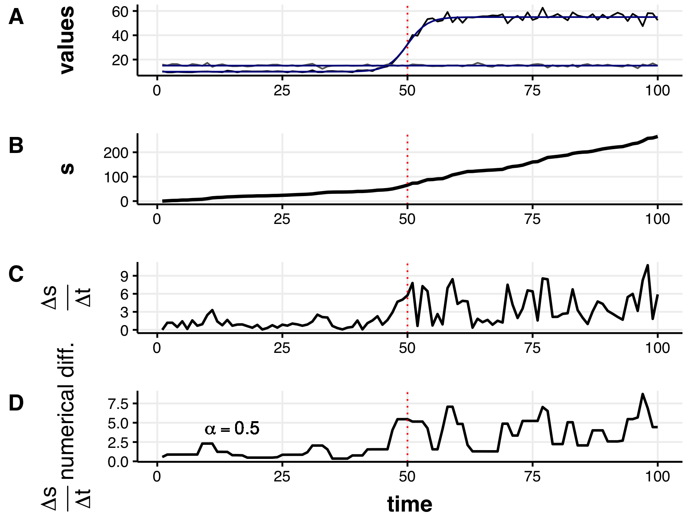
```
\newpage
```{r mu1varpt5, echo=FALSE, warning=F, message=F, cache = T,   out.width="85%", fig.cap="The velocity signal is muted when the  hyperbolic smoothing parameter, $\\alpha$, is moderate (0.50). True and observed values of $x_i$ (panel A), observed distance traveled ($s$, panel B), observed velocity (C), and the smoothed velocity (D). "}
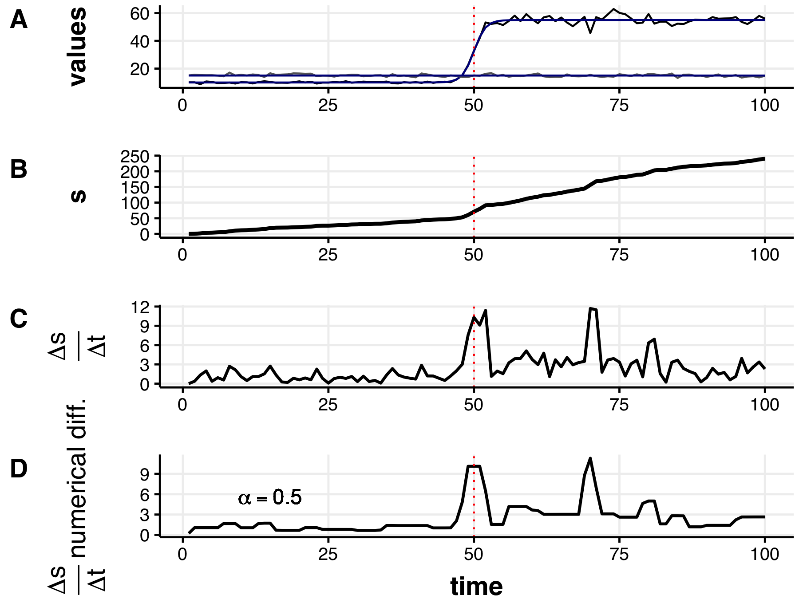
```
\newpage
```{r mu1varpt75, echo=FALSE, warning=F, message=F, cache = T,   out.width="85%", fig.cap="The velocity signal is muted when the  hyperbolic smoothing parameter, $\\alpha$, is moderate (0.50). True and observed values of $x_i$ (panel A), observed distance traveled ($s$, panel B), observed velocity (C), and the smoothed velocity (D). "}
knitr::include_graphics("./chapterFiles/velocity/figsCalledInDiss/changeMuX1_tanhAlpha075-05tvdiffAlpha-1000iter_stackTvdiff.png")
```
\newpage
```{r mu1var1, echo=FALSE, warning=F, message=F, cache = T,   out.width="85%", fig.cap="The velocity signal is muted when the  hyperbolic smoothing parameter, $\\alpha$, is moderate (0.50). True and observed values of $x_i$ (panel A), observed distance traveled ($s$, panel B), observed velocity (C), and the smoothed velocity (D). "}
knitr::include_graphics("./chapterFiles/velocity/figsCalledInDiss/changeMuX1_tanhAlpha1-05tvdiffAlpha-1000iter_stackTvdiff.png")
```
\newpage
```{r muBoth75, echo=FALSE, warning=F, message=F, cache = T,   out.width="85%", fig.cap="The velocity signal is regained under smoooth transition ($\\alpha_{tanh}=0.75$) when both state variables undergo a shift in the mean. True and observed values of $x_i$ (panel A), observed distance traveled ($s$, panel B), observed velocity (C), and the smoothed velocity (D). "}
knitr::include_graphics("./chapterFiles/velocity/figsCalledInDiss/changeMuBoth_tanhAlpha075-05tvdiffAlpha-1000iter_stackTvdiff.png")
```
\newpage
```{r varBoth, echo=FALSE, warning=F, message=F, cache = T,   out.width="85%", fig.cap="The velocity signals a rapid shift in the variance of both state variables under a moderately abrupt transition ($\\alpha_{tanh}=0.75$). True and observed values of $x_i$ (panel A), observed distance traveled ($s$, panel B), observed velocity (C), and the smoothed velocity (D). "}
knitr::include_graphics("./chapterFiles/velocity/figsCalledInDiss/changeVarBoth_tanhAlpha075-5tvdiffAlpha-1000iter_stackTvdiff.png")
```
\newpage
```{r var1, echo=FALSE, warning=F, message=F, cache = T,   out.width="85%", fig.cap="The velocity does not signal shifts in the variance of a single variable ($x_1$) under a moderately abrupt transition ($\\alpha_{tanh}=0.75$). True and observed values of $x_i$ (panel A), observed distance traveled ($s$, panel B), observed velocity (C), and the smoothed velocity (D). "}
knitr::include_graphics("./chapterFiles/velocity/figsCalledInDiss/changeVarX1_tanhAlpha075-10tvdiffAlpha-1000iter_stackTvdiff.png")
```
\newpage
```{r muBoth25, echo=FALSE, warning=F, message=F, cache = T,   out.width="85%", fig.cap="The velocity signal is regained under smoooth transition ($\\alpha_{tanh}=0.25$) when both state variables undergo a shift in the mean. True and observed values of $x_i$ (panel A), observed distance traveled ($s$, panel B), observed velocity (C), and the smoothed velocity (D). "}
knitr::include_graphics("./chapterFiles/velocity/figsCalledInDiss/changeMuBoth_tanhAlpha025-05tvdiffAlpha-1000iter_stackTvdiff.png")
```

#### Smooth changes in the mean
As discussed earlier, the velocity of the distance traveled, $V$, is a measure of how quickly the sum of the squared system variables change between observations (i.e. time). Consequently, as the total change in state variables grows, so will the maximum potential of the velocity, $V$. Following this logic, we should expect to see a spike in the derivative of the distance traveled when the system changes quickly. I tested this hypothesis under two conditions of changing means, where either one or both variables underwent mean shifts (see Table \@ref(tab:sysParams)), and under varying degrees of transition smoothness (i.e. $\alpha_{tanh}={0.25, 0.50, 0.75, 1.00}$). 

When the hyperbolic tangent smooth transition function is less steep (Figure \@ref(fig:mu1varpt25)) the observed velocity signal is dampened. This signal, however, quickly recovers when the transition function becomes more abrupt (Figures \@ref(fig:mu1varpt5), \@ref(fig:mu1varpt75) ,\@ref(fig:mu1var1); $\alpha_{tanh}=0.5, 0.75, and 1.00$, respectively). The signal of velocity as an indicator of abrupt change appears more rapid when the mean of both state variables (Figure \@ref(fig:muBoth25)), rather than a single (Figure \@ref(fig:mu1varpt25)), are shifted (assuming  constant variance). Figure \@ref(fig:muBoth75) is representative of the increasing signal in velocity as $\alpha_{tanh}$ increases. 

#### Smooth changes in variance
Abrupt changes sometimes manifest first as a change in the variability, rather than the mean value, of the state variables. This condition manifests in the velocity signal when both variables experience a shift in relative variance (Figure \@ref(fig:varBoth)), however, velocity does not signal change when only one variable exhibits a shift in variance (Figure \@ref(fig:var1)). Again, given the total magnitude of change influences the distance traveled, $s$, and the derivative of s, $V$, it is not surprising that the velocity signal is greater around the transition point when both, compared to a single, state variable exhibits increased variability about the mean. In these scenarios I shifted the variability in the state variables $x_i$ from only $\sim 5\%$ to $\sim10\%$ (see Table \@ref(tab:sysParams))---this percent variability is low relative to most empirical observational ecological data sets. As such, I expect the velocity signal to be more pronounced when empirical systems undergo shifts in variance in at least one state variable.

#### Smooth changes in the mean and variance
Given the signals identified in the velocity when one or both state variables exhibits a shift in mean and/or variance, it is unsurprising that even under smooth transitions (when $\alpha_{tanh} = 0.25$), velocity manifests as a signal of change (Figure \@ref(fig:muVarBoth25)). This signal is most pronounced when the shift is abrupt (Figure \@ref(fig:muVarBoth1)).
```{r muVarBoth25, echo=FALSE, warning=F, message=F, cache = T,  out.width="85%", fig.cap="The velocity signals a shift when both variables undergo shifts in the mean and variance under a slightly abrupt transition ($\\alpha_{tanh}=0.25$). True and observed values of $x_i$ (panel A), observed distance traveled ($s$, panel B), observed velocity (C), and the smoothed velocity (D)."}
knitr::include_graphics("./chapterFiles/velocity/figsCalledInDiss/changeMuVarBoth_tanhAlpha025-5tvdiffAlpha-1000iter_stackTvdiff.png")
```
\newpage
```{r muVarBoth1, echo=FALSE, warning=F, message=F, cache = T,   out.width="85%", fig.cap="The velocity signals a shift when both variables undergo shifts in the mean and variance under a slightly abrupt transition ($\\alpha_{tanh}=1.00$). True and observed values of $x_i$ (panel A), observed distance traveled ($s$, panel B), observed velocity (C), and the smoothed velocity (D)."}
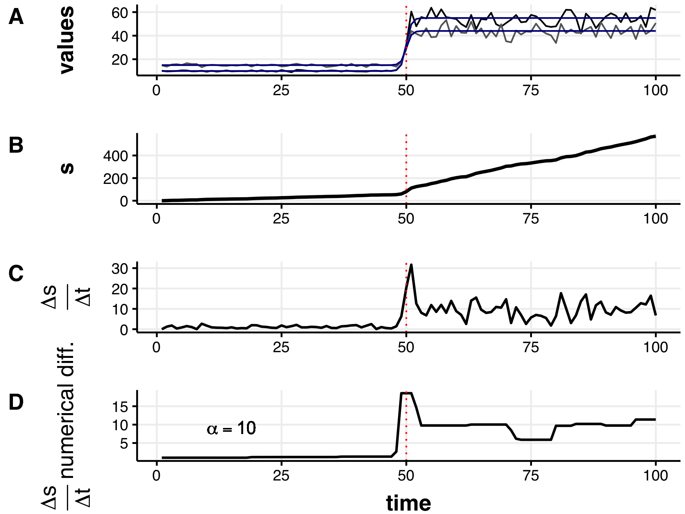
```

```{r paleoTurnover, echo=FALSE, warning=F, message=F, cache = T, out.width="85%", fig.cap="Relative abundances of the most common diatom species in the time series. Few species dominate the data over the entire time series, and turnover is apparent at multiple observations."}
knitr::include_graphics("./chapterFiles/velocity/figsCalledInDiss/paleoTurnover.png")
```

## Velocity Performance Under Empirical Transitions: paleolithic freshwater diatom communities
To gather baseline information on the use of velocity in empirical systems data, I calculated velocity for the paleodiatom system described in Chapter \@ref(resampling). Briefly, the paleodiatom community comprises `r length(unique(paleo$variable))` time series over a period of approximately `r abs(max(paleo$sortVar)-min(paleo$sortVar)) %>% round(0)` years (Figure \@ref(fig:paleoTurnover)). As elaborated in @spanbauer_prolonged_2014, the paleodiatom community is suggested to have undergone regime shifts at multiple points. These abrupt changes are apparent when exploring the relative abundances over time, as there are extreme levels of species turnover at multiple points in the data (Figure \@ref(fig:paleoTurnover)). Using Fisher Information and climatological records, @spanbauer_prolonged_2014 suggest that regime shifts in this system at approximately 1,300 years before present [where years before present is equal to year 1950; @spanbauer_prolonged_2014].

```{r paleoVelocity,  echo=FALSE, warning=F, message=F, cache = T,    out.width="85%", fig.cap ="Velocity $V$ and distance traveled $s$ of the paleodiatom time series. Dashed line at 1,300 years before 1950 indicates the regime shift identifed in Spanbauer et al. (2014). Dotted lines indicate regime shifts as visually identified on metrics $s$ and $V$."}
knitr::include_graphics("./chapterFiles/velocity/figsCalledInDiss/paleoVelocity.png")
```

```{r paleoRegime1and3, echo=FALSE, warning=FALSE, message=FALSE, cache = TRUE, out.width="85%", fig.cap ="Inter-regime (regimes A and B) trends in the velocity signal ($V$) identify  the fluctuating decadal and centurial abiotic conditions discussed in  Spanbauer et al. (2014)."}
knitr::include_graphics("./chapterFiles/velocity/figsCalledInDiss/paleoRegime1and3.png")
```

@spanbauer_prolonged_2014 used different regime detection metrics coupled with regional climatological events to identify regime shifts in the system, suggest that a regime shift occurred at ~1,300 years before present. Using the methods outlined above, I calculated the distance traveled ($s$) and velocity ($V$; Figure \@ref(fig:paleoV)). The results of $V$ and $s$ (Figure \@ref(fig:paleoVelocity)) on the relative abundance data correspond with both the large shifts in species dynamics (see Fig \@ref(fig:paleoTurnover), and also with the regime shift identified by @spanbauer_prolonged_2014. However, two primary results can be made from the metrics  $V$ and $s$ that are not obvious nor identified numerically in the results of @spanbauer_prolonged_2014: 

1. Two additional large shifts occurred at approximately 2,500, 4,800 and years before 1950       
1. The periods before the first and after the second large shifts appear oscillatory (Figure \@ref(fig:paleoRegime1and3)).

To determine the effect of dampening the noise in the data on the velocity signal, I interpolated the each time series using function `stats::approx` to 700 time points. Next, I calculated the distance traveled of the entire system, $s$. Finally, I obtained the derivative of $s$ by using a regularized differentiation (using function `tvdiff::TVRegDiffR`; parameters were $iter = 2000$, scale = small, $ep = 1 x 10^-6$, and $\alpha = 100$). This method of regularized differentiation is an ideal approach to smoothing $s$ because it assumes the data are non-smooth and incorporates finite differencing. The total variation regularized differentiation is described in @chartrand2011numerical, @price2019tvdiff, and in the previous first-level section.
```{r paleoObsPred, eval=TRUE, cache = TRUE, echo=FALSE, warning=FALSE,  message=FALSE,   out.width="85%", fig.cap = "The regularized differentiation of $s$ was best fit using $\\alpha = 100$. Higher overlap of $s$ and pred indicates a good fit of the regularized differentiated metric to the non-smoothed metric, $s$."}
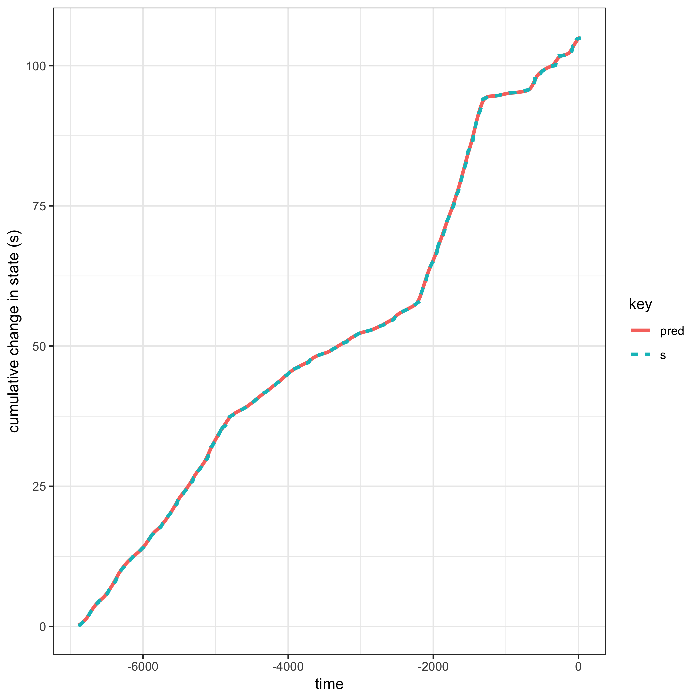
```

The smoothed velocity (Figure \@ref(fig:paleoV)) provides a similar but smoother picture of the velocity of the system trajectory. Comparing the smoothed (Figure \@ref(fig:paleoV)) to the non-smoothed velocity (Figure \@ref(fig:paleoVelocity)) yields similar inference regarding the location of the regime shifts at 2,200 and 1,300 years before present, however, it  more clearly demonstrates potential inter-regime dynamics (e.g., between 7,000 and 4,800 years before present), that were not identified in previous study of this system [@spanbauer_prolonged_2014].
```{r paleoV,  eval=TRUE, cache = TRUE, echo=FALSE, warning=FALSE, message=FALSE, out.width="85%", fig.cap="The velocity metric  ($V$) signals potential periodicities in the paleo diatom time series data when the distance traveled metric, $s$, is smoothed using regularized differentiation methods (see Price and Burnett 2019)."}

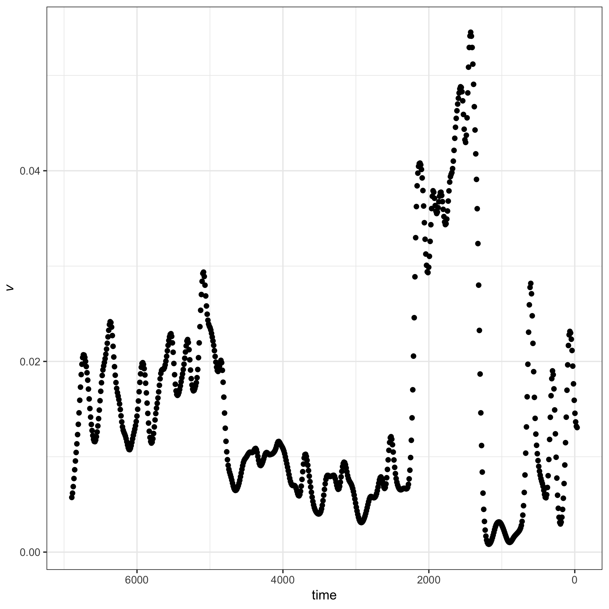
```

## Discussion
Here, I described the steps for calculating a novel regime detection metric, system velocity ($V$). First described in @fath_regime_2003, $V$ is used as a single step for calculating a more complicated regime detection metric, Fisher Information (see also Chapter \@ref(fiGuide)). System velocity is arguably simple to calculate, as shown in this chapter, captures the total change in system variables under a variety of mean and variance conditions. The metric does not, however, perform well as variance increases (Figure \@ref(fig:simVarPlot2)), and smoothing the original data does not reduce the noise surrounding this metric when variance is moderate. Variance is a commonly-used indicator of ecological regime shifts (@brock_variance_2006), however, is difficult to interpret when the number of variables is much greater than a few. System velocity, $V$, may be useful in situations where the number of state variables is much greater than few, and appears especially useful when the magnitude of change in one or more state variables is high (Figures \@ref(fig:simVplot2),\@ref(fig:muBoth75)). For example, this method will likely identify signals of regime shifts where the shift is defined as high species turnover within a community (Figure \@ref(fig:muVarBoth1)).

This study provides baseline expectations of the velocity of the distance traveled, $V$, as an indicator of abrupt change in a multivariate system. Although a useful first step, this metric should next be critiqued in a sensitivity analytical approach, where a statistical measure is used to determine whether $V$ indicates abrupt shifts prior to occurrence (c.f. during or after),  particularly with respect to its performance in community-level empirical data. The paleolithic diatom data used in the last section of this chapter is also presented in the documentation for my R Package,  **regimeDetectionMeasures** (Appendix \@ref(regimeDetectionMeasures)). In this case study, the 'distance traveled', $s$ [Equation \@ref(eq:diffX)], clearly exhibits shifts at points where expert opinion and species turnover (in species dominance) agree that a large change occurred. Further, velocity, $V$ (see *dsdt* in package materials) indicates a large shift at only the most predominant shift in the time series, perhaps due to the sensitivity of the metric to variance (Figure \@ref(fig:simVplot2).

Further work is required to determine the utility of system velocity as a regime detection metric, however, this chapter demonstrates that the metric may indicate clear shifts in variable means and variability about the means. In addition to examining high-dimensional and noisy data, a study of the performance of $V$ under conditions where few variables exhibit large changes while many variables are relatively constant may also prove useful. Additionally, this metric may be a useful tool for reducing the dimensionality of high dimensional data. Although the metric loses much information, as opposed to some dimension reduction techniques, e.g. Principal Components Analysis PCA, the metric is simple to calculate (even by hand), is computationally inexpensive, and is intuitive, unlike many clustering algorithms (e.g., Non-metric Multidimensional Scaling NMDS). Like system velocity, methods of the latter variety (e.g. NMDS) require post-hoc statistical analyses to confirm the location of clusters (or abrupt change, regime shifts), while methods of the former variety (e.g. PCA) retain loadings but do not necessarily identify the locations of abrupt shifts.

## Supplementary Figures
Figures \@ref(fig:velocSysEx2), \@ref(fig:velocSysEx3), and \@ref(fig:velocSysEx4) provide additional examples of the behavior of velocity, $V$ when varying the mean and/or variance prior to and/or after the induced abrupt shift in the toy system with a discontinuous transition at $t=50$.

```{r velocSysEx2,message=FALSE, warning=FALSE, echo=FALSE,   out.width="85%", fig.cap = "System change ($s$) and velocity ($V$) of the model system over the time period. Change in means ($\\bar{x}_{1_{pre}}=25$, $\\bar{x}_{1_{post}}=100$, $\\bar{x}_{2_{pre}}=50$, $\\bar{x}_{2_{post}}=10$) and an increase in variance ($\\sigma_{1_{pre}}=2$, $\\sigma_{1_{post}}=10$, $\\sigma_{2_{pre}}=5$,  $\\sigma_{2_{post}}=10$)."}
knitr::include_graphics("./chapterFiles/velocity/figsCalledInDiss/velocSysEx2.png")
```
\newpage
```{r velocSysEx3, message=FALSE, warning=FALSE, echo=FALSE,   out.width="85%", fig.cap = "System change ($s$) and velocity ($V$) of the model system over the time period. Constant means ($\\bar{x}_1=25$, $\\bar{x}_2=50$) and sharp change in variance for one state variable $\\sigma_{1_{pre}} = 2$, $\\sigma_{1_{post}} = 12$, $\\sigma_{2_{pre,post}} = 5$"}
knitr::include_graphics("./chapterFiles/velocity/figsCalledInDiss/velocSysEx3.png")
```
\newpage
```{r velocSysEx4, message=FALSE, warning=FALSE, echo=FALSE,   out.width="85%", fig.cap = "System change ($s$) and velocity ($V$) of the model system over the time period. Variance equal to mean ($/bar{x_i}=/sigma_i$), where means ($/bar{x}_{1_{pre}}=25$, $/bar{x}_{1_{post}}=50$, $/bar{x}_{2_{pre}}=15$, $/bar{x}_{2_{post}}=150$)."}
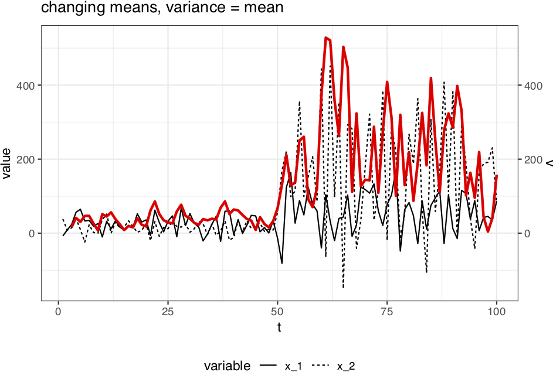
```  

# Grassland Obligates and Declining Birds Operate Near Edges of Body Mass Distributions {#discontinuity}
```{r ch7setup, echo=FALSE, message=FALSE, warning=FALSE, }
figDir <- "./chapterFiles/discontinuityAnalysis/figsCalledInDiss/"
tabDir <- "./chapterFiles/discontinuityAnalysis/tabsCalledInDiss/"

## define function for getting table data from file
getTab <- function(fn) readRDS(paste0(tabDir,"/" ,fn))#,".RDS"))

library(tidyverse)
library(kableExtra)

knitr::opts_chunk$set(echo=FALSE, warning = FALSE, message=FALSE)
```
## Introduction
Animal body mass distributions have been used to identify scaling structures of ecological communities [@allen2006discontinuities; @allen2002cross; @holling1992cross]. Using statistical methods to identify gaps, or discontinuities, in body mass distributions, some patterns are observed within and across taxonomic groups and biomes. Given the ubiquity of discontinuities identified in body mass distributions of fauna and social systems [@allen2006discontinuities], the ecological significance of these patterns may prove useful in understanding ecosystem structure and functioning [@angeler2016management]. Various hypotheses are posited as  drivers of the observed discontinuities in animal body mass distributions, including those related to resource use (the Energetic and Textural Discontinuity hypotheses), community interactions, biogeography, and evolution/phylogenetics  [@allen2006discontinuities; @holling1992cross; @blackburn1994animal; @allen2006patterns].

Body size influences the frequency and intensity of inter- and intraspecific competition for resources, territory, and mates, thereby dictating the spatial and temporal scales at which a species of a distinct body size operates [@peters1983effect;@silva1995allometric; @allen2006patterns]. The scaling structure of terrestrial communities are have been found to have 'lumpy' distributions; that is, they are not well-described using parametric statistical descriptions. If the scaling structure of a community manifests in the body mass distribution of the community, it is  considered reflective of the  discontinuous and heterogeneous nature of resource use. Specifically, @holling1992cross suggests that the body mass distribution of a community or group of species reflects the discontinuous nature of environmental structures and processes. Quantitative analyses of animal body sizes [@allen2006patterns;@nash2014habitat] and other similar distributions has revealed the ubiquity of the discontinuous nature of distributions of animal body masses [@skillen2008ecological; @havlicek2001pelagic], plant biomass [@spanbauer2016body], city population sizes [@garmestani2005time], and animal home range sizes [@restrepo2008discontinuities]. 

Avian distribution and presence data are abundant, easily accessible and, more importantly, provide insights into resource availability and structure at the local and landscape scales. In this Chapter I used discontinuity analysis of avian body mass distributions to identify the scaling structures of local avian communities in the Prairie Potholes, Central Mixed Grass, and Eastern Tall Grass regions of the central Great Plains of North America. I then use linear mixed modelling to determine whether the body mass distributions of these avian communities exhibit change corresponding to the spatial boundaries recently proposed in [@roberts2019shifting]. Although I found evidence supporting the hypothesis that declining grassland birds operate near the 'edges' of body mass aggregations, which represent the spatiotemporal scaling of resource use and availability, I did not identify shifts in the body mass distributions corresponding with the previously proposed pole ward, spatial shifts. 

## Methods
```{r studyarea, echo=FALSE, eval=TRUE, out.width="85%", fig.cap="My study area (red box) overlaying the terrestrial Breeding Conservation Regions (BCR) in North America."}
knitr::include_graphics(".//chapterFiles/discontinuityAnalysis/figsCalledInDiss/mybbox_onBCRmap.jpg")
```

### Study area
A recent study [@roberts2019shifting] identified what they refer to as spatial regimes across a large portion of the central United States (see Figure \@ref(fig:studyarea)) using inference gained from discontinuity analyses of avian body mass distributions. The authors hypothesize that a spatial regime boundary exists in the Central Great Plains and suggests it has exhibited a Northward shift at a rate of  $\sim\frac{0.05^\circ\ latitude}{year}$. The authors used discontinuity analysis to identify these 'spatial regimes', using the body masses of breeding birds. Their hypothesized spatial regime boundary occurs at $39^\circ$ latitude in year 1970, $39.5^\circ$ latitude  in year 1985, $40^\circ$ latitude in year 2000, and $40.5^\circ$ latitude in year 2015 (see Figure \@ref(fig:routesWithSpatRegimes)). Sampling sites were classified each year as belonging to either the Southern or Northern regime according to whether the location was below (Southern) or above (Northern)  the regimes identified by @roberts2019shifting.

My study area is designed such that there is minimal crossing of very different BCR, or habitat types (Figure \@ref(fig:studyarea)). In other words, this study area largely falls within BCRs which can be generally classified as grassland habitat (BCR 11, Prairie Potholes; BCR 19, Central Mixed Grass ; BCR 22, Eastern Tall Grass). Using this design we should expect that the functional groups within our avian communities should be similar across BCR boundaries, despite a potential turnover in species identity. Accounting for change in habitat across space allows us to assume that any observed change in the scaling structure of the avian community is due to changes in habitat and resource availability such that similar species are or are not included in the community. 

### Data
#### Avian census data - North American Breeding Bird Survey
I constructed body mass distributions using route-level data from the North American Breeding Bird Survey hereafter [NABBS; @sauer2017results]. The NABBS uses citizen scientist volunteers to annually collect data using a standardized roadside, single observer, 3-minute point count protocol and has organized data collection annually across North America (Figure \@ref(fig:bbsPoints)) since 1966. Each roadside survey consists of 50, 3-minute point counts (data collected using sight and sound) along  $\sim24.5$ mile stretch of road. Although the point counts are designed to collect estimates of relative abundance, the method for building body mass distributions used in this chapter require only presence absence data. I therefore converted abundances to presence-absence data. I considered a species as 'present' if it was detected on the year in question or the $\pm 1$ year to account for potential false negative observations (i.e., a species was not detected in the NABBS route despite its presence in the local community). 

##### Identifying avian census locations
To determine whether the spatial regime shifts identified in @roberts2019shifting manifested in local avian community structure, I restricted analysis to the grassland habitat of the Central Great Plains. All routes falling within a rectangular area bounded by coordinates $37.8^\circ$ and $44.5^\circ$ latitude, and $-101^\circ$ and $-95.5^\circ$ longitude [see Figure \@ref(fig:routesWithSpatRegimes)]. I retained all NABBS routes which used the sampling protocol '101', which is the standard method for conducting NABBS point count surveys. 

##### Avian body mass data
Species operating at similar spatial and temporal scales are those which are close in body size as identified using statistical aggregation identification techniques [@allen1999body]. The interactions among species within a single body mass aggregation are presumed to experience a higher frequency and intensity of interspecific interactions with each other as opposed to those in different aggregations [@peterson1998ecological]. Although some species of birds are sexually size dimorphic, I am unaware of any sexually size-dimorphic birds that would likely operate at different spatial and temporal. Therefore,  I constructed body mass distributions of each avian census using the sex-averaged body masses published in @dunning2007crc (available for [download at CRC press](https://www.crcpress.com/CRC-Handbook-of-Avian-Body-Masses/Dunning-Jr/p/book/9781420064445)).

##### Removing species from analysis
Due to strict reliance on volunteers, some routes are not covered every year. Although NABBS volunteers attempt identify all species in the point-count area,  biases exist in data collection. Rather than retain observations of cryptic or species with low detection rates, I removed select species from the censuses (see Methods section in Chapter \@ref(fisherSpatial) for further discussion of this topic). I analyzed species of the following taxonomic families: Accipitriformes, Apodiformes, Cathartiformes, Charadriiformes, Columbiformes, Coraciiformes, Cuculiformes, Galliformes, Gruiformes, Passeriformes and Piciformes. Although removing cryptic, nocturnal, and some crepuscular species (e.g. Caprimulgiformes) from the analysis may yield a more conservative body mass distribution, including them may result in correctly identifying additional scaling structures (or body mass aggregations) in some routes but not in others. This method of exclusion also results in a loss of some medium- and larger-bodied Ciconiiformes (Podicipediformes, Phoenicopteriformes, Ciconiiformes; e.g. grebes, pelicans).

##### Taxonomic munging of the census data
Although the NABBS survey reports species-specific abundances, some birds are only classified to genera or order. Common examples of these species are those which are nearly indistinguishable from each other (e.g., Glossy Ibis and White-faced Ibis), birds which are difficult to see under certain conditions (e.g., hummingbirds, fast-moving hawks or accipiters), or species whose songs are similar. Numerous species were presented as identified to family or genus (e.g., Accipiter sp., Buteo sp., and Trochilids sp.) and others are categorized as hybrid. 

I made decisions regarding species-specific classification based on the North American breeding range maps provided by the Cornell Lab of Ornithology. Many unidentified species were easily categorized given the lack of overlap in species' ranges in our study area. For example, *Baeolophus bicolor* is nearly indistinguishable from *Baeolophus atricristatus*, however *B. atricristatus* is not known to occur in our study area (Figure \@ref(fig:studyarea))--therefore all accounts classified as either *B. bicolor* or *B. atricristatus* were classified as the former. Informed decisions of this nature were made regarding the following unidentified species, where the second name in the binomial was assigned as the species preceding the "/": *Passerina cyanea / amoena*, *Corvus brachyrhynchos / ossifragus*, *Petrochelidon pyrrhonota / fulva*, *Corvus brachyrhynchos*, *Quiscalus major / mexicanus*, *Pipilo maculatus / erythrophthalmus*, *Sturnella magna / neglect*, *Plegadis chihi / falcinellus*, *Coccyzus erythropthalmus / americanus*, *Empidonax traillii / alnorum*, *Icterus galbula / bullockii*, *Nyctanassa nycticorax / violacea*, and *Poecile atricapillus / carolinensis* were all classified according to their known distributions. I classified unidentified hummingbirds (*Trochilid* sp.) as *Selasphorus rufus*, and unidentified Terns (Tern sp.) as *Childonias niger*. All unidentified Accipiters (Accipiter sp.), Buteos (Buteo sp.), and Gulls (Gull sp.) were removed from analysis entirely as there are no clear differences in the probability of occurrence in our study area.  

```{r routesWithSpatRegimes, echo=FALSE, out.width="85%", eval=TRUE, fig.cap="North American Breeding Bird Survey routes (points), latitudinal locations (horizontal bars) of the spatial regimes identified by \\@roberts2019shifting."}
knitr::include_graphics(".//chapterFiles/discontinuityAnalysis/figsCalledInDiss/routes_spatRegimeLines2.png")
```

#### Identifying species of interest
@allen2006patterns propose alternative hypotheses for the relative locations of species within the body mass aggregation distributions as a function of 'distance-to-edge', a measure indicating the distance (in log-mass units) of each species to the edge of a body mass aggregation. This distance-to-edge measure is zero when the species falls at the edge of a statistically identified body mass aggregation. This species is often referred to as an 'edge species'. To determine the effect of spatial regime shifts on edge species, I identified three types of species of interest: (1) grassland obligates species, (2) species with widespread population declines in the study area, and (3) a combination of these groups. All remaining species were classified as 'other'.

##### Grassland obligate species 
The spatial regimes identified in @roberts2019shifting are attributed to large-scale changes in the landscape, including woody plant invasion. The loss of native grassland in our study area due to land conversion is largely attributed to anthropogenic land use change (e.g., development) and fire suppression. Numerous species have been negatively impacted by this widespread habitat loss, but grassland obligates are particularly at risk. Grassland obligates should be strong indicators of the large-scale spatial regime shifts identified in @roberts2019shifting, given their high sensitivity to grassland habitat loss [@herkert1994effects]. I identified North American grassland obligate species from the grey literature [@shriver2005distribution; @north2009state] and white literature [@peterjohn1999population]. Although some grassland obligates were positively impacted by the Conservation Reserve Program [CRP; @peterjohn1999population], this group of birds exhibited strong declines in North America until approximately 2003 [@north2009state].

##### Declining species
I classified a species as 'declining' based on the results of the North American Breeding Bird Survey [@sauer2017results]. The Patuxent Wildlife Research Center uses hierarchical modelling techniques to estimate the trends of species using the NABBS data at various spatial scales. @sauer2017results also provides estimates of data credibility  according to data availability, number of routes used to build the population trend estimate, abundance, and probability of detecting a small change in population trend. These credibility scores are generated for multiple  spatial extents: state-level, BCR-level, and across the three regions of the United States (Western, Central, and Eastern). Given the extent of this study, I considered the data credibility estimates using the Central Breeding Bird Survey Region, the Prairie Pothole BCR (BCR 11) and Eastern Tallgrass Prairie (BCR 22). A species was considered as declining only if the trend estimate was categorized as having moderate precision and abundance (blue) or having a deficiency (yellow). I considered the population trend estimates provided for the period of 1966 - 2015. 

### Statistical analysis
#### Identifying scaling structure of avian communities using body mass distributions 
Discontinuities in body mass distributions been quantified using various methods (e.g., multivariate time series models, regression trees, and gap rarity index)  which are collectively referred to as 'discontinuity analyses' [@nash2014discontinuities; @barichievy2018method; @stow2007evaluating; @allen2006discontinuities]. Using various methods, the discontinuous nature of body masses of ecological communities has been observed in various taxa of both terrestrial [@allen2006patterns] and aquatic [@spanbauer2016body] communities. Multiple methods are proposed for identifying discontinuities in body mass aggregations [@allen2001cross], including clustering algorithms [@stow2007evaluating], body mass difference indices [@holling1992cross], gap rarity index [@restrepo2008discontinuities], and more recently the discontinuity detector [@barichievy2018method], an extension of the gap rarity index [@restrepo2008discontinuities]. 

I used the discontinuity detector described in @barichievy2018method, which uses likelihood to determine whether the observed data contains multiple modes as compared to that of a Gaussian (uni-modal) distribution. This method requires multiple user-defined parameters, including an imputation resolution (1000) and a bootstrap sample size (1000) over which the null distribution is randomly sampled. I provided a slightly altered and annotated version of the functions `Neutral.Null` and `Bootstrap.Gaps` (first printed in @barichievy2018method) used to identify discontinuities in a continuous variable in Appendix \@ref(appDiscont). 
Two criterion have been used to determining the exact location of discontinuities within a rank-ordered continuous variable: using a constant significance/threshold level [@barichievy2018method] and a power constant table for varying sample sizes [@roberts2019shifting]. It should be noted because the power-constant method identifies a larger proportion of "significant" discontinuities, or edges, identifying aggregations requires subjective measures regarding actual aggregation locations. Using the percentile method avoids this subjectivity, however, the aggregation number and locations are sensitive to choice of percentile or threshold value. Following the methods of @barichievy2018method I considered a value to be a discontinuity if the gap percentile (see Appendix \@ref(appDiscont) was $\geq 90%$. 
I built route-level body mass distributions for each route-year combination by using presence absence data from the current, previous, and following year to account for observational and process errors impacting the detectability of a species within a single route. Using this method reduces the amount of species-specific, and consequently specific-body mas turnover within a route over time. This also assumes that an unobserved species is truly absent, an assumption which is difficult to avoid without a sophisticated occupancy modelling approach for each species in the community.

```{r readInAnovaDat, echo=FALSE, eval=TRUE, warning=FALSE, message=FALSE}
d = readRDS(".//chapterFiles/discontinuityAnalysis/results/datForAnova.RDS") %>% 
  dplyr::select(year, loc, aou, isGap.percentile, isGap.powerConstant) %>% 
  gather("key", "value", -year, -loc, -aou) %>% 
  group_by(key, value) %>% 
  summarise(n = n()) %>% 
  na.omit()
```

```{r corTabBySppGroup, eval=FALSE,  echo=FALSE}
## get cor\.test restuls for distEdge x log10.mass for all species groups, incl all species
temp <- getTab(fn="corTabBySppGroup") %>% 
  mutate(r = paste0(round(cor, 2),#" \u00B1 ", 
         " (", 
         round(lwr,2),
         ", ",
         round(upper,2),
         ")"  ),
         p = round(p,2)
         ) %>% 
  dplyr::select(name,r, p, df) %>% 
  rename(`Species Group` = name
         )
         # `$p$` = p)

temp$`Species Group` <- str_replace(temp$`Species Group`,"Grassland Obligates",pattern = "grass")
temp$`Species Group` <- str_replace(temp$`Species Group`,"Declining Species",pattern = "declining")
temp$`Species Group` <- str_replace(temp$`Species Group`,"Declining Grassland Obligates",pattern = "Grassland ObligatesDeclin")
temp$`Species Group` <- str_replace(temp$`Species Group`,"All Species",pattern = "all")

temp2 <- temp %>% 
arrange(desc(`Species Group`))

kableExtra::kable(temp2, 
                  caption =
                  "Pearson's product correlation coefficient estimates of observed distance-to-edge and body mass (log scale).",
                  "latex",
                  booktabs=TRUE, escape=FALSE) %>%
column_spec(1, border_right = T, bold = T)%>%
kable_styling(full_width = TRUE)
```

#### Determining Effects of a Spatial Regime Boundary on Grassland Birds
If the spatial regime shift occurred in the bird community, it should manifest in the local community scaling structure through one or both of species turnover and a shift in the number of body mass aggregations. I used linear mixed modelling to determine whether the local scaling structure and the location of grassland obligates and declining species within these scaling structures are impacted by the spatial regime boundaries proposed by  @roberts2019shifting. 

I used a linear mixed model to determine whether the proposed moving spatial regime boundaries influenced the location of species of interest (grassland obligates, declining species) within their respective body mass aggregation. Each species was assigned a 'distance to  edge', which served as a proxy of the proximity of a species to the nearest edge of its respective body mass aggregation. Previous studies suggest that this distance to edge measure can be used to identify zones of transitions, as invasive and threatened species tend to be located at the edges of aggregations [@allen1999body]. Following this hypothesis, one should expect to see changes in the locations of sensitive and declining species change in the areas undergoing so called spatial-regime shifts [@roberts2019shifting]. 
```{r sppIntTab, echo=FALSE, eval=TRUE}
sppIntDat <- readRDS("./chapterFiles/discontinuityAnalysis/results/mixedModel-dataUsed.RDS") %>% 
  distinct(commonName, sppGroup) %>% 
  arrange(desc(sppGroup))%>%
  rename("Common Name" = commonName,    
         "Species Group" = sppGroup
         ) 

sppIntDat$`Species Group` = factor(sppIntDat$`Species Group`,levels(sppIntDat$`Species Group`)[c(4,2,3,1)])

levels(sppIntDat$`Species Group`)  = c( "Grassland Obligates",  "Declining", "Declining Grassland Obligates", "Others")
  

kable(sppIntDat %>% filter(`Species Group` != "Others"),
      "latex",
      caption="Grassland obligates and species with declining trends over the period of (1966-2015) in the Central Breeding Bird Survey region in our study area.",
      booktabs=TRUE, longtable=TRUE, escape=FALSE)%>% 
  kableExtra::kable_styling(repeat_header_continued = TRUE) 

# grass <-getTab("grassDeclSppList") %>% filter(id=="grass")
# decl <-getTab("grassDeclSppList") %>% filter(id=="declining")
# sppIntTab <- getTab("grassDeclSppList") %>% dplyr::select(commonName, id) %>%  
#   spread(key="id" , -commonName, fill="")%>%
#   rename(`English Common Name`= commonName, 
#          `Grassland Obligate` = grass) %>% 
#   mutate(
#     `English Common Name` = cell_spec(`English Common Name`, "latex", color=ifelse(declining=="declining", "red","black")), 
#     `Grassland Obligate` = ifelse(`Grassland Obligate`=="grass", "X","")
#     ) %>% 
#   arrange(desc(declining), `Grassland Obligate`)
# # sppIntTab
# 
# kable(sppIntTab %>% dplyr::select(-declining),
#       "latex",
#       caption="Grassland obligates and species with declining trends (1966-2015) in our study area.",
#       booktabs=TRUE) 
```

I modelled the 'distance to edge' for each species as a function of time, whether the NABBS route is in the 'Southern' or 'Northern' spatial regime [South or North of the boundaries proposed in @roberts2019shifting; see Figure \@ref(fig:routesWithSpatRegimes)], time, route identity, and a descriptive group (one of grassland obligate, declining, declining grassland obligate, other). The 'distance to edge' response variable was not strongly correlated with body mass (Figure \@ref(fig:aggEdgeCorrPlot)), however, I scaled and centered the  response values to avoid obtaining predictions lower than zero for the unscaled response. 

Fixed effects included an interaction among year ($\beta_{1i}$) and regime location ($\beta_{2i}$), and an interaction among regime ($\beta_{2i}$) and species group ($\beta_{3}$). Random intercepts were estimated for each species ($b_1$) within each NABBS route ($b_2$). That is, species was nested within route. An auto-regressive lag-1 correlation structure was assumed for the random intercept estimates. The model was fitted using restricted maximum likelihood. The model was fitted using `nlme::lme` and was coded as:
>  nlme::lme( distEdge.scaled ~ year.center \* regime + regime \* sppGroup, 
     random = ~ 1 | loc/aou, correlation = corAR1(form = ~ 1 | loc / aou ), method = "REML")

## Results
```{r nRtesPerRegimePerYearTab}
temp <- getTab(fn="nRtesPerRegimePerYear") %>% 
  rename(
         Year = year, Regime = regime) 

# do not comibn ewith getTab -- does NOT work! 
temp <- temp %>% spread(key="Regime",value="nLoc")
kableExtra::kable(temp,
                  caption = "The number of NABBS routes analysed in the Southern regime is smaller than those used in the Northern regime each year given the location of the regimes identified in a previous study with respect to the contiguous grasslands of Central North America.",
                  "latex",
booktabs=TRUE,  
      longtable=TRUE, 
escape=FALSE) %>% 
  kableExtra::kable_styling(repeat_header_continued = TRUE)
```

### Summary statistics of censuses (NABBS data)  
Given the location of the study area (Figure \@ref(fig:studyarea)) with respect to the location of the contiguous Central Great Plains, fewer NABBS routes falling into the Southern regime were analysed than those in the Northern (Table \@ref(tab:nRtesPerRegimePerYearTab)).  Likely due to the increase in the total number of routes surveyed over time across the entire North American Breeding Bird Survey region, species richness increased over time within our study area (Figure \@ref(fig:richnessByYear)). Annual turnover rates were relatively low but became more dispersed over time (Figure \@ref(fig:turnoverByYear); Table \@ref(tab:richTurnTab)).

```{r nRtesPerRegimePerYearFig, out.width="85%", fig.cap= "Number of NABBS routes analysed per year. Some routes are not sampled annually due to volunteer availability, environmental conditions, or route discontinuation."}
temp <- getTab(fn="nRtesPerRegimePerYear") %>% 
  rename(
         Year = year, Regime = regime) 
ggplot(temp, aes(Year, nLoc,linetype=Regime))+geom_line()+ylab("# NABBS routes analysed")
```

```{r richnessByYear, echo=FALSE, out.width="85%", eval=TRUE, fig.cap="Species richness increases over time across the entire study area."}
knitr::include_graphics(".//chapterFiles/discontinuityAnalysis/figsCalledInDiss/richnessByYear.png")
```

```{r turnoverByYear, echo=FALSE, out.width="85%", eval=TRUE, fig.cap="Variance in the total species turnover increases over time across the entire study area."}
knitr::include_graphics(".//chapterFiles/discontinuityAnalysis/figsCalledInDiss/turnoverByYear.png")
```

```{r richTurnTab}
temp <- getTab(fn="richTurnStatsTab") %>% 
  mutate(meanRich = round(meanRich, 1),
         sdRich = round(sdRich, 2),
         sdTurn = round(sdTurn, 2),
         meanTurn = round(meanTurn, 1)) %>% 
  rename(Year = year, 
`$\\bar{x}$` = meanRich, 
         `$\\sigma$` = sdRich, 
         `N` = sampSizeRich,
         `$\\bar{x}$` = meanTurn, 
         `$\\sigma$` = sdTurn, 
         `N` = sampSizeTurn)
                  # `Mean richness` = meanRich, 
         # `SD` = sdRich, 
         # `N` = sampSizeRich,
         # `Mean turnover` = meanTurn, 
         # `SD` = sdTurn, 
         # `N` = sampSizeTurn)

kableExtra::kable(temp, escape = FALSE, digits = 2, 
                  caption = "Summary statistics for annual species richness and annual turnover in all NABBS routes in study area.",
                  # "latex",
                  booktabs=TRUE, 
      longtable=TRUE) %>% 
    add_header_above(c(" ", "Annual Richness" = 3, "Annual Turnover" = 3))
```

```{r intrxnPlot-regime, eval=TRUE, echo=FALSE, fig.cap="Declining species were closer to the edge of body mass aggregations in the 'northern' than were in the 'southern' regimes.", out.width="80%"}
knitr::include_graphics(".//chapterFiles/discontinuityAnalysis/figsCalledInDiss/intrxnPlot_regime.png")
knitr::include_graphics(".//chapterFiles/discontinuityAnalysis/figsCalledInDiss/intrxnPlot_regime1.png")
```

```{r simpleCoefEst, eval=FALSE, out.width="85%", echo=FALSE, fig.cap="Coefficient estimates of fixed predictors of the linear mixed effects model."}
knitr::include_graphics(".//chapterFiles/discontinuityAnalysis/figsCalledInDiss/simpleCoefEst.png")
```

#### Species of interest
A total of `r nrow(sppIntDat)` species were considered for analysis across the entire study area. `r nrow(sppIntDat[sppIntDat$'Species Group' =="Grassland Obligates",]) + nrow(sppIntDat[sppIntDat$'Species Group' =="Declining Grassland Obligates",])` were classified as grassland obligate species, or species deemed highly sensitive to changes in amount and quality of grassland habitat. Of the grassland obligates, `r nrow(sppIntDat[sppIntDat$'Species Group' =="Declining Grassland Obligates",])` were considered as declining species. An additional `r nrow(sppIntDat[sppIntDat$'Species Group' =="Declining",])` species were classified as non-grassland obligate and declining (Table \@ref(tab:sppIntTab)).

The total (Figure \@ref(fig:stopTotalSum)) and mean (Figure \@ref(fig:stopTotalMean)) number of birds counted within each species group was relatively constant across time in the Prairie Potholes and Eastern Tallgrass Prairie bird conservation regions, but fluctuation in stop totals appeared greater in the Badlands and Prairies BCR (Figures \@ref(fig:stopTotalMean), \@ref(fig:stopTotalSum))). The latter BCR comprises a much smaller portion of the study area (Figure \@ref(fig:studyarea)) and accordingly the coefficient of variation (CV; ratio of deviation to the mean) around the stop totals (Figure \@ref(fig:stopTotalCV)) was highest in this region. It is worth noting the high CV (CV is considered low when $<\ \sim40%$) in all regions.

```{r stopTotalSum, out.width="85%", echo=FALSE, eval=TRUE, fig.cap="Total number of birds across the entire study area per species group per year. "}
knitr::include_graphics(".//chapterFiles/discontinuityAnalysis/figsCalledInDiss/stopTotal-byBCR-logSum.png")
```

```{r stopTotalMean, out.width="85%", echo=FALSE, eval=TRUE, fig.cap="Average coefficient of variation in the number of birds across the entire study area per species group per year."}
knitr::include_graphics(".//chapterFiles/discontinuityAnalysis/figsCalledInDiss/stopTotal-byBCR-mean.png")
```

```{r stopTotalCV, out.width="85%", echo=FALSE, eval=TRUE, fig.cap="Average number of birds across the entire study area per species group per year. "}
knitr::include_graphics(".//chapterFiles/discontinuityAnalysis/figsCalledInDiss/stopTotal-byBCR-CV.png")
```

```{r nAggsPerYear, out.width="85%", echo=FALSE, eval=TRUE, fig.cap="Number of body mass aggregations identified in each route unchanged across the time period (**a**) and is approximately normally distributed ($\\bar{x} =  4.7, \\sigma = 1.6$)"}
dat = readRDS(".//chapterFiles/discontinuityAnalysis/results/datForAnova.RDS") %>% distinct(year, loc, nAggs, regime)
# mean(dat$nAggs)
# sd(dat$nAggs)

p1<-ggplot(dat, aes(year, nAggs))+
  geom_point()+
  # geom_jitter()+
  ylab("# of body mass aggregations ")
p2<-ggplot(dat, aes(nAggs))+
  geom_histogram()+
  coord_flip()+
  xlab("# of body mass aggregations ")
cowplot::plot_grid(p1,p2,labels = "auto", align="v")
```

```{r aggEdgeCorrPlot, echo=FALSE, eval=TRUE, out.width="85%",  fig.cap="Relationship between species richness per route and (a) the number of aggregations identified in body mass distributions and (b) distance to the edge (units log body mass) of aggregations."}
knitr::include_graphics(".//chapterFiles/discontinuityAnalysis/figsCalledInDiss/distEdge_corrplot.png")
```

```{r routeGapEx, echo=FALSE, eval=TRUE,  out.width="85%", fig.cap="Aggregation locations of body mass distributions of the avian community at a single NABBS route (state 7 route 24) appear relatively similar across time. Panels include data for years 1=1970, 2=1985, 3=2000, 4=2015. Red triangles indicate grassland obligate species."}
knitr::include_graphics(".//chapterFiles/discontinuityAnalysis/figsCalledInDiss/routeGapEx.png")
```

### Statistical analysis
#### Identifying scaling structure in body mass distributions
Discontinuity analysis was conducted to identify the aggregations in the body mass distributions of `r n_distinct(dat$loc)` routes over a `r max(dat$year) - min(dat$year)` period across the Central Great Plains (Figure \@ref(fig:studyarea))). Discontinuity analysis suggested discontinuities existed in all routes analysed, and were relatively similar within NABBS routes over time. The number of body mass aggregations identified within each NABBS route using the discontinuity detector [@barichievy2018method] was similar was similar across time (Figure \@ref(fig:nAggsPerYear)a) and was approximately normally distributed across all survey-year combinations ($\bar{x} =  4.7, \sigma = 1.6$; Figure \@ref(fig:nAggsPerYear)a). Species richness at the route level was strongly positively correlated with the number of aggregations  (Figure \@ref(fig:aggEdgeCorrPlot)). The distance to edge variable was statistically, but not strongly, correlated with body mass $r=-0.02, p = <0.01$, and this relationship was similar across species groups except grassland obligates. 
<!-- (Table \@ref(tab:corTabBySppGroup)).  -->

The discontinuities in the body mass distribution identified appeared relatively similar over time at most NABBS routes (Figure \@ref(fig:routeGapEx)). If the shifting spatial regimes proposed in an earlier study [@roberts2019shifting; Figure \@ref(fig:routesWithSpatRegimes)], then we should expect changes in the body mass distribution of NABBS falling within or near the regime boundary. This was not observed on the routes falling within this zone (Figure \@ref(fig:routeGapEx) is representative of the ~5 NABBS locations falling in this area of expected changes shifting).

```{r lmeTab, echo=FALSE}
varFix <- getTab("lme_varFix") %>% round(3) %>% 
  rename(Estimate = "est.") 
est <- varFix %>% 
  mutate("CI" = paste0("(", lower,", ", upper,")" )) %>% 
  dplyr::select(-lower, -upper) 
row.names(est) <- row.names(varFix)
# est
kableExtra::kable(est,
      caption = "Coefficient estimates for the linear mixed effects model predicting species' 'distance to edge' of a body mass distribution.",
      "latex", 
      booktabs=TRUE, escape=FALSE) %>% 
  # kable_styling(full_width = FALSE) %>%
    row_spec(c(4,5,6, 9,10), bold=T)
```

#### Linear mixed effects analyssis of distance to edge
Declining species and declining grassland obligate species were located closer to the edge than the 'other' species, while grassland obligate species were further from the edge than 'other' species (Table \@ref(tab:lmeTab)). Similar trends held for declining grassland obligates and grassland obligates in the Northern regime location. There was, however, no evidence to suggest additive effects of the regime  location or year, or their interactions  (Table \@ref(tab:lmeTab)). 

```{r bmDistPerSppGroup, echo=FALSE, eval=TRUE, fig.cap="Body mass distribution for species in the study area over the entire time period varies by species group. Distributions represent the species pool for each group over the entire study area and all years.", out.width="85%"}
knitr::include_graphics(".//chapterFiles/discontinuityAnalysis/figsCalledInDiss/bmDistPerSppGroup.png")
```

```{r bmDistPerSppGroup-byRegime, echo=FALSE, eval=TRUE, fig.cap="The body mass distribution of declining species differ only slightly between the Southern and Northern regimes.", out.width="85%"}
knitr::include_graphics(".//chapterFiles/discontinuityAnalysis/figsCalledInDiss/bmDistPerSppGroup-byRegime.png")
```

```{r bmDistPerSppGroup-byBCR, echo=FALSE, eval=TRUE, fig.cap="Body mass distribution for species in the study area over the entire time period varies by species group. Distributions represent the species pool for each group and Bird Conservation Region over all years.", out.width="85%"}
knitr::include_graphics(".//chapterFiles/discontinuityAnalysis/figsCalledInDiss/bmDistPerSppGroup-byBCR.png")
```

## Discussion
South-North shifts in the past 50+ years have been demonstrated in large scale processes, including bird populations and ranges [@sorte2007poleward] and plant hardening zones [@mckenney2014change]. A recent application of discontinuities in  body mass distributions [@holling1992cross] corroborated these previous observations of large-scale changes as manifested in the avian community [@roberts2019shifting]. support for the hypothesis that declining species operate at the edges of body mass aggregations, but did not identify changes in the body mass distributions of avian communities near the proposed spatial regime boundary [@roberts2019shifting] proposed in  impact of these proposed spatial regime shifts on local bird communities

The lack of additive effects in the presence of multiplicative effects of the regime location (Table \@ref(tab:lmeTab)) strengthens the support for the differences in grassland obligates and declining grassland obligates with respect to all other species, however, the confidence intervals around the estimates of declining grassland obligates, grassland obligates may suggest that the evidence for such an effect is relatively weak (Figure \@ref(fig:intrxnPlot-regime)). This is unsurprising given the distribution of grassland obligate body masses is highly skewed right relative to the remaining species (Figures \@ref(fig:bmDistPerSppGroup)), \@ref(fig:bmDistPerSppGroup-byRegime))). Many grassland obligate species have small body masses, reducing the probability that they will appear in different body mass aggregations, however, depending on the local bird community identities, local grassland obligates may all have similar body masses, removing this effect. The larger, non-declining grassland obligates occur in a relatively small portion of our study area, Shortgrass Prairie BCR (Figures \@ref(fig:studyarea),\@ref(fig:bmDistPerSppGroup-byBCR)). 

Although the body mass distributions of terrestrial communities at small scales tends to differ from those at larger spatial scales [@blackburn1994animal], numerous studies confirm the evidence for 'discontinuities' in these distributions across multiple spatial scales for a variety of phenomenon [@wardwell2009variability; @allen1999body; @spanbauer2016body;@nash2014discontinuities; but see @siemann1999gaps;@bibi2019body; @manly1996there for applications yielding negative results]. This study found evidence supporting the hypothesis that scaling structures manifest in the body masses of fauna communities, adding to the growing number of case studies which suggest this phenomena is widespread across systems and scales.
  
  
# Conclusions {#conclusions}
Climate change is expected to induce an increase in both the intensity and frequency of rapid ecological change or disturbance, impacting social systems, potentially to the detriment of human communities most vulnerable. Identifying and forecasting these changes is critical for community and ecological planning, management, and disaster mitigation. Because ecological and social systems are tightly coupled, it is commonplace to use ecological indicators to identify change and potential changes that may impact these systems. Many papers introducing or discussing regime detection measures suggest the ecologist uses multiple lines of evidence, ranging from historical observations to ecological modelling results, for identifying an ecological regime shift [@lindegren_early_2012]. Although  valid, comparing results of multiple methods or lines of evidence within a single system has yielded inconsistent results, and inconsistent results can result in either improper conclusions, or in what I am calling **method mining**. That is, a data set is analyzed using until a sufficient number of methods yield affirmative results. 

\begin{equation}
\begin{split}
Data  & = Information \\
& = Signal \\
& = Process + Noise
\end{split}
(\#eq:infoTheory)
\end{equation}

## Method Mining
<!-- (and HARKing - hypothesizing after results are knownn - @kerr1998harking) -->
Many regime detection measures have yet to be statistically (or numerically) scrutinized for robustness or sensitivity to data quality, data quantitaty, and shift types. However, it should be noted that, in part due to both (i) the popularity and (ii) the sheer number of 'new' methods introduced by only a handful of authors^[S.R. Carpenter is one example of an author who has relative infamy in the field and has, as primary author or otherwise, introduced a relatively large number of new methods (e.g., rising variance, the variance index, Fourier transform, online dynamic linear modelling, TVARSS)]. Ecological indicators (a.k.a. indices, metrics) have been suggested as 'early-warning indicators' of ecological regime shifts or abrupt change (Chapters \@ref(intro) and \@ref(rdmReview)) and are methods of measurement designed to provide inference about one or more unobserved or latent processes, are inherently biased. Regardless of the state of the theory supporting *regime shifts* in ecology, ecological indicators and the methods for calculating them should be heavily scrutinized prior to being used in an ecological management or policy-making setting. Rather, new methods (indices, metrics, etc.) are being introduced into the literature at a rate exceeding that at which they are scrutinized (Chapter \@ref(rdmReview)). This dissertation demonstrates that, while potentially useful, regime detection metrics are inconsistent, not generalizable, and are currently not validated using probabilities or other statistical measurements of certainty. 

## Ecological Data are Noisy  
Regime detection metrics appear more reliable when the signal-to-noise ratio is high [Chapter \@ref(rdmReview), Chapter \@ref(velocity),  @taranu2018can]. Ecological systems are noisy, and the observational data we are collecting at large scales (e.g., the North American Breeding Bird survey), is noisy. Using methods incapable of identifying meaningful signals in noisy data appears futile, yet, methods for doing so are increasingly introduced in the scientific literature (Chapter \@ref(rdmReview)). 

## Data Collection and Munging Biases Limit Inference

Regime detection measures and other ecological indicators can signal various changes in the data, however, understanding what processes are embedded in the signals (i.e., removing the noise) requires expert judgement. And because a consequence of data collection and data analysis limits the extent to which we can identify and infer processes and change within an ecological system, **I suggest the practical ecologist scrutinizes her data prior to identifying and conducting analyses**, including those that are purely exploratory. By collecting and analyzing data, the ecologist has defined the boundaries of the system *a priori* [@beisner2003alternative states this eloquently as, 'The number and choice of variables selected to characterize the community will be determined by what we wish to learn from the model']. The influence of state variable selection is ignored  by some metrics [e.g. Fisher Information, @eason2014managing and velocity, Chapter \@ref(velocity)], in that the resulting measure is composite and carries no information regarding the influence of state variables on the metric result. 
The actual limitations to the system  should be, theoretically, known as a result of bounding the system. Inference beyond this system is extrapolation, and should be treated as speculation, especially when not accompanied by a measure of uncertainty around one's predictions.

## Common Limitations of Regime Detection Measures  
Limitations of the findings in this dissertation and of the regime detection methods used herein are largely influenced by the **data collection**, **data munging** processes. Although the below mentioned points may seem logical to many, these assumptions are overlooked by many composite indicators, including regime detection measures.  

1. Signals in the indicators are restricted to the ecological processes captured by the input data. Extrapolation occurs when processes manifest at scales different than the data collected [resolution; Chapter \@ref(fisherSpatial)]
1. Normalization and weighting techniques often impact results (whether ecological or numerical) (Appendices \@ref(bbsRDM) and \@ref(regimeDetectionMeasures))
1. Data aggregation techniques often impact results (Chapter \@ref(resampling))
1. Some indices fail to generalize across systems or taxa (see Chapters \@ref(intro) and \@ref(rdmReview))

<!-- ## Future Research for Advancing Ecological Regime Detection Measures -->
<!-- !!! IN PROGRESS !!! -->
<!-- - Comment on our working group progress goals, including: -->
<!--   - Create a common definitions database (initialized 10 june) -->
<!--   - Create database for regime shift methods (initialized 10 june) -->

<!-- Transient behavior & regime shifts -->
<!-- - Regime shfits for ecological managemnt and regime shfits for scientific pursuit -->
<!-- - how to identify transient behavior -- group at UWisc pursuing these ideas, and the Hastings et al wg -->

<!-- The Human Element of Regime Shift Detection & management -->
<!-- - Impact of human decision making (in all stages from study design $\rightarrow$ analyses) -->
<!--   - see also Bahlai work  in progress (bad breakup) + Chapter \@ref(resampling) -->
<!-- - Misalignment of speed of human intervention (the institution/policy/action) vs. ability to manage or prevent a regime shift -->
<!--   - Alignment of speed of human intervention/detection and the speed of drivers and ecological responses -->
<!--       - How is the probability of preventing a regime shift influenced by - the speed of the driver or response?  -->
<!--       - the speed of the human institution's capacity to intervene (policy, action)? -->


<!-- On the Methods  -->
<!-- - A critical and comparative review of method performance (mention workign group progress) -->
<!-- - Comparing multiple methods , sensitivity analyses -->
<!-- - Far more studies applying regime detection measures exist than do critiques and reviews of this literature (Chapter \@ref(rdmReview)). -->
<!-- - Relating process-control methods (cusum) to regime shift detection methods -->


<!-- # References {.unnumbered} -->
`r if(knitr:::is_latex_output()) '\\appendix'`
`r if(!knitr:::is_latex_output()) '# (APPENDIX) Appendix {-}'` 
<!-- this first appendix line 1 starts the appendix secioning and should be called prior to the references -->
  
# Appendix A bbsAssistant: an R package for Download and Munging Data and Information from the North American Breeding Bird Survey {-#bbsAssistant}
*[This package is awaiting review at the Journal for Open Source Software](https://github.com/openjournals/joss-papers/tree/joss.01550/joss.01550). JLB is the creator and maintainer of the package. G. Palomo-Mu\~{n}oz and Lyndsie Wszola are co-authors. Tentative doi: 10.21105.joss.01550*

## Package Summary

This package contains functions for downloading and munging data from the North American Breeding Bird Survey (BBS) FTP server [@pardieck2018north; @sauer2017first]. Although the FTP server provides a public interface for retrieving data and analysis results, this package consolidates the efforts of the data user by automating downloading and decompression of .zip data files, downloading route-level information, and saving them as .feather files for speedy import from disk. The data subsetting features of this package also allow the user to readily import and save to file only the data necessary for her purposes. Although the primary audience is for those wishing to use BBS data in Program R for visualization or analysis, this package can be used to quickly download the BBS data to file for use elsewhere. 

The BBS team uses hierarhical modelling techniques to generate population trend estimates [@sauer2017results] at various spatial scales [see the BBS results webpage](https://www.mbr-pwrc.usgs.gov/). Given the variability in data availability, the BBS team also provides data credibility scores for species-regions combinations. This package contains two functions for retrieving the population trend estimates produced by @sauer2017results and the associated data credibility scores: a web-scraping function for obtaining current region and/or species-specific population trend estimates and data credibility scores via a supplied url, [`get_credibility_trends()`](https://github.com/TrashBirdEcology/bbsAssistant/blob/master/R/get_credibility_trends.R); and a function for the current and archived population trends estimates for *all* species and regions, [`get_analysis_results()`](https://github.com/TrashBirdEcology/bbsAssistant/blob/master/R/get_analysis_results.R). 

## Package Vignette
Package vignette is available at [https://github.com/TrashBirdEcology/bbsAssistant/tree/master/vignettes](https://github.com/TrashBirdEcology/bbsAssistant/tree/master/vignettes)

## Package Manual  
For functions and descriptions please see the manual at [github.com/bbsAssistant/tree/master/man](https://github.com/TrashBirdEcology/bbsAssistant/tree/master/man). 

## Acknowledgements

The authors of this package thank the participatory scientists who collect data annually for the North American Breeding Bird Survey, and the Patuxent Wildlife Research Center for making these data publicly and easily accessible. Some functions in this package were adapted from the [rBBS](github.com/oharar/rbbs) package and are mentioned in function source code as appicable.

`r if(knitr:::is_latex_output()) '\\appendix'`
`r if(!knitr:::is_latex_output()) '# (APPENDIX) Appendix {-}'`   
# Appendix B regimeDetectionMeasures: an R package for calculating various regime detection measures {-#regimeDetectionMeasures}  
## Package Summary
This package provides functionality for calculating numerous regime shift detection measures (see below). Additionaly, a 'new' metric, **distance travelled** and __velocity__ are also calculated:

**Composite measures:**  
1. Distance travelled -see also package [`distanceTravelled`](https://github.com/TrashBirdEcology/distanceTravelled).  
1. Fisher Information 
1. Variance Index  

**Single-variable measures:**  
1. Skewness (mean and mode versions)  
1. Kurtosis  
1. Variance  
1. Mean  
1. Mode  
1. Coefficient of variation, CV  
1. Autocorrelation lag-1 (using `stats::acf`)  

Development source code for this package is available on GitHub as a compressed file at [https://github.com/TrashBirdEcology/regimeDetectionMeasures/archive/master.zip](https://github.com/TrashBirdEcology/regimeDetectionMeasures/archive/master.zip) or at [https://github.com/TrashBirdEcology/regimeDetectionMeasures](https://github.com/TrashBirdEcology/regimeDetectionMeasures).


## Package Manual  
For functions and descriptions please see the manual at [github.com/bbsAssistant/tree/master/man](https://github.com/TrashBirdEcology/bbsAssistant/tree/master/man). 
   
# Appendix C bbsRDM: an R package for applying `regimeDetectionMeasures` functionality to spatial data {-#bbsRDM}

The R package bbsRDM provides a template for using the North American Breeding Bird Survey to calculate various regime detection measures across space. This document provides a guide to to package functionality and results visualization. This package is not actively developed. Development source code for this package is available on GitHub as a compressed file, [https://github.com/TrashBirdEcology/bbsRDM/archive/master.zip ](https://github.com/TrashBirdEcology/bbsRDM/archive/master.zip ) or at [https://github.com/TrashBirdEcology/rRDM](https://github.com/TrashBirdEcology/rRDM).

## Package Vignette
Package vignette is available at [https://github.com/TrashBirdEcology/bbsRDM/tree/master/vignettes](https://github.com/TrashBirdEcology/bbsRDM/tree/master/vignettes). This example provides source code for analyzing the North American Breeding Bird Survey across regularly-sampled spatial transects at one or more points in time.

## Package Manual  
For functions and descriptions please see the manual at [github.com/bbsRDM/tree/master/man](https://github.com/TrashBirdEcology/bbsRDM/tree/master/man). 


`r if(knitr:::is_latex_output()) '\\appendix'`
`r if(!knitr:::is_latex_output()) '# (APPENDIX) Appendix {-}'`   
# Appendix D Functions used to calculate discontinuities in avian body mass distributions. {-#appDiscont}

This code was first published in @barichievy2018method and has been slightly modified and annotated for the purposes of this dissertation. This code was used to produce body mass discontinuities in Chapter \#ref(discontinuity)

## Neutral.Null function
Neutral.Null <- function(log10.data, resolution = 4000) {
  Dmax = max(log10.data, na.rm = FALSE)
  Dmin = min(log10.data, na.rm = FALSE)
  ds = (Dmax - Dmin) / resolution
  MaxK = (Dmax - Dmin) / 2
  MinK = ds * 2
  
  #define h's to analyze
  ks = seq(MinK, MaxK, by = 1 / resolution)
  
  # generate matrix
  bws = matrix(data = NA,
               nrow = length(ks),
               ncol = 1)
  
  for (i in c(1:length(ks))) {
    # Calculate KS density estimate
    KSdens <- density(log10.data, bw = ks[i], "gaussian", adjust = 1)
    
    # Test if the ksdensity is unimodal
    TF <- which(diff(sign(diff(KSdens$y))) == 2) + 1
    if (length(TF) == 0)
      bws[i] = 1
    else
      bws[i] = 0
  }
  # Define the neutral Null
  r = min(which(bws == 1))
  hnull = ks[r]
  return(hnull)
}

## Bootstrapping Function
DD <- function(log10.data, hnull, Sample.N = 1000) {
  NNull <- density(log10.data, bw = hnull, "gaussian", adjust = 1)
  N <- length(log10.data)
  
  # generate matrix
  null.samples <- matrix(data = 0,
                         ncol = Sample.N,
                         nrow = N)
  for (i in 1:Sample.N) {
    #sample the null model
    rand.N <- sample(NNull$x, N, replace = TRUE, prob = NNull$y)
    #calculate the gaps
    null.samples[, i] <- sort(rand.N, decreasing = FALSE)
    #put into the matrxi
  }
  
  # generate gaps
  gaps.log10.data <- diff(log10.data)
  gaps.null.samples <- diff(null.samples, decreasing = FALSE) # difference between random samples and 1st diff orig dat
  gap.percentile <- matrix(data = 0,
                           nrow = length(gaps.log10.data),
                           ncol = 1)
  for (i in 1:length(gaps.log10.data)) {
    # generate distribution of gaps per row (per gap rank)
    gap.percentile[i] <-
      ecdf(gaps.null.samples[i, ])(gaps.log10.data[i]) # returns the percentile at each observation
    
  }
  Bootstrap.gaps <- rbind(gap.percentile, 0)
  Bootstrap.gaps <- cbind(log10.data, Bootstrap.gaps)
  return(Bootstrap.gaps)
}

<!--
The bib chunk below must go last in this document according to how R Markdown renders.  More info is at http://rmarkdown.rstudio.com/authoring_bibliographies_and_citations.html
-->

\backmatter
 
# References {-}
<!--
This manually sets the header for this unnumbered chapter.
-->
\markboth{References}{References}
<!--
To remove the indentation of the first entry.
-->
\noindent

<!--
To create a hanging indent and spacing between entries.  These three lines may need to be removed for styles that don't require the hanging indent.
-->

\setlength{\parindent}{-0.20in}
\setlength{\leftskip}{0.20in}
\setlength{\parskip}{8pt}


<!--
This is just for testing with more citations for the bibliography at the end.  Add other entries into the list here if you'd like them to appear in the bibliography even if they weren't explicitly cited in the document.
-->

---
nocite: |
`r paste(c("@tvdiff","rmarkdown","base","bbsRDM","regimeDetectionMeasures","bookdown","bookdown2", "rmarkdown2",myPackages), collapse = ", @")`
...


  