```{r setup, message=FALSE, warning=FALSE, cache=TRUE, echo=FALSE}
xaringan::summon_remark(version = "latest", to = "libs/")
options(htmltools.dir.version = FALSE)
knitr::opts_chunk$set(include = FALSE, warning=FALSE, message=FALSE, cache=TRUE, fig.path="/figures")

# PACKAGES
pkgs <- c("tidyverse", "here", "xaringan", "knitr")
# create a function to load packages
loadPkgs <- function(packages) {
  for(package_name in packages)
  {library(package_name,character.only=TRUE, quietly = TRUE);}
}
loadPkgs(pkgs)

# SET PLOT THEME
theme_set(theme_bw())
```

```{r savetopdf, eval=FALSE, echo=FALSE, warning=FALSE, message=FALSE}
# install.packages("webshot")
library(webshot)
install_phantomjs()
webshot::webshot("presentation.html", "burnettDissDefense.pdf")
```

# Anthropogenic Activity is Changing the World <!-- anthropo activity == unwanted chgs-->

???
- Modern anthropogenic activity is leading to unprecedented change across the globe  

- For example, our activiies have altered atmospheric conditions __click__

--

.pull-left[]
<!-- .pull-left[] -->

???
- such that we have induced a disturbing rate of global warming ....
- which has already had detrimental consequences...__click__ 

--
<br><br>
.pull-right[]

???
- like widespread glacial melt....
- Fortunately, we, society and the scientific community, are increasingling recognizing the impacts that our actions are  having __click__

---
# We are Inducing Ecological and Social-Ecological Changes
.pull-left[]
???
- on ecosystems and wildlife ... __click__ 

--
.pull-right[]
???
- and on ourselves ... 

- Luckily, just like the actions in both of these video,  some of these shifts and consequecnes may be avoidable

--
<br>.center[.big[__Can we foresee undesirable changes?__]]

???
- So the question becomes -- can we foresee and perhaps avoid undesirable change in ecological systems?

---
# Ecological Regime Shifts  <!-- what how goal -->
???
- One way the scientific community is attempting to foresee and avoid undesirable conseuqences (like bashing your face into an ice wall)
- is to develop and apply the concept of __ecological regime shifts__ ... next
--

.big[ **what?**  a persistent change in the structure or functioning of a system] 
???
- A **persistent change in the sturcture or functioning of a system**
--

<br><br><br>
.big[**how?** loss of negative feedback(s) maintaining the system]
???
- Regime shifts occur, via a number of pathways, when a system **loses the negative feedback(s) maintaining** the system in its current state

- Again, *goal* is to detect or  predict in time to prevent something bad from happening. Pipe dream? Probably...
--
<br><br><br>
.big[**goal?** detect or predict in time to prevent]
???
- goal is to predict regime shifts in time to either prevent or create a plan of action for timely mitigation

---

# Regime Shift Example: Coral Reef Bleaching <!-- caryfort before -->
???
- Regime shifts are especially important when the changes impact human societies and livelihoods. 

--

.pull-left[

]
.pull-right[.big[

- Ecotourism
- Fisheries
- Storm Protection
]]

???
- For example, coral reef systems provide economic opportunity via ecotourism and fisheries revenue, and also provide storm protection to local human communities. 

---

# Regime Shift Example: Coral Reef Bleaching <!-- caryfort after -->

.pull-left[

]
.pull-right[.big[

- <strike>Ecotourism</strike>
- <strike>Fisheries</strike>
- <strike>Storm Protection</strike>
]]

???

- However, these ecosystem services are lost when the coral reef undergoes a reigme shift to a bleached state, or upon death of the reef

---

# When Threshold, Dynamics Known, Shifts 'Easier' To Predict<!--some RS are predictable-->
.pull-left[


] <br><br><br>
.big[__<font color="black">Shifts easier to foresee when thresholds known</font> __]
???
- Identifying regiem shfits like these are easier to understand, however, when the system is well-understood
  
--
.pull-right[
.medium[

- Water temps
- Acidification
- Algae loss
]]

???
- For example, reef systems are relatively well-understood now
- So we know that if for example the  sea temps rise and sustaint high temps, 
- Or local acification occurs, 
- Then the algae will leave the corals, adn the corals will bleach and die

---
# Most Ecosystems Not Well-Understood <!--prediction is difficult in ecology...-->

--

.medium[
- Predicting shifts more difficult ]
<br><br>
--
.medium[
- Ecosystems are complex
  - high dimensional    
  - many ( $\infty$ ) interactions  
  - dynamic (time dependence)
  - non-linear  
  - non-ergodic (open)    
]

???
Ecosystems are 
- high dimensional, especially as we increase scale system extent
- which leads to a higher number of interactions
- increasingly realizing these are non-linear interactions
- non-ergodic
- because they are open, they are obviously dynamic.
- These characteristics, paired with our inability to perfectly observe the systems means that we cannot predict many shifts now,  
- Especially as we move beyonbd just a handful of state  variables.
---

# <!--Research Question + Diss Aims-->
<font size="15" color="red">Research Question Motivating this Research</font>
<br>
???
- But before we can even talk about predicting regime shifts, we need to to be able to accurately and precisely DETECT historic changes under varying conditions, and especially in complex and messy ecological data. 
- The research question motivating my researhc program is just that.... __click__
--
<br><br><font size="15" color="black"><b>.left[Can we detect  ecological regime shifts in <u>under-described</u> systems?]</b></font>  
--
<br><br>
<font size="15" color="red">Dissertation Aims</font>
<br><br><font size="15" color="black"><b>.left[Improve the utility and accesibility of regime shift detection methods for the <u>practical</u> ecologist]</b></font>
???
>pause...water 
- So, with the practical ecologist in mind, or basically anyone not able to spend a solid 4 years studying this literature and testing these methods but wishing to apply these methods, my dissertation focuses on the quantitative methods proposed for identifying ecological regime shfits
- Particularly I focus on the methods that are used for ecological community and systems, rather than single-species or single-state variable analyses.

---
#  Dissertation Themes & Outline<!--chapter themes-->
???
My dissertation comprises 8 chapters, with three themes
--

.small[<font color="black"><b><u>Theme 1</u>: Synthesize and review methods and literature</b></font>]
.smaller[
- __Chapter 1 & 8__: Introduction to and Synthesis of the State of Regime Detection Measures
- __Chapter 2__: A Brief Overview of the Ecological Regime Detection Methods
]
???
- In chapters 1,2 and 8 I review and synthesize both the state of the regime shift  literature, focusing on the quantiattive methods we are usign to identify regime shifts. 

--

.small[<font color="black"><b> <u>Theme 2</u>: Test the utility and efficacy of methods</b></font>]
.smaller[
- __Chapter 4__: Spatial application of Fisher Information
- __Chapter 5__: Proposed method: velocity (*v*) of  system  trajectory 
- __Chapter 6__: Relative performance of methods using resampling
- __Chapter 7__: Body mass distributions application
]

???
- Next, I use theoretical and empirical data to test the utility and efficacy of selected regime sfhit methods  

--

.small[<font color="black"><b> <u>Theme 3</u>: Improve method accessibility</b></font>]
.smaller[
- __Chapter 3__: Deconstructing Fisher Information calculation
- __Appendix A__: `bbsAssistant`. Download and manipulate Breeding Bird Survey data 
- __Appendix B__: `regimeDetectionMeasures`. Calculate multiple regime detection measures
- __Appendix C__: `bbsRDM`. Spatial application of `regimeDetectionMeasures` 
]
  
???
Finally I will give a brief overview and very shamelessly promote the open sources softwares associated with this research program and which were used throughout  this research program

---
#  Dissertation Themes & Outline<!--chapter themes-->
.small[<font color="black"><b><u>Theme 1</u>: Synthesize and review methods and literature</b></font>]
.smaller[
- <font color="lightgrey"><b>Chapter 1 & 8</b>: Introduction to and Synthesis of the State of Regime Detection Measures</font>
- __Chapter 2__: A Brief Overview of the Ecological Regime Detection Methods
]

.small[<font color="black"><b> <u>Theme 2</u>: Test the utility and efficacy of methods</b></font>]
.smaller[
- <font color="lightgrey"><b>Chapter 4</b>: Spatial application of Fisher Information</font>
- __Chapter 5__: Proposed method: velocity (*v*) of  system  trajectory 
- __Chapter 6__: Relative performance of methods using resampling
- <font color="lightgrey"><b>Chapter 7</b>: Body mass distributions application</font>
]

.small[<font color="black"><b> <u>Theme 3</u>: Improve method accessibility</b></font>]
.smaller[- __Chapter 3__: Deconstructing Fisher Information calculation 
- <font color="lightgrey"><b>Appendix A</b>: bbsAssistant. Download and manipulate Breeding Bird Survey data </font>
- <font color="lightgrey"><b>Appendix B</b>: regimeDetectionMeasures. Calculate multiple regime detection measures</font>
- <font color="lightgrey"><b>Appendix C</b>: bbsRDM. Spatial application of regimeDetectionMeasures </font>
]
???
- Today I am going to review select Chapters from each of these themes
- I will also briefly mention the softwares at the end of the presentation 
---

# Chapter 2: Systematic Reviews of the Ecological Regime Shift Literature and Methods <!--problem & aims-->
.pull-left[
.medium[<b>Motivation</b>]
.small-med[
- Lack of use of concepts by practitioners
<br>
<br>
<br>
- No comprehensive source for methodologies
]]
???
- There are few problems motivating the studies conducted in this chpater
- First, RS concepts not applied by practitioners, rather its an academic pursuit

- One driver of this may be the lack of statistical testing of the methods used to "identify" regime shifts...

--

.pull-right[
.medium[<b>Approach</b>]
.small-med[
- Bibliographic analysis to identify themes in literature

- Build a comprehensive resource of methods 
]]
???
- To understand

---

# Rapid Growth in Regime Shift Literature <!--growth num pubs-->
.center[__Topic__ = regime, abrupt & catastrophic shifts <b>|</b>  __Field__= ecology,  biodiversity conservation ]
.center[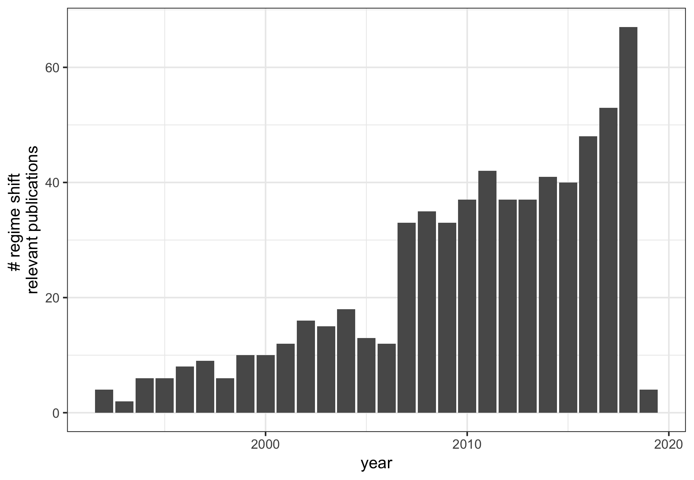]

???
- The number of papers related to ecological regime shifts exploded in the mid 2000s, 
  - coinciding with scheffer and carpenter 2003 - ASS theory + resilience...
  
- __But despite the growth of__ RS-related publications, these concepts are rarely applied in natural resoruce mangement and policy

---

# Many Methods, Not All Are Accesible Via Literature Review <!--methods not found in lit review--> 
.small-med[
- Systematic review __and__ prior knowledge
  - 70+ methods
  - $< \frac{1}{2}$ identified in systematic review
]
???
- In a sys. review designe dto identify _as many methods as possible_, I found 

- I propose a few reasons for the lack of method ID in a sys. rev

--

.small-med[
- Method review papers exist
  - None are comprehensive
    - Most comprehensive are out of date
  - High overlap in methods covered
]
???
- Using both prior knowledge AND lit review, I identified over 70 methods used in the ecol lit for detecting regime shifts
- However, less than half were identfied using standard boolean techniques 
 
- that is, without sufficient prior knowledge, the methods arent accessible to the practical ecologist


---
# Methods Emphasize Results and Not Method Efficacy <!--flowchart--> 
.center[]
???
- Next, many 'new methods ' are first published as case studies rather than methods studies

- In other words, many do not emphasize and test the method statistically

- Rigorous testing required to improve both the methods and theory 
---

# Methods Not Concentrated in Methodological Journals 

???
- ANd because many of the first instsances of these methods are published as presnetations of new and exciting results, rahter tahn as the boring and dull robustness and sensitivity tests

- Methodological jouranls are receiving fewer submissions than subdisciplinary adn applied or concepts jouranls

---
# Regime Detection Methods for Individual State Variables are Well-Tested <!--Ch3 Segue: Multivariate Methods -->

???
- In chapter 2 I compiled a list of over 70 reigme shift detection methods

- manny of these methods, however, are capable of analyzing indivuadl state variables, for example, a single species, rather tahn handling multivariate data

--

.pull-left[.medium[
<u>Univariate Methods</u>
- Autoregressive coefficient (lag-1)
- Standard deviation
- Skewness 
- Kurtosis
- Coefficeint of Variation
]]
???
- Numerous univariate indicators exist

- These are among the more widely used and tested methods

--

<br>
<br>
.pull-right[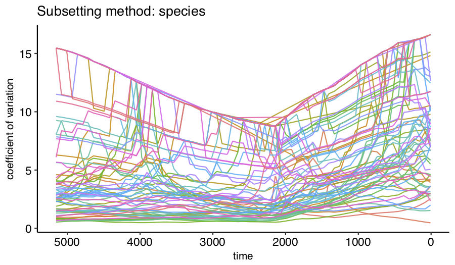]

???
- Although these metrics have been shown useful in some conditions  and systems

- Their _utility in HIGH DIMENSIONAL SYSTEMS is LESS OBVIOUS_

- For example, using the Coef. of Variation on a 100 species time series produces an __uninterpretable spaghetti plot__

---

# Performance of the Most Widely-Used Univariate Methods is Inconsistent <!--EWIs fail-->
.center[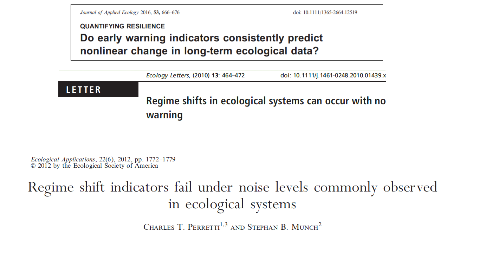]
???
- To further complicate things, even the most widely applied univariate methods are inconsistent


---

# Composite  Methods Proposed for Handling High-Dimensional Data <!--composite methods-->

.medium[
- Variance Index
- Ordination
- Clustering algorithms
]
???
- A few methods are proposed as solutions for analyzing high dimensional ecological data including
- Variance Index, Ordination e.g. PCA, clustering, and Fisher Information
--

.medium[
- __Fisher Information__
  ]
  
???
- One of which is the Fisher Infomration metric
- This 
---

# Fisher Information Proposed as a Multivariate Regime Shift Detection Method<!-- FI method1 -->
.pull-left[

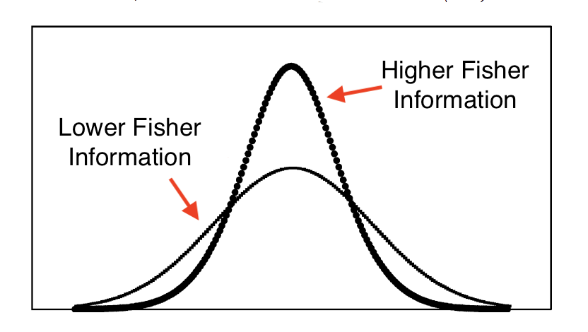
]
<font color="grey">.footnote[Figure: Cabezas and Fath (2002) *Fluid Phase Equilibria*]</font> 

???
- FI proposed as a MV indicaror of regime shfits

- Where a higher amt of information indicated higher 'orderliness'


--

.pull-right[
.medium[<b></b>].small-med[
- Noisy data

- Irregularly sampled data

- Infinite # of variables

]]


???
- Handles noiy data, irregualr smpling, and infinite variables

---

# Fisher Information Proposed as a Multivariate Regime Shift Detection Method<!-- FI method2 -->
.pull-left[


]
.footnote[Figure: Cabezas and Fath (2002) *Fluid Phase Equilibria*] 

.pull-right[
.medium[<b></b>].small-med[
- Noisy data

- Irregularly sampled data

- __Infinite # of variables__

]]


???
- And it is this characteristic on which Chapter 3 focuses:
- In Chapter 3 I demonstrate that calcualting Fisher INformation comprises two steps

---

#  Chapter 3: Deconstructing the Steps for  Calculating Fisher Information

<font color="grey">.footnote[[1] Figure :Spanbauer et al. (2014) _Plos One_]</font>
.left-column-2[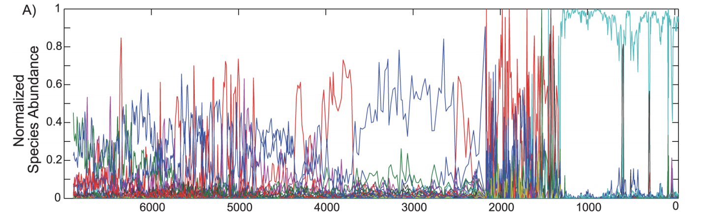]
.right-column-2[.medium[1) Dimension &nbsp;&nbsp;&nbsp;&nbsp;&nbsp;Reduction]]

???
- In Chapter 3 I demonstrate that calcualting Fisher Information comprises two steps

- First, it entails a dimension reduction step, takign N-vars to a signle variable
--

.right-column-2[.medium[<br>2) Rate of &nbsp;&nbsp;&nbsp;&nbsp;change]]

--

.left-column-2[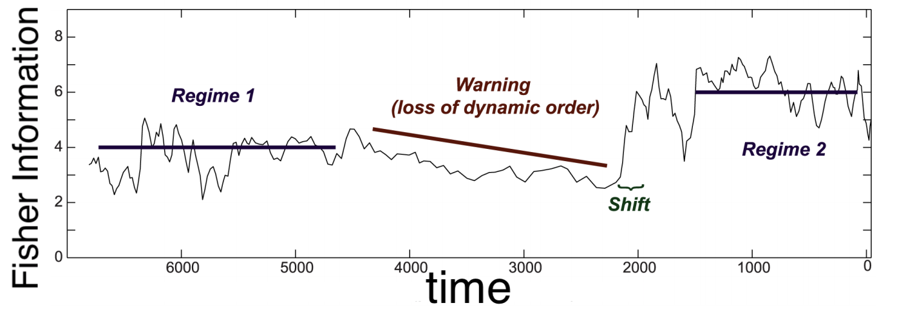]
.right-column-2[.medium[<br> 3) Fisher &nbsp;&nbsp;&nbsp;&nbsp;Information]]

???
- Then, there is the actual step of calculting the Fisher Infomration


---

# Chapter 3: Aims and Approach <!-- CH3-->
.left-column-half[.small-med[
- Conceptually and numerically outline the calculation

- Highlight <b>dimension reduction</b> as a distinct step 

- Using a 2-species predator-prey model
  - Shift in carrying capacity, $K$ 

]]

--

.right-column-half[.center[
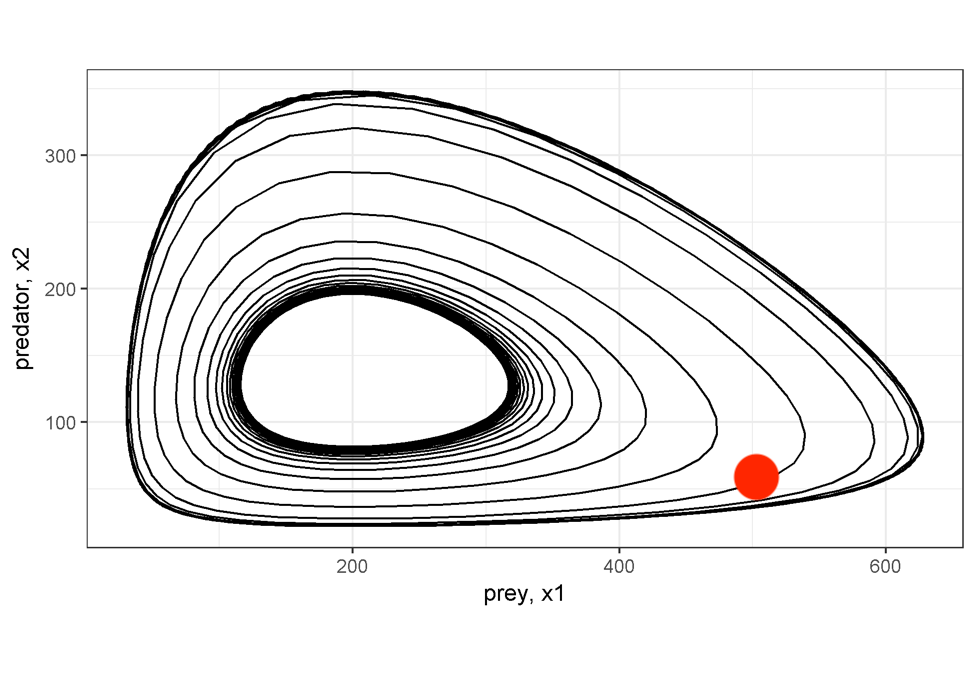
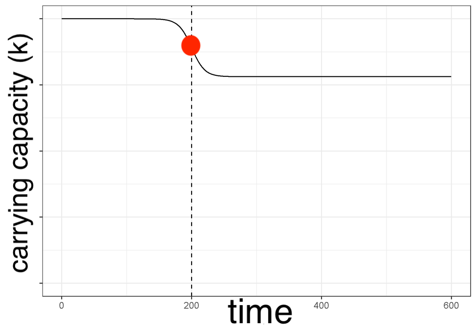
]]

???
- I demonstrate the calculation of each step by inducing a regime shift into a 2-species predator prey model

- The top panel is a phase plot of the prey and predator abundances over the entire time period, where red indicates the loation of the rapid shift in K in prey 

---

# Step 1a: Dimension Reduction Using Euclidean Distance <!-- CH3 Step 1 PP-->

.left-column-2[]

.right-column-2[
.medium[
- Euclidean distance
  - all variables
  - between time points
]]

---

# Step 1b: Calculate Distance Travelled Along Trajectory <!-- CH3 Step 1b-->

.left-column-2[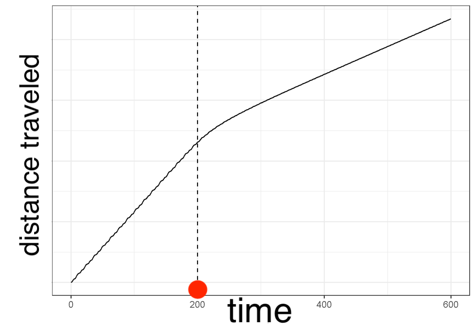]

.right-column-2[.medium[
- One value at each time point
]]

???
- This Step, the dimension reduction step, results in a measure which we are calling the "distance travelled"

- It is from this measure that the Fisher INfomration is calcualted, adn therefore, can be considered separaate from the Fisher calcualtion. 


---

# Step 2: Calculate Velocity & Acceleration of Distance Travelled 

.center[
.medium[<b>Velocity over entire time series</b>]<br>
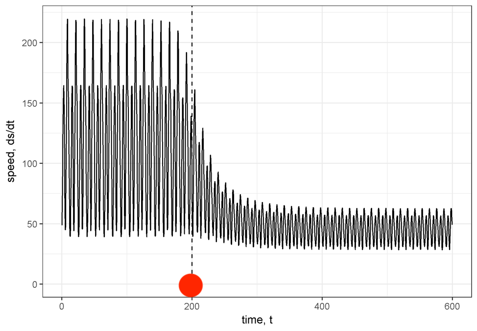
]
???
- Next, we  calculate the rate of change, or velocity  of the distance travelled, and the acceleration at each point in time. 

- Left panel is a single cycle

- Right is just the velocity over the entire time series

---

# Step 3: Calculate Fisher Information Using Moving Windows
.pull-left[
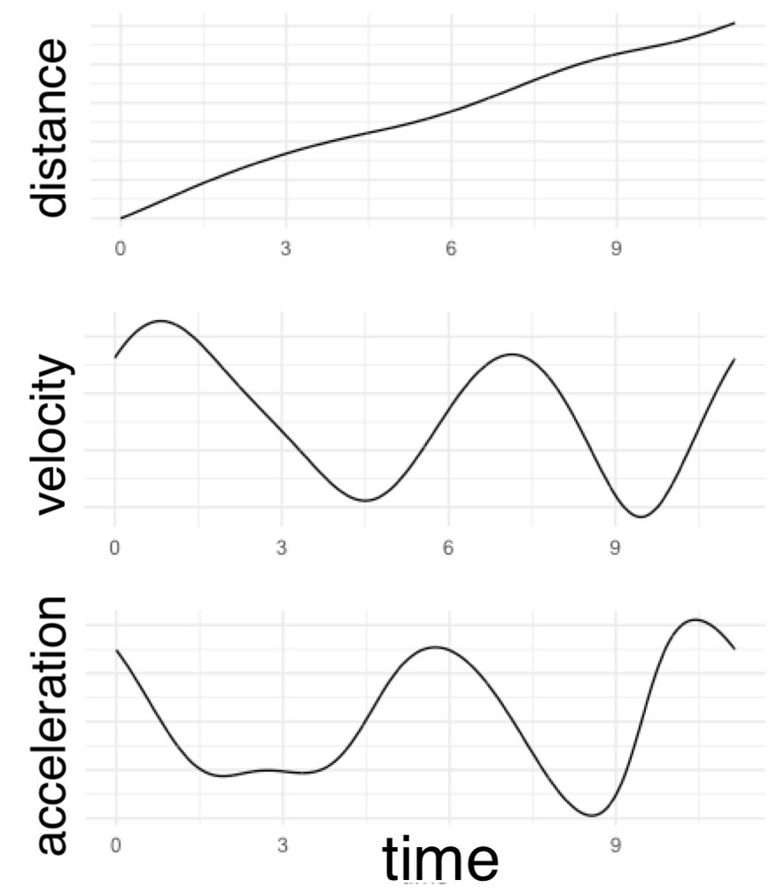
]
--

.pull-right[<br><br><br>.medium[
$$ I = \frac{1}{T}\int_0^T [\frac{s''^2}{s'^4}]^2dt  $$
]]
???
- Finally, once we've calculated the  velocity and acceleration we can calcualte the Fisher Information
- Basically, it's a ratio of hte vel. and accel. over some chosen window


---

# Step 3: Calculate Fisher Information as a Function of Velocity & Acceleration of Distance Travelled 

.left-column-2[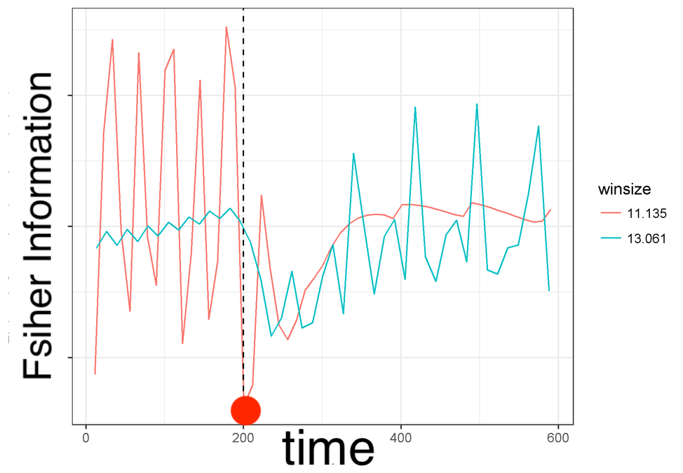]
???
- But note that this calualtion requires integration over some period of time, and 

- As a consequence, Fisher Informaiton is sensitive to the choice of the window width. 

- By varying the true cycle time based on the pre and post carry capacities, Fisher Information gives varying results. 

--

.right-column-2[.small-med[
- Sensitive to window size 

- But better if periodic

- Using velocity in lieu of Fisher Information <font size="5">(Chapters 5, 6)</font> 

]]

???
- If the correct window size is identified, FI may be a useful regime dtection method, however, 

- WOudl be best if the system is periodic

- And in the next two chapters I demonstrate the relative utility of using only the velocity measurement, rather than calculating the Fisher Information metric.  

---


# Chapter 3 Summary: Demystifying Fisher Information for Ecologists

.medium[
1) Fisher Information is separate from dimension reduction
]
<font color="grey">.footnote[.smaller[[1] Burnett *et al.*. Deconstructing the steps for calculating Fisher Information as a measure of abrupt change in ecological systems. _in review at Ecological Modelling_]]</font>
???
- Ch 3 is all about demystifying FI  
--
.medium[
2) Is sensitive to user-define paramter, window size
]
--
.medium[
3) <b>Velocity may be a useful alternative to Fisher Information</b>
]

---

# Chapters 5 & 6 Study System: Paleodiatom Community

.center[]
<font color="grey">.footnote[[1] Data and figure: Spanbauer *et al* (2014) Plos One]</font>

???
- For the next two chapters I am goign to refer to thisstudy system
- $$\sim7,000$$years, diatom relative abundances

- Some things to note about these data:
  - Especially long for this type of data 
  - Irregularly sampled
  - High rates of turnober

---
# Chapters 5 & 6 Study System: Paleodiatom Community

.left-column-3[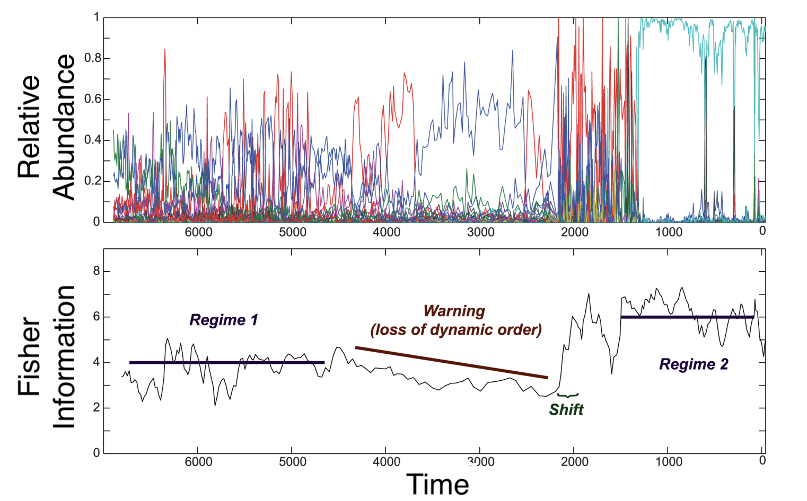]
<font color="grey">.footnote[[1] Figure (left): Spanbauer *et al* (2014) Plos One]</font>

???

- We are exploring the use of ecosystem velocity as an indicator of abrupt change. 
- Although velocity, or rate of cahnge using dissimilarity/distance indices has been used in paleoecology, it has yet to be explored as a potential indicator of ecological regime shifts
--

.right-column-3[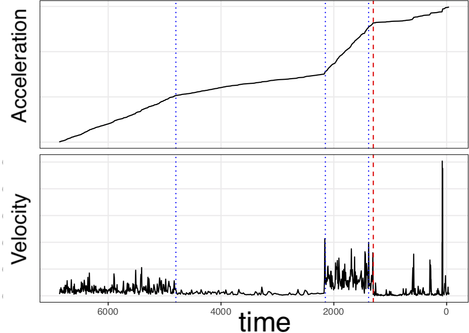]
???
- We stop at the velocity calculation (remeber, that's the rate of change of the distnace travelled)  findng that it more clearly indicates the shifts suggested in Spanbauer et al

---

# Velocity of Distance Travelled Signals Regime Shifts
.pull-left[
.small[&nbsp;&nbsp;&nbsp;&nbsp;&nbsp;Finite Differencing]
]

???

- This method calcuagtes velocity using finite differening
- __problem__: amplifies noise
- Solution: __next__

--
.pull-right[
.small[&nbsp;Regularized Differentiation<sup>1,2</sup>]
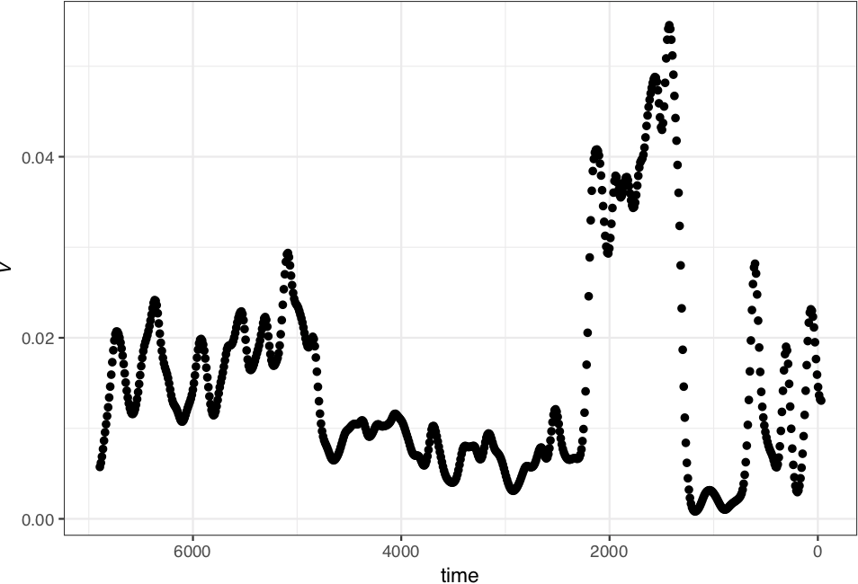]

<font color="grey">.footnote[[1] Price & Burnett. R package `tvdiff`.  [2] Chartrand (2011) _ISRN Applied Mathematics_]</font>

???
- Trying to get a smoother estimate of the rate of change
- Exploring this TVDIUFF

- Exploring numerical integration to 


---

# Velocity: Next Steps
.medium[
- Statistical identification of change point in velocity  

- Compare Euclidean to other  distance-based metrics 

- Compare to ordination techniques
- Compare to other smoothing techniques (e.g.  Generalized Additive Models)
]


???
- TV diff 
- One of the primary motivations for this chapter was to explore the ecosystem velocity as a measure of abrupt change in multivariate data. 
- Next steps include exploring smoothing impacts on this and other regime detection measures
- Comparing our velocity method to other multivariate methods

---

# Pathways for Methods Evolution<!--resampling intro-->
.center[]
???
- Althoguh not demonstrated inthe talk todya, the evolution of the Velocity metric has taken this route
- First, it is explored under various situations to gather expectations, and to test the metric on different TYPES of shifts
- Then, it is applied to empirical systems data, as shown on the paleo example
---

# Methods Evolution: Multiple Paths Taken <!--resampling intro2-->
.center[]
???
- The last step here is arguably most important for identify the utility of methods 
---

# Rigorous Testing of the Methods Required to Ensure Efficacious Methods <!-- need to test methods!!!!-->
.center[]
???
- Many of the 70 plus methods identified in the review (Chater 2), have NOT undergone this yellow path. 
- This, I would argue, is the most important step towards generateing and improving regime detection methods that can actually be used by the practical ecologist
---

# Chapter 6: Relative Performance of Composite Regime Detection Methods <!--Ch6 aims approach-->
.pull-left[
.medium[<b>Aims</b>]
.small-med[
- Impact of 
  - data quality
  - data quantity
- Composite methods
  - Velocity
  - Fisher Information
  - Variance Index
]]
--
.pull-right[
.medium[<b>Approach</b>]
.small-med[
- Resampling %
  - species
  - time 
- Retain dominant species
]]
???
- I used resampling methods on the paleodiatom community time series shown earlier to dtermine the impact of common data quality, ad sampling issues common to ecology
- I will highlight the results here
--

.pull-left[.medium[
Data quality issues
- Common/dominant species
- Infrequent sampling
- Irregular sampling
- Undetected species
]]
---

# Randomly Removing Species: Fisher Information & Variance Index  <!--Ch6 results: FI VI-->
.center[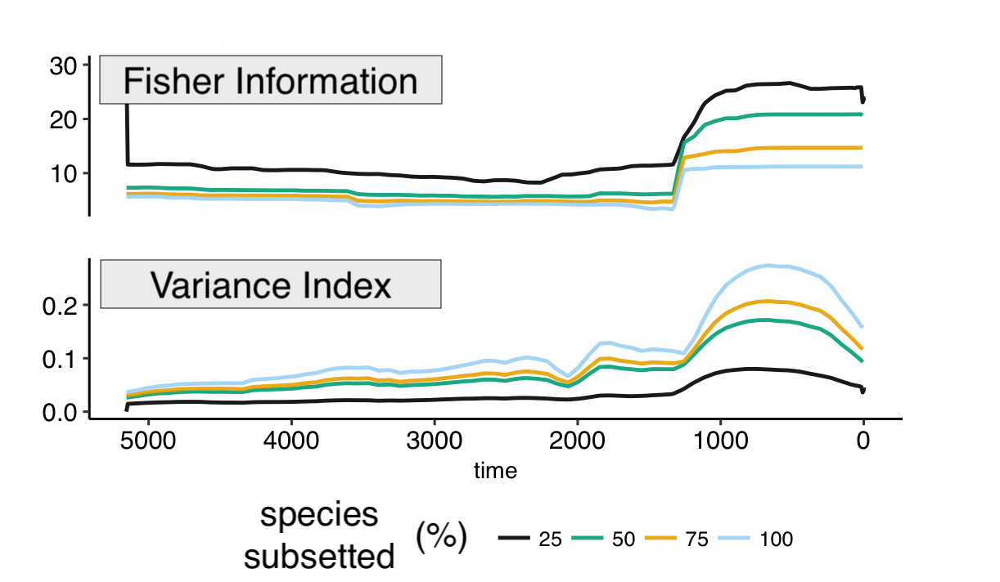]
???
- Randomly removing species 
---

# Randomly Removing Time Points: Distance Traveled  <!--Ch6 results: Distance-->

.center[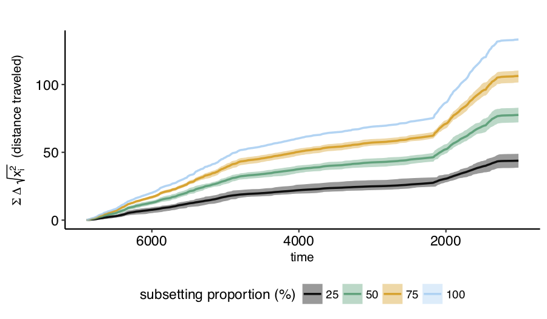]

---

# Summary of Findings: Velocity of Distance Travelled
.pull-left[.medium[
- Simple calculation
- Smoothing improves signals
- Robust to data quality & quantity
- Fails when variance >>> mean
]]
.pull-right[.medium[
- Numerical identification of exact change points  
- Compare to distance-based metrics 
- Compare to ordination techniques 
- Identify out-of-sample predictive capacity
- Smoothing
]]
---

# Prediction is __The__ Holy Grail of Ecology <!--holy grail is prediction-->
.center[]
???
- Ecologists are taking baby steps towards being able to make predition in ecology
- Easier done when system dynamics are UNDERSTOOD 
- When systems are well-described
- When conditions are predictable
- I think we have a long way until we are able to forecast most undesirable shifts in the environment, whcih some may refer to as regime shifts. 
---

# Dissertation Summary: Regime Detection Methods Need Work Before Application<!-- summarise diss findings-->
.medium[
- Many methods (> 70!); <font color="grey">(Ch. 2, 8</font>)

- Rigorous testing of methods <font color="grey">(Chs. 3, 4, 5, 6)</font>

- Sensitivity to data quality & quantity <font color="grey">(Ch. 3, 5, 6)</font>

- Divergence of regime shift theory from dynamical systems theory <font color="grey">(Ch. 1, 8)</font>
]

---

# Regime Shift Methods and Theory Lagging Behind the Applications: Has Implications for the Practical Ecologist
.pull-left[
.medium[
- Types of regime shifts
- Non-smooth potential<sup>*</sup>
- Sensitivity to:
  - data quality & quantity
  - process lags
- Caution
]]
.footnote[*Hastings & Wysham (2010) Ecology Letters]
.pull-right[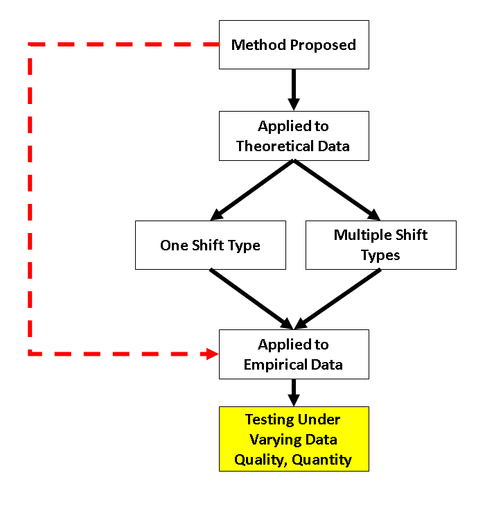]

???
- Theory way behind our applications
- No practiioners are using these metrics
- Perhaps because the theory is lagging WAY far behind applications and claims
- Rigorous statistical testing
---

# Software Associated with this Research Program <!-- my softwares-->
<br>
.medium[
- __distanceTravelled__<sup>1</sup>: calculate velocity, distance
- __regimeDetectionMeasures__<sup>1</sup>: calculate FI, VI, CV, etc.
- __bbsRDM__<sup>1</sup>: spatial application of methods
- __bbsAssistant__<sup>1</sup>: retrieve & handle BBS data
- __tvdiff__<sup>2</sup>: regularized numerical differentiation
]

.footnote[[1] github.com/trashbirdecology <br>[2] github.com/natbprice]]
---

# Acknowledgements

.pull-left[.medium[ 
__Dissertation Committee__ 

<font color="blue"><b>Craig Allen  
Dirac Twidwell</font></b>    
David Angeler  
John DeLong  
Drew Tyre   
]]
--
.pull-right[.medium[
__IIASA Supervisors__
  
Brian Fath  
Elena Rovenskaya  
]]
???
Also had the really great opportunity to do some of my research at the International Institute for Applied Systems Analysis in Austria, so I owe thanks to my supervisors who aided the resampling chapter, Fath and Rovenskaya
---

# Financial Support
.pull-left[
<br><br>
<br><br>

<br><br>


]
.pull-right[
 &nbsp;

 


]

???
Thanks to all the groups who have made this research possible. 

---

# Thanks to All Who Supported My Research Program and Professional Development <!--people-->
.left-column-2[
.pull-left[
- Hannah Birg&eacute;
- Lyndsie Wszola
- Mary Bomberger Brown
- Carissa Wonkka
- Tori Donovan
- Caleb Roberts
- Allie Schiltmeyer
- Tarsha Eason
- Erica Stuber
- Ahjond Garmestani
- Gabby Palomo-Munoz
- Jenny Dauer
- Scott Robinson
- Chrisie Bahlai 
- Katya Perez
- Kevin Pope<sup>1</sup> 

.footnote[<font color="grey">[1] thanks for the free racquetball coaching<br> [2]  Dogtoral Degree in Personnel Management and Security Services</font>] 
]
.pull-right[
- Mike Moulton
- Andy Kratter
- Trevor Hefley
- Chris Lepczyk
- Katie Sieving
- Trisha Spanbauer
- Brigette Tenhumberg
- John Carroll
- Zac Warren
- George Sugihara
- Rob Crystal-Ornelas
- Tarsha Eason
- Keith Hurley
- Hao Ye 
- Dennis Ferraro
- Kelly Willemssens
- Frank La Sorte
]
]
.right-column-2[
- Lego Grad Student
- Wilma Gerena
- Caryl Cashmere
- Lisa Greif
- Karen Gilbert
- Maggie Tetreau
- Larkin Powell
- Chris Chizinski
- Sabrina Russo
- Shawna Ritcher-Reyerson
- Tri Tran
- Gregg Hutchinson
- Dee Ebbekka
- Mark Mesearch
- Patty Swanson
- Terry Thomas, A.P.R.N
- Dr. Schultz<sup>2</sup> 
- My friends & family
]


---


# Acknowledgements: Data & Software

```{r, eval=TRUE,echo=FALSE, out.width="8.5%"}
knitr::include_graphics("https://github.com/tidyverse/magrittr/raw/master/man/figures/logo.png")
knitr::include_graphics("https://user-images.githubusercontent.com/163582/45438104-ea200600-b67b-11e8-80fa-d9f2a99a03b0.png")
knitr::include_graphics("https://bookdown.org/yihui/rmarkdown/images/hex-rmarkdown.png")
knitr::include_graphics("https://d33wubrfki0l68.cloudfront.net/071952491ec4a6a532a3f70ecfa2507af4d341f9/c167c/images/hex-dplyr.png")
knitr::include_graphics("https://d33wubrfki0l68.cloudfront.net/5f8c22ec53a1ac61684f3e8d59c623d09227d6b9/b15de/images/hex-tidyr.png")
knitr::include_graphics("https://github.com/tidyverse/ggplot2/raw/master/man/figures/logo.png")

knitr::include_graphics("https://upload.wikimedia.org/wikipedia/commons/thumb/1/1b/R_logo.svg/1200px-R_logo.svg.png")
knitr::include_graphics("https://camo.githubusercontent.com/55f1444be1adecb1ede76ec23cd17838176a142b/687474703a2f2f7777772e6269626c696f6d65747269782e6f72672f6c6f676f2e706e67")
knitr::include_graphics("https://camo.githubusercontent.com/3a6eb33909ba8de431b07a0f1fd7cb800f7ba2db/68747470733a2f2f626f6f6b646f776e2e6f72672f79696875692f626f6f6b646f776e2f696d616765732f6c6f676f2e706e67")
knitr::include_graphics("https://upload.wikimedia.org/wikipedia/commons/thumb/2/22/LaTeX_cover.svg/400px-LaTeX_cover.svg.png")
```
```{r, eval=TRUE,echo=FALSE, out.width="10%"}
knitr::include_graphics("https://github.com/TrashBirdEcology/bbsAssistant/raw/master/man/figures/logo.png")
```


.small[
- Thanks to the participatory scientists of the North American Breeding Bird Survey
- Paleodiatom data
  - Spanbauer et al. (2014) Plos One
  - Stevens and Fritz (2006) Quaternary Research
]

.footnote[
**GitHub**:&nbsp;&nbsp;  TrashBirdEcology <br>
**twitter**:&nbsp;&nbsp; @trashbirdecol <br>
**e-mail**:&nbsp;&nbsp;&nbsp;&nbsp;  jburnett@huskers.unl.edu <br>
]
 

