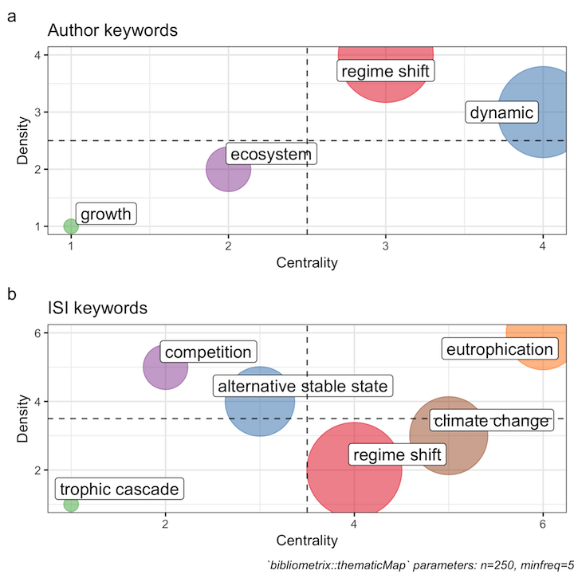

# Chapter 2: Methods for Detecting Regime Shifts <!--ch2 background of RS theory -->

???
- Ecological regime shift theory was born out of dynamical systems theory, a branch of mathematics
- Of particular note are the existence of chaotic systems, or, systems which are unpredictible in most situations
- The study of chaotic systems in mathematics is relatively new (1980s)
- That is, a system which exhibits time-dependence
- The Lorenz, or butterfly attractor, is a commonly used visualization of such a system  
- For example, somepredator-prey systems cna exhibit chaotic behavior reflecting the Lorenz attractor [^1]

and has very much diverged from the field
- When entering a new field of research or usign a new method, the practical ecologist might conduct a lit review
- Research surrounding ecological regime shifts and the methods used to identify them, however, are spread across disciplines, and subdisciplines.
- The same goes for when we are trying to identify best methods and best practices using methods on empirical data
- This, however is a difficult feat in the regime shift literature

---
---
# Bibliographic Analysis to Identify Themes in Ecological Regime Shift Development <!--results: themes --> 
.left-column[.medium[
__X axis__: importance to field   
__Y axis__:  
less to more developed
]] 

.right-column[]

???
- __Top panel__ (Author keys): 
  - no clear themes identified
  - "dynamic" suggested, but many papers don't refer to dynamical systems theory...
- __Bottom panel__ (WOS keys):
  - 

---
